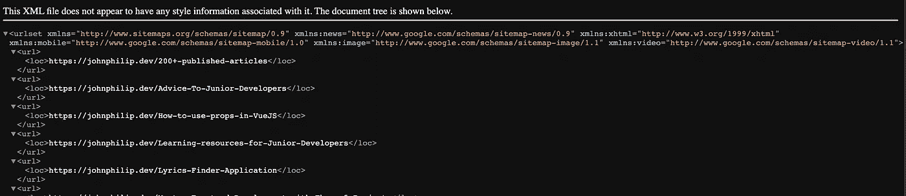

# 如何使用 Nuxt 内容在 Nuxt 中添加 Sitemap

> 原文：<https://javascript.plainenglish.io/how-to-add-sitemap-in-nuxt-using-nuxt-content-7ca4619ccc29?source=collection_archive---------7----------------------->

## 通过添加网站地图来改善网站的搜索引擎优化🎉


Photo by Christina [Morillo:](https://www.pexels.com/photo/man-standing-infront-of-white-board-1181345/)

提高网站的搜索引擎优化(SEO)是非常关键的，尤其是当你想提高你在搜索引擎结果中的排名时。

为你的网站生成一个网站地图对于让网络爬虫(Google，Bing，DuckDuckGo)更容易理解你的网站是很有用的。网站地图中可用的信息和文件可能包括页面、图像、文章、视频和您网站上可用的其他文件。

网站地图文件是非常有效的，因为它告诉网络爬虫他们应该在你的网站上考虑和优先考虑的信息。

拥有一个正确配置的站点地图将使网络爬虫能够容易地发现关于你的站点页面的信息。这将增加你在搜索引擎结果中排名靠前的机会。

站点地图可以帮助搜索引擎发现你站点上的 URL，但是它不能保证你站点地图上的所有项目都会被抓取和索引。然而，在大多数情况下，你的网站将受益于拥有一个网站地图。”~谷歌。

## **为什么你可能需要一个网站地图**

虽然可能有必要为您的网站配置一个站点地图，但在某些情况下可能没有必要。一些你应该考虑使用站点地图的场景。

*   当你有一个包含大量媒体文件内容(视频、图片)的大型网站时。
*   当你的网站提供丰富的内容，你会想展示给你的观众。
*   当你打算组织一个大型网站时
*   当你的网站相当新的时候。
*   当你想提高你的搜索引擎(SEO)索引排名。
*   提供一种自然的方式来驱动游客。

**用 Nuxt 内容在 Nuxt 中配置站点地图**

**安装 Nuxt/sitemap**

我们将利用 ***@nuxt/sitemap*** 模块向我们的站点添加站点地图配置。

**使用国家预防机制**

```
npm install @nuxtjs/sitemap
```

**使用纱线**

```
yarn add @nuxtjs/sitemap
```

找到 ***nuxt.config*** 文件，在模块部分添加***@ nuxtjs/sitemap***，如下图。

```
modules: [
'@nuxt/content',    
'@nuxtjs/sitemap',
],
```

接下来，您需要在 ***nuxt.config*** 文件中添加一个 sitemap 属性。对于用 ***_slug.vue*** 呈现的动态路由，我们需要配置 sitemap 来索引这些路由。在您项目的路线上，创建一个名为***sitemap routes . js***的文件，并在文件中执行以下功能。这将是一个帮助器函数，用于从@nuxt/content 目录中自动获取与所需文件相关联的路径。

上面的函数将自动获取所有你的 ***nuxt-content*** 博客文件所在的`content`目录中文件的完整路径。

现在我们可以在 ***nuxt.config*** 文件中导入并引用这个文件，并将它添加到 sitemap 属性中。我们将在 sitemap 属性中声明一个 routes 选项。

```
import sitemapRoutes from './***sitemapRoutes***'
```

当构建应用程序时，这些自动生成的路线将被添加到我们的站点地图文件中。为了测试 sitemap.xml 文件是否成功地生成了相关的路径和信息，构建您的应用程序并导航到根目录下的 ***dist*** 目录。在这里，您可以找到 sitemap.xml 文件，其中包含与您的站点相关的必要信息。

这里是一个预览什么样的地雷后，一切都设置好了。



sitemap.xml file

要查看这些文件的样本预览，您可以访问:[***https://johnphilip.dev/sitemap.xml***](https://johnphilip.dev/sitemap.xml)

## **最终想法**

感谢您花时间通读这篇文章。祝您在构建推动惊人用户体验的网站时过得愉快。

每周三，我都会发送一封独家邮件，里面有我发现的有用的、与技术写作相关的技巧、文章、应用、书籍和想法。

[***加入像你一样想提高写作技巧的人吧。***](https://artisanal-thinker-2556.ck.page/6e2ba71172)

**更多内容:**

[](/how-to-implement-skeleton-loading-animation-in-page-components-3fbeff5a6ecb) [## 如何在页面组件中实现骨架加载动画

### 了解加载动画以及如何在页面组件中构建骨架加载动画效果

javascript.plainenglish.io](/how-to-implement-skeleton-loading-animation-in-page-components-3fbeff5a6ecb) [](/how-to-configure-commitlint-and-generate-useful-changelogs-from-git-commit-messages-baa50764da4b) [## 如何配置 Commitlint 并从 Git 提交消息中生成有用的 CHANGELOGs

### 从 git 提交消息中配置和生成有用的变更日志

javascript.plainenglish.io](/how-to-configure-commitlint-and-generate-useful-changelogs-from-git-commit-messages-baa50764da4b) 

*更多内容请看*[***plain English . io***](https://plainenglish.io/)*。报名参加我们的* [***免费周报***](http://newsletter.plainenglish.io/) *。关注我们关于*[***Twitter***](https://twitter.com/inPlainEngHQ)**和*[***LinkedIn***](https://www.linkedin.com/company/inplainenglish/)*。查看我们的* [***社区不和谐***](https://discord.gg/GtDtUAvyhW) *加入我们的* [***人才集体***](https://inplainenglish.pallet.com/talent/welcome) *。**