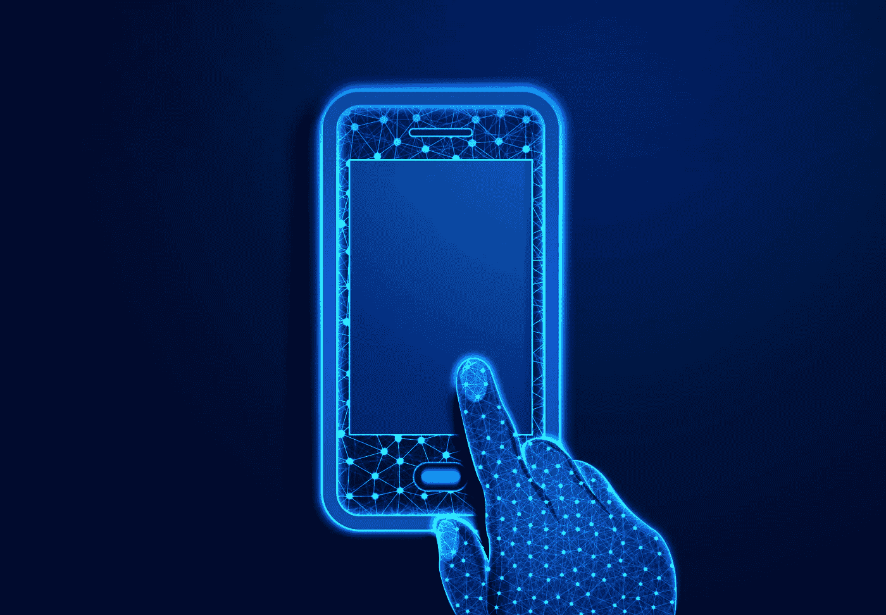
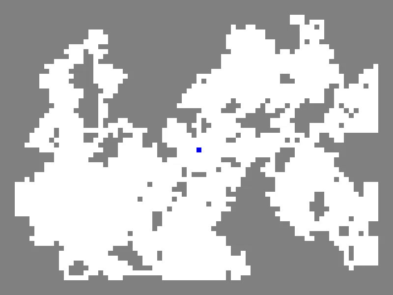
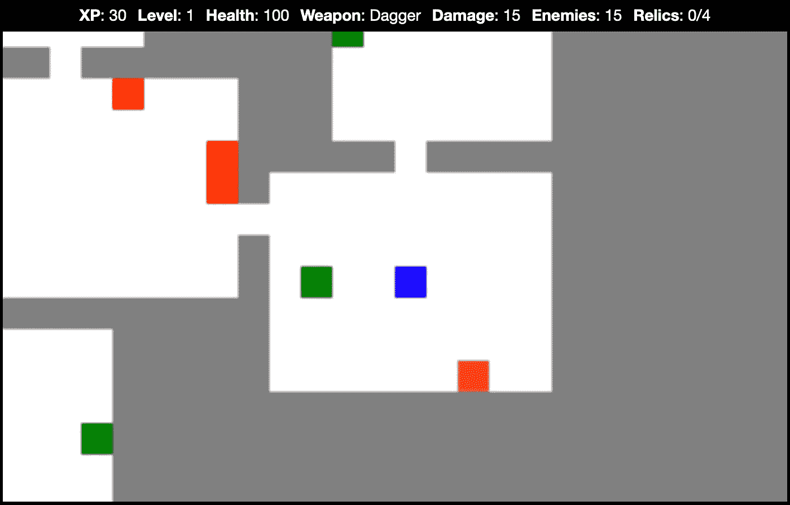
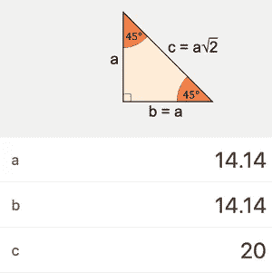
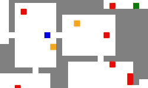

# 如何在 JavaScript 游戏中添加滑动控件

> 原文：<https://javascript.plainenglish.io/how-to-add-swipe-control-to-a-javascript-roguelike-e8ef327e9930?source=collection_archive---------11----------------------->



[Phone design vector](https://www.freepik.com/vectors/phone-design) created by [WangXiNa](https://www.freepik.com/author/wangxina) on [freepik](https://www.freepik.com)

roguelike 是一种自动生成关卡的冒险游戏，自 20 世纪 80 年代以来一直吸引着玩家的想象力。在制作了许多带有键盘控制的 roguelike 演示之后，我最近制作了一个可以在智能手机上使用的带有滑动控制的演示。

在本教程中，我们将从一个仅包含一个播放器和一个由墙砖和地砖组成的简单环境的演示开始。虽然播放器一开始是由光标键控制的，但我将向您展示如何让播放器响应单触式滑动而移动。



The demo we will add our swipe logic to.

在那之后，我们可以将它与一款拥有额外功能和相似刷卡逻辑的[游戏](https://roguelike-swipe.netlify.app/game/index.html)进行比较。



A game with adjusted swipe logic for handling the enemies in red.

# 入门指南

请随意下载[启动代码](https://github.com/nevkatz/js-roguelike-swipe/archive/refs/heads/main.zip)，其中包含以下内容:

*   我们的工作将在那里进行。
*   三个`phase`目录，包含教程每个阶段的解决方案。
*   一个带有游戏示例的`game`目录。
*   一个`css`目录，包含所有版本使用的样式。

这些文件夹旁边是一个`js`目录，里面有四个文件:

*   `script.js`，运行演示关卡。
*   `player.js`，包含玩家类。
*   `game.js`，包含游戏类。
*   `random_walk.js`，生成玩家所在的洞穴。

让我们仔细看看游戏和玩家职业。

## 游戏课

`game.js`中的游戏对象持有地图、`<canvas>`元素和称为`context.`的绘图方法包。`touchCoords`属性存储滑动期间最后记录的触摸位置，`timer`属性帮助处理玩家在阶段 3 中的滑行。

The game class.

游戏的`map`属性是一个 2D 数组。每块墙砖是一个`0`，每块地砖是一个`1`。下面是一张 5x4 的地图，有两块瓷砖宽的走廊。

```
[[0,0,0,0,0], 
 [1,1,1,1,1],
 [1,1,1,1,1],
 [0,0,0,0,0]]
```

## 玩家对象

我们在`player.js`中的玩家对象存储了两个属性:速度和位置。两者都有`x`和`y`组件。

```
class Player {
    constructor(coords) {
        this.coords = coords; this.velocity = {
            x:0,
            y:0
        };
    }
}
```

速度从零开始，当我们在`script.js`中创建玩家时，我们通过地图的中心作为位置。

```
// script.js let coords = {
        x: COLS / 2,
        y: ROWS / 2
};player = new Player(coords);
```

## 检查方向

用光标键移动播放器应该已经在`project`目录中工作了，因为`script.js`有处理按键的逻辑，如下所示。

在上面的`checkDirection`中，我们使用一个开关/盒子来根据键码移动玩家。

现在我们已经走过了`game.js`、`player.js`和`script.js`的关键部分，让我们开始添加滑动逻辑。

# 阶段 1:基本刷卡响应

我们的工作将发生在`project`目录的`swipe.js`中，它从空函数开始。对于阶段 1，我们将编写五个:

*   两个触摸处理器，`swipeStart`和`swipeMove`
*   两个辅助功能，`setVelocityX`和`setVelocityY`
*   一种称为`checkPlayer`的碰撞检测功能

## 开始刷卡

在`script.js`的`init()`功能中有一个用于开始滑动的监听器。

```
game.canvas.addEventListener('touchstart', swipeStart);
```

这里是我们初始的`swipeStart`函数，它以`event`为参数。

```
function swipeStart(event) {
}
```

`event`对象保存一个名为`touches`的数组。`touches`数组中的每个对象代表一个触摸设备表面的手指。

我们应该只在屏幕上有一个手指的情况下做出响应——如果有两个手指，我们希望允许缩放。所以让我们检查一下数组的长度。

```
function swipeStart(event) { if (event.touches.length == 1) {
```

如果只有一次触摸，让我们用`preventDefault()`方法来防止默认触摸响应。

```
function swipeStart(event) { if (event.touches.length == 1) { **event.preventDefault();
   }
}**
```

接下来，让我们抓住第一个`touch`对象。

```
event.preventDefault();**let obj = event.touches[0];**
```

我们来提取两个属性:`clientX`和`clientY`，代表触摸的坐标。

```
let obj = event.touches[0];**let {clientX, clientY} = obj;**
```

最后，让我们将触摸的起点存储在`game`对象中。

```
game.touchCoords.x = clientX;
game.touchCoords.y = clientY;
```

下面是完整的`swipeStart`功能。

The swipeStart function.

## 跟踪刷卡

隐藏在我们的`init`函数中的是另一个监听器，用于检测`touchMove`事件。

```
game.canvas.addEventListener('touchmove', swipeMove);
```

与`swipeStart`一样，让我们通过检查触摸次数和阻止默认动作(如滚动)来启动`swipeMove`。

```
function swipeMove(event) { if (event.touches.length == 1) { event.preventDefault();
  }
}
```

和`swipeStart`一样，我们需要从触摸对象中提取`clientX`和`clientY`。

```
event.preventDefault();**let obj = event.touches[0];****let {clientX,clientY} = obj;**
```

## 寻找旅行的距离

现在让我们来测量手指从最后一个记录点移动了多远。对于 x 和 y 坐标，我们将获得当前位置，在`touchCoords`中减去过去的位置，并找出差异。我们可以在一个叫做`diff`的对象中存储沿每个轴移动的距离。

```
let diff = {
   x: clientX - game.touchCoords.x,
   y: clientY - game.touchCoords.y
};
```

在测试`diff`之前，我们先把玩家当前的坐标保存在`oldX`和`oldY`两个常量中。

```
const {x: oldX, y: oldY} = player.coords;
```

我们也把它们存储在两个变量中，`newX`和`newY`。

```
let {x: newX, y: newY} = player.coords;
```

## 检查阈值

因为即使是轻微的移动也会触发一个`touchMove`事件，我们不希望我们的玩家在每次这样的事件注册时都移动——因为它会移动得太快。相反，我们只希望它在手指位置距离最后一次记录的触摸足够远的情况下移动。

因此，只有当手指沿轴移动的距离超过下面的阈值时，我们才会触发移动。

```
const threshold = 20;
```

如果水平距离或`diff.x`超过了那个阈值，让我们调用一个新的`setVelocityX`函数，并将`newX`设置为它的返回值。

```
if (Math.abs(diff.x) > threshold) {
    newX = setVelocityX(diff, clientX, clientY, newX, newY);
}
```

我们也来测试一下`diff.y`。如果超出阈值，我们通过调用`setVelocityY`来重新定义`newY`。

```
if (Math.abs(diff.y) > threshold) {
     newY = setVelocityY(diff, clientX, clientY, newX, newY);
}
```

如果`newX`或`newY`已经改变，让我们调用我们的碰撞检测函数。

```
if (newY != oldY || newX != oldX) {
    checkPlayer(oldX, oldY, newX, newY);
}
```

下面是完整的`swipeMove`功能。

The swipeMove function.

## 设定速度

现在让我们来研究速度的辅助函数。为了让玩家移动一格，我们通过将`diff.x`除以其绝对值来设置速度为`-1`或`1`。

```
function setVelocityX(diff, clientX, clientY, newX, newY) { player.velocity.x = diff.x / Math.abs(diff.x);
}
```

然后，我们将触摸位置的 x 坐标`clientX`作为新的`x`值存储在`touchCoords`中。

```
player.velocity.x = diff.x / Math.abs(diff.x);**game.touchCoords.x = clientX;**
```

因为`touchCoords`已经更新，玩家不会水平移动，直到触摸向右或向左再移动 20 个像素。

最后，我们将`velocity.x`值与`player.coords.x`相加，并将总和存储在`newX`中。

```
game.touchCoords.x = clientX;**newX = player.coords.x + player.velocity.x;**
```

然后我们返回`newX`。

下面是设置水平速度的全部功能。

The setVelocityX method.

下面是一个类似的函数，设置垂直速度，更新最近的触摸位置，设置`newY`。

The setVelocityY method.

如果您现在运行代码，播放器将忽略墙壁—所以让我们添加一些碰撞检测。

## 冲突检出

在`swipeMove`结束时，如果`newX`或`newY`有变化，我们就叫`checkPlayer`，

```
if (newY != oldY || newX != oldX) {
     checkPlayer(oldX, oldY, newX, newY);
}
```

现在就写`checkPlayer`吧。我们将从检测空闲块的辅助函数开始。

```
function checkPlayer(oldX, oldY, newX, newY) {
    const freeTile = (x, y) => game.map[y][x] != WALL_CODE;
}
```

如果目标牌是空的，玩家可以移动到那里。

```
function checkPlayer(oldX, oldY, newX, newY) {
    const freeTile = (x, y) => game.map[y][x] != WALL_CODE;

    if (freeTile(newX, newY)) {
        movePlayer(newX, newY);
    }

}
```

总之，当沿轴超过距离阈值时，相应地设置速度，只要没有障碍物，玩家就移动一个方格。

我们现在已经完成了第一阶段。如果你一直和我们一起编码，你可以看看[演示](https://roguelike-swipe.netlify.app/phase-1/index.html)来比较你的工作。

# 第二阶段:对角线运动

既然基本的滑动逻辑已经工作了，让我们来决定我们是想要直线移动还是对角线移动。

首先，我们需要一个对角滑动的阈值。要设置一个，想象一个 45–45°的三角形，其中对角线扫动是斜边 c 边。



Image from [www.omnicalculator.com.](http://www.omnicalculator.com.)

如果我们希望对角线滑动超过 20°，水平和垂直滑动应该超过这个三角形的边长，也就是 14.14。在`swipeMove`中，让我们用这个值初始化`diag_threshold`。

```
const threshold = 20;
**const diag_threshold = 14.14;**
```

下面，让我们通过查看`x`和`y`值的变化是否超过这个较小的阈值来测试对角滑动。

Code for handling the diagonal case.

让我们将水平情况更改为`else-if`语句，以确保它不会与对角线情况同时出现。如果玩家水平移动，我们把垂直速度设为零。

```
} else if (Math.abs(diff.x) > threshold) {  

   newX = setVelocityX(diff, clientX, clientY, newX, newY); 

   player.velocity.y = 0;                                                           }
```

让我们对垂直的情况做同样的事情，把它改为`else-if`，把水平速度设置为零。

```
} else if (Math.abs(diff.y) > threshold) {  

    newY = setVelocityY(diff, clientX, clientY, newX, newY);  

    player.velocity.x = 0;  
} 
```

下面是`swipeMove`函数中的 if-else 树。

The full if-else tree.

## 增加球员移动的灵活性

在`checkPlayer`中，如果玩家沿对角线移动，我们检查目标牌是否空闲。

```
if (freeTile(newX, newY)) { movePlayer(newX, newY);}
```

为了让玩家的动作尽可能流畅，让玩家尝试水平或垂直运动，作为对角运动受阻时的备用。让我们首先在垂直速度的方向上寻找一个自由瓷砖。

```
else if (**newY** != oldY && freeTile(oldX, **newY**)) { movePlayer(oldX, newY);
} 
```

如果该块不是空闲的，让我们也检查一下水平相邻的块是否可用。如果是，玩家水平移动。

```
else if (**newX** != oldX && freeTile(**newX,** oldY)) { movePlayer(newX, oldY);
}
```

下面是更新后的`checkPlayer`功能，它允许玩家在对角线移动受阻但附近有瓷砖可用的情况下移动。

如果您已经完成了对角线逻辑，请继续将您的工作与[阶段 2 演示](https://roguelike-swipe.netlify.app/phase-2/index.html')进行比较。

# 第三阶段:滑行

让我们添加滑行行为，这样，如果一个手指停留下来并停止移动，玩家将继续向那个方向移动，直到碰到一面墙。为了实现这个，我们会写两个函数，`coastPlayer`和`stopCoast`，在各个地方调用它们。

滑行需要玩家周期性地移动，而不需要更多的输入。虽然我们可以使用`setInterval`来实现这一点，但我们将使用`requestAnimationFrame`，它只在屏幕准备重绘时移动播放器。

## 从海岸开始

让我们更新`swipeMove`，这样如果一个滑动导致玩家移动，我们等待 125 毫秒，然后请求一个动画帧，用`coastPlayer`作为回调。

```
if (newY != oldY || newX != oldX) { checkPlayer(oldX, oldY, newX, newY); if (!game.timer) {
         let delay = 125;
         game.timer = window.setTimeout(function() {
               window.requestAnimationFrame(coastPlayer);
         }, delay);
   }}
```

## 海岸线

在`coastPlayer`函数中，我们根据玩家当前的速度来移动玩家。为此，我们首先提取速度的`x`和`y`值。

```
function coastPlayer() { let {x,y} = player.velocity;
```

如在`swipeMove`中，我们然后设置旧的和新的坐标。

```
const { x: oldX, y: oldY} = player.coords;let {x: newX, y: newY} = player.coords;
```

如果速度的`x`分量非零，我们将其加到`newX`。

```
if (x) {
        newX = player.coords.x + x;
}
```

如果`y`不为零，我们将`y`分量加到`newY`上。

```
if (y) {
     newY = player.coords.y + y;
}
```

最后，我们检查是否可以移动玩家。

```
checkPlayer(oldX, oldY, newX, newY);
```

如果`game.timer`为非空，这意味着动画仍在继续，因此请求另一个动画帧，递归调用`coastPlayer`。

```
if (game.timer) {
   let delay = 100;
   game.timer = window.setTimeout(function() {
      window.requestAnimationFrame(coastPlayer);
   }, delay);
}
```

下面是完整的`coastPlayer`功能。

## 停止海岸

在我们的`stopCoast`函数中，如果超时事件正在发生，我们会将其清除，并将`game.timer`设置为`null`，以表示滑行间隔既不在进行中也不会发生。然后我们更新地图。

```
function stopCoast() {
    window.clearTimeout(game.timer);
    game.timer = null;
    drawMap(0, 0, COLS, ROWS);
}
```

如果碰到墙，如果接触结束，或者手指有移动，玩家应该停止滑行。为了进行任何显著的触摸运动来取消滑行，让我们在`setVelocityX`和`setVelocityY`开始时调用`stopCoast`。例如:

```
function setVelocityX(diff, clientX, clientY, newX, newY) {
    stopCoast();
```

为了在玩家碰壁时停止滑行，让我们在`checkPlayer`结束时的最终`else`条件下调用`stopCoast`。

The new if-else tree with stopCoast.

最后，让我们在刷卡结束时停止滑行。在`script.js`中，有一个监听器调用`swipeEnd`来结束一个触摸动作。

```
game.canvas.addEventListener('touchend', swipeEnd);
```

在`swipeEnd`中，让我们阻止默认动作，将速度设置为零，并调用`stopCoast`。

```
function swipeEnd(e) {
    e.preventDefault();
    player.velocity = {
        x: 0,
        y: 0
    };
    stopCoast();
}
```

如果你已经走到这一步，恭喜你！您已经完成了教程。请随意将您的代码与[阶段 3 演示](https://roguelike-swipe.netlify.app/phase-3/index.html)进行比较。

# 更进一步

一个可能的下一步是添加其他功能，使这个项目感觉更像一个游戏。作为一个例子，我在一个[示例游戏](https://roguelike-swipe.netlify.app/game/index.html)中添加了类似的滑动代码，该游戏有滚动、敌人、要收集的遗迹和恢复生命的药剂。



The game with red enemies, green potions, and orange weapons.

在这个游戏的`swipe.js`文件中，`checkPlayer`逻辑被调整为处理敌人碰撞。您可以[尝试一下](https://roguelike-swipe.netlify.app/game/index.html)并在 [Github](https://github.com/nevkatz/js-roguelike-swipe/tree/main/game) 或您下载的`game`目录中检查代码。

就是这样！请随意访问[主演示页面](https://roguelike-swipe.netlify.app/)查看游戏、启动项目和分阶段解决方案。

[](/how-to-add-scrolling-to-a-javascript-roguelike-c9f835d10537) [## 如何制作一个 JavaScript Roguelike 卷轴

### 让我们一次只展示地牢的一部分。

javascript.plainenglish.io](/how-to-add-scrolling-to-a-javascript-roguelike-c9f835d10537) 

*更多内容请看*[***plain English . io***](https://plainenglish.io/)*。报名参加我们的* [***免费周报***](http://newsletter.plainenglish.io/) *。关注我们关于*[***Twitter***](https://twitter.com/inPlainEngHQ)*和*[***LinkedIn***](https://www.linkedin.com/company/inplainenglish/)*。查看我们的* [***社区不和谐***](https://discord.gg/GtDtUAvyhW) *加入我们的* [***人才集体***](https://inplainenglish.pallet.com/talent/welcome) *。*