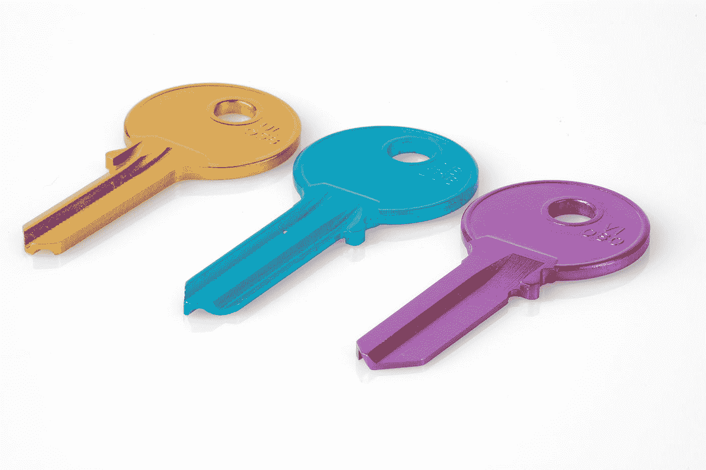

# 如何将输入字段的宽度调整为其输入值的宽度？

> 原文：<https://javascript.plainenglish.io/how-to-adjust-the-width-of-an-input-field-to-the-width-of-its-input-value-728ef59bc3e9?source=collection_archive---------1----------------------->

## 关于如何将输入字段的宽度调整为其输入值宽度的指南。



Photo by [Florian Berger](https://unsplash.com/@bergerteam?utm_source=medium&utm_medium=referral) on [Unsplash](https://unsplash.com?utm_source=medium&utm_medium=referral)

有时，我们可能希望将输入字段的宽度调整为其输入值的宽度。

在本文中，我们将了解如何将输入字段的宽度调整为其输入值的宽度。

# 监听按键事件

我们可以监听`keypress`事件来获取按键的输入值。

然后我们可以将输入的`style.width`属性设置为输入值的宽度。

为此，我们编写以下 HTML:

```
<input type="text">
```

以及下面的 JavaScript:

```
const input = document.querySelector('input')
input.addEventListener('keypress', (e) => {
  input.style.width = `${e.target.value.length}ch`
})
```

我们用`querySelector`得到输入元素。

然后我们用`'keypress’`调用`addEventListener`来监听按键事件。

在事件处理程序回调中，我们将`input.style.width`设置为`e.target.value.length`，单位为`ch`。

`e.target.value`将数值输入到输入框中。

`ch`是元素字体的 0 个字符的宽度。

现在，当我们键入输入内容时，我们应该看到输入框随着我们键入内容而变长到输入值的宽度。

# 结论

通过在`ch`中设置输入的宽度，我们可以将输入元素的宽度设置为输入值的宽度。

*更多内容看* [***说白了。报名参加我们的***](https://plainenglish.io/) **[***免费周报***](http://newsletter.plainenglish.io/) *。关注我们关于*[***Twitter***](https://twitter.com/inPlainEngHQ)*和*[***LinkedIn***](https://www.linkedin.com/company/inplainenglish/)*。加入我们的* [***社区***](https://discord.gg/GtDtUAvyhW) *。***