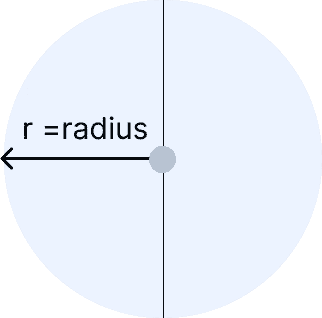
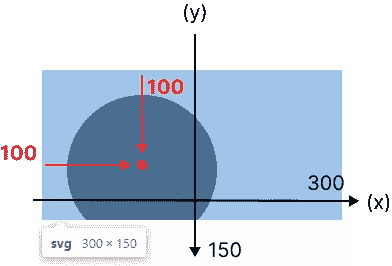
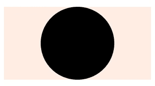
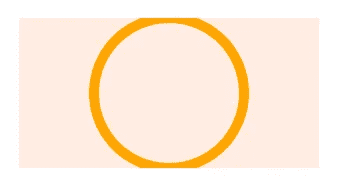
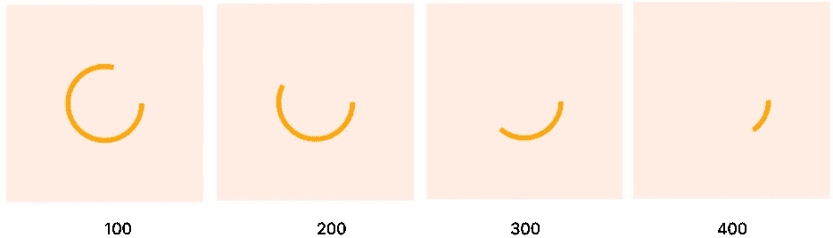
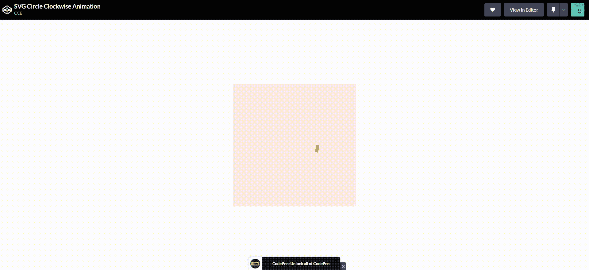
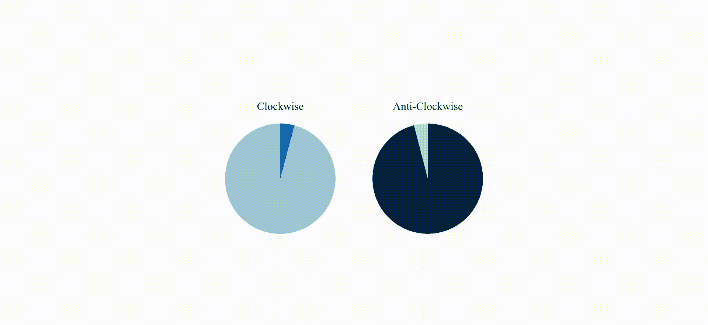

# 如何用 CSS 制作 SVG 圆形动画

> 原文：<https://javascript.plainenglish.io/how-to-animate-svg-circle-with-javascript-8e8c720ee3a2?source=collection_archive---------2----------------------->

## 如何制作 SVG 圆动画的初学者指南。

在我们开始之前，我想承认我是 SVG(可伸缩矢量图形)的新手。因此，我对 SVG 的工作原理做了大量的研究。终于开始有基本的了解了。所以，简而言之，这篇文章为那些对 SVG `<circle>`感兴趣的人提供了一个初学者指南。

## 创建 SVG 圆

第一个问题: ***如何建立一个圈子？*** 先说简单的**数学**！圆的周长= 2 *π*半径。

公式:C = 2 × π × r



radius decides how big is the circle

```
<svg>
  <circle cx="100" cy="100" r="75" />
</svg>
```

如果你将代码复制粘贴到 ***codepen.io*** 中，你会得到一个不完整的圆。**为什么？**考察一下`<circle>`元素，就知道答案了。

y 轴坐标(cy)有问题吗？



Inspect `<circle>` element

作为一种解决方案，我们可以将`cy`值更改为 **75** 以使`<circle>`元素在 **y 轴**上居中。同样，对于`cx`值，将 300 除以 2。

代码如下所示:

```
<svg>
  <circle cx="150" cy="75" r="75" />
</svg>
```

## 将 SVG 居中

接下来，这一步是**可选**。如果你想让你的 SVG 在网页上居中，你可以遵循下面的代码:

```
**svg** {
  background: #ffece3;
 ** position: absolute;
  left: 50%;
  top: 50%;
  transform: translate(-50%, -50%);**
}
```



`Center <circle>` element

## 制作动画

我计划以顺时针方向**制作圆形动画**。因此，我将`stroke-width` CSS 属性添加到 10px。

```
circle {
    fill: transparent;
    stroke: orange;
    stroke-width: 10px;
}
```



Circle with 10px stroke

哎呀！`<circle>`元素没有足够空间。让我们把“空间”变大。因此，为 SVG 元素添加大约 400px 的 ***宽度*** 和 ***高度*** CSS 属性。并且您的`<circle>`元素没有再次将中心放在网页上。

然后，您需要通过**将**的宽度和高度值除以 2 或者使用**的百分比(%)** 值来表示 x 轴和 y 轴坐标，从而再次进行调整。

```
<svg>
  <circle cx="50%" cy="50%" r="75" />
</svg>
```

接下来，我们需要知道动画的`stroke-dasharray`和`stroke-dashoffset` CSS 属性。

CSS 中的`stroke-dasharray`属性用于在 SVG 形状的笔画中创建破折号。**来自 CSS-Trick。**

## H **如何认识** `**stroke-dasharray**` `**<circle>**` **元素？**

有一个计算`<circle>`元素的`*stroke-dasharray*`属性的公式。我在这里找到了[解决方案](https://stackoverflow.com/questions/29909403/how-to-get-exact-amount-of-stroke-dasharray-on-circle-and-rect)！

*为* `*<circle>*` *元素，* `*stroke-dasharray*` *属性代表* ***圆周*** *。*

所以，我们可以得到`*stroke-dasharray*`属性的最大值。**越低**的值，**越大**在`<circle>`元件行程中的破折号间距。

```
circle {
    fill: transparent;
    stroke: orange;
    stroke-width: 10px;
   ** stroke-dasharray: 471;**
}
```

*CSS 中的* `*stroke-dashoffset*` *属性定义了一个* `*stroke*` *的破折号沿 SVG 路径开始的位置。* ***来自 CSS-Trick。***

我用不同的值摆弄了一下`*stroke-dashoffset*`属性。结果如下:



Different value for `*stroke-dashoffset*`

如果你把相同的值和`*stroke-dasharray*`值放在一起，你会得到一个空圆。因此，我们将制作`*stroke-dashoffset*`属性的动画。现在，我们可以为`<circle>`元素声明动画。

```
circle {
  fill: transparent;
  stroke: orange;
  stroke-width: 10px;
  stroke-dasharray: 471;
  stroke-dashoffset: 471;
  animation: **clock-animation** 10s linear infinite;
}
[@keyframes](http://twitter.com/keyframes) **clock-animation** {
  0% {
    stroke-dashoffset: 471;
  }
  100% {
    stroke-dashoffset: 0;
  }
}
```



Circle animation

## **问题:起始动画点在圆圈右侧？如何让起点从最上面开始？**

*解决方法*:将圆旋转到 **-90 度**。并且记得将`*transform-origin*`属性添加到**中心**。

```
circle {
  fill: transparent;
  stroke: orange;
  stroke-width: 10px;
  stroke-dasharray: 471;
  stroke-dashoffset: 471;
  animation: clock-animation 10s linear infinite;
 **transform: rotate(-90deg);
  transform-origin: center;**
}
```


Circle transform in -90 deg

也可以换成**逆时针**方向。只需更改动画代码。

```
[@keyframes](http://twitter.com/keyframes) **anti-clock-animation** {
  0% {
    stroke-dashoffset: 0;
  }
  100% {
    stroke-dashoffset: 471;
  }
}
```

## 附加功能:

如果你想要一个**整圆**动画，只需增加`stroke-width`值。假设圆半径为 75，那么将数值翻倍，就是 150px。



Full SVG Circle Animation

## 结论

希望你喜欢这篇 SVG 教程。感谢您的阅读！这里我附上了源代码。

[SVG 圆形笔画动画](https://codepen.io/CCE94/pen/KKZqMRy)

[完整 SVG 圆动画](https://github.com/waltzHao/SVG_Circle)

编码快乐！

*更多内容看* [***说白了。报名参加我们的***](https://plainenglish.io/) **[***免费周报***](http://newsletter.plainenglish.io/) *。关注我们关于*[***Twitter***](https://twitter.com/inPlainEngHQ)*和*[***LinkedIn***](https://www.linkedin.com/company/inplainenglish/)*。加入我们的* [***社区***](https://discord.gg/GtDtUAvyhW) *。***