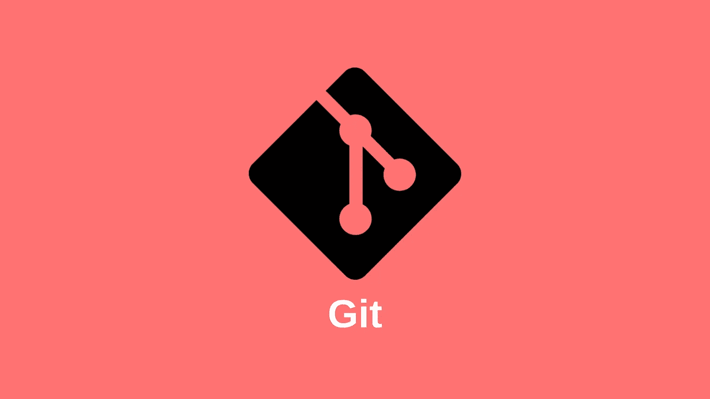
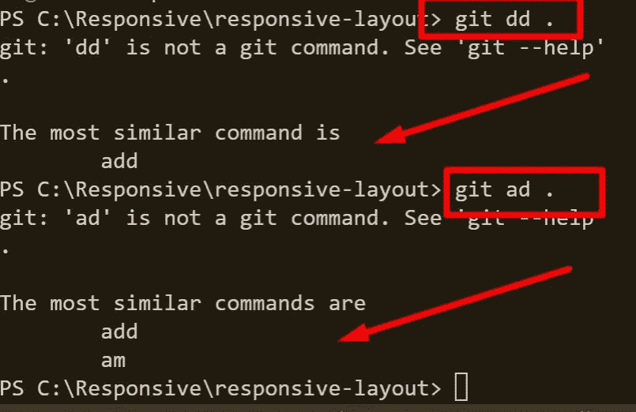
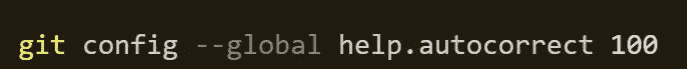
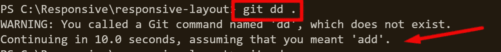
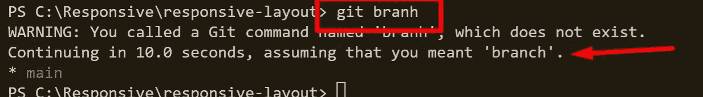
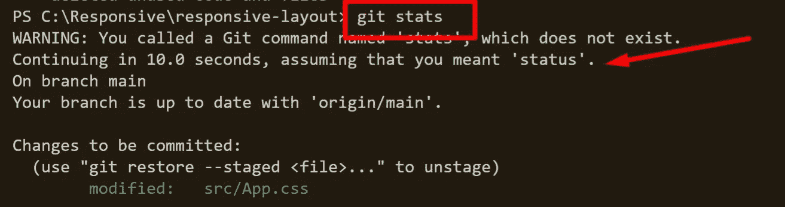

# 如何自动更正有错别字的 Git 命令

> 原文：<https://javascript.plainenglish.io/how-to-autocorrect-git-commit-that-has-typos-4d9e56046807?source=collection_archive---------10----------------------->



你曾经在运行 Git 命令的时候犯过打字错误吗？如果是，今天我们将尝试让 Git 理解这些错别字并自动更正它们，而无需我们再次将它们写回到终端。

如果您没有在您的终端中激活 git 自动更正，您将会看到 Git 的建议，告诉我们使用推荐的命令来更正命令。如果你看下面的例子，我试着使用 git add。命令，Git 告诉我它不能识别这个命令，并给我提供了有效命令的选项。



现在，解决这些错别字很容易。我们只需要在命令提示符下运行下面的自动更正命令。让我们这样做，看看当我们在终端上运行相同的命令时会发生什么。

**简单说明一下:**命令末尾的 100 表示自定义周期，100 相当于 10 秒钟。您可以根据自己的选择进行不同的设置。

```
**git config --global help.autocorrect 100**
```



在下面，你会看到结果。这一次，Git 将自动纠正我们的输入错误并继续执行命令，而无需我们在终端中再次写回命令。



这个结果将帮助你解决 50- 60%的错别字，它并不完美，也不会捕捉到所有的错别字，但它会帮助你。

如果您不喜欢这个结果，并且对它不满意，您可以很容易地运行下面的命令来禁用 Git 自动更正选项。

```
**git config -- global help.autocorrect 0**
```

我们将在这里结束。希望这篇文章对你有帮助。如果您有任何问题，请在帖子上发表评论，如果帖子帮助您解决了问题，请鼓掌、分享或给我一个关注。

[AKIN KARAYUN | LinkedIn](https://www.linkedin.com/in/akin-karayun-ab3239bb/)

*更多内容看* [***说白了就是***](https://plainenglish.io/) *。报名参加我们的* [***免费周报***](http://newsletter.plainenglish.io/) *。关注我们关于* [***推特***](https://twitter.com/inPlainEngHQ) ， [***领英***](https://www.linkedin.com/company/inplainenglish/) *，*[***YouTube***](https://www.youtube.com/channel/UCtipWUghju290NWcn8jhyAw)*，以及* [***不和***](https://discord.gg/GtDtUAvyhW) *。*