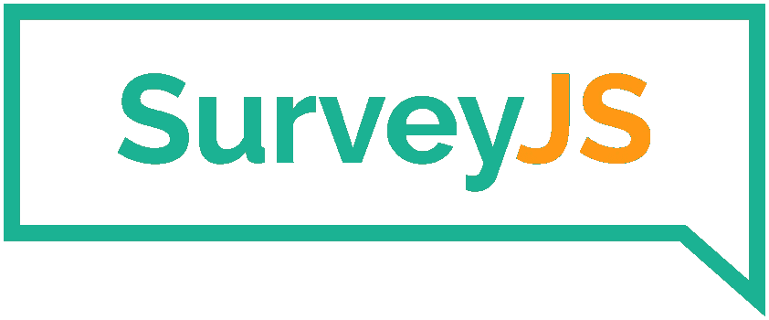

# 如何通过调查实现病历自动化

> 原文：<https://javascript.plainenglish.io/how-to-automate-patient-history-with-surveyjs-a31e2301029d?source=collection_archive---------9----------------------->

## 在保持 HIPAA 合规性的同时，立即提高对患者的护理标准。

[Photo by Andrea Piacquadio @ Pexels](https://www.pexels.com/photo/cheerful-stomatologist-and-assistant-showing-medical-report-to-patient-3952125/)

建立全面的病历是医疗保健链中的一个关键环节。这有助于医疗专业人员更好地了解病情，跟踪其进展，了解风险因素，并最终做出明智的治疗决定。

但是传统的方法效率很低。

口头问卷是僵化的模板，会干扰自然的对话流程，敏感信息可能不会被自由讨论。当患者只想尽快得到帮助时，病历调查可能是一个棘手的问题，最终，纸张仍然需要手动扫描到系统中。

我们能做得更好吗？让我们来看看 [SurveyJS](https://bit.ly/3arFq9V) ，这是一个 JavaScript 库，您可以使用它轻松构建交互式、自动化的电子患者调查— *和*将它们托管在您组织自己的门户网站上。这在快速、强大、安全和免版税的包中提供了无与伦比的灵活性和临床数据产量。

# 当前的需要

我们的目标是通过确保使用自动病历调查获得尽可能多的临床数据，来提高所提供的护理标准。考虑到这一点，下面是我们的业务需求:

1.  极其快速的实施和快速的周转时间，因为*在拯救生命的时候，每一秒都很重要*。
2.  我们需要调查易于设计，易于集成到 Cerner、MEDITECH、Epic 等医院的现有 [EHR(电子健康记录)](https://en.wikipedia.org/wiki/Electronic_health_record)系统中。，并且易于修改，无需开发人员输入。
3.  传统上，列出问题而不列出它们的严重性是一个问题，因此我们需要一个系统，可以根据需求创建动态定义的量表来进行定性检测或筛选，如疼痛的 NRS、家庭虐待的 WAST 或抑郁症状的 Zung 量表。
4.  我们需要在访谈的某些时候使用患者的回答，以确定后续的问题。这可以确保患者只问最相关的问题，这样他们就不会费力地完成调查或留下未回答的问题，从而导致假阳性。
5.  我们不仅需要避免不披露敏感话题的临床信息，如自杀、精神评估史、药物使用、慢性病等。，但我们还需要根据 HIPAA 或 GDPR 来保证这些信息的安全性和隐私性。

# 输入:SurveyJS。

分解这些需求，并通过软件开发的视角来观察它们，这就是为什么 SurveyJS 像手套一样适合医疗技术行业。

# 时间限制

当以传统方式构建调查时——带有自定义验证逻辑的 HTML/JavaScript、HTTP 请求和数据库——即使像添加一个新问题这样简单的事情也需要对服务器、数据库和前端代码进行单独的更改。这种**增加的复杂性沿着依赖链**向上传播，如果您没有适当的 CI/CD 管道，更改可能需要几天到*周*。

另一方面，SurveyJS 作为客户端库分发，并使用一种**数据驱动的方法**——定义为 JS on 模式的全动态调查，带有 UI 元素的模板。实现更快，维护更容易，变化只需几秒钟就能反映在前端。

# 集成和迭代

SurveyJS 优化了设计、集成和后续迭代的周期。

1.  在设计方面，调查很容易构建，并且完全可以使用 CSS 和预构建的主题进行定制。支持[自动本地化](https://bit.ly/3ysS8xa)，以及第三方 JavaScript 组件，如[日期选择器](https://jqueryui.com/datepicker/)或 [EasyAutocomplete](http://easyautocomplete.com/) 进一步简化了设计。
2.  对于集成，SurveyJS 采用了一种*构建模块*的理念，作为客户端组件库提供 [React](https://www.npmjs.com/package/survey-react-ui) 、 [Angular](https://www.npmjs.com/package/survey-angular) 、 [Vue.js](https://www.npmjs.com/package/survey-vue-ui) 、 [Knockout](https://bit.ly/3ysFxdo) ，与 **full** [**jQuery 兼容**。因此，只要支持 JSON、text 或 BLOB 数据类型，就可以使用任何服务器+数据库的组合。最后，由于所有数据都在行业标准的 JSON 中，您可以很容易地将其与现有的 EHR 解决方案集成。](https://bit.ly/3alLYqS)
3.  对调查的迭代也是简化的，因为您将调查定义为**结构良好、自我记录的** JSON 文档。没有编程背景的员工可以轻松添加或更改问题、字段类型，实现条件逻辑**，而无需代码**，也无需等待开发团队。与常规数据输入没有什么不同。

> *💡*[survey js 库](https://bit.ly/3bSdzQF)在麻省理工学院的许可下是完全免费和开源的，但是通过名义上定价的[商业使用许可](https://bit.ly/3bYlaNQ)，你也可以获得[Creator](https://bit.ly/3yoRAsm)——一个易于使用的 GUI 解决方案来可视化地构建调查*——你可以将它嵌入到你的员工内部网中，甚至让非程序员也能很快做出专业外观的设计。*

# *条件逻辑*

*无需任何代码，您就可以在调查模式本身中实现跳过逻辑和分支，从而根据受访者对之前问题的回答来确定问题。这为每位患者提供了个性化的调查体验，从而提高了完成率和临床数据的准确性。*

*此外，您可以根据您所在的医疗中心设计任意数量的预定**查询分支**。*

# *动态创建的秤*

*SurveyJS 的字段类型非常通用。它提供了对矩阵问卷和等级量表的开箱即用支持，您可以*动态定义*这些具有精确值、限制、可见性和验证逻辑的量表，不仅可以实施任何类型的自我报告或观察者评定的医学量表，用于鉴别诊断，还可以确保该量表**适合被评估的人群**(例如，儿童、成人、老年人等)。)*

*为了展示按需构建这些是多么容易，[这里有一个](https://surveyjs.io/Examples/Library?id=real-lcq)[莱斯特咳嗽问卷](https://www.physio-pedia.com/Leicester_Cough_Questionnaire)，使用 SurveyJS 制作(并增加了条件逻辑)。*

*Questions pertaining to social distress are only shown when Question 5 is true; Question 9 is dependent on cough severity, and so it is invisible unless certain questions (1, 2, 14 and 15 in this example) have concerning enough responses.*

# *隐私*

*SurveyJS 在您组织自己的服务器上是完全自托管的，让您完全控制数据安全。没有第三方黑盒解决方案，您可以确保敏感数据存储在您选择的安全位置，完全由您的组织管理，加密，定期备份，只有授权人员才能访问。*

# *使用调查的组织生活中的一天*

*这是七月的一个多雨的星期二，52 岁的里贾纳已经持续咳嗽了一周。她预约了时间，您的门户网站向她展示了患者病史调查，并根据她的地区自动翻译成西班牙语。*

*她被要求通过你的定制莱斯特咳嗽问卷来确定咳嗽的严重程度，然后是个人和家族史，在那里她记下了烟草使用史。*

*输出是结构化的，同步到医院的 EHR 数据库，并建议相关的诊断实验室/成像——所以当 Regina 登记就诊时，她的医生已经有了他需要的所有信息。*

*他提出了一个治疗方案，最后他们一起检查了她的病史，以此作为精神检查。*

**多亏了 SurveyJS，这一过程的每个阶段*都得以简化。*

*   *患者可以在家里尽自己的一份力量，通过医院门户网站上的**自主调查**。*
*   *由于**自动本地化**，不需要西班牙语-英语翻译，让他们在医院的其他地方更好地使用。*
*   *传统的莱斯特咳嗽问卷很长，但使用**条件逻辑**，明显更容易通过，因为与她的咳嗽无关的问题被跳过了。*
*   *不涉及打印输出或文书工作。所有输入或输出的数据都与现有的 EHR 系统无缝集成，并得到保护。*

# *结论*

*如何让自动病历记录变得更好？简单来说，**效率**，**同理心**，**隐私**。*

*快速、准确、为患者描述他们的问题提供充分和相关的响应选项、最大限度减少潜在偏见和误报的可定制性，以及最重要的是，保证敏感信息的隐私性，所有这些都为患者创造了一个安全、可靠和非判断性的环境。*

*使用 SurveyJS 实现自动化病历，对于克服与上述所有问题相关的技术挑战最有意义。*

**更多内容请看*[***plain English . io***](https://plainenglish.io/)*。报名参加我们的* [***免费周报***](http://newsletter.plainenglish.io/) *。关注我们关于*[***Twitter***](https://twitter.com/inPlainEngHQ)*和*[***LinkedIn***](https://www.linkedin.com/company/inplainenglish/)*。查看我们的* [***社区不和谐***](https://discord.gg/GtDtUAvyhW) *加入我们的* [***人才集体***](https://inplainenglish.pallet.com/talent/welcome) *。**