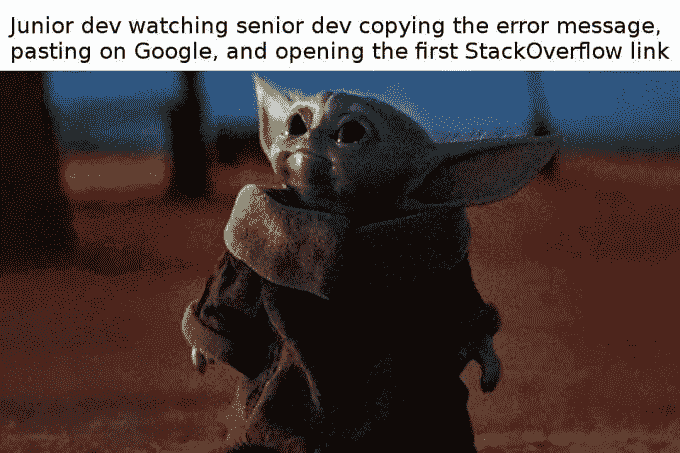
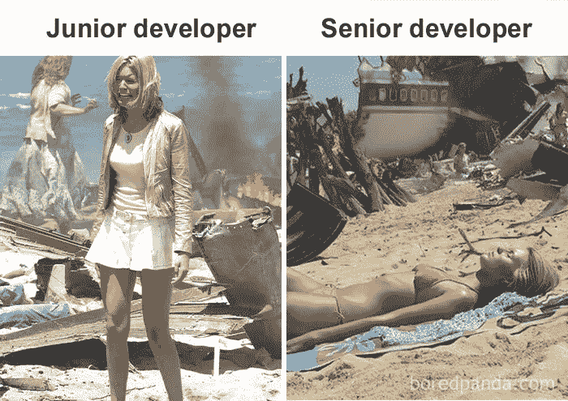
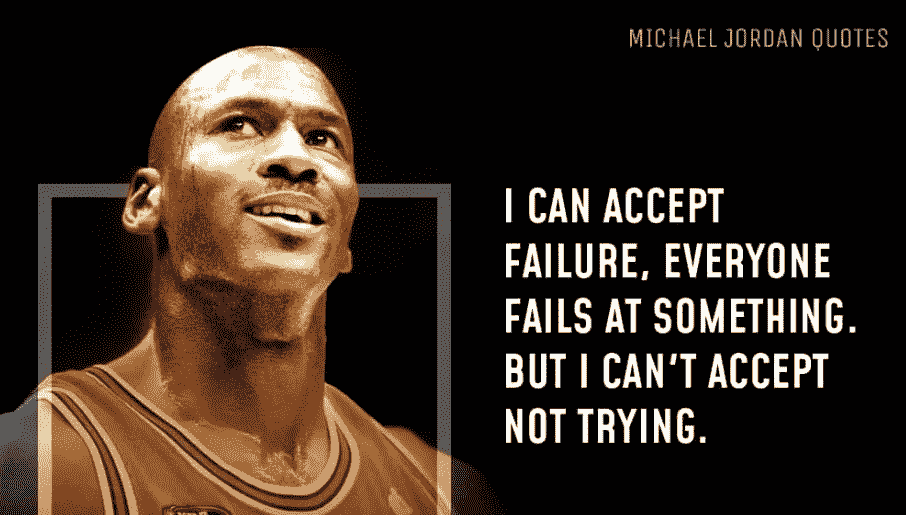
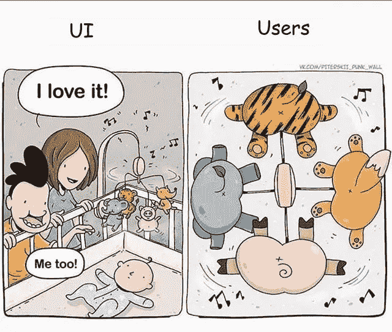

# 如何成为团队中最好的开发人员

> 原文：<https://javascript.plainenglish.io/how-to-become-the-best-developer-on-your-team-61063b8cf1aa?source=collection_archive---------0----------------------->

## 根据我个人的经验

Captured by: [Rene Asmussen](https://www.pexels.com/sk-sk/photo/vyraz-tvare-smoking-nesenie-nesuci-12919222)

他们说资历随着年龄的增长而增长。

这种说法虽然部分正确，但并没有描绘出全貌。

如果你不相信我，让我给你画另一幅画。

想象一下一个叫威尔逊的人。他已经编程 30 多年了。他从来没有换过工作，他每天早上坐在办公桌前，静静地工作，下午 5 点后离开一点点。

他像个疯子一样复制粘贴 StackOverflow 的答案。除了从计算机科学学位获得的技能之外，他什么也没学到。

在 30 年的时间里，Wilson 获得了高级开发人员的地位，但是他真的是高级开发人员吗？我不认为他是。至少在我看来不是。

[Original Source](https://pbs.twimg.com/media/EXJzu-kWkAAOAn8.jpg)

这是一个简单的事实:

> 资历是随着时间来的，但并不取决于时间。

重要的是你愿意在给定的时间内付出多少努力。你的年龄并不重要。但是你在这段时间里所建立的。

# 时间很重要，但不是真的

如果你想变得更好，想成为开发忍者，你花在编码上的时间绝对有帮助。毕竟，更多的时间意味着更多的经验。

但是不要被愚弄，时间只是等式中的一个变量。真正的体验来自于做项目，面对问题，解决这些问题。这个过程叫做积累经验。

当你面对某一类问题，你自己解决了，你的大脑会记住它。但最重要的是，它会在未来认识到同类问题。也就是说你会马上知道解决方法。

你有没有想过为什么伟大的开发人员在面对问题时知道该怎么做？这正是为什么！

[Original Source](https://static.demilked.com/wp-content/uploads/2021/08/61249759c3478-4-61234b63116e0__700.jpg)

但是怎样才能让自己接触到更多的机会呢？毕竟，在我们的工作中，我们被告知要做什么，我们真的无法选择。

别担心，没那么复杂。

# 利用你的空闲时间

如果你想变得伟大，你不能仅仅局限于你在办公室或者家庭办公室(也就是你的床)度过的 8 个小时。

迈克尔·乔丹是世界上有史以来最好的篮球运动员。他很快就达到了那个地位。在年轻的时候，他已经统治了 NBA，所有其他球员很快意识到这是镇上的新警长。

你认为他这么快就变得这么好只是因为他每天都出现在训练中吗？这确实有所帮助，但让迈克尔变得伟大的是他令人难以置信的职业道德和竞争力。

[Original Source](https://modernmenlife.com/wp-content/uploads/2021/08/michael-Jordan-Quotes.png)

如果你想很快好起来，你需要采取同样的心态。

做你的个人项目，或者兼职自由职业会让你接触到更多的工作和经验。最终，它会帮助你更快变得更好。

在工作时间之外构建项目会给你极大的帮助。如果你愿意听听我的意见，我认为这比无休止的工作要令人兴奋得多。

> 去办公室，花 8 个小时编码，忘记一切，在家看网飞。

参与不同规模、不同行业、不同客户的项目。你的工作越多才多艺，你就会成为越灵活的开发者。

除了枯燥的工作程序，我建议做以下事情。

> 建设，失败，学习，再建设，成功。

如果你重复这个过程，你最终会变得很棒。我对此毫不怀疑。

[Original Source](https://media.makeameme.org/created/get-this-developer-5b1f89.jpg)

你可以建立 100 个网站、移动应用或软件解决方案。它们对你来说可能都很完美。毕竟，它们都是你的作品，所以你应该永远爱它们。

然而，你仍然会错过实现伟大的最后一块拼图。你需要向世界展示你的作品。

如果你不和任何人分享你的产品，你就错过了发展的一个重要方面。你错过了顾客反馈。

# 为观众打造

顾客真的很让人头疼。

我曾经把顾客视为我的死敌。他们总是在我做的东西上发现一些缺陷。因为这个原因，我们的关系到处都是。

每次我注意到一个新的 bug 报告，几秒钟之内我就生气了。但我意识到这不是一种生产产品的方式。

你脑子里可能有个好主意。这对你来说意义非凡。但对其他人来说，这可能只是简单的混淆。

[Original Source](https://i.pinimg.com/736x/9f/0b/8d/9f0b8dbef7691083a97e67257ed35f64.jpg)

你需要与他人分享你的成果，并收集尽可能多的反馈。当你这样做的时候，你将开始从一个开发者的角度思考问题，而更多地从一个潜在客户的角度思考问题。

这些天来，我一直在倾听我的用户。并且尽可能的有建设性。我在倾听他们的需求，也在关心他们的意见。

如果你想提高，你也应该这样做。毕竟，决定你成功与否的是客户。

如果你开始倾听你的客户，你会了解他们是如何思考的，他们是如何运作的，这将教会你一件非常重要的事情。你将学习如何制造人们喜爱的产品。

# 结束语

我一直认为，成为一名优秀的开发人员意味着你写的代码越少，你实现的功能就越多。老实说，我也遵循这个策略有一段时间了。

但是一路走来，我了解到你写的代码越少，越难理解。我发现成为一名优秀的开发人员还有更重要的方面。

如果你仔细读过这个故事，你就会知道所有的故事。如果你还不是一名优秀的开发人员，你知道如何成为一名优秀的开发人员。

我提到的建议可以被任何人采纳，如果你至少以某种方式遵循它们的话。我保证你的手艺会越来越好。如果没有，我很抱歉浪费了你 5 分钟的时间。

我不是故意的！

*如果想多读，* ***通过使用*** [***这个链接***](https://bernardbad.medium.com/membership) ***成为中等会员。*** *如果你想获取我的优质内容，* [***加入我的快讯***](https://upbeatcode.substack.com/) *。*

*更多内容请看*[***plain English . io***](https://plainenglish.io/)*。报名参加我们的* [***免费周报***](http://newsletter.plainenglish.io/) *。关注我们*[***Twitter***](https://twitter.com/inPlainEngHQ)*和*[***LinkedIn***](https://www.linkedin.com/company/inplainenglish/)*。查看我们的* [***社区不和谐***](https://discord.gg/GtDtUAvyhW) *加入我们的* [***人才集体***](https://inplainenglish.pallet.com/talent/welcome) *。*