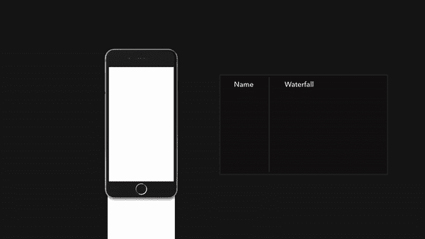
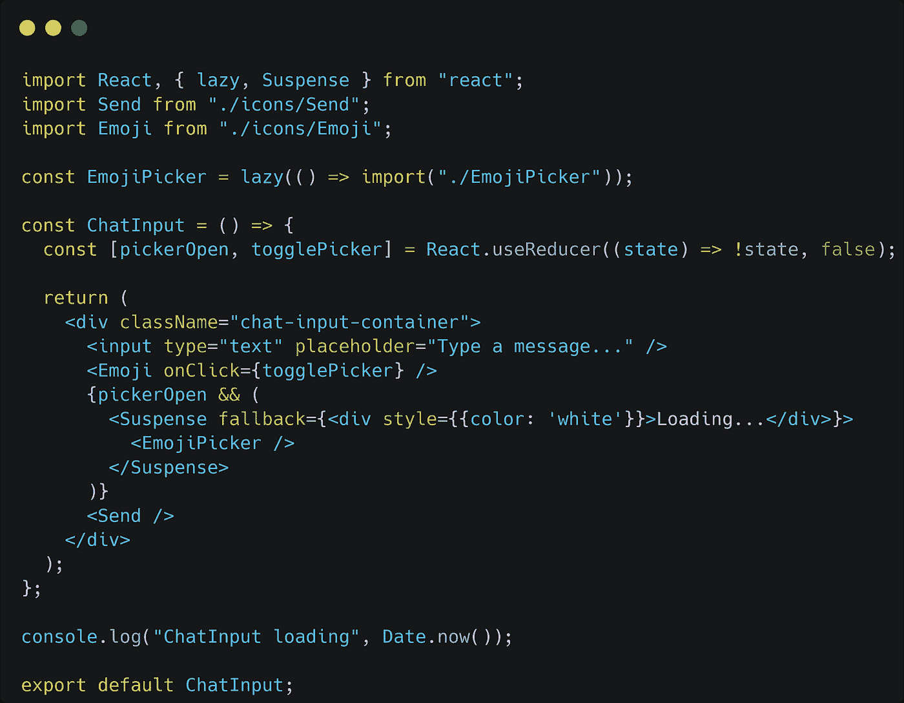
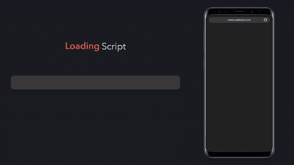

# 如何一步提高 React 应用程序的加载时间

> 原文：<https://javascript.plainenglish.io/how-to-boost-react-app-load-time-in-one-step-43f40ffd392c?source=collection_archive---------4----------------------->

## **Google Docs 和 YouTube 就是这样节省了超过 500KB 的资源加载量。**

Photo by [Shahadat Rahman](https://unsplash.com/@hishahadat?utm_source=medium&utm_medium=referral) on [Unsplash](https://unsplash.com?utm_source=medium&utm_medium=referral)

**Google Docs 和 YouTube 使用类似的技术来节省超过 500KB 的资源加载。这个简单的技巧将会快速提高你的 React 应用的加载时间。**

有时，我们的应用程序中有一些组件应该隐藏在页面上，除非需要。一个典型的例子是不在视窗中的图片的延迟加载。

# 𝐇𝐨𝐰 𝐰𝐢𝐥𝐥 𝐭𝐡𝐢𝐬 𝐢𝐦𝐩𝐫𝐨𝐯𝐞 𝐦𝐲 𝐥𝐨𝐚𝐝𝐢𝐧𝐠 𝐭𝐢𝐦𝐞?

这个简单的技术可以让我们缩短首次加载时间，因为我们不会立即请求所有照片。同样的方法也可以应用到 app 的其他部分。

技术很简单:我们不会在应用程序中加载那些在应用程序加载时不一定重要的组件。应用程序将根据需要加载这些组件，例如:当它们在视口中或用户交互时。

由于资源是按需加载的，因此可以节省获取这些资源所需的加载时间。当你的应用程序需要加载多个沉重的组件时，这是非常有效的。

Google Docs 和 YouTube 使用类似的技术来节省超过 500KB 的资源加载。

# 𝐀 𝐬𝐢𝐦𝐩𝐥𝐞 𝐚𝐩𝐩 𝐭𝐨 𝐥𝐨𝐚𝐝 𝐡𝐞𝐚𝐯𝐲 𝐫𝐞𝐬𝐨𝐮𝐫𝐜𝐞 𝐨𝐧 𝐝𝐞𝐦𝐚𝐧𝐝

这是一个简单的聊天应用程序，按需加载沉重的表情符号选择器组件。

**演示链接:**[https://chat-app-eight-ashen . vercel . app](https://chat-app-eight-ashen.vercel.app)

上面的应用程序是这个用例的一个简单例子。当`EmojiPicker`呈现在表情按钮 click 上时，`react lazy`检测`EmojiPicker`组件是否应该在屏幕上可见。

然后它开始导入组件模块。在导入组件时，应用程序将显示正在加载。

这种加载部件在该过程中是有益的。因为组件是按需导入的，所以我们需要用户的反馈。加载组件通知用户应用程序没有冻结:他们只需要等待组件被加载。

这些简单的技术被证明是构建大型应用程序时的救命稻草。明智地使用这种技术，因为对每个组件都使用这种技术会导致性能下降。

*更多内容请看*[***plain English . io***](https://plainenglish.io/)*。报名参加我们的* [***免费周报***](http://newsletter.plainenglish.io/) *。关注我们关于*[***Twitter***](https://twitter.com/inPlainEngHQ)[***LinkedIn***](https://www.linkedin.com/company/inplainenglish/)*[***YouTube***](https://www.youtube.com/channel/UCtipWUghju290NWcn8jhyAw)*[***不和***](https://discord.gg/GtDtUAvyhW) *。对增长黑客感兴趣？检查* [***电路***](https://circuit.ooo/) *。***