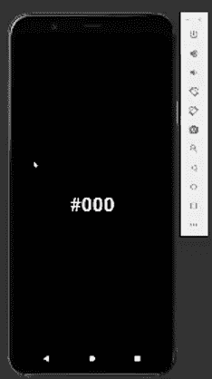
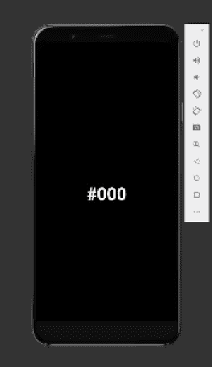

# 如何在 React Native 中构建一个旋转木马

> 原文：<https://javascript.plainenglish.io/how-to-build-a-carousel-in-react-native-9ed31d14c9fb?source=collection_archive---------7----------------------->

## 在 React Native 中从头开始创建一个旋转木马。

Photo by [Daria Shevtsova](https://www.pexels.com/photo/bokeh-photography-of-person-holding-turned-on-iphone-1440727/) on Pexels

这段代码演示了如何用`[FlatList](https://medium.com/r?url=https%3A%2F%2Freactnative.dev%2Fdocs%2Fflatlist)`组件创建一个旋转木马。这个转盘将显示一个十六进制代码，并设置相同的十六进制代码作为背景颜色。

伴随这个作品的演示(在这个 Github [链接](https://github.com/AzizBooker/rn-carosuel))将展示每个单独项目的旋转木马抓拍。我们将通过使用 FlatList `[SnapToInterval](https://reactnative.dev/docs/scrollview#snaptointerval)` prop 和`[Dimensions](https://reactnative.dev/docs/dimensions)` API 来实现这一点。

下面的截屏总结了这一过程。请注意，我们还在 carousel 中呈现了一个页脚。这可以通过使用 FlatList `[ListFooterComponent](https://reactnative.dev/docs/flatlist#listfootercomponent)`属性来实现。

Finished Carousel in Action

*如果你在任何时候迷路了，本文底部提供了完整的代码*

## 起始代码

下面我附上了一个 GitHub 要点与代码，你将需要启动这个项目。在此代码中，我们:

1.  导入包，
2.  声明十六进制代码数组
3.  传入 RenderItem 函数
4.  创造我们的风格

Code Needed to Start Project

## 渲染项目

如果你运行这段代码，你会发现什么也不会出现。这是因为我们的 **renderItem** 函数没有返回方法。我们现在将添加一个返回函数。

在这个返回函数中，我们将做两件事

1.  将我们的 HexCode 显示为字符串
2.  将我们的 Hexcode 设置为背景色

为了将我们的 HexCode 显示为一个字符串，我们需要将我们的项目道具包装到一个`[Text](https://reactnative.dev/docs/text)`组件中。然后我们将把这个`[Text](https://reactnative.dev/docs/text)`组件包装在一个`[View](https://reactnative.dev/docs/view)`组件中，并对其应用**项目容器**样式。

修改 **renderItem** 函数，如下所示。

在这个 **renderItem** 函数中，我们将项目 prop 设置为显示在`[Text](https://reactnative.dev/docs/text)`组件*中的字符串，并将*设置为背景颜色样式提供的值。您可能还注意到我们正在获取**高度的值。**

**这就是** `[Dimensions](https://reactnative.dev/docs/dimensions)` **API 发挥作用的地方。**

添加以下代码行以获取设备的当前高度。这是必需的，以便转盘中的每个项目都可以扩展到设备的最大高度。

Using Dimensions Api to get the Device's Height

下面的截屏总结了我们迄今为止取得的进展。你可能会注意到我们还有一些事情需要改进。第一，我们的项目是**而不是**捕捉到每一个单独的项目。我说的对齐是指一次只能显示一个项目。不像我们在截屏中展示的那样是 2 的一部分

## 与间隔对齐

为了让我们的旋转木马捕捉每一个项目，我们将使用 4 个`[FlatList](https://medium.com/r?url=https%3A%2F%2Freactnative.dev%2Fdocs%2Fflatlist)`道具:`[showsVerticalScrollIndicator](https://reactnative.dev/docs/scrollview#showsverticalscrollindicator)`、`[decelerationRate](https://reactnative.dev/docs/scrollview#decelerationrate)`、`[snapToAlignment](https://reactnative.dev/docs/scrollview#snaptoalignment-ios)`和`[s](https://medium.com/r?url=https%3A%2F%2Freactnative.dev%2Fdocs%2Fflatlist)napToInterval`。

`[showsVerticalScrollIndicator](https://reactnative.dev/docs/scrollview#showsverticalscrollindicator)`、`[decelerationRate](https://reactnative.dev/docs/scrollview#decelerationrate)` 最容易理解。`[showsVerticalScrollIndicator](https://reactnative.dev/docs/scrollview#showsverticalscrollindicator)`将简单地隐藏垂直滚动条。`[decelerationRate](https://reactnative.dev/docs/scrollview#decelerationrate)`确定滚动视图减速的速度。

`[snapToAlignmen](https://reactnative.dev/docs/scrollview#snaptoalignment-ios)t`和`[snapToInterval](https://reactnative.dev/docs/scrollview#snaptoalignment-ios)`携手并进。根据 react-native 文档:

> 置位时，[snapToInterval]使滚动视图在`snapToInterval`值的倍数处停止。这可用于对长度小于滚动视图的子视图进行分页。

这意味着使用`[snapToInterval](https://reactnative.dev/docs/scrollview#snaptoalignment-ios)`并将其设置为在装置的**高度的间隔处咬合。我们正在创建一个一次只能呈现一个项目的情况。**

`[snapToAlignmen](https://reactnative.dev/docs/scrollview#snaptoalignment-ios)t` 另一方面，简单地决定了捕捉将在哪里发生。对于我们的用例，我们将设置为`[snapToAlignmen](https://reactnative.dev/docs/scrollview#snaptoalignment-ios)t` *【开始】*

这方面的代码如下。

这个截屏显示了传送带现在如何抓取每个单独的项目。

Carousel With Snapping at Intervals of Height

## 呈现页脚

完成 carousel 的最后一步是添加一个页脚元素。我们将使用`[ListFooterComponent](https://reactnative.dev/docs/flatlist#listfootercomponent)` 道具来完成这个任务。第一步是创建一个 **renderFooter** 函数。下面的代码演示了如何操作。

我们现在将把这个函数传递给我们的`[ListFooterComponent](https://reactnative.dev/docs/flatlist#listfootercomponent)` prop。

这样我们的旋转木马就完成了。

Finished Carousel in Action

## 完整代码

如果你迷路了，这里有完整的代码。

Full Code

# 结论

感谢您阅读我关于**“为您的下一个 Web 开发项目获得灵感的 7 个地方”**的文章。如果你有任何问题，请随意提问，我会尽快回答。

如果你刚接触媒体，你可以点击这里的[链接](https://bookeraziz.medium.com/membership)加入。

## 我的更多故事

 [## 如何使用 Expo 在 React Native 中创建图像拾取器

### 在 React Native 中上传图像和视频变得简单

javascript.plainenglish.io](/how-to-create-an-image-picker-in-react-native-using-expo-4dd403e706bd)  [## 如何在 React Native 中使用 Expo 更改设备的屏幕方向

### React Native 中处理屏幕方向的初学者指南

javascript.plainenglish.io](/how-to-change-a-devices-screen-orientation-using-expo-in-react-native-af69c10032fb) 

*更多内容看* [***说白了就是 io***](https://plainenglish.io/) *。报名参加我们的* [***免费周报***](http://newsletter.plainenglish.io/) *。关注我们关于*[***Twitter***](https://twitter.com/inPlainEngHQ)*和*[***LinkedIn***](https://www.linkedin.com/company/inplainenglish/)*。加入我们的* [***社区不和谐***](https://discord.gg/GtDtUAvyhW) *。*