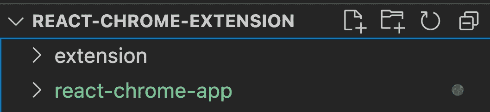
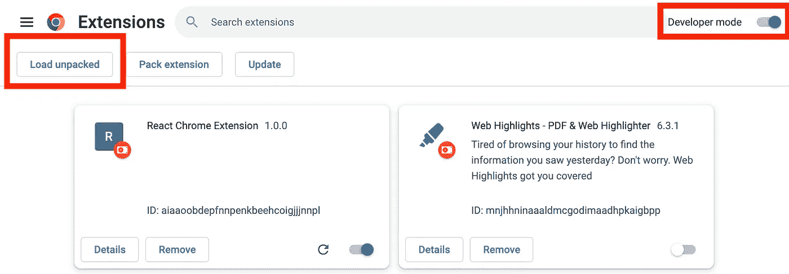
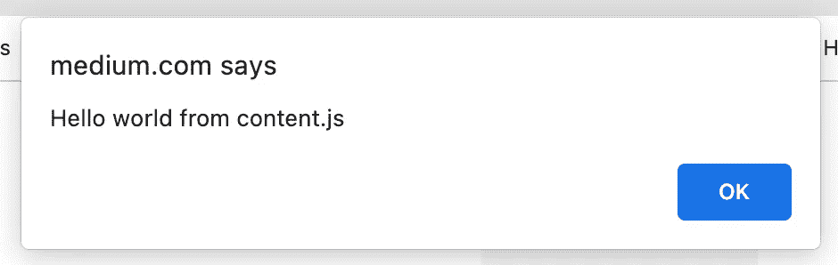
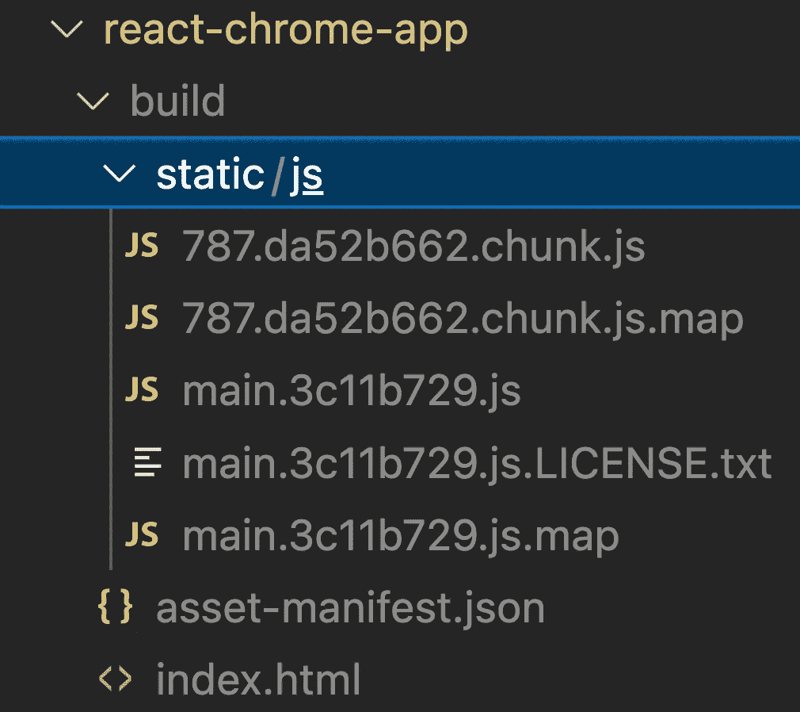
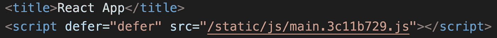
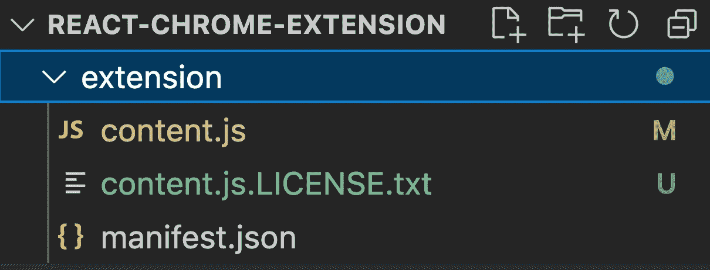
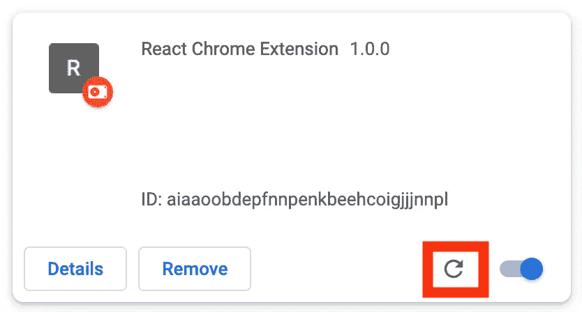
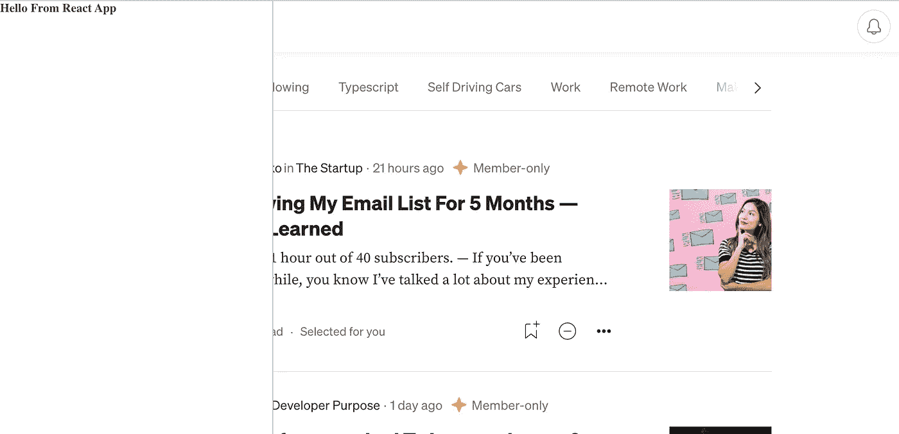

# 如何使用 React 构建 Chrome 扩展

> 原文：<https://javascript.plainenglish.io/how-to-build-a-chrome-extension-using-react-28ec1a16c44b?source=collection_archive---------3----------------------->

## 了解如何创建 Chrome 扩展，以及如何使用 React 构建应用程序的前端部分。

Photo in background by [Markus Spiske](https://unsplash.com/@markusspiske?utm_source=unsplash&utm_medium=referral&utm_content=creditCopyText) on [Unsplash](https://unsplash.com/s/photos/shaking-hands?utm_source=unsplash&utm_medium=referral&utm_content=creditCopyText)

创建自己的 Chrome 扩展比许多人想象的要容易。而且很有意思。我们可以尽情发挥我们的创造力，随心所欲地修改每个网站。

在本文中，我将首先向您展示如何设置一个通用的 Chrome 扩展。之后，我们将设置一个 React 应用程序，并将其加载到任何网站上。

# 设置

在开始之前，让我们在我们的存储库中创建两个子文件夹: ***扩展*** 和***react-chrome-app***。 ***扩展*** 文件夹会包含我们的 chrome 扩展文件，我们会在***react-chrome-app***目录下创建一个 react app。

结构应该是这样的:

Repository folder structure

# Chrome 扩展设置

让我们开始设置我们的 Chrome 扩展。首先，我们需要创建一个`manifest.json`文件。我们将在我们的 ***扩展名*** 子文件夹中创建该文件。

清单是我们的扩展的入口点，它定义了元数据，比如名称和版本，以及其他功能。

## 创建 manifest.json

让我们创建一个`manifest.json`并添加一些元数据:

前三个值`name`、`version`和`manifest_version`足以创建我们的第一个 chrome 扩展。

## 安装延伸部分

打开你的 Chrome 浏览器，导航到 **chrome://extensions** 。

点击**开发者模式**旁边的拨动开关启用开发者模式。点击**Load unpacked**按钮，选择包含本方`manifest.json`的本方回购 ***扩展名*** 目录。

Load unpacked Chrome extension

恭喜你！你刚刚创建了一个 Chrome 扩展！

# 设置 React 应用程序

现在，让我们在存储库的子文件夹中设置 React 应用程序。

我们可以通过运行以下命令来实现:

`npx create-react-app react-chrome-app --template typescript`

或者

`yarn create create-react-app react-chrome-app --template typescript`

现在，让我们扔掉所有不必要的东西。让我们删除所有 CSS 样式和`App.tsx`组件中的 React 模板代码。对于这篇文章，让我们把一个简单的*“你好，来自 React App”*标题放到我们的组件中:

如果您想要包含样式，您应该使用[*styled-components*](https://styled-components.com/)将它们包含在 Javascript 包中。

因为我们想在 Chrome 扩展中包含 React 应用程序，所以我们需要配置 React 如何设置我们的应用程序。为此，我们需要查看`index.tsx`文件:

这里我们可以看到 React 为带有`id="root"`的元素创建了一个 React 根。然后，根元素用于将我们的 React 组件`App.tsx`渲染到带有`render`的 DOM 中。React 假设根元素存在，因为它存在于我们的`index.html`文件中。一旦找不到元素，我们的应用程序就会失败。

要在任何网站上使用我们的应用程序，我们不能再假设根元素存在。这就是为什么我们将在呈现 React 应用程序之前以编程方式创建自己的根元素。

我们创建一个新的`div`元素，传递我们自己的 ID，并将 HTML 元素作为子元素添加到文档的`body`中。然后，我们可以将`rootElement`传递给`createRoot`函数。

最后，让我们创建一个`style`元素，并将其附加到我们的`rootElement`中，以将其放置在屏幕的左侧。下面是我们的`index.tsx`文件中的最终代码:

# 将 React 应用程序纳入 Chrome 扩展

一开始，我们已经安装了我们的扩展。尽管如此，目前它什么也不做，因为我们还没有给我们的`manifest.json`添加功能。

## 创建内容脚本

要将扩展中的 React 应用程序包含到任何网页中，我们需要一种方法来读取 DOM 并对其进行更改。

为此，我们将创建一个内容脚本:

> ***内容脚本*** *生活在一个孤立的世界中，允许内容脚本对其 JavaScript 环境进行更改，而不会与页面或其他扩展的内容脚本发生冲突。——*[developer.chrome.com](https://developer.chrome.com/docs/extensions/mv2/content_scripts/)

首先，让我们创建一个带有警告的`content.js`文件，以确保我们的扩展成功加载脚本。这个文件将作为我们的内容脚本。

`content.js`脚本是我们扩展的入口点。让我们调整我们的`manifest.json`来注入我们的脚本:

为了使用我们静态声明的`content.js`脚本，我们需要在`content_scripts`字段下注册它。该字段需要定义*必需的*属性`matches`，以指定内容脚本将被注入哪些页面。为此，您可以设置几个[匹配模式](https://developer.chrome.com/docs/extensions/mv3/content_scripts/match_patterns)。我们将使用特殊模式`<all_urls>`来匹配任何以允许的模式开头的 URL 例如`http`或`https`。

我们还定义了可选字段`js`。在这里，我们定义要注入到匹配页面中的脚本。

让我们通过点击`chrome://extensions`上扩展的刷新按钮来更新我们的扩展。我们现在可以导航到任何页面，如果操作正确，在页面加载时应该会出现一个警告。

史上最烂的 Chrome 扩展，对吧？让我们继续，包括 React。

## 创建一个反应内容脚本

让我们构建运行`yarn build`或`npm run build`的 React 应用程序。

您应该看到 react-scripts 构建脚本在***build/static/js/***文件夹中生成了一些 Javascript 文件:

Build directory

`main.3c11b729.js`文件是我们的入口文件，在文件名中包含一个生成的散列。在生成的`index.html`中，主文件将被加载:

/build/index.html

我们现在想做的不是从`index.html`加载主文件，而是在我们的 Chrome 扩展中作为内容脚本加载。

请注意，我们的构建还包含一个由主文件加载的块文件。将许多文件名中带有散列的 JavaScript 文件放到我们的`manifest.json`中并不是最好的解决方案。因此，我们将设置 Webpack 为我们的应用程序创建一个单独的 JavaScript 包。

## 设置 Webpack

首先我们需要安装 webpack。我们可以通过运行以下命令来实现:

`yarn add -D webpack ts-loader webpack-cli`

或者

`npm i -D webpack ts-loader webpack-cli`

然后，我们可以创建一个`webpack.config.js`文件:

我们告诉 Webpack，我们的入口点是`index.tsx`文件，我们希望将所有内容捆绑到一个`content.js`文件中。最后，我们将捆绑的 Javascript 文件的路径定义为 Chrome 扩展的目录。

现在，如果我们运行`yarn build`，你应该会看到`content.js`文件覆盖了我们的 ***扩展*** 文件夹中的现有内容脚本:

Extension folder with bundled content.js file

现在，我们可以继续并重新加载扩展以应用我们的更改。

当导航到任何网页时，我们应该看到我们的 React 应用程序出现在屏幕的左侧:

React App loaded on medium.com

诚然，这仍然不是一个很酷的 Chrome 扩展。但现在我们已经成功地将 React 应用集成到 Chrome 扩展中，你可以用 React 构建任何你选择的应用，在任何网页上运行。

您可以在这个 [GitHub 资源库](https://github.com/MariusBongarts/react-chrome-extension)中找到本文的代码。

# 最后的想法

创建自己的 Chrome 扩展比许多人想象的要容易得多。一旦正确设置了扩展，您就可以使用 React 开发任何您想开发的东西。能够设计自己的 Chrome 扩展非常有趣，因为你可以尽情发挥你的创造力。

我希望你喜欢阅读这篇文章。我写的是关于辅助项目、Web 组件、Chrome 扩展、Typescript 和更多的主题。**关注** **me** 或 [**订阅**](https://medium.com/subscribe/@mariusbongarts) 通过电子邮件获取我的故事，不要错过我的下一篇文章。

我总是乐于回答问题，并乐于接受批评。欢迎随时留言或联系我！通过**[**LinkedIn**](https://www.linkedin.com/in/marius-bongarts-6b3638171/)**或 [**Twitter**](https://twitter.com/MariusBongarts) **与我联系。******

****还有，如果你还没有，可以看看我的 [**在线荧光笔 Chrome 扩展**](https://chrome.google.com/webstore/detail/web-highlights-pdf-web-hi/hldjnlbobkdkghfidgoecgmklcemanhm?hl=de) 。使用 [Web Highlights](https://web-highlights.com/) ，您可以在任何网页或 PDF 上高亮显示，创建标签并做笔记。看看吧！😊****

**** [## 网络亮点- PDF 和网络荧光笔

### 最佳网络荧光笔。就像你在书上做的那样，在任何网页或 PDF 上高亮显示，并做笔记。组织…

web-highlights.com](https://web-highlights.com/)**** 

****[**这里是无限制访问媒体**](https://medium.com/@mariusbongarts/membership) 上每一个内容的链接。如果你注册使用这个链接，我会赚一小笔钱，不需要你额外付费。****

**** [## 通过我的推荐链接加入 Medium-Marius bong arts

### 作为一个媒体会员，你的会员费的一部分会给你阅读的作家，你可以完全接触到每一个故事…

medium.com](https://medium.com/@mariusbongarts/membership)**** 

*****更多内容看* [***说白了就是***](https://plainenglish.io/) *。报名参加我们的* [***免费周报***](http://newsletter.plainenglish.io/) *。关注我们关于* [***推特***](https://twitter.com/inPlainEngHQ) ， [***领英***](https://www.linkedin.com/company/inplainenglish/) *，*[***YouTube***](https://www.youtube.com/channel/UCtipWUghju290NWcn8jhyAw)*，以及* [***不和***](https://discord.gg/GtDtUAvyhW) *。对增长黑客感兴趣？检查* [***电路***](https://circuit.ooo/) *。*****