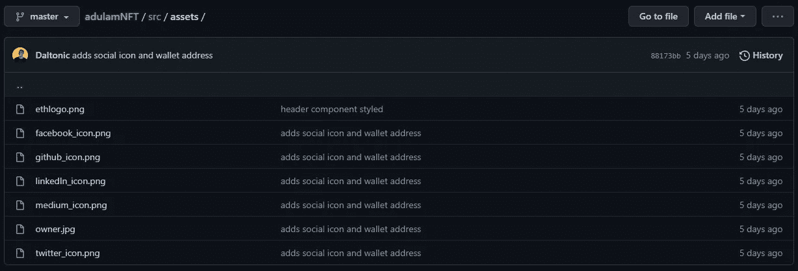

# 如何建立一个经典的 Web3 NFT 明廷 Dapp 与反应和坚实

> 原文：<https://javascript.plainenglish.io/how-to-build-a-classic-web3-nft-minting-dapp-with-react-and-solidity-part-2-c019073febee?source=collection_archive---------2----------------------->

Adulam NFT Part 2

你将建立什么，见[现场演示](https://adulam-nft.web.app/)和 [GitHub repo](https://github.com/Daltonic/adulamNFT) 了解更多信息(不要忘记启动该项目)。

# 介绍

在本教程的[第一部分](https://medium.com/p/how-to-build-a-classic-web3-nft-minting-dapp-with-react-and-solidity-part-1-4448404ee805)中，我们用 Solidity 编写了这个应用程序的智能合同部分，现在是时候将它与 React 合并了。

如果你还没有检查过本教程的第一部分，我建议你在继续第二部分之前先检查一下。

如果你从本教程中获得了价值，并且你想全力以赴开发区块链，那么 [**和我一起预定一堂私人课**](https://daltonic.github.io) **。**

让我们开始编码吧…

[现在就去我的 Youtube 频道查看免费的 web3 教程](https://www.youtube.com/channel/UCQteXYZ5mC-cuTxplzM4Hlw?sub_confirmation=1)。

# 先决条件

您必须在其他地方完成本文的第[部分](https://medium.com/p/how-to-build-a-classic-web3-nft-minting-dapp-with-react-and-solidity-part-1-4448404ee805)才能充分受益于这一部分。如果你还没有，请迅速检查[第一部分](https://medium.com/p/how-to-build-a-classic-web3-nft-minting-dapp-with-react-and-solidity-part-1-4448404ee805)，区块链发展不是儿戏。

# 构建组件

让我们从一步一步地构建组件开始，确保您准确地遵循这些步骤…

**表头组件**

像往常一样，我们将从头部组件开始，这是任何网站或应用程序的正常流程。

这是用渐变样式的顺风 CSS 精心制作的。它只是让用户能够连接一个钱包地址进行铸造。在项目中，转到 components 文件夹，创建一个名为 Header.jsx 的新文件，然后将下面的代码粘贴到其中。

这就是标题，让我们来看看英雄部分。

**英雄组件**

这个组件负责启动铸造过程，就像您看到的铸造按钮一样。此外，它还记录了制造的 NFT 总数与剩余的 NFT 数。

下面是负责此操作的代码片段…

我们清单上的下一个是艺术品部分…

**艺术品组件**

这个组件负责一个接一个地呈现艺术品。顺风 CSS 通过这里来帮助我们设计一个令人惊叹的界面。

让我们来看看负责这些组件行为的代码…

让我们继续添加页脚组件…

**页脚组件**

如果你欣赏好的作品，你会喜欢这个设计。Tailwind CSS 使我能够构建像这样漂亮的组件。嘿，如果你有兴趣，我可以带你去上一堂关于区块链发展的私人教学课， [**请在这里查看我的提议**](https://daltonic.github.io/#mh-pricing) 。

回到这个版本，这个当前的组件稍微有一个站点品牌和标志的签名显示，这个组件没什么特别的，但是，我需要把它包含在这个教程中。

下面是它的代码…

太棒了，我们几乎完成了这些组件，让我们把最后两个加起来…

**告警组件**

这个组件，听起来很直观，负责在铸造过程完成时通知我们。再次，它是手工制作的使用顺风 CSS 和一些反应图标。

让我们看看展示其行为的代码…

很好，让我们通过将加载器组件添加到组合中来完成这些组件。

**装载器组件**

该组件只显示一个微调器，它还显示 NFT 铸造时的当前进度。

状态管理库 react-global-hooks 管理这里发生的活动；稍后将详细介绍。

以下是该组件的代码…

太棒了，现在我们已经完成了组件的编码，让我们深入到 **App.jsx** 并将它们耦合在一起。

# 应用程序组件

这个组件负责连接这个项目中使用的所有其他组件，让我们看看它是如何编码的。

我们还没有完成，让我们包括其他基本配置。

# 索引文件

请确保您的 index.jsx 和 index.css 的配置如下面的代码片段所示。

太棒了，还有两个你必须知道的重要文件吗，让我们来看看它们…

# Adulam 区块链接口

为了与我们部署的智能合同进行交互，您需要通过函数访问它。下面的代码使我们能够与我们的智能合同进行交互，该合同现在正在一个实时的区块链网络上运行。在这个项目的 src 文件夹中创建一个名为 Adulam.jsx 的文件，并将以下代码粘贴到其中。

这是一个非常方便的函数结构，您应该考虑在后续的区块链项目中使用。它将所有与区块链相关的功能集中在一起，帮助我们保持理智。

接下来，让我们讨论一下我们小小的状态管理库是如何在幕后协调这些活动的。

# 语句管理库

我们使用 react-global-hook 包进行状态管理。为这样一个小项目设置 redux 可能会很麻烦，当您有一个像下面这样简单的实现时，为什么要设置呢？

在 **src** 目录下创建一个名为 store 的文件夹，并在其中创建一个名为 **index.jsx** 的文件，现在将下面的代码粘贴到文件中并保存。

我们这里快结束了…

# ABIs 文件夹和文件

让我把你的注意力引向这个文件夹，它现在应该还没有空…

在本文的第一部分中，我们在 **truffle-config.js** 中指定，每当我们编译一个智能契约时，就在这个文件夹中创建这些文件，这就是为什么我们可以使用这个文件夹。

# 资产文件

我必须说我们就要完成了，除了我们还没有包括资产文件夹和文件。让我们快点做吧…

在 **src** 目录中创建一个名为 **assets** 的文件夹，然后下载下面的文件并将其移动到其中。

[**使用此链接**](http://) 到 git repo 下载图片。

现在我们已经完成了所有的构建，让我们通过在终端上运行下面的命令来启动服务器，让它开始运行！

`yarn start #starts the server on localhost:3000`

恭喜，你正式完成了这个构建…

现在就在 Youtube 上观看我的免费 web3 教程。

# 结论

您已经看到了如何构建 web3 应用程序的另一个经典示例。我坚信，如果你和我一起编码，你就是分散式互联网正在寻找的区块链军队之一。

我目前在网上教授区块链发展，如果你想更深入地学习这个技能，现在就和我一起预定一个私人课程吧。

下次再见，祝一切顺利！

# 关于作者

福音书达林顿在 2016 年开始了他的软件工程师之旅。这些年来，他在 React、React Native、Vue.js 以及现在的区块链等 JavaScript 堆栈方面的技能日臻成熟。

他目前是自由职业者，为客户开发应用程序，并编写技术教程，教别人如何做他所做的事情。

福音达林顿是开放的，可以听到你的声音。你可以通过 [LinkedIn](https://www.linkedin.com/in/darlington-gospel-aa626b125/) 、[脸书](https://www.facebook.com/darlington.gospel01)、 [Github](https://github.com/Daltonic) 或者他的[网站](https://daltonic.github.io/)联系到他。

*更多内容看* [***说白了。报名参加我们的***](https://plainenglish.io/) **[***免费周报***](http://newsletter.plainenglish.io/) *。关注我们关于*[***Twitter***](https://twitter.com/inPlainEngHQ)*和*[***LinkedIn***](https://www.linkedin.com/company/inplainenglish/)*。加入我们的* [***社区***](https://discord.gg/GtDtUAvyhW) *。***