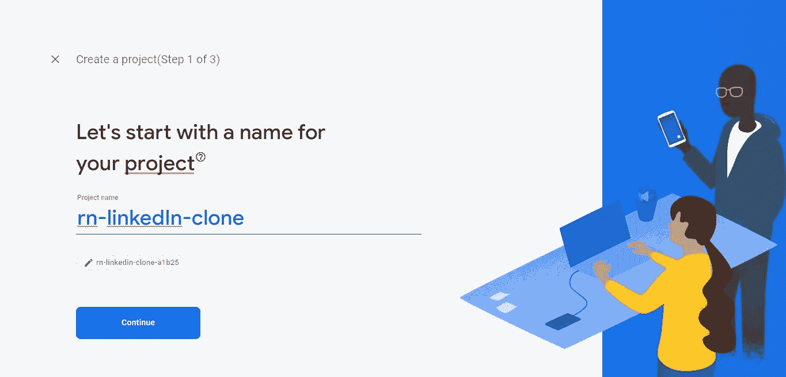

# 如何建立一个具有反应能力和可靠性的分散式电子商务平台

> 原文：<https://javascript.plainenglish.io/how-to-build-a-decentralized-ecommerce-platform-with-react-and-solidity-part-two-cb4650f827b3?source=collection_archive---------5----------------------->

## 第 2 部分:构建前端


你将建立什么，见[现场演示](https://fresher-a5113.web.app/)和 [GitHub repo](https://github.com/Daltonic/freshers) 了解更多信息。


# 介绍

在本教程的第一部分中，我们构建了支持我们应用程序的智能契约。现在让我们建立一个与它交互的前端，就像你在上面看到的那样。

[**跟我预约一次私人辅导**](http://daltonic.github.io/) 加速你的 web3 开发技能。

不要说太多，相反，让我们开始编码。我们将从安装该应用程序的其余依赖项开始。

[现在就去我的 Youtube 频道查看免费的 web3 教程](https://www.youtube.com/channel/UCQteXYZ5mC-cuTxplzM4Hlw?sub_confirmation=1)。

# 安装应用程序依赖项

在您的终端上，运行以下命令:

```
yarn add firebase #Database SDKyarn add @cometchat-pro/chat #Chat SDKyarn add @material-tailwind/react #UI Kit
```

如果您已经成功执行了上面的命令，那么让我们来为 Firebase 和 CometChat 创建一些私钥。

# 创建私钥

为了利用 Firebase 或 CometChat SDK，我们需要用它们的服务创建一个应用程序。别担心，这不会花你一分钱。Firebase 虽然有限但是免费，对于帮助你学习全栈开发绰绰有余。CometChat 为其用户提供了一个试用版，用于测试他们的 SDK 并熟悉他们的技术是如何工作的。

**使用 Firebase 创建应用**

如果您还没有 Firebase 帐户，请为自己创建一个。之后，转到 Firebase 并创建一个名为 **freshers** 的新项目，然后激活 Google 认证服务，如下所述。



Firebase 支持通过各种提供者进行身份验证。例如，社会认证、电话号码以及传统的电子邮件和密码方法。因为我们将在本教程中使用 Google 认证，所以我们需要为我们在 Firebase 中创建的项目启用它，因为它在默认情况下是禁用的。单击项目的 authentication 选项卡下的登录方法，您应该会看到 Firebase 当前支持的提供者列表。


太好了，这就是 firebase 身份验证的全部内容，让我们生成 Firebase SDK 配置密钥。

您需要在 Firebase 项目下注册您的应用程序。


在项目概述页面上，选择添加应用选项，并选择 **web** 作为平台。


完成 SDK 配置注册后，返回到项目概述页面，如下图所示。


现在，您可以单击项目设置来复制您的 SDK 配置设置。


上图所示的配置密钥必须复制到**。env** 文件。我们稍后将在这个项目中使用它。

在本项目的 **src** 文件夹下创建一个名为 **firebase.js** 的文件，并在保存前将以下代码粘贴到其中。

如果你正确地遵循每件事，你是令人敬畏的。接下来我们将为 **CometChat** 做类似的事情。

**使用 CometChat 创建应用**

如果您没有他们的帐户，请访问[come chat](https://app.cometchat.com/app/)并注册。接下来，登录，您将看到下面的屏幕。


以此为例，通过点击**添加新应用按钮**的来创建一个名为**新鲜者**的新应用。您将看到一个模式，您可以在其中输入应用程序的详细信息。下图显示了一个示例。


创建应用程序后，您将被定向到您的仪表板，看起来应该像这样。


您还必须将这些密钥复制到。环境文件。

最后，删除预加载的用户和组，如下图所示。


太棒了，这就足够了。使用此模板来确保您的**。env** 文件遵循我们的惯例。

```
ENDPOINT_URL=<PROVIDER_URL>SECRET_KEY=<SECRET_PHRASE>DEPLOYER_KEY=<YOUR_PRIVATE_KEY>REACT_APP_COMET_CHAT_REGION=<YOUR_COMET_CHAT_REGION>REACT_APP_COMET_CHAT_APP_ID=<YOUR_COMET_CHAT_APP_ID>REACT_APP_COMET_CHAT_AUTH_KEY=<YOUR_COMET_CHAT_AUTH_KEY>REACT_APP_FB_AUTH_KEY=<YOUR_FIREBASE_AUTH_KEY>REACT_APP_FB_APP_ID=<YOUR_FIREBASE_APP_ID>
```

最后，在这个项目的 **src** 文件夹中创建一个文件名为 cometChat.js 的文件，并将下面的代码粘贴到其中。

酷，让我们开始将它们集成到我们的应用程序中，我们将从组件开始。

# 构建组件

让我们开始一个接一个地制作所有的组件，如果你有任何挑战，请参考 [**git repo**](https://github.com/Daltonic/freshers) 。

**寄存器组件**


该组件负责将新用户保存到 Firebase 中。导航到 **src > >组件**并创建一个名为 **Register.jsx** 的文件。

厉害！

**登录组件**


让我们在**src>>components**文件夹中创建另一个名为 **Login.jsx** 的组件，并将下面的代码粘贴到其中。

酷，这两个组件组成了这个应用程序的身份验证方面。我们稍后将把它们融合到各自的视图中。

**割台组件**


该组件封装了应用程序中的页面。它是用免费的**创意 TIm Tailwind-Material UI 套件**制作的。在 **src > > components** 目录下创建一个名为 **Header.jsx** 的文件，并将下面的代码粘贴到其中。

**食物成分**

这个组件将特定的食物属性呈现在一个来自 tailwind CSS 和 Material design 的制作精美的卡片中。在**组件文件夹**中创建一个名为 **Food.jsx** 的文件，并在其中粘贴以下代码。


每张卡片呈现一种食品的名称、图像、描述、价格和剩余库存。这是它的代码。

接下来，让我们看看食物的组成部分。

**食物成分**

该组件负责呈现我们数据库中的整个食品数据集合。让我们看看它的代码片段。


不过，在**组件目录**中，创建另一个名为 **Foods.jsx** 的文件，并将下面的代码粘贴到其中。

最后，让我们看看 **CartItem** 组件。

**卡蒂姆组件**


该组件负责显示购物车集合中的单个商品。下面是负责它的代码。

祝贺您，您刚刚完成了组件的编码，让我们继续创建视图…

# 风景

现在我们已经创建了支持各种视图的组件，接下来让我们创建单独的页面。

**首页视图**


该视图呈现了食物成分结构。也就是说，home 视图从 firebase 中检索所有的食物集合，并在屏幕上显示出来。让我们来看看负责它的代码。

导航到**视图目录**并创建一个名为 **Home.jsx** 的文件，然后将下面的代码粘贴到其中。事实上，您将在 views 文件夹中创建所有这些文件。

**产品视图**


这个视图负责展示产品的详细信息。在这个页面上，用户可以查看、编辑和删除产品，还可以与卖家聊天，或者使用以太坊快速购买食品。

这是它的代码…

**添加产品视图**


顾名思义，这个视图负责将新的食品存储到我们的 Firestore 集合中。观察下面的代码片段…

太棒了，我们正在前进，让我们看看编辑产品视图…

**编辑产品视图**


这个视图使我们能够编辑现有的食物项目。当然，在您可以编辑之前，您需要是最初将食品添加到商店的人。只有产品所有者可以编辑，让我们来看看执行此操作的代码。

最后，对于与产品相关的案例，让我们看看购物车视图…

**购物车视图**


在此视图中，您可以修改和下订单。一旦您下了订单，它会立即保存在 Firestore 中。下面是代码的编写方式。

接下来，让我们来处理托盘中的最后四个视图…

**聊天列表视图**


这个视图简单地列出了到目前为止您与客户最近的对话。这在 CometChat SDK 的帮助下是可能的，下面的代码向您展示了它是如何实现的。

**聊天视图**


这是卖方和买方进行沟通的一对一聊天视图。CometChat SDK 让我们更容易做到这一点。下面的代码很好地演示了它的工作原理。

**注册视图**

创建一个名为 **SignUp.jsx** 的新文件，并将下面的代码粘贴到其中。

**登录视图**

让我们对登录视图做同样的事情，创建一个名为 **SignIn.jsx** 的新文件，并将下面的代码粘贴到其中。

太棒了，我们刚刚在应用程序中添加了所有必要的视图，让我们整理一下剩下的代码…

# App.jsx 文件

这是在我们的应用程序中所有其他视图和组件之前运行的第一个文件。在 App.jsx 文件中，粘贴以下代码。

# AuthGuard.jsx 文件

该文件包含在我们的应用程序中阻止未经身份验证的用户访问安全路由的逻辑。在 **src** 文件夹中创建一个新文件，命名为 **AuthGuard.jsx** ，然后在其中粘贴以下代码。

# Index.jsx 文件

将以下代码粘贴到 **index.jsx** 文件中并保存…

# 商店

使用 react-hooks-global-state 库的强大功能，让我们创建一个存储来管理一些全局状态变量。在 **src 目录**、>、>、 **store** 下创建一个名为 **index.jsx** 的文件，并将下面的代码粘贴在里面。

# ABI 连接器文件

最后，我们有一个 **fresher.jsx** 文件，作为智能合约的 Abi 和前端之间的接口。与我们的智能合约交互所需的所有代码都存储在这个文件中，下面是它的代码。

在这个共享文件夹中，我们有另一个名为 ***abis*** 的文件夹，它包含为我们部署的存储生成的 ABI 代码。当我们在本文的第一部分中部署智能契约时，Truffle 为我们生成了这些代码。

确保你包括了**。env** 文件在**中。gitignore** 文件，这非常重要，这样你就不会在网上暴露你的私钥。

如果这些都处理好了，那么你应该知道你已经完成了这个项目。

恭喜你！！！

# 结论

区块链技术已经到来，在这个智能合约、DAO、NFTs 和 DeFi 应用程序的新世界中，用区块链开发技能武装自己非常重要。

你想要一个私人导师来加速你的 web3 开发吗？敬请 [**与我预约一期**](http://daltonic.github.io/) 。

迫不及待地想在下一篇文章中见到你，查看[现场演示](https://fresher-a5113.web.app/)和 [GitHub repo](https://github.com/Daltonic/freshers) 了解更多信息。

[现在就在 Youtube 上观看我的免费 web3 教程](https://www.youtube.com/channel/UCQteXYZ5mC-cuTxplzM4Hlw?sub_confirmation=1)。

下次再见，祝一切顺利！

# 关于作者

福音书达林顿在 2016 年开始了他的软件工程师之旅。这些年来，他在 React、ReactNative、NextJs 以及现在的区块链等 JavaScript 堆栈方面的技能日臻成熟。

他目前是自由职业者，为客户开发应用程序，编写技术教程，教别人如何做他做的事情。

福音达林顿是开放的，可以听到你的声音。你可以通过 [LinkedIn](https://www.linkedin.com/in/darlington-gospel-aa626b125/) 、[脸书](https://www.facebook.com/darlington.gospel01)、 [Github](https://github.com/Daltonic) 或者他的[网站](https://daltonic.github.io/)联系到他。

## 进一步阅读

[](/beat-your-competition-with-web-scraping-why-choosing-the-right-tool-matters-f925294f3d26) [## 用网络抓取击败竞争对手:为什么选择正确的工具很重要

### 如何通过使用 Bright Data 的，真正利用你的电子商务业务的网络抓取的优势…

javascript.plainenglish.io](/beat-your-competition-with-web-scraping-why-choosing-the-right-tool-matters-f925294f3d26) 

*更多内容请看*[***plain English . io***](https://plainenglish.io/)*。报名参加我们的* [***免费周报***](http://newsletter.plainenglish.io/) *。关注我们关于*[***Twitter***](https://twitter.com/inPlainEngHQ)*和*[***LinkedIn***](https://www.linkedin.com/company/inplainenglish/)*。加入我们的* [***社区不和谐***](https://discord.gg/GtDtUAvyhW) *。*