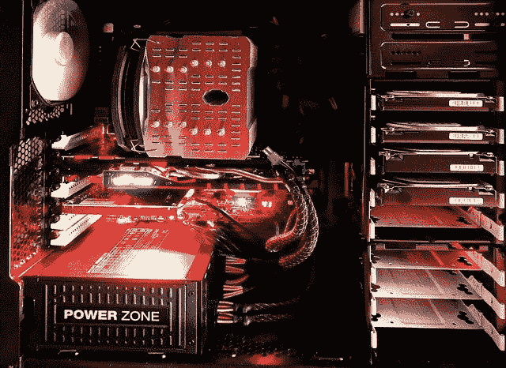
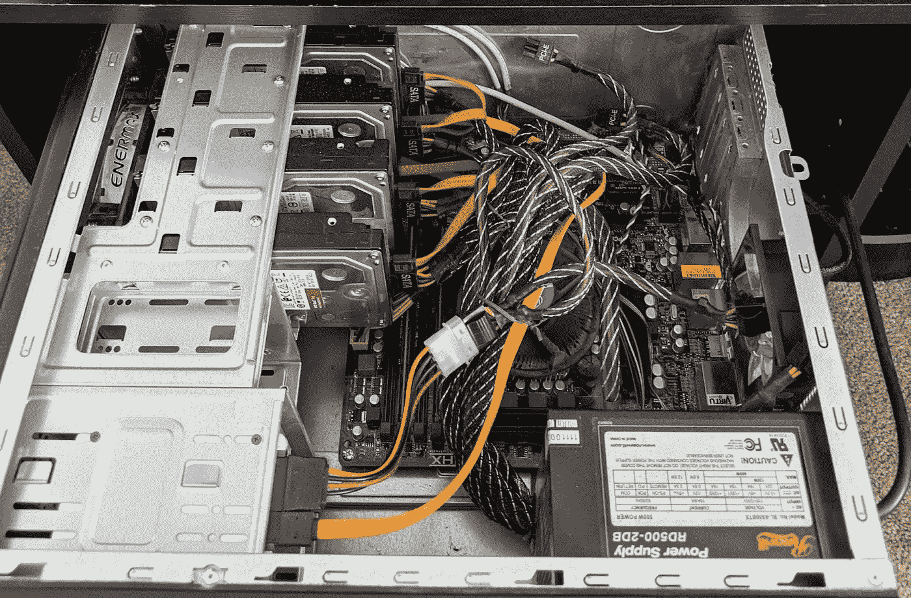
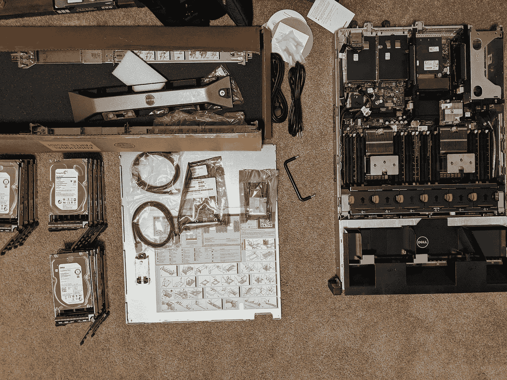
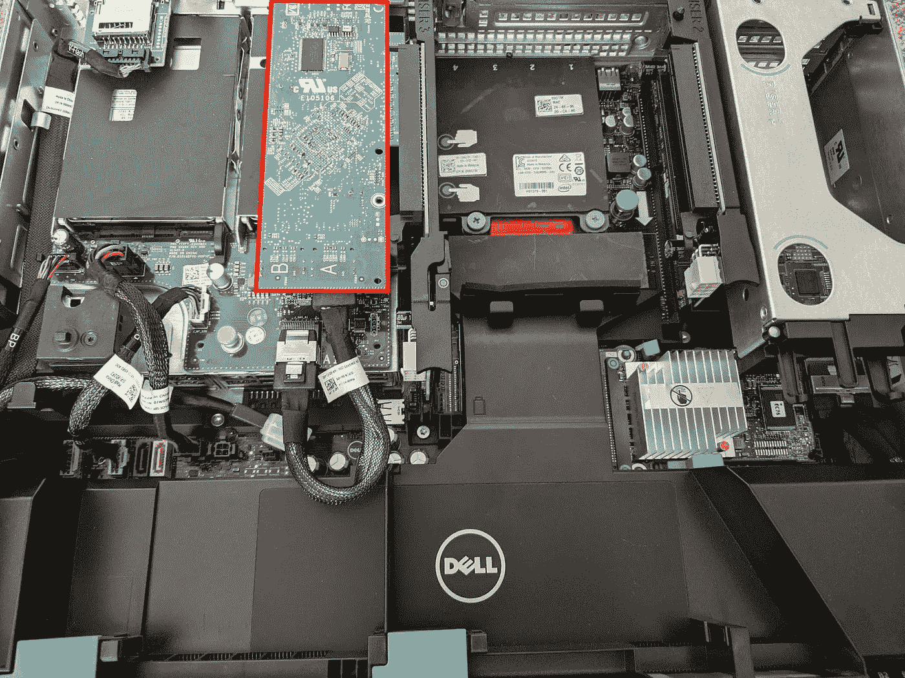

# 如何构建家用戴尔服务器

> 原文：<https://javascript.plainenglish.io/how-to-build-a-dell-server-for-home-use-cbf293b9614e?source=collection_archive---------4----------------------->

## 使用 ZFS、RAID、Docker 和 Ubuntu 构建戴尔 R720XD



*Image by* [*Bruno /Germany*](https://pixabay.com/users/bru-no-1161770/?utm_source=link-attribution&utm_medium=referral&utm_campaign=image&utm_content=1574533) *from* [*Pixabay*](https://pixabay.com/?utm_source=link-attribution&utm_medium=referral&utm_campaign=image&utm_content=1574533)

我的职业是软件工程师，但在专业上是该领域所有行业的佼佼者。这包括担任系统管理员、网络架构师、VOIP 和通用数字通信工程师以及其他工作。

多年来，我一直在家里使用一台 24/7 运行的旧台式电脑，随着时间的推移，我对它进行了更新，以实现许多目标。它运行得很好:

*   存储我们的照片和视频备份的文件服务器
*   当我在家建立网站时，一个网络服务器来托管它们
*   能够从任何地方访问我们的数字电影和电视节目的复杂媒体流
*   一个 mythbuntu 电视主持人和 dvr 来管理我们的无线电视
*   用于编译和测试代码以及工作部署的项目框
*   以及这些年来的许多其他事情…

这台台式计算机服务器有一个 4 磁盘 RAID 5 卷，在固态硬盘上运行操作系统(每周备份到 RAID)，并使用 16GB 内存。这个系统虽然达到了目的，但是慢慢的就变成了一堆乱七八糟的配置。所以对我来说，这意味着是时候重建和升级了。

在一些朋友的帮助下，Reddit 的 [/r/homelab](https://www.reddit.com/r/homelab/) ，一位非常有帮助的[服务器艺术的权威人士](https://www.youtube.com/channel/UCKHE9DEep52XlmwLbZUKvyw)，以及很多谷歌的帮助下，我深入研究了用于家庭使用的二手企业服务器的世界。电脑本身并不贵，最大的一部分成本是硬盘，无论如何，我都必须购买硬盘来扩展我的存储空间。

和许多事情一样，我带着一些基本的需求和学习的愿望进入了这个领域。在这篇文章中，我将带你了解我做对了什么，做错了什么。请记住，这更像是一次发现之旅，而不是 homelab 转换专家给出的建议。我收集了一些在精选的 IT 专业人员的世界之外相对新颖的东西(尽管在 [/r/homelab](https://www.reddit.com/r/homelab/) 中相当常见)，我希望它将继续成为学习和扩展我的知识的一个伟大平台。



*Photo by Author … Where I started*

# 多少盒？多大？

我在两个主要设置之间进行了辩论…要么让两个服务器分离出我的设置的网络连接存储( [NAS](https://en.wikipedia.org/wiki/Network-attached_storage) 是一种让您在网络上的许多计算机之间托管和共享文件的服务)组件，要么让一个服务器做所有事情。分离的好处是每台服务器中的升级和配置不会影响到另一台，如果数据在一台机器上，而其他服务在另一台机器上，那么更容易保证你的*数据*的安全。缺点是更高的功耗、噪音和成本。

我这次的计划是将所有不同的项目分离到它们自己的 Docker 容器中。这将让我保持每个项目的配置非常孤立，并给我一个非常简单的管理项目的方法。这也让我有可能连接大量的个人媒体和备份存储。

## *备份侧边栏:*

家庭服务器本身并不是备份“解决方案”,但它可以是朝着正确方向迈出的一大步。通过使用正确的 [*ZFS*](https://en.wikipedia.org/wiki/ZFS) *或*[*RAID*](https://en.wikipedia.org/wiki/RAID)*设置，服务器上的存储介质将内置冗余，这有助于防止任何单个磁盘出现故障。如果您还在其他计算机上备份了介质，那么您已经很好地分散了风险。但是，如果您试图保存非常重要的数据，您应该始终对这些数据进行离线和/或异地备份。*

对于我们家中其他计算机的快照备份，对于我们可以根据需要重新创建的媒体文件的快照备份(例如，从原始 DVD 复制回文件系统)，甚至对于我们也存储在云中的照片的快照备份，它都是整个备份解决方案的重要组成部分。

我开始调查服务器和成本，对我来说最划算的是戴尔“20”代(420、520、620、720 等)。这些足够新，我可以运行稍微更现代的 CPU 和 RAM，但不是太新，以至于它们要花费数千美元。我可以花几百美元买下大多数的服务器。这些服务器配备了超过 12 个计算机内核、数百千兆字节的内存、数十兆兆字节的存储以及跨多个网卡的高速网络。对我来说过分了？当然，但也应该持续很长时间，并且不会比我现有的解决方案花费更多。

我开始考虑如何将存储构建到系统中。不久前，我被介绍到 ZFS，但当时没有办法转换，所以我从来没有尝试过。这是一个机会，我对 ZFS 了解得越多，就越想利用它。然而，就像软件 raid 设置一样，Ubuntu(和其他操作系统)有时会在直接安装到软件磁盘卷和从软件磁盘卷引导时出现问题。他们正在变得越来越好，但我想要一个解决方案，如果出现了改变规则的重大更新，我不必“再次计算”。我真的想为操作系统设置一个硬件 RAID，为存储驱动器设置 ZFS，这很棘手，因为你不能设置一个 RAID 控制器卡来同时做这两件事。您需要两张卡和两个位置来连接磁盘。不幸的是，在大多数这种盒子上，你也不能把驱动器分开…它们都连接到一个控制器上。

这让我只有几个选择。要么我在操作系统和引导驱动器上不使用 RAID，我对所有驱动器使用 RAID 而不是 ZFS，要么我有多个 RAID 控制器卡和独立的驱动器“平面”…这是许多服务器所不具备的。

# 戴尔 R720XD

输入戴尔 R720XD。那个“XD”？额外磁盘。它有一个后面板，您可以在其中放置两个以上的 2.5 英寸驱动器，虽然这不是一个“官方支持”的配置，但您可以将后面板与前驱动器面板断开，并通过第二个磁盘控制器来控制它们。

该服务器可以在前端安装 12 个 3.5 英寸驱动器(或 24 个 2.5 英寸驱动器)，在后端安装两个 2.5 英寸驱动器，这对于家庭服务器来说是一个巨大的存储容量。老实说，对于家庭服务器来说有点荒谬，但这既有学习新事物的空间，也有增长的空间。它还拥有戴尔 R720 的所有功能，这是我考虑的重型服务器之一。

我意识到，凭借 R720XD 的存储容量*和*能力，它既有大量可用的硬盘托架，又是一个巨大的计算资源。它足够强大，可以做我想做的任何事情，而且只把它用作 NAS 有点浪费，所以我只把它作为单个服务器解决方案，而不是尝试构建两个服务器。

我一只眼睛盯着价格，另一只眼睛盯着功耗。我的希望是尽可能提高热效率，这样坐在地下室楼梯井(或我的办公室)也没问题，不需要风扇一直全速运转。

对我来说是这样的配置:

*   大型前置驱动器(12 个 3.5 英寸驱动器)
*   2 枚英特尔至强 E5–2650 v2:每枚 8 核，2.6GHz，95 瓦
*   8x16GB PC3L-12800 (256GB)
*   适用于 ZFS 的 PERC H310 Mono Mini 闪存至 IT 模式
*   用于操作系统 RAID 1 的 H310 PCIe
*   后部灵活托架，带两个 600GB 10k 2.5 英寸 SAS 驱动器
*   英特尔 X540-T2，双 10GB，双 1GB 网卡
*   iDRAC 7 Express
*   双 1100 瓦白金冗余 PSU
*   还有表圈，因为它很漂亮

H310 是经过大量的谷歌搜索、服务器艺术的一些视频以及在易趣商店订购零件时直接与服务器艺术先生交谈后挑选的。为了使用 ZFS，我需要一个 JBOD(只是一堆磁盘)模式的 PERC 卡，这通常需要将卡闪入 IT 模式…这是一个有点冒险的过程，但购买预闪是便宜的。对于 RAID 系统，我可以使用几乎任何质量的磁盘控制器。对于我的磁盘速度目标，H310 非常适合这两种使用情形，既节省了时间和能源，又不牺牲磁盘的性能。

RAM 和 CPU 的选择也是为了平衡功耗、性能和成本。我选择了 3.5 英寸驱动器，以便能够在任何大型商店买到它们。我得到了 7200 rpm 的驱动器，虽然我怀疑 5400 rpm 的 ZFS 会很好。如果您想要速度，请务必选择 2.5 英寸 SAS 硬盘。我不相信我需要那个。总而言之，它仍然是一个非常强大的系统。对于大多数家庭使用来说绰绰有余，我希望它在正常使用时不会太热，风扇会一直响。

我还得对[桔子电脑](https://www.orangecomputers.com/node/)大呼一声。我从他们那里订购了大部分零件和一些二手硬盘。他们在寻找组件方面做得很好，讨论了哪些可以涵盖，哪些不可以涵盖，当我后来遇到问题时，*确实涵盖了一些用过的磁盘的退货和更换(更换已经进行了几个月)。我觉得从一家有良好声誉和良好保修的公司订购要舒服得多，即使这比从易贝拼凑东西要贵一点。*

# 初始设置:物理配置和 BIOS



*Photo by Author … the pieces*

计划已经就绪。集合时间到了！对于企业服务器来说，这一步非常容易。我当然鼓励你阅读说明书(注意说明书也可以在外壳内看到)，但是几乎电脑中的所有东西都可以通过一些夹子或拉杆轻松连接或拆卸。对于我正在做的事情，我甚至不记得我是否必须使用螺丝刀。

说明书上说，首先打开电源大约 15 分钟，以便电源可以自行配置。我设置它没有硬盘和额外的 RAID 卡，所以我只是打开它，看看它会做什么。果然，用了 15 分钟左右，循环了几个测试，大部分时间都像飞机起飞一样尖叫。几分钟后我真的离开了房间并关上门。

声音太大了。肯定让我紧张，我做了一个糟糕的决定。但那时我别无选择，只能继续下去，看看它会走向何方。

> “如果你正在经历地狱，那就继续前进。”
> 
> ―温斯顿·丘吉尔

接下来是安装 PCIe 卡和 SAS 驱动器。



*Photo by Author … PCIe RAID card in upper left over the rear backplane*

这是我找到的最好的卡槽。只需要一根短电缆(在这种情况下，是 SFF-8087 到 SFF-8087 微型 SAS 电缆)并将其连接到后背板。我在网上看到了一些关于断开背板传感器电缆的讨论，但要么已经为我做了，也许是通过与 [Orange Computers](https://www.orangecomputers.com/node/) 的讨论，要么我不需要为了让我所有的 blinky 灯都有正确的颜色而这样做。

安装了后面的 SAS 驱动器和安装在后面背板上的 PCIe RAID 控制器后，我再次启动并为 RAID1 配置了后面的托架。在设备设置中，这些显示为“Slot6 DELL PERC H310”。设置这部分非常简单。

接下来，我关闭电源并安装了 IT 模式 Mini Mono H310 和 12 个 3.5 英寸驱动器。当我再次启动时，我没有看到任何驱动器，尽管它认为 H310 是一个集成的 LSI SAS2 MPT 控制器。我尝试调整一些东西，但最终它关闭了集成 raid 控制器(在 BIOS 集成设备设置中)，重新启动，重新启用，并再次重新启动，让我看到所有 12 个磁盘显示在启动序列和卡的细节下。

# 请安静！使 R720XD 在听觉上可以忍受

R720XD 默认为*大声*。我知道这将需要一些修改，使它更安静。如果没有其他工作，我准备修改风扇或更换为低转速“静音”模式。即使对我来说，这也有点奇怪，因为这将有效地禁用服务器上的几个散热功能，虽然你通常不需要这些，但当你需要时，你*真的*需要它们。

我在 unraid 论坛上发现了一篇很棒的文章:

[](https://forums.unraid.net/topic/51733-taming-a-12th-gen-dell-poweredge/) [## 驯服第 12 代戴尔 PowerEdge

### 不得不喜欢退役的服务器...无论如何，这些东西开始进入二手市场，而且越来越便宜。的…

forums.unraid.net](https://forums.unraid.net/topic/51733-taming-a-12th-gen-dell-poweredge/) 

我首先经历了在盒子上更新固件的过程。通过 BIOS 很容易做到这一点，我想如果我发现这是正确的答案，我可以随时尝试将它降级到特定的版本。然而，出于许多原因，最新的固件通常是一件好事。

我采取的下一步措施是:

*   转到 IDRAC thermal 并设置为性能功耗比和 50 摄氏度(没有更低的选项)。注:将以太网连接插入右后插头，这是 IDRAC 端口。
*   在“power”下，将电源设置为冗余，启用热备盘并启用功率因数校正，以便一次只使用一个 PSU。这确实使它安静了一点。
*   我禁用了生命周期控制器在每次重启时收集信息。更换单个磁盘可能会让它闲置 20 分钟或更长时间，这是我不喜欢(或不需要)的。它加快了重新启动的时间，我不希望戴尔对这款机型进行任何新的固件更新，所以我现在就让它这样。

在这一点上，它似乎仍然令人失望地大声。在 IDRAC 中，风扇似乎以大约 50%的速度旋转，但当我重新启动 Ubuntu 20.04 的 USB 引导时，因为我已经启动系统几个小时了，还没有测试操作系统，风扇明显安静下来了！可能只有我以前的台式服务器的两倍大。成功！

在这种模式下，它的运行功率为 266 瓦(空闲)，PSU2 的功耗为 0 安培，CPU1 和 2 的温度分别为 61 摄氏度(142 华氏度)和 49 摄氏度(120 华氏度)，排气温度为 37 摄氏度(98 华氏度)，而这并不是在一个超级寒冷的房间里，在这个夏天，入口温度为 25 摄氏度(77 华氏度)，服务器整个上午都在向里面吹热风。

有很多帖子提供了让这些机器安静下来的“解决方案”。它们的范围从相当简单(转到支持低速风扇的固件版本)，到稍微更极端(用更安静、运行更慢的风扇替换所有风扇)，到非常极端(入侵温度传感器本身)。它们都有潜在的缺点，我宁愿尽可能保持最新和标准的东西。就目前情况来看，我很少看到粉丝超过我工作量的 30%,通常他们保持在 22%左右。我手机上的廉价分贝仪告诉我，十英尺外是 35 分贝，一英尺外是 45 分贝。一点也不差。

# 安装 Ubuntu 服务器并减少重启时间

你会问，为什么是 Ubuntu 服务器？为什么不呢？它是最受支持和使用的 linux 发行版之一，与 ZFS 配合得很好，有定期更新，并且相对来说占用空间最小。

在后面的 RAID 驱动器上安装 Ubuntu Server 很容易。制作一个可启动的 USB 驱动器并将其插入(我使用前面板 USB 只是为了尝试一下，它工作得很好)。在引导期间进入引导菜单(F11)，使用 UEFI 菜单，选择可移动驱动器，然后选择安装 Ubuntu。它将检查大量的硬件，这似乎比在普通桌面上花费的时间要长一些。确保安装到 RAID 卷，而不是前面板驱动器。在安装过程中，我的系统排气温度保持在 40 摄氏度左右，远远低于风扇试图保持的 50C。风扇始终在 22%到 27%的速度之间徘徊。

一个注意:安装似乎卡在“安装柯廷钩”。这将保持安装轮永远旋转。但是如果你按下 Tab 键，转到“查看完整日志”，当它完成时，你会看到“所有升级已安装”，然后可以通过点击“查看完整日志”下的“立即重启”来重启。确保你在 BIOS 启动设置中设置为从 UEFI 启动，而不是从 BIOS 启动，这样你就可以启动并运行了！

我也喜欢有一个可用的图形环境(主要用于 gparted 紧急情况，虽然有时也可以缓慢地挂载外部驱动器)，所以我添加了 xubuntu，同时我还按照我喜欢的方式设置了我的 vimrc 和 bashrc。不得不经历几次重启让我想到了我的下一个好奇的“问题”…重启需要大约 12 分钟。戴尔花了很多时间研究硬件，但 Ubuntu 花了几分钟时间在“等待网络配置”或“等待网络配置”。

这里的解决方案似乎是设置三个(！)我没有使用的以太网设备是可选的。进入/etc/net plan/00-installer-config . YAML，为除第一个以太网端口之外的所有端口添加“optional: yes”。

这个最终的修复让我的重启时间(从发出重启命令到我可以再次使用操作系统的时间)减少到了大约 6 分钟。以台式机的标准来看还是不快，但比我之前看到的 12 到 15 分钟的启动时间要快得多。

# ZFS:设置、失败的驱动器更换和报告

开始安装 ZFS。该软件以软件包的形式提供，这很好，因为这意味着它会随着操作系统的变化而保持最新。

```
sudo apt install zfsutils-linux
```

之后，找出我有哪些磁盘:

```
fdisk -lsmartctl -a /dev/sdX
```

我记下了来自 smartctl 和 fdisk 的序列号、托架和磁盘标识符的映射。这将允许我基于驱动器的 ID 而不是设备名称来构建池，设备名称在添加其他项目时会在启动时发生变化。对于此机箱，您可以一次添加一个驱动器，而无需重新启动(热插拔！)，检查 fdisk -l 的磁盘 ID 和设备名(每次应该是字母表中的下一个字母)，然后使用 smartctl 获取序列号。或者，您可以只记下每个驱动器的序列号，并检查您添加的每个驱动器的 fdisk 以使它们匹配。

我制作了一个 bay 表，这样当我遇到错误时，我可以很容易地找到有问题的驱动器并将其拔出，而不需要太多的额外检查。例如:

0 1 2 3

4 5 6 7

8 9 10 11

我一次添加一个驱动器，然后填写每个驱动器的信息(例如):

```
Bay 6: 4TB/dev/disk/by-id/scsi-SATA_ST4000NM0033–9ZM_S1Z2BN8JDisk identifier: FACF252C-D595-C745-A990–730AE390BD6AModel Family: Seagate Constellation ES.3Serial Number: S1Z2BN8J
```

你大部分的信息是从哪里得到的

```
sudo smartctl -a /dev/sd<a-z>
```

要获取磁盘标识符，您可以运行:

```
ls /dev/disk/by-id/ | grep <serialnumber>
```

这些驱动器需要一个分区表，这也很容易从命令行添加。

```
parted /dev/sdd$ mklabel GPT$ quit
```

清除 zfs 的任何现有分区

```
sfdisk — delete /dev/sdd
```

一旦 GPT 被添加到每个磁盘，并且没有分区，就该创建 zfs 了。为了好玩，我坚持使用普通的“坦克”名称，并开始尝试。我有一些剩余的 3TB 驱动器和来自 3 个不同批次和供应商的 12 个 4TB 服务器驱动器…这是一种“安全”措施，这样您就不会因为所有驱动器都完全相同而在同一时间用完它们。我想测试扩展 vdev 的能力，所以我加载了 3、3、4、4、4 和 4、4、4、4、4、4 TB 驱动器的 vdev。

```
zpool create tank raidz2 /dev/disk/by-id/[id0] /dev/disk/by-id/[id1] <etc> -fzpool add tank raidz2 /dev/disk/by-id/[id6] /dev/disk/by-id/[id7] <etc> -f
```

接下来，我根据看的几篇文章，盲调了一点。这里有一个很好的记录:

[](https://www.admin-magazine.com/mobile/HPC/Articles/Tuning-ZFS-for-Speed-on-Linux) [## 高性能计算的 ZFS 调优

### 如果您管理存储服务器，您可能已经知道 ZFS 及其一些特性和功能…

www.admin-magazine.com](https://www.admin-magazine.com/mobile/HPC/Articles/Tuning-ZFS-for-Speed-on-Linux) 

*   `zfs set mountpoint=/data tank`
*   `zfs set xattr=sa tank`
*   `zfs set acltype=posixacl tank`
*   `zfs set atime=off tank`
*   `zfs set relatime=off tank`
*   `zfs set compression=lz4 tank`
*   `zpool set autoexpand=on tank`

首先，我测试了 ZFS 在重启时是否被正确地重新挂载了，这对于我来说是自动的。不过，这是配置中的一个常见问题，所以如果您有问题，请查看:

[](https://askubuntu.com/questions/1294944/zfs-pool-not-auto-mounting-after-upgrade-to-20-04) [## 升级到 20.04 后，ZFS 池不会自动装载

### 在 Ubuntu 18.10 更新到 20.04 时，zfs 池在启动时自动导入，池不再在启动时导入-我看不到…

askubuntu.com](https://askubuntu.com/questions/1294944/zfs-pool-not-auto-mounting-after-upgrade-to-20-04) 

检查尺寸:

```
zfs listNAME USED AVAIL REFER MOUNTPOINTtank 21.9G 24.6T 21.9G /datazpool listNAME SIZE ALLOC FREEtank 38.2T 32.9G 38.2T
```

命令“zfs list”显示可用空间量。这包含了我的两个奇怪大小的游泳池。4*3.65TB + 4*2.75TB 加上一些开销。奇数而不是 4TB 和 3TB 是因为硬盘制造商通常使用兆字节(1000 的倍数)和操作系统报告兆字节(1024 的倍数)。

命令“zpool list”显示总可用空间为 6*2.75TB + 6*3.65TB，外加少量开销。

很多时候，我们会关心“zfs 列表”。

# 测试读/写速度

首先，作为一个快速的“真实世界”测试，我将一个 7.7GB 的文件从 zfs 池复制到 raid 阵列，耗时 10.2 秒。我把它从 raid 阵列复制到 zfs 池，用了 8.9 秒。这相当快，演示了同时从/向两个设备读/写。太好了，但是是时候隔离和测试了！

[](https://arstechnica.com/gadgets/2020/02/how-fast-are-your-disks-find-out-the-open-source-way-with-fio/) [## 你的磁盘有多快？用 fio 找出开源的方法

### 查看更多故事存储性能指标评测——与 Wi-Fi 性能指标评测非常相似——是一项被广泛误解的黑色艺术。管理员和…

arstechnica.com](https://arstechnica.com/gadgets/2020/02/how-fast-are-your-disks-find-out-the-open-source-way-with-fio/) 

我使用 dd 和 fio 进行了测试，以获得单次访问和多次访问的读/写速度。

我的 zfs 阵列报告的写入速度高达 1.4GB/s，其中单次访问写入的数据大小为中到大(64k 到 1M 的批处理)，对于非常小的批处理大小(1k 到 4k)，速度相当慢，约为 50MB/s，但当多达 16 个线程同时写入文件时，速度高达 550MB/s 到 670MB/s，而不管批处理大小如何(1k 到 1M)。

对于读取速度，我得到的最慢速度是 280MB/s 的小批量(1k 到 4k)单次访问读取。但是对于较大的批量或多线程读取，我得到的速度在 2.1GB/s 到 5GB/s 之间！

这些数字对我有用。

在此期间，粉丝数量一直保持在 25%左右，只是偶尔会达到 30%的水平。总体来说还是相当安静的。

接下来，我用一台在 ssd 上存储数据并使用 ftp 和 sftp 的 linux 笔记本电脑进行了测试。我得到了 100.4 兆字节/秒和 98.8 兆字节/秒的传输速度(双向)。与我的 1Gbps 交换机相比，每个方向大约 800Mbps(每个字节为 8 位)，加上 tcp 和 ftp/sftp 的开销，我确实觉得我已经接近最大传输速度了。太棒了。

# 使 VDEV 降级

现在是时候测试降级我的 vdev 和将我的 vdev 增长到最大容量了。我想在获取所有数据之前尝试一下这些东西，以确保一切都设置正确。如果五年后我发现我犯了一个简单的错误，无法轻松扩展我的 vdevs，或者我设法使更换损坏的驱动器变得困难，那将是一场灾难！

首先，我用以下方法检查一切是否正常:

```
zpool status
```

它告诉我一切都在线，没有报告错误。

我将从 raid z2–0 驱动器 Z1F2P2TB 开始。我从我的笔记中了解到，我在 0 号机架中安装了所有的驱动器。这被标记为/dev/sdb，但是再次使用驱动器 ID 来唯一地标识它们。

```
zpool offline tank scsi-SATA_ST3000DM001–1CH1_Z1F2P2TB
```

然后，我再次检查状态，发现 tank 和 raidz 2–0 都处于降级状态(raidz 2–1 列为联机)。它很高兴地告诉我，该池继续在降级状态下运行。完美。

# 发展 VDEV

现在我需要找到新的磁盘。我可以将序列号读取为 Z1Z78C3E，因此我将检查 fdisk 和 smartctl 的/dev/sdb(当我交换它时)和/dev/disk/by-id/否则。找到后，我只需更新我的笔记，说明哪个驱动器在 bay 0 和 raidz 2–0 中。我还将再次使用 parted 来删除分区和/或创建一个 gpt 分区表，这样我将有一个带有磁盘标识符的干净磁盘来加载到 vdev 中。

在物理交换驱动器后，检查我的 zpool 状态，我仍然看到旧磁盘列为脱机，没有提到新磁盘。是时候更换了！

```
zpool replace tank scsi-SATA_ST3000DM001–1CH1_Z1F2P2TB /dev/disk/by-id/scsi-SATA_ST4000NM0033–9ZM_Z1Z78C3E
```

现在，当检查状态时，它仍然处于降级状态，但表示它正在等待重新镜像驱动器。就我而言，几秒钟之内，我就看到状态更新为在线。

在这种情况下，它只需要重新配置 2.21GB。这大约是目前存储在 zpool 中的总数据的 1/10，因为我刚刚启动时驱动器上几乎没有数据。相比之下，raid 阵列的重新镜像(无论有多少数据放在磁盘上，通常都必须重新镜像整个磁盘大小)，您会开始看到 ZFS 的一些好处。

我更换了另一个 3TB 驱动器，因此所有驱动器都是 4TB，并遵循相同的过程。几秒钟之内，磁盘再次被还原。

现在让我们看看自动扩展是否发挥了它的魔力:

```
zfs listNAME USED AVAIL REFER MOUNTPOINTtank 21.9G 28.1T 21.9G /datazpool listNAME SIZE ALLOC FREE CKPOINT EXPANDSZ FRAG CAP DEDUP HEALTH ALTROOTtank 43.7T 32.9G 43.6T — — 0% 0% 1.00x ONLINE -
```

是啊！我有高达 43.6TB 的总空间(大约 3.65*12)和 28.1TB 的可用空间(大约 3.65*8 加上一些开销)。自动扩展成功了！

我不得不第二次更换多个磁盘…在加载了 12TB 的数据之后…因为我从亚马逊订购的四个磁盘中的三个出现了故障，我从 orange computers 订购的八个磁盘中的一个也出现了故障。谢天谢地，第一次 vdev 只有一个磁盘完全失效，所以还好。第二个 vdev 有两个磁盘出现故障，其中一个进入降级模式。这很可怕，促使我设置了电子邮件警告，这样以后任何时候磁盘出现问题，我都会得到通知。没有什么能让他们回来。幸运的是，在一个磁盘降级、两个磁盘出现故障的情况下，我的数据仍然完好无损，因此我不必从备份中重新开始。

旧驱动器的说明。我买了这些二手硬盘，知道有风险。亚马逊卖家没有保修，但考虑到容错能力，我希望在运营的头几个月到一年里节省一些钱。咬了我一口。orange computers 出故障的磁盘得到了保修，他们为我更换了它。

我只更换了第二个 vdev 上的一个磁盘，并让它重新镜像，这花了大约 3 个小时(12.5TB)。然后，我一次替换一个进程(执行 replace 命令会启动 resilver，而不是同时将多个进程联机，我认为应该让每个进程完成后再执行下一个进程)。

热插拔硬盘太棒了。

# 设置 ZED (ZFS 事件守护进程)只发送重要警告

由于这种恐惧，我知道我需要设置扫描和电子邮件警告。这被证明是相对容易的，只有几个陷阱可以借鉴。

我的 ZFS 阵列中的 JBOD 磁盘需要一行配置:

```
DEVICESCAN -H -l error -l selftest -f -s (S/../../6/03) -m <myemail> -M exec /usr/share/smartmontools/smartd-runner
```

这是为了监视磁盘的 SMART 问题，并每周运行一次短扫描。最后，它执行我的 smartd-runner 脚本(稍后我会讲到)。

raid 磁盘花了我很长时间才弄明白。在 Ubuntu 中，你可以使用 megaraid 来设置智能测试，如下所示:

```
/dev/sda -d megaraid,0 -H -l error -l selftest -f -s (S/../../6/03) -m <myemail> -M exec /usr/share/smartmontools/smartd-runner/dev/sda -d megaraid,1 -H -l error -l selftest -f -s (S/../../6/03) -m <myemail> -M exec /usr/share/smartmontools/smartd-runner
```

Devicescan 扫描所有 zfs 驱动器，megaraid 扫描 raid 驱动器。现在，smartctl 正在扫描并向我发送电子邮件，zfs 正在清理并向我发送电子邮件……所有这些都有利于通知，我可以让 sas 驱动器出现故障，6 个磁盘池中的任何两个驱动器出现故障，或者让 raid 驱动器出现故障，我将收到一封电子邮件。

在过去的几个月里，这已经过测试，测试对象既有拉取驱动器，也有出现从失败到简单的 SMART 错误等问题的驱动器。

事实上，我得到的一些错误意味着一个驱动器正在慢慢地失败，但还没有失败。鉴于我的容错能力(以及我的数据的非关键性)，只要只有一个驱动器出现故障，在我更换它们之前，我希望让它们一直出现故障。但是我不需要每天在同一个硬盘上收到邮件。在就单个驱动器的 SMART 问题发送消息两周之后，我添加了 smartd-runner 脚本，该脚本仅在消息与上次发送的消息不同时才发送消息。我在这里加入了这个脚本:

# 结局是尽人皆知的

之后，我设置了 Docker，NGINX，并开始构建我想运行的所有服务的容器，所有这些都设置在 NGINX 端口转发的后面。太棒了。每个服务和项目都是独立的，升级任何一个项目或项目的依赖项都不会对其他项目产生影响。

我有大量的容错存储，并继续使用 ZFS、容器和 web 服务。当我在编程、处理数据或编译时，这个机器足够强大，可以处理一些重要的代码行。

剩下唯一要做的事情是完成我的地下室，这样我就可以把盒子从我的办公室搬到一个专用的“网络”壁橱里(在楼梯下面)！

期待各位媒体博主在评论中对本文的反馈，特别是:[内文·卡茨](https://medium.com/u/62fbee41aad2?source=post_page-----cbf293b9614e--------------------------------)、[冈田新一](https://medium.com/u/a262a804b78f?source=post_page-----cbf293b9614e--------------------------------)、[何塞·格兰哈](https://medium.com/u/8ae6a5b70ece?source=post_page-----cbf293b9614e--------------------------------)、[布莱恩·迪克伊岑](https://medium.com/u/a8a3c73c563?source=post_page-----cbf293b9614e--------------------------------)、& [埃里克·克莱本](https://medium.com/u/1e2ea32699c9?source=post_page-----cbf293b9614e--------------------------------)。

[*公民升级*](https://medium.com/@citizenupgrade) *是一个涵盖技术、社会、个人发展的专家社区。请访问我们的* [*网站*](https://citizenupgrade.com/) *，访问* [*脸书*](https://www.facebook.com/citizenupgrade) *，或访问* [*推特*](https://twitter.com/CitizenUpgrade) *。加入我们的* [*邮件列表*](http://www.citizenupgrade.com/join) *，获取更多精彩内容和其他有用资源。*

[](https://citizenupgrade.medium.com/membership) [## 通过我的推荐链接加入 Medium 公民升级

### 作为一个媒体会员，你的会员费的一部分会给你阅读的作家，你可以完全接触到每一个故事…

citizenupgrade.medium.com](https://citizenupgrade.medium.com/membership) [](https://codeburst.io/quickstart-guide-to-oculus-quest-2-and-unreal-engine-4-506ca8c27a05) [## Oculus Quest 2 和虚幻引擎 4 快速入门指南

### 虚拟现实入门

codeburst.io](https://codeburst.io/quickstart-guide-to-oculus-quest-2-and-unreal-engine-4-506ca8c27a05) [](https://codeburst.io/creating-local-python-packages-with-init-py-aa19f1e9e80f) [## 使用 __init__ 创建本地 Python 包。巴拉圭

### 用于代码重用和分发的包

codeburst.io](https://codeburst.io/creating-local-python-packages-with-init-py-aa19f1e9e80f) [](https://levelup.gitconnected.com/networking-your-home-ethernet-1dc94cdf6c1e) [## 将您的家庭联网:以太网

### 在家中安装以太网，实现高速家庭网络

levelup.gitconnected.com](https://levelup.gitconnected.com/networking-your-home-ethernet-1dc94cdf6c1e) [](https://levelup.gitconnected.com/networking-your-home-network-equipment-b864c9ecf596) [## 为您的家庭建立网络:网络设备

### 运行家庭网络所需的硬件

levelup.gitconnected.com](https://levelup.gitconnected.com/networking-your-home-network-equipment-b864c9ecf596) 

*更内容于* [***普通英语***](https://plainenglish.io/) *。报名参加我们的* [***免费周报***](http://newsletter.plainenglish.io/) *。* [***推特***](https://twitter.com/inPlainEngHQ) *和*[***LinkedIn***](https://www.linkedin.com/company/inplainenglish/)*追随我们。查看我们的* [***社区不和***](https://discord.gg/GtDtUAvyhW) *并加入我们的* [***人才集体***](https://inplainenglish.pallet.com/talent/welcome) *。*