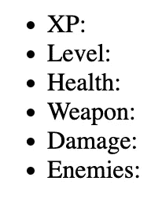

# 让我们用随机漫步算法建立一个 Roguelike

> 原文：<https://javascript.plainenglish.io/how-to-build-a-dungeon-crawler-game-with-javascript-57189bdd9f08?source=collection_archive---------6----------------------->


Image by [Skitterphoto](https://pixabay.com/users/skitterphoto-324082/) on [Pixabay](https://pixabay.com).

学习编程最令人愉快的方式之一是构建游戏。在本教程中，我们将使用 JavaScript 和 CSS 构建一个地牢爬虫。这个游戏是一个类似 Roguelike 的游戏，关卡由算法生成，地图由瓷砖组成，玩家只有一次生命。

游戏文件可以在 [Github](https://github.com/nevkatz/js-roguelike-1) 上的[目录](https://github.com/nevkatz/js-roguelike-1/tree/main/games/game-1-drunkards-walk)中找到，你也可以下载 [zip](https://github.com/nevkatz/js-roguelike-1/archive/refs/heads/main.zip) 并尝试[演示](https://roguelike-tutorials.netlify.app/games/game-1-drunkards-walk/index.html)。下面是一个完整游戏的快速截图。


A screenshot of the roguelike.

你可能猜到灰色的瓷砖是墙。下面是其他图块所代表的内容。

*   你的玩家是蓝瓦。
*   红色瓷砖是敌人。
*   黄色瓷砖是你可以拿起的武器。
*   绿色瓷砖是恢复健康的药剂。

像早期的 Roguelikes 一样，这在计算机上工作，需要键盘输入。但是，作为教程的后续步骤，您可以添加替代控件，如滑动、设备方向检测或软键。另外，[这个教程](/how-to-add-scrolling-to-a-javascript-roguelike-c9f835d10537)可以帮你添加滚动。

# 游戏逻辑

本教程中的代码是我用这个优秀的 [CodePen](https://codepen.io/ni-kun/pen/jWKWom) 由 [Nicola](https://codepen.io/ni-kun) 制作的叉子。虽然代码库有很大的不同，但它仍然拥有 Nicola 的核心游戏逻辑，包括以下内容:

## 电平生成

*   墙壁，以及敌人和物品的位置，都是程序生成的。
*   该算法生成每个敌人的生命值及其造成的伤害。

## 控制

*   你用光标键移动你的播放器。
*   “切换阴影”按钮可以用来显示整个地图，或者将可见区域限制在玩家周围的 7x7 方块内。

## 物品和敌人

*   你的玩家可以选择不同的武器，每种武器都造成一定的伤害。
*   你不知道什么是武器，直到你拿起它。
*   可以拿药水恢复健康。
*   当你拿起一个武器或药剂时，另一个会出现在另一个位置。
*   你可以通过击败敌人来积累经验和升级。

## 结束游戏

*   如果你的健康达到零，你就输了。
*   你通过击败地牢中的所有敌人来击败地牢。
*   击败地下城或输掉游戏后会创建一个新的地下城。

# 技术

在整个教程中，我们将使用 [DOM API](https://developer.mozilla.org/en-US/docs/Web/API/Document_Object_Model) 来设置界面，使用 [Canvas API](https://developer.mozilla.org/en-US/docs/Web/API/Canvas_API) 来渲染地图并保持更新。我们还将为玩家、游戏和敌人使用 JavaScript 类。最后，我们将使用 2D 数组来存储地图数据和可见区域，以及用于按钮、字体和页面布局样式的 CSS。

下面是这些步骤的简要概述。

1.  [启动您的文件](#0202)
2.  [创建类别](#b3c9)
3.  [添加游戏常数](#e2fd)
4.  [生成游戏标记](#de64)
5.  [运行您的第一个测试](#cab7)
6.  [开始游戏](#c174)
7.  [生成地图](#7501)
8.  [渲染地图](#83ef)
9.  [生成游戏元素](#9823)
10.  [玩家动作](#6aa1)
11.  [更新游戏统计数据](#ce14)
12.  [敌人战斗](#4856)
13.  [处理战败的敌人](#57fd)
14.  [敌方碰撞检测](#7f1b)
15.  [收集药剂和武器](#56d7)
16.  [影子逻辑](#23e7)

让我们开始吧。

# 1.启动您的文件

*   首先创建您的`style.css`和一个`script.js`文件。
*   创建一个`index.html`文件来保存游戏结构，并拉入上面的文件。它应该有一个空的`<div>`元素和一个`container`的`id`。

The HTML shell for your game.

在您的 JavaScript 中，如果您希望将代码与教程之后添加的非游戏代码隔离开，可以随意地将代码包装在一个立即调用的函数表达式(IIFE)中。

```
(function() {

   // you can add your code here.

})();
```

当你的`script.js`文件被载入浏览器后，上面的生活将立即开始。

有了我们的结构，现在让我们用将要使用的类和常量填充 JavaScript 文件。

# 2.创建类

首先，我们将创建三个 JavaScript 类:一个用于敌人，一个用于玩家，一个用于游戏。

下面是玩家类，包括等级、生命值、经验值、武器和坐标。

The player class.

下面是敌人职业，有生命值、伤害和坐标属性。

The enemy class.

下面是带有两个 2D 数组的整体游戏类:`map`和`shadow`。还有一个用于阴影切换的布尔属性，一个敌人数组，以及用于画布 API 的`canvas`和`context`对象。

The game class.

让我们为游戏类创建一个快速方法，允许它在玩家击败地牢或“游戏结束”发生后重置。

The game’s reset method.

# 3.添加游戏常数

让我们添加游戏引擎将使用的全局常量。

## 经验值和等级

当你打败敌人时，你会累积经验点数(XP)。每次你赚到 100 XP，你就会升级——所以让我们为此创建一个常数。

```
const POINTS_PER_LEVEL = 100;
```

## 地图尺寸

让我们编写两个快速常量来设置地图的尺寸。

```
const COLS = 80;
const ROWS = 60;
```

接下来，让我们用一个叫做`TILE_DIM`的常量来指定游戏区块的宽度和高度。

```
const TILE_DIM = 10;
```

## 瓷砖代码和颜色

地图 2D 数组将存储整数地图代码。为了使我们的代码可读，让我们为每个地图元素代码添加一个常数。

```
const WALL_CODE = 0;
const FLOOR_CODE = 1;
const PLAYER_CODE = 2;
const ENEMY_CODE = 3;
const POTION_CODE = 4;
const WEAPON_CODE = 5;
```

为了以正确的颜色呈现一个图块，这些图块代码将被用于索引到一个`TILE_COLORS`数组中，我们可以将它写成另一个常量。

The tile colors.

对于阴影 2D 数组，让我们为可见的瓷砖和黑暗中的瓷砖创建代码。

```
SHADOW_CODE = 0;
VISIBLE_CODE = 1;
```

## 游戏元素的数量

让我们设置一些常量来决定游戏开始时有多少敌人、药剂和武器会被添加到地图上。

```
const TOTAL_ENEMIES = 10;
const STARTING_POTIONS_AMOUNT = 4;
const STARTING_WEAPONS_AMOUNT = 3;
```

## 敌人和药剂助手

让我们添加一些随机选择敌人属性的辅助数组。

```
// possible health that enemies can have
const ENEMIES_HEALTH = [30, 30, 30, 30, 40, 40, 60, 80];

// possible damage that enemies can inflict
const ENEMIES_DAMAGE = [30, 30, 30, 30, 40, 40, 60, 80];
```

另外，新药剂恢复的生命值将从这个数组中选择。

```
const POTIONS = [10, 20, 30, 40, 50];
```

## 武器

现在让我们添加一个保存武器的常数。每个武器都有标签和伤害等级。

The constant holding the weapons.

## **能见度**

如果阴影被打开，玩家周围应该有一个正方形，这个正方形应该总是可见的。


The square of visibility.

上面显示的正方形是 7x7 瓷砖。让我们设置一个名为`VISIBILITY` 的常量，它指定每个方向上应该有多少个图块可见。在这种情况下，让我们用 3 来实现 7x7 的平方。

```
const VISIBILITY = 3;
```

游戏常数到此为止。现在让我们把注意力转向构建游戏标记和样式。

# 4.生成游戏标记

这个游戏发生在一个包含几个元素的页面上:

*   显示游戏统计数据的平视显示器(HUD)
*   玩家四处移动的关卡地图
*   打开和关闭阴影的按钮

让我们从调用我们的容器的函数开始，这是我们的`index.html`页面中唯一的元素。

```
function createDOM() { let container = document.getElementById('container');}
```

现在让我们为平视显示器(HUD)创建一个元素。

```
function createDOM() { let container = document.getElementById('container'); **let hud = document.createElement('ul');** **hud.id = 'hud';**
}
```

## 填充 HUD

HUD 将会有一些标签-数值对来显示玩家的健康，剩余敌人的数量，以及其他的统计数据。因此，在进入`createDOM`之前，让我们编写一个函数来创建一个标签-值对，并将其添加到`hud`元素中。

A function for adding a label-value pair to the HUD.

现在让我们回到`createDOM`，写一个我们想要显示的统计数据列表。

```
let labels = ['XP', 
              'Level',
              'Health', 
              'Weapon', 
              'Damage',
              'Enemies'];
```

然后，我们可以对它们中的每一个调用`addStat`。

```
for (var label of labels) {
      hud = addStat(label, hud);
}
```

上面的代码会将每个 stat 的标签-值对添加到`hud`元素中。

最后，让我们将`hud`元素添加到主游戏容器中。

```
container.appendChild(hud);
```

## 添加游戏地图

现在我们有了 HUD 逻辑，让我们添加游戏地图本身，这将是一个`<canvas>`元素。

```
let canvas = document.createElement('canvas');canvas.id = 'grid';
```

因为`COLS`常数决定了地图的宽度，而`ROWS`决定了地图的高度，所以我们可以用它们来创建画布尺寸的常数。

```
const tileDim = 10;

canvas.height = ROWS * TILE_DIM;
canvas.width = COLS * TILE_DIM;
```

现在让我们将画布添加到容器中。

```
container.appendChild(canvas);
```

让我们同样添加切换按钮。请注意，有一个按钮

```
let btn = document.createElement('button');
btn.className = 'toggle';
btn.textContent = 'Toggle Shadow';
container.appendChild(btn);
```

该按钮需要切换阴影的打开和关闭，所以现在，让我们启动该功能并向按钮添加一个事件侦听器。

先在`createDOM`之外加上这个功能。

```
function toggleShadow() {
    game.isShadowToggled = !game.isShadowToggled;
}
```

现在，返回到`createDOM`并将监听器添加到按钮。

```
btn.addEventListener('click',toggleShadow);
```

下面是创建游戏标记的整个功能。

The function for creating the game markup.

# 5.运行您的第一个测试

在这一点上，它可以是一个鼓舞士气，看看你到目前为止。所以让我们声明我们需要的两个全局变量，然后编写一个`init`函数。

```
var game = null;
var player = null;

function init() {
    createDOM();
}

init();
```

现在，在浏览器中打开您的`index.html`文件。在你的页面顶部，你应该有一个统计列表。



The list of stats without styling.

在页面的底部，你应该有你的切换按钮。


The button without styling.

# 添加 CSS

到目前为止，这个页面看起来像一个 1995 年的基本网站，这是因为我们还没有添加 CSS。让我们现在做那件事。

下面是整个页面的一般样式。

以下是 HUD 的样式。

最后，下面是按钮的样式。虽然它们驻留在我们的`styles.css`文件中，但是它们是从引导库借来的。

The button colors, by Bootstrap.

现在，让我们刷新页面。您的统计面板应该如下图所示。


The styled stats panel

在页面的底部，你的按钮应该是这样的:


The styled button panel

# 6.开始游戏

现在我们已经测试了我们的标记和样式，让我们来编写基本的游戏开始逻辑。

返回我们的`init()`函数来初始化`game`对象。

```
function init() {
   createDOM();
   game = new Game();
}
```

现在，设置它的`canvas`和`context`属性，这样我们可以更容易地跟踪它。

```
function init() {

   createDOM();
   game = new Game();

   // new
   game.canvas = document.getElementById("grid");
   game.context = game.canvas.getContext("2d");
}
```

设置好`game`对象后，让我们编写一个新的`startGame`函数，它将在游戏开始时处理地图及其元素的生成。

```
function startGame() {

}
```

既然已经启动了`startGame`功能，让我们将其添加到`init()`功能中。

```
function init() {
   createDOM();
   game = new Game();
   game.canvas = document.getElementById("grid");
   game.context = game.canvas.getContext("2d");

   // new
   startGame();
}
```

虽然`init`只会被调用一次，但`startGame`会被放置在另一个位置，以便在游戏结束后再次调用。

# 7.生成地图

制作地图的目标是获得存储在我们的 2D 阵列中的墙砖和地砖的排列，一旦渲染到`<canvas>`元素上，就可以转换成可穿越的游戏关卡。

## 启动功能

我们先来启动一个名为`generateMap`的函数，这个函数最终会添加到`startGame`中。

这个函数从一个嵌套循环开始，它遍历所有的瓷砖位置，在每个位置创建一个墙砖。

这并不能转化为一个很大的级别，所以我们需要添加逻辑来“挖掘”数组，用地砖替换一些墙砖。

## 该算法

为了实现这一点，我们将编写一个*随机行走*算法的实现，其中创建每个地砖的点，或“挖掘者”，从中心开始，沿着向外的路径蹒跚前行。下面是一个挖掘机旅程的快速动画。


The random walk algorithm in action.

在地图的外部边缘附近，有挖掘者不能创造地砖的禁止区域。当它到达这些地方时，它会更加蹒跚，随机尝试其他方向，直到它要么找到一个合法的挖掘点，要么放弃——在这一点上，它要么回到中心，要么简单地退出，如果已经完成了足够的挖掘。

这种随机绊倒的结果是一个给定的地牢通常会像一个石灰岩洞。也就是说，如果房间和走廊是你想要的，有其他算法你可以在以后交换。

下面是算法的具体步骤。

1.  从地图的中心开始。
2.  开始一次挖掘尝试。随机选择 x 轴或 y 轴继续前进。
3.  随机选择正向或负向移动。
4.  如果太靠近顶部、左侧、右侧或底部边缘，会导致扣分。搜索离边缘更远的另一个图块位置。每一次失败的搜索都会增加惩罚次数。
5.  如果在达到最大惩罚后我们不能离开边缘，检查我们是否需要添加更多的地砖。如果是，返回中心；否则，完成。
6.  如果我们离边缘足够远，而这个新位置又没有地板，就在这里加一块地砖。增加使用的瓷砖数量，并将惩罚重置为零。
7.  如果我们已经做到了这一步，重复步骤 2-6，除非我们已经达到了最大尝试次数。

现在，让我们看看如何用 JavaScript 实现这个算法。

## 将挖掘机放在中间

一开始，我们从游戏板的中心开始挖掘。所以在我们的`generateMap`函数中，让我们用一个名为`pos`的对象来初始化我们的挖掘机的位置，这个对象的`x`和`y`属性最初被设置为地图的中心。

```
let pos = { 
      x:COLS/2,
      y:ROWS/2
};
```

## 设置常数

现在，让我们设定一次挖掘的最大尝试次数。

```
const ATTEMPTS = 30000;
```

接下来，让我们设置游戏板需要的最小地砖数量。

```
const MINIMUM_TILE_COUNT = 1000;
```

此外，让我们设置挖掘尝试失败之前的最大外部限制惩罚数。

```
const MAX_PENALTIES_COUNT = 1000;
```

最后，我们来设定外限。

```
const OUTER_LIMIT = 3;
```

外部限制为 3 时，在每个地砖和地图边缘之间应该至少有三个墙砖。

## 准备循环

让我们写一个`randomDirection`助手来设置挖掘者的方向。我们将使用这两次——一次是正常移动，另一次是当我们接近外部极限时，必须尝试另一个位置。

```
const randomDirection = () => Math.random() <= 0.5 ? -1 : 1;
```

如您所见，我们使用一个`Math.random()`和一个三元运算符来选择正方向或负方向。

此外，让我们将使用的瓦片数和惩罚数都初始化为零。

```
let tiles = 0, penalties = 0;
```

## 天真的循环

让我们首先编写不检查外部限制的 dig 循环。

我们将使用一个`for`循环继续挖掘，直到我们用尽所有的尝试。在循环开始时，我们选择是在`x`轴还是`y`轴上挖掘，以及是正向还是负向挖掘。

```
for (var i = 0; i < ATTEMPTS; i++) {

   let axis = Math.random() <= 0.5 ? 'x' : 'y';

   pos[axis] += randomDirection();

}
```

为了方便起见，让我们从`pos`中提取我们的`x`和`y`属性。

```
for (var i = 0; i < ATTEMPTS; i++) {

   let axis = Math.random() <= 0.5 ? 'x' : 'y';

   pos[axis] += randomDirection();

   // new 
   let {x, y} = pos;
}
```

现在，让我们在新位置添加一个地板砖(如果不存在的话)。添加一个意味着我们使用我们的一个瓷砖。

```
let {x, y} = pos;

// new

if (game.map[y][x] != FLOOR_CODE) {
      game.map[y][x] = FLOOR_CODE;

      tiles++;
}
```

## 添加外部限制检查

如果不检查我们在当前轴上相对于地图每条边的位置，我们可以很容易地越过地图——并且超出阵列。因此，让我们添加外部限制检查。

首先，我们回到计算轴的地方。基于我们使用的轴，我们可以得到行或列的总数。

```
let axis = Math.random() <= 0.5 ? 'x' : 'y';

// new
let numCells = axis == 'x' ? COLS : ROWS;

pos[axis] += randomDirection();
```

然后我们开始一个`while`循环，检查我们是否在地图的边缘和外部界限之间。

*   如果我们在 x 轴上挖掘，我们检查右边和左边。
*   如果我们在 y 轴上挖掘，我们检查顶部和底部边缘。

```
while (pos[axis] < OUTER_LIMIT || 
       pos[axis] >= numCells - OUTER_LIMIT) {

    // search for a new tile here. 
    // if we cannot find one, quit or start from the center.
}
```

顶部和左侧边缘将是`0`，所以我们用第一个条件来处理它:

```
pos[axis] < OUTER_LIMIT
```

底部和右侧边缘将等于`numCells`，我们将其设置为等于`ROWS`(底部边缘)或`COLS`(右侧边缘)。我们用第二个条件来处理:

```
pos[axis] >= numCells - OUTER_LIMIT
```

如果我们实际上在一个被禁止的方块上，我们试图找到另一个方块并增加惩罚。

```
while (pos[axis] < OUTER_LIMIT || 
       pos[axis] >= numCells - OUTER_LIMIT) {

     pos[axis] += randomDirection();
     penalties++;

}
```

如果我们达到了惩罚极限，那么就不要再寻找安全的地砖了——让我们检查一下我们是否使用了最少数量的地砖。如果是这样，我们就可以完成地图和`return`的构建了。如果没有，我们回到中心，开始挖一个新的隧道。

```
penalties++;

// new
if (penalties > MAX_PENALTIES_COUNT) {
     if (tiles >= MINIMUM_TILES_AMOUNT) {
           return;
     }

      pos.x = COLS / 2;
      pos.y = ROWS / 2;
}
```

下面是整个`while`循环的样子。第 1 行和第 2 行显示了它在函数中的位置。

The outer limits check.

一旦我们添加了这个外部限制检查，我们必须意识到惩罚的数量——所以我们需要在添加一个图块后重置它们。

所以事不宜迟，让我们回到函数的末尾，将惩罚数重置为零。这样，每一次新的尝试都从零惩罚开始。

```
if (game.map[y][x] != FLOOR_CODE) {

    game.map[y][x] = FLOOR_CODE;
    tiles++;
}
penalties = 0;
```

下面是整个`generateMap`函数，其中`numCells`被初始化，`while`循环，`penalties`被复位。

终于来了！我们的地图生成算法现在已经完成。现在让我们将它添加到我们的`startGame()`函数中。

```
function startGame() {
   generateMap();
}
```

# 8.渲染地图

现在我们可以生成地图了，让我们继续编写渲染它的逻辑。我们将从编写一个在地图上绘制一个图块的函数开始。

## 绘制一个图块

`drawObject`函数使用 Canvas API 在地图上绘制一个正方形。

这里最复杂的一行是对`rect`方法的调用。

```
game.context.rect(x * TILE_DIM, y * TILE_DIM, TILE_DIM, TILE_DIM);
```

前两个参数是我们正在绘制的方块左上角的`x`和`y`坐标。接下来的两个参数都是`TILE_DIM`，指定了平铺的高度和宽度。

## 画所有的瓷砖

让我们从为地图上的每个区块编写一个函数调用`drawObject`开始。

```
function drawMap(startX, startY, endX, endY) {
}
```

接下来，让我们定义一个数组，为每种瓷砖类型提供一种颜色。

请注意，数组中每种颜色的索引对应于图块代码。例如，地板颜色的索引`1`对应于`FLOOR_CODE`值。除了地板和墙壁，我们还没有使用瓷砖代码，但我们很快就会这样做。

现在，让我们编写一个嵌套循环，允许我们遍历地图上的每一个图块并调用`drawObject`。

```
for (var row = startY; row < endY; row++) {

    for (var col = startX; col < endX; col++) {

         let c_idx = game.map[row][col];

         let color = colors[c_idx];

         // new
         drawObject(col, row, color);
    }
}
```

在`drawObject`调用中，`col`和`row`参数分别对应于给定图块的`x`和`y`坐标。

下面是整个`drawMap`函数的样子。

The map drawing function.

让我们扩展我们的`startGame`函数，并为其添加`drawMap`。

```
function startGame() {

  generateMap();

  setTimeout(gameSetUp, 1000);

  function gameSetUp() {
      drawMap(0, 0, COLS, ROWS);
  }
}
```

请注意，我将`drawMap`作为一个名为`gameSetup`的新内部函数的一部分，它将随着时间的推移而扩展。

我使用`setTimeout`来延迟`gameSetup`一秒，这将有助于编排等级转换。

## 测试您的地图

如果你刷新你的浏览器，你的游戏地图应该会显示出来，看起来和下面的地图风格相似。地图本身永远是不一样的。


## 需要思考的问题

*   在`generateMap`功能中，您一次只能沿一个轴改变挖掘机的位置。为什么这很重要？如果你能同时改变 x 和 y 的值，会发生什么？
*   算法如何保证每条路径都是由连续的瓦片组成的？
*   为什么地图上的所有地砖最终都能被玩家接触到？

# 9.生成游戏元素

现在我们已经有了迷宫生成算法，是时候用游戏元素填充关卡了。其中包括以下内容:

*   玩家
*   敌人
*   健康药水
*   武器

## 添加对象

我们从一个简单的函数`addObjToMap`开始，它基于`coords`参数在特定位置添加一个新的图块，使用`tileCode`设置图块的类型。

```
function addObjToMap(coords, tileCode) {

   game.map[coords.y][coords.x] = tileCode
}
```

## 寻找有效坐标

鉴于`generateMap`的挑战在于创建可穿越的通道，这里的目标是选择既不是墙壁也不是游戏元素的坐标——所以让我们编写一个函数来随机生成一个代表未被占用的瓷砖的坐标。下面的函数，`generateValidCoords,`就是这么做的。

```
function generateValidCoords() {

  var x, y;

  do {
      x = Math.floor(Math.random() * COLS);
      y = Math.floor(Math.random() * ROWS);
   }
   while (game.map[y][x] != FLOOR_CODE);

   return {
      x: x,
      y: y
   };
}
```

上面的`do...while`循环一直进行，直到在`game.map`数组中找到一个等于`FLOOR_CODE`的元素，它代表一个空闲的图块。

## 添加玩家

现在我们可以在地图上添加东西了，让我们试着用一个叫做`generatePlayer`的函数来添加我们的玩家对象。

```
function generatePlayer() {
} 
```

在这个函数中，我们首先获得一些有效的坐标。

```
function generatePlayer() {

   var coords = generateValidCoords();

}
```

然后，我们实例化一个新的玩家对象，传递必要的参数。

```
function generatePlayer() {

  var coords = generateValidCoords();

  // new, with these parameters: level, health, weapon, coords, xp
  player = new Player(1, 100, WEAPONS[0], coords, 30);
}
```

最后，我们使用`player.coords`和玩家的磁贴代码将玩家对象添加到地图中。

```
function generatePlayer() {

  var coords = generateValidCoords();

  // parameters: level, health, weapon, coords, xp
  player = new Player(1, 100, WEAPONS[0], coords, 30);

  // new
  addObjToMap(player.coords, PLAYER_CODE);
}
```

我们现在可以从我们的`gameSetup`函数中调用`generatePlayer`。

```
function startGame() {

  generateMap();

  setTimeout(gameSetUp, 1000);

  function gameSetUp() {

      // new
      generatePlayer();

      drawMap(0, 0, COLS, ROWS);
  }
}
```

## 测试播放器生成逻辑

刷新浏览器并测试代码。现在，您应该会在屏幕上看到一个蓝色方块。


The player should appear as a blue tile.

## 树敌

现在让我们制造一些敌人。

让我们开始一个叫做`generateEnemies`的函数。`amount`是你想要产生的敌人数量。

```
function generateEnemies(amount) { for (var i = 0; i < amount; i++) { }
}
```

我们将再次从获取可用图块的坐标开始。

```
for (var i = 0; i < amount; i++) { let coords = generateValidCoords();
}
```

现在让我们随机挑选一些`health`和`damage`值。回想一下，这些是我们从中选择值的数组。

```
const ENEMIES_HEALTH = [30, 30, 30, 30, 40, 40, 60, 80];const ENEMIES_DAMAGE = [30, 30, 30, 30, 40, 40, 60, 80];
```

因为这需要从`ENEMIES_HEALTH`和`ENEMIES_DAMAGE`数组中选取随机值，所以让我们编写一个帮助函数来选取一个值。

```
function pickRandom(arr) { let idx = Math.floor(Math.random() * arr.length); return arr[idx];
}
```

现在让我们调用辅助函数两次—一次用于`health`，一次用于`damage`。

```
function generateEnemies(amount) {
   for (var i = 0; i < amount; i++) {

      let coords = generateValidCoords();

      let health = pickRandom(ENEMIES_HEALTH);

      let damage = pickRandom(ENEMIES_DAMAGE);
   }
}
```

最后，让我们实例化我们的敌人，并将其添加到`game`对象的`enemies`数组中。

```
let enemy = new Enemy(health, coords, damage);game.enemies.push(enemy);
```

最后，让我们把它添加到地图上。

```
addObjToMap(coords, ENEMY_CODE);
```

下面是整个`generateEnemies`功能。

现在让我们将它添加到`generatePlayer`之后的`gameSetup`函数中。

```
function gameSetUp() {

     generatePlayer();

     // new
     generateEnemies(TOTAL_ENEMIES);

     drawMap(0, 0, COLS, ROWS);
}
```

## 敌人的考验

如果你刷新浏览器，你应该会在地牢里看到十个类似敌人的红色方块。


The ten red tiles represent enemies.

让我们将它添加到 init 函数中。

## 生成药剂和武器

对于一个任性的冒险者来说，没有一些物品几乎不可能在地牢中生存，所以让我们添加一个放置物品的功能。下面的函数既可以处理健康药水，也可以处理武器。

让我们从一个有两个参数的循环开始:

*   `quantity`，即要创建的项目数
*   `tileCode`，对应于`POTION_CODE`或`WEAPON_CODE`常量，用于索引到`TILE_COLORS`数组中。

```
function generateItems(quantity, tileCode) {

}
```

让我们从一个条件设置为`quantity`的`for`循环开始。在每一轮循环中，让我们生成一些有效的坐标，并将`tileCode`添加到`game.map` 2D 数组中由坐标指定的索引处。

```
function generateItems(quantity, tileCode) {

   // new
   for (var i = 0; i < quantity; i++) {

      let coords = generateValidCoords();

      addObjToMap(coords, tileCode);

   }
}
```

我们接下来的步骤包括使用`tileCode`获取正确的颜色，然后用`drawObject`在地图上渲染。

```
addObjToMap(coords, tileCode);

let color = TILE_COLORS[tileCode];

drawObject(coords.x, coords.y, color);
```

完整功能如下。

与敌人生成不同，我们没有创建 JavaScript 对象并将它们添加到遭遇数组中。当玩家找到一种药剂或武器时，它的属性会在飞行中生成。

写完这个函数，我们回过头来把它添加到`gameSetup`函数中。

```
function gameSetUp() {

      generatePlayer();

      // new
      generateItems(STARTING_WEAPONS_AMOUNT, WEAPON_CODE);

      generateItems(STARTING_POTIONS_AMOUNT, POTION_CODE);

      generateEnemies(TOTAL_ENEMIES);

      drawMap(0, 0, COLS, ROWS);
}
```

## 项目测试

如果你刷新浏览器，你会看到四个橙色方块代表药剂，三个绿色方块代表武器。你所有的游戏元素现在都在地图上了！


Here we have enemies in red, weapons in orange, potions in green, and our player in blue.

# 10.球员运动

尽管我们取得了进步，但我们还不能控制球员。让我们通过添加一个位置更新函数和一个调用它的键盘监听器来解决这个问题。

首先，让我们添加一个辅助对象，它从地图中删除一个对象，并用地砖来替换它。

```
function removeObjFromMap(x, y) {

   game.map[y][x] = FLOOR_CODE;

};
```

现在让我们在一个稍微大一点的更新玩家位置的函数中使用它。

在上面的代码中，我们调用`removeObjFromMap`从数组中清除玩家。然后，我们将`PLAYER_CODE`设置为新单元的更新位置。最后，我们更新`player.coords`，用于处理玩家移动。

现在让我们开始我们的球员运动功能。

```
function addKeyboardListener() {

   document.addEventListener('keydown', function(e) {

     // we will add logic here

   });
}
```

在侦听器中，让我们为播放器的当前坐标和新坐标设置变量。目前，这两对坐标是相同的。

```
function addKeyboardListener() {

    document.addEventListener('keydown', function(e) {

      var x = player.coords.x;
      var y = player.coords.y;
      var oldX = player.coords.x;
      var oldY = player.coords.y;
   });
}
```

让我们编写逻辑，通过调整`x`或`y`坐标来响应光标键的每次按下。

Switch / case statement.

如果玩家没有撞墙，我们使用新旧坐标调用`updatePlayerPosition`。

```
if (game.map[y][x] != WALL_CODE) {

   updatePlayerPosition(player.coords.x, player.coords.y, x, y);
}
```

现在让我们重新绘制玩家周围的地图部分。我发现，如果一个 7x7 的区域在任何时候都是可见的，并且随着玩家移动，那么重绘一个 10x10 的正方形效果很好。我们可以通过设置四个指定渲染边界的变量来实现这一点——分别是`left`、`top`、`right`和`bot`——然后调用`drawMap`。

```
if (game.map[y][x] != WALL_CODE) {

   updatePlayerPosition(player.coords.x, player.coords.y, x, y);

   let left = oldX - VISIBILITY - 1;
   let top = oldY - VISIBILITY - 1;

   let right = x + VISIBILITY + 2;
   let bot = y + VISIBILITY + 2 ;

   drawMap(left, top, right, bot);
}
```

最后，让我们调用`preventDefault`来防止不想要的行为，比如滚动。

```
e.preventDefault();
```

下面是完整的功能。

完成`addKeyboardListener`后，一定要在你下面的`init()`函数中调用它。

```
function init() {
   createDOM();
   game = new Game();
   game.canvas = document.getElementById("grid");
   game.context = game.canvas.getContext("2d");
   startGame();

   // add here
   addKeyboardListener();

}
```

现在，刷新你的浏览器，测试你是否可以移动你的播放器。

## 一个需要思考的问题:

我们还没有添加碰撞检测——所以在这一点上，玩家可以简单地走到物品或敌人的瓷砖上，然后在玩家离开瓷砖后消失。为什么会这样？

# 11.更新游戏统计数据

我们即将让我们的玩家与敌人和物品互动，所以现在是一个写逻辑来更新 HUD 中的数据的好时机。提醒一下，下面是统计数据的样子。


The game stats.

让我们编写一个`updateStats`函数，列出我们想要打印的三个播放器属性。

```
function updateStats() {

  let player_props = ['xp', 'level', 'health'];

}
```

现在，让我们使用一个`for...of`循环来遍历玩家的属性，并将每个属性打印到 HUD。令人高兴的是，每个 HUD 元素的`id`与对应的播放器属性相同。

```
function updateStats() {

  let player_props = ['xp', 'level', 'health'];

  // new
  for (var prop of player_props) {
      let el = document.getElementById(prop);
  }
  el.textContent = player[prop];
}
```

现在我们需要打印出当前武器的名称及其伤害等级。这里又是`weapons`数组。

The constant holding the weapons.

武器的 DOM 元素的 ID 是`weapon`而不是`name`，所以让我们编写一个映射对象，将 HUD 元素的 ID 匹配到武器的对象键`name`。

```
let weapon_props = [{
         domId: 'weapon',
         key: 'name',
      },
      {
         domId: 'damage',
         key: 'damage'
      }
 ];
```

现在，我们准备迭代武器的两个属性并打印它们，通过`domId`获取元素，通过`key`获取属性。

```
for (var prop of weapon_props) {

  let {domId, key} = prop;

  let el = document.getElementById(domId);

  el.textContent = player.weapon[key];
}
```

最后，我们来更新一下剩余敌人的数量，对应的是`enemies`数组的长度。

```
let enemyStats = document.querySelector("#enemies");

enemyStats.textContent = game.enemies.length;
```

下面是完整的函数，我们可以在玩家移动和交互时调用它。

The complete updateStats function.

作为最后一步，让我们将`updateStats`添加到我们的`gameSetup`函数中，这样我们就可以在一开始就知道玩家的生命体征。

```
function gameSetUp() {
      generatePlayer();
      generateItems(STARTING_WEAPONS_AMOUNT, WEAPON_CODE);
      generateItems(STARTING_POTIONS_AMOUNT, POTION_CODE);
      generateEnemies(TOTAL_ENEMIES);

      drawMap(0, 0, COLS, ROWS);
      updateStats();
 }
```

有了我们的`updateStats`功能，我们现在可以编排战斗和收集物品的过程了。

# 12.敌军战斗

当你的玩家试图移动到敌人的方格时，一场战斗将会发生。你根据敌人的伤害等级损失生命值，敌人的生命值根据你的武器等级下降。

如果敌人造成的伤害超过了玩家剩余的生命值，那么游戏就结束了，伙计！我们来写一个`gameOver`函数，打印一条消息，调用`game.reset()`方法，用新的关卡重启游戏。

```
function gameOver() {

   alert("GAME OVER");
   game.reset();
   startGame();

};
```

现在让我们开始一个在遭遇战中被调用的`fightEnemy`函数。它会检查敌人造成的伤害是否会让玩家的生命值降到零度以下。如果是，我们称之为`gameOver`。

```
function fightEnemy(enemy) {

   if (player.health - enemy.damage <= 0) {
      gameOver();
      return;
}
```

也就是说，如果你的玩家造成的伤害超过了敌人的生命值，敌人就会被击败。

```
function fightEnemy(enemy) {
   if (player.health - enemy.damage <= 0) {
      gameOver();
      return;
   }

   // new
   if (enemy.health - player.weapon.damage <= 0) {
      enemyDefeated(enemy);
   }
}
```

如果你的敌人在这一轮战斗中幸存了下来，它只是失去了生命值。

```
function fightEnemy(enemy) {
   if (player.health - enemy.damage <= 0) {
      gameOver();
      return;
   }
   if (enemy.health - player.weapon.damage <= 0) {
      enemyDefeated(enemy);
   }

   // new
   else {
      enemy.health -= player.weapon.damage;
   }
}
```

如果玩家在这一轮后还活着，生命值将会消失，游戏数据将会更新。

```
function fightEnemy(enemy) {
   if (player.health - enemy.damage <= 0) {
      gameOver();
      return;
   }
   if (enemy.health - player.weapon.damage <= 0) {
      enemyDefeated(enemy);
   }
   else {
      enemy.health -= player.weapon.damage;
   }

   // new
   player.health -= enemy.damage;
   updateStats();
}
```

# 13.对付战败的敌人

让我们编写`enemyDefeated`函数，它将一个`enemy`对象作为参数。

```
function enemyDefeated (enemy) {

}
```

在这个函数中，让我们首先从`game.map` 2D 数组中的位置删除敌人的牌码。

```
removeObjFromMap(enemy.coords.x, enemy.coords.y);
```

接下来，让我们更新游戏地图，使红色的敌人消失。

```
let left = enemy.coords.x - 1;
let top = enemy.coords.y - 1
let right = enemy.coords.x + 1;
let bot = enemy.coords.y + 1;

drawMap(left, top, right, bot);
```

接下来，让我们增加玩家的经验值，它等于敌人生命值和伤害等级的平均值。

```
player.xp += parseInt((enemy.damage + enemy.health)/2);
```

我们现在必须弄清楚我们是否应该升级玩家。我们用积分来量化玩家的水平吧。

```
let level_in_points = POINTS_PER_LEVEL * (player.level - 1);
```

如果玩家的经验值和当前等级的点数之差大于 100(每个等级的点数)，这意味着玩家的等级应该提高。

```
if (player.xp - level_in_points >= POINTS_PER_LEVEL) {

   player.level++;
}
```

现在我们已经调整了播放器，让我们从`game.enemies`数组中移除`enemy`对象并更新 HUD。

```
let e_idx = game.enemies.indexOf(enemy);

game.enemies.splice(e_idx, 1);

updateStats();
```

最后，让我们检查一个胜利，这将发生在没有敌人的情况下。

```
if (game.enemies.length == 0) {
      userWins();
}
```

下面是一个快速的`userWins`函数，打印一个胜利消息，重置游戏对象，开始一个新游戏。

```
function userWins() {

   alert("YOU CONQUERED THE DUNGEON!");

   game.reset();

   startGame();
};
```

下面是完整的`enemyDefeated`功能。

The enemyDefeated function.

# 14.敌人碰撞检测

现在我们已经有了一套可能的战斗场景的函数，我们需要检测玩家何时接触到敌人。为了实现这一点，让我们回到处理玩家移动的`addKeyboardListener`函数。

在该函数中，在检查墙壁的上方，让我们检查下一个图块是否在`game.map`数组中有一个`ENEMY_CODE`。

```
 // switch / case with keycodes above

if (game.map[y][x] == ENEMY_CODE) {

}

// check for walls below
```

如果有，我们就用匹配的坐标找到敌人。下面我们使用数组方法`find`和一个叫做`matching_coords`的辅助函数。

```
const matching_coords = (enemy) => {
     return enemy.coords.x == x && enemy.coords.y == y;
}
let enemy = game.enemies.find(matching_coords);
```

一旦我们有了敌人的对象，让我们把它传到一个叫`fightEnemy`的地方。

```
if (game.map[y][x] == ENEMY_CODE) {

      const matching_coords = (enemy) => {
          return enemy.coords.x == x && enemy.coords.y == y;
      }
      let enemy = game.enemies.find(matching_coords);

      // new
      fightEnemy(enemy);
 }
```

最后，对于它下面的`WALL_CODE`检查，让我们用`else if`代替`if`，这样我们只有在*而不是*遇到敌人时才移动玩家。


Enemy collision detection logic

# 15.收集药剂和武器

让我们继续扩展我们的`addKeyboardListener`功能来处理武器和药剂的遭遇。下面是我们的球员移动代码的详细介绍，并附有注释，说明我们将在哪里添加这个新的逻辑。


A snippet of player movemeent code.

让我们从魔药的代码开始，然后你可以试着写武器的代码。记住药剂可以带来的生命值是在`POTIONS`数组中指定的。

```
const POTIONS = [10, 20, 30, 40, 50];
```

让我们编写一个快速助手函数，从这个数组中随机选取一个值。

```
function pickRandom(arr) {

   let idx = Math.floor(Math.random() * arr.length);

   return arr[idx];
}
```

现在，让我们在遭遇药剂的代码中使用它。

```
if (game.map[y][x] == POTION_CODE) {

    player.health += pickRandom(POTIONS);

    removeObjFromMap(x, y);

    generateItems(1, POTION_CODE);      
}
```

在`if`条件下，会发生三件事:

*   我们通过从`POTIONS`数组中抽取的数量来增加生命值。
*   我们从地图上移除药剂物品。
*   我们调用`generateItems`在别的地方创造新的药剂。

既然你已经知道了如何为魔药编写碰撞检测，那就继续为武器编写一个吧。完成后，您可以将您的代码与下面的完整`addKeyboardListener`函数进行比较。

The full addKeyboardListener function with collision detection.

请注意，武器和药剂逻辑与玩家移动逻辑在同一个代码块中。这意味着与敌人不同，玩家不会被药剂或武器阻挡，而是可以走过它们并捡起它们。

## 测试你的游戏

在这一点上，除了“切换阴影”按钮之外，游戏中的所有东西都应该工作了。所以在这一点上，刷新你的浏览器，并测试游戏，以确保它按预期运行。

如果您正在使用 Git 这样的版本控制系统，这是提交您的更改的好时机。

# 16.影子逻辑

作为最后一步，让我们得到“切换阴影”按钮的工作。当我们打开它时，应该只能看到玩家周围的 7x7 方块。当玩家移动时，可见的方块应该随之移动。

## 生成初始阴影

让我们从一个名为`generateShadow`的函数开始，它在 2D 数组中存储可见方块的位置。我们将初始化两个对象，`start`和`end`，它们将分别存储正方形的左上和右下坐标。

```
function generateShadow() {
   let start = {}, end = {};

}
```

请记住，在我们文件的其他地方，我们有一个值`VISIBILITY`，它决定了 7x7 可见正方形的大小。

```
VISIBILITY = 3
```

所以在这个函数内，让我们用`VISIBILITY`结合玩家的位置来计算可见方块左边缘的位置。

```
let left_edge = player.coords.x - VISIBILITY;
```

现在，让我们通过比较左边缘和最低可能索引 a 行来计算起始的`x`坐标:`0`。

```
start.x = left_edge < 0 ? 0 : left_edge;
```

如果`OUTER_LIMIT`小于`3`并且玩家非常靠近地图的左边缘，则`left_edge`可能小于零。如果`left_edge`为负，我们从`0`开始可见方块的左上`x`坐标。下面是它可能的样子。


On the left edge, the visible rectangle is no longer 7x7.

让我们对顶部边缘和`y`坐标做同样的操作。

```
let top_edge = player.coords.y - VISIBILITY;

start.y = top_edge < 0 ? 0 : top_edge;
```

我们将对`right_edge`和`bot_edge`进行同样的操作，以获得`end`坐标。

```
let right_edge = player.coords.x + VISIBILITY;
let bot_edge = player.coords.y + VISIBILITY;

end.x = right_edge >= COLS ? COLS - 1 : right_edge;
end.y = bot_edge >= ROWS ? ROWS - 1 : bot_edge;
```

回想一下，`game`对象将有一个名为`shadow`的 2D 数组。现在我们已经有了`start`和`end`坐标，让我们使用一个嵌套循环来基于可见矩形的新角填充这个数组。


Here we populate the 2D shadow array with a nested loop.

在这里，我们让可见矩形内的图块的值为`VISIBLE_CODE` ( `1`)，而其他图块的值为`SHADOW_CODE` ( `0`)。

下面是整个`generateShadow`功能。

The generate shadow logic

## 完成游戏设置功能

我们现在可以通过在调用`generateItems`之前调用`generateShadow`来完成我们的`gameSetup`函数。

```
function gameSetUp() {
      generatePlayer();

      // new 
      generateShadow();

      generateItems(STARTING_WEAPONS_AMOUNT, WEAPON_CODE);
      generateItems(STARTING_POTIONS_AMOUNT, POTION_CODE);
      generateEnemies(TOTAL_ENEMIES);

      drawMap(0, 0, COLS, ROWS);
      updateStats();
}
```

## 用阴影逻辑绘制地图

我们需要修改四个函数来适应阴影和可见方块。让我们从`drawMap`开始，当阴影打开时，它应该使大部分方块变黑。

下面是整合了影子逻辑的完整`drawMap`功能。

The complete drawMap function

逻辑的关键位在下面。如果阴影是开着的，而玩家不在可见的矩形内，我们只需将那块瓷砖涂成黑色。否则，我们使用指定的瓷砖颜色。

```
if (game.isShadowToggled && game.shadow[row][col] == SHADOW_CODE) {

     // new - set color to black
     color = '#000000';

} else {
     let c_idx = game.map[row][col];
     color = TILE_COLORS[c_idx];
}
```

## 完成阴影切换处理程序

为了确保阴影可以被打开和关闭，现在让我们将`drawMap`添加到我们的`toggleShadow`函数中。

```
function toggleShadow() {
   game.isShadowToggled = !game.isShadowToggled;

   // new
   drawMap(0, 0, COLS, ROWS);
}
```

添加这个调用到`drawMap`将会在每次阴影切换时更新地图。

## 使用影子逻辑生成项目

当在地图上生成药剂和武器时，我们现在可以包括一个与阴影相关的检查。如果在游戏过程中添加了药剂或武器，只有当阴影关闭*或*且该物品在可见的矩形内时，才能抽取药剂或武器。

```
if (!game.isShadowToggled || 
     game.shadow[coords.y][coords.x] == VISIBLE_CODE) {

         let color = TILE_COLORS[tileCode];

         drawObject(coords.x, coords.y, color);
}
```

The item generation function.

## 更新玩家位置

在下面的函数中，我们需要添加玩家位置更新时重绘地图的逻辑。


The position update function before adding the shadow logic.

让我们建立两个坐标，`start`和`end`，这两个坐标将建立将被重新渲染的地图区域。

```
let start = {}, end = {};
```

我们的默认情况是假设我们的玩家向右下方移动。

让我们找到旧广场的左上坐标，这将需要重新渲染。

```
let old_left = oldX - VISIBILITY; let old_top = oldY - VISIBILITY;
```

然后，我们可以通过检查渲染区域的左上边缘来计算它们，就像我们在生成阴影时所做的那样。

```
start.x = old_left < 0 ? 0 : old_left;start.y = old_top < 0 ? 0 : old_top;
```

我们可以使用类似的技术来寻找渲染区域的右下角。因为我们在向右移动，所以我们用`newX`来找最右边的边。

```
let new_right = newX + VISIBILITY;
```

而且因为是向下移动，所以用`newY`来找底边。

```
let new_bot = newY + VISIBILITY;
```

现在我们可以找到正方形右下角的坐标。

```
end.x = new_right >= COLS ? COLS - 1 : new_right;end.y = new_bot >= ROWS ? ROWS - 1 : new_bot;
```

但是如果玩家向左移动呢？在这种情况下，我们使用`newX`来获得正方形的左边缘，因为我们必须确保重新渲染左边缘。

```
if (oldX > newX) {
      start.x = newX - VISIBILITY;
}
```

因为`oldX`更靠右，所以让它成为渲染区域的最右边的界限。

```
if (oldX > newX) {
      start.x = newX - VISIBILITY;
   **   end.x = oldX + VISIBILITY;**
}
```

如果玩家向上移动，让我们用`newY`找到渲染区域的上边缘，用`oldY`找到下边缘。这最大化了我们重新渲染的区域的高度。

```
if (oldY > newY) {
      start.y = newY - VISIBILITY;
      end.y = oldY + VISIBILITY;
}
```

现在让我们遍历需要重新渲染的区域。我们将使用`newX`、`newY`和`VISIBILITY`来确定哪些图块可见。


The nested loop.

下面是完整的`updatePlayerPosition`功能。

如果你已经做到了这一步，祝贺你！你已经完成了完整的游戏。请随意测试您的工作，并与此代码笔进行比较。

The complete game.

此外，可以随意下载这个 [zip](https://github.com/nevkatz/js-roguelike-1/archive/refs/heads/main.zip) ，里面有完整的代码和其他类似 roguelike 的实验。与本教程相关的演示在`games/game-1-drunkards-walk`目录中。

# 潜在的后续步骤

如果你想进一步开发你的游戏，下面是一些想法供你考虑。

*   给你能拥有的健康加上一个限制。
*   添加健康栏。
*   增加滚动功能，这样游戏可以独立于屏幕宽度运行。
*   添加滑动控制、加速度控制或软键按压。
*   添加声音，音乐，图像，伤害效果和精灵。

再次感谢[尼古拉](https://codepen.io/ni-kun)，他在开发最初游戏的整体架构方面做得非常好。

[](https://medium.com/codex/build-a-maze-game-with-vanilla-javascript-part-1-of-2-ddfd35e84e93) [## 用普通 Javascript 构建一个迷宫游戏，第 1 部分

### 开始这个由两部分组成的旅程，用 HTML、CSS 和普通 JS 创建一个迷宫游戏。

medium.com](https://medium.com/codex/build-a-maze-game-with-vanilla-javascript-part-1-of-2-ddfd35e84e93) 

*更多内容看* [***说白了就是 io***](https://plainenglish.io/) *。报名参加我们的* [***免费周报***](http://newsletter.plainenglish.io/) *。关注我们关于*[***Twitter***](https://twitter.com/inPlainEngHQ)*和*[***LinkedIn***](https://www.linkedin.com/company/inplainenglish/)*。加入我们的* [***社区不和谐***](https://discord.gg/GtDtUAvyhW) *。*

*并考虑注册*[***Medium***](https://medium.com/@nevkatz/membership)*无限制访问我以及其他作家的所有文章。*