# 如何从头开始构建一个 GraphQL 电子商务应用程序

> 原文：<https://javascript.plainenglish.io/how-to-build-a-graphql-ecommerce-app-from-scratch-46f8c6674bad?source=collection_archive---------8----------------------->

## 使用 WunderGraph、Next.js、Strapi 和 Snipcart 将 JAMstack 设置为简单模式

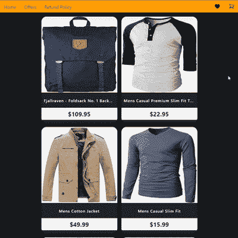

This is what you’ll be building!

埃森哲(n>19 个国家的 20，000 名消费者)在进行的一项调查发现，47%的网上购物者实际上会考虑支付更多——如果他们能获得超出预期的电子商务体验。

如果你是电子零售商，这是个好消息，对吗？但是*买者自负*:同样比例的人还表示，如果他们的体验令人沮丧，他们会避免从零售商那里购买。

为你的购物者提供快速、灵敏、直观的体验至关重要，因此[jam stack](https://jamstack.org/)——JavaScript、API、标记——已经证明在电子商务中很受欢迎。然而，这并不是你需要的全部。

这里的关键是解耦您的前端和后端，用 GraphQL 和内容呈现的智能管理来弥合差距…这就是为什么[WunderGraph](https://wundergraph.com/)——一个将 REST、GraphQL 和所有数据源整合到一个单一、安全、类型安全的端到端途径来实现所有用户体验的工具——非常有意义。

坚如磐石的技术，加上现代设计理念。

因此，让我们来看看如何将这些 JAMstack 技术中的一些技术——[next . js](https://nextjs.org/)、 [Strapi](https://strapi.io/) 、 [GraphQL](https://graphql.org/) 和[Snipcart](https://snipcart.com/)——结合在一起，让您为您的用户构建您想要的确切购物体验，同时对开发人员体验没有任何影响。

# 30，000 英尺的视野

以下是本教程需要的内容:

1.  Node.js & NPM，和 Python(用`sqlite3`在本地测试 Strapi 需要的)。
2.  React/Next.js、TypeScript 和 CSS 的中级知识(我在这里使用 [Tailwind](https://tailwindcss.com/) 是因为我喜欢实用优先的 CSS；但是 Tailwind 类可以很好地转换成几乎任何其他样式的解决方案，因为它实际上是编写普通 CSS 的不同方式。
3.  一个无头 CMS 来快速引导我们的后端(并添加 GraphQL ),而不必处理庞大的第三方客户端，我们将不得不运送客户端。Strapi 很棒，所以我们在这里用的就是它。
4.  一个 Snipcart [帐户](https://app.snipcart.com/register)添加到我们的电子商务应用程序购物车管理系统(免费测试模式)。本教程使用 Snipcart V3。

第二，这里有一个我们架构的快速图表，这样你就知道你要建造什么了。

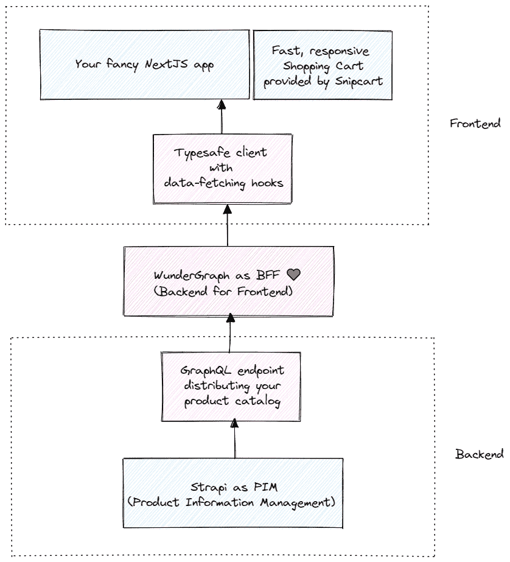

## 后端— Strapi + GraphQL

虽然关系数据库本身可以满足大多数用例，但生产就绪型电子商务是您想要更多东西的地方。

因此，我们将使用无头 JAMstack CMS，Strapi，作为一个 PIM——一个 **P** 产品 **I** 信息 **M** 管理解决方案——您的电子商务平台的唯一真实来源。这将是您的产品目录的中心，在这里您可以添加、修改、丰富和分发您的产品目录(通过一个易于安装的插件作为 GraphQL)。

本教程使用`sqlite3` 作为 Strapi 数据库，但是您可以在生产中很容易地用 PostgreSQL——或者您选择的另一个——替换它。

## BFF —神童图

神奇宝贝是这一切的关键。它位于我们的前端和后端之间，同时充当它们解耦的关键，并促进类型安全通信。

它是一个 BFF — [后端对前端](https://learn.microsoft.com/en-us/azure/architecture/patterns/backends-for-frontends) —一个服务层，或者 API 网关，不管你想叫它什么，它是你的前端可以看到的唯一“后端”。

这是通过整合来自所有数据源(对于我们来说，这里是一个 GraphQL 端点)的数据，并使用您编写的 GraphQL 查询(通过安全的 JSON-RPC)为您想要提供的每个单独的用户体验调整数据来实现的。

您可以使用过滤器、连接、翻译等，同时在您的 Next.js 应用程序和您的 Strapi + DB 后端之间保持清晰的关注点分离，并将它们释放出来做自己的任务。

## 前端— Next.js + TailwindCSS + Snipcart

前端并不复杂，真的。WunderGraph 为查询和修改数据生成了非常有用的现成钩子(同样基于您编写的 GraphQL 操作),因此对于 Next.js，您可以直接使用它们。

Snipcart 是一个很好的方式，可以为任何 webapp 添加一个易于集成、外观非常棒的购物车管理系统，它会很好地为我们服务。

这种架构让你可以将你的电子商务体验作为一个极快的、模块化的、可扩展的界面，而不是很久以前的笨重的一体化客户端应用程序。

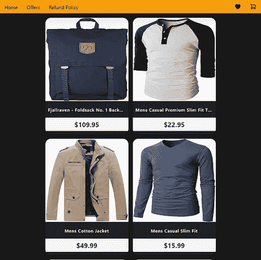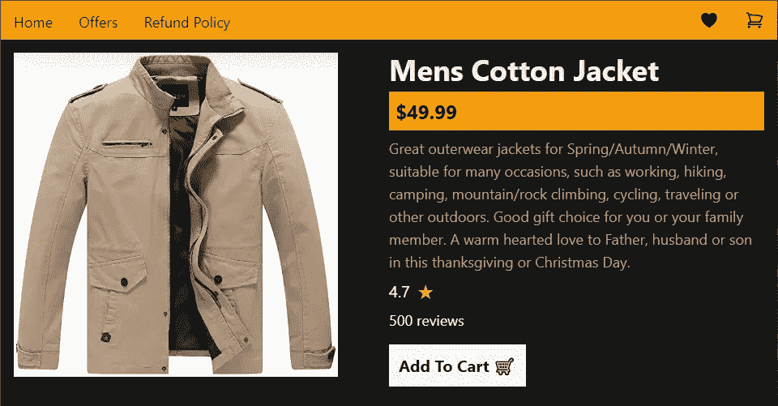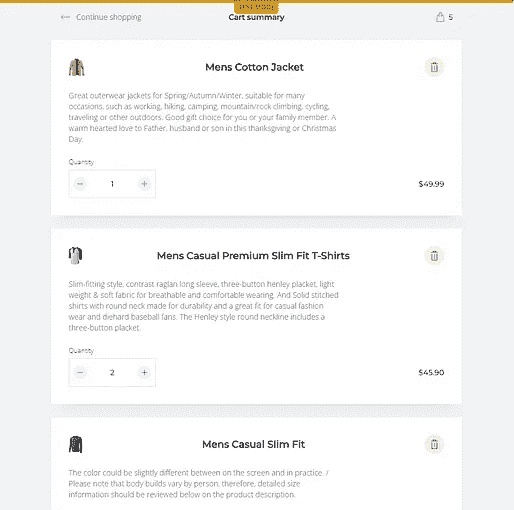

Here’s the finished product, at different screen sizes.

# 1.构建 Strapi + GraphQL 后端

Strapi 是一个开源的基于 Node.js 的 headless CMS(内容管理系统),它使程序员能够快速创建自托管的、自适应的、有效的内容 API(RESTful 和 GraphQL ),而无需编写任何代码。

**第一步:脚手架 a Strapi 项目**

创建一个新目录，放入 cd，然后运行以下命令:

```
> npx create-strapi-app@latest my-project — quickstart
```

> *💡*默认情况下，`*--quickstart*`标志给你一个 [SQLite](https://www.sqlite.org/) 3 数据库。如果你喜欢切换数据库，[看这里](https://strapi.gitee.io/documentation/3.0.0-beta.x/guides/databases.html)。

您的 Strapi 应用程序现在已经启动并在`localhost:1337`运行。

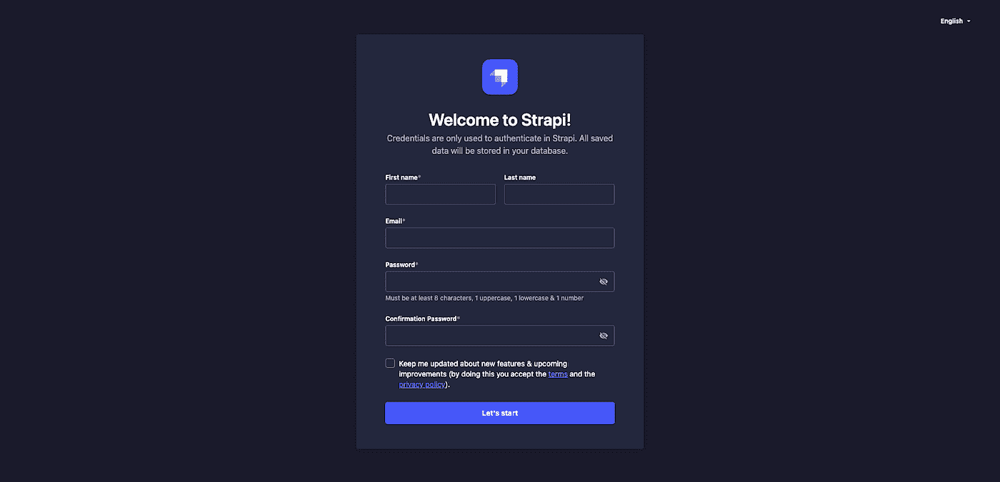

继续为 Strapi 项目注册一个管理员。这完全是本地的开发和测试。你不必担心有效的电子邮件和强密码之类的东西…现在还不用。

现在，您应该可以访问位于`[http://localhost:1337/admin](http://localhost:1337/admin.)`T13 的 Strapi 仪表盘。

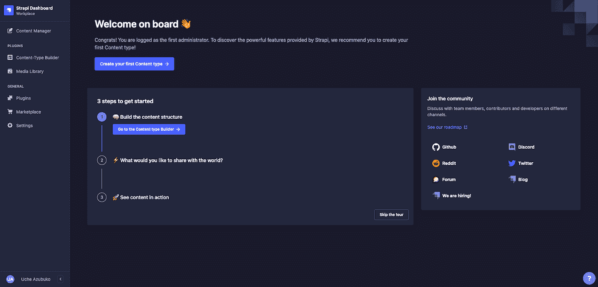

**步骤 2:为产品目录创建内容类型。**

Strapi admin dashboard 允许您快速构建数据的模式，而不必摆弄实际的关系数据库。Strapi 将这些模型称为内容类型。它们非常直观，您所要做的就是创建一个新的内容类型，并添加您的产品需要的字段。

转到侧栏上的内容类型生成器部分，然后选择创建新的集合类型。将出现一个模式，您将输入 product 作为显示名称，然后单击 Continue 按钮。

接下来就是忙活了。接下来，您必须添加您的实际数据(**内容管理器** - >选择一个**集合类型** - > **创建新条目，**清洗并重复您目录中的每个产品)我正在播种来自 [FakeStoreAPI](https://fakestoreapi.com/) 的示例数据，因此，这就是我的内容类型看起来的样子。

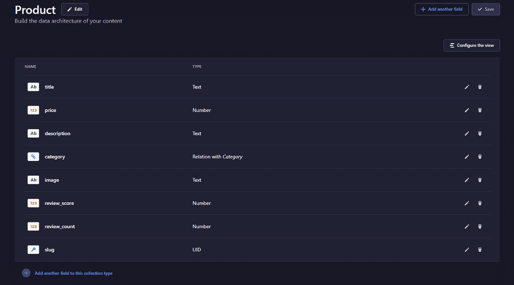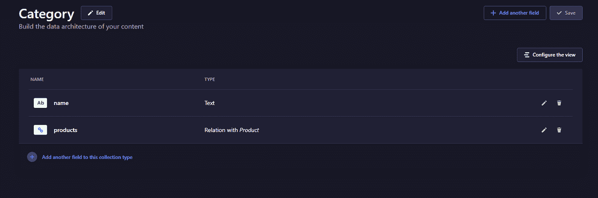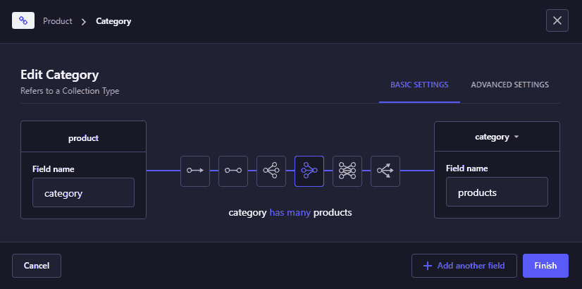

Don’t forget to add the many-to-one relation between product and category!

接下来，您需要授予`find` 和`findOne`对这两种集合类型的读权限，这样它们就可以被公开，无需认证就可以被查询。

为此，请转到边栏上的设置，然后:

*   头**角色**下**用户和权限。**
*   点击**公共**角色进行编辑。
*   点击**用户-权限**下拉菜单，然后检查产品和类别的 find 和 findone 选项。

现在，单击屏幕右上角的 Save 按钮来更新角色。

现在，我们可以进行类似于`**GET** /products`和`**GET** /products/:id`的 REST 查询。但是当然，GraphQL 会使所有这些*变得更加容易。所以接下来让我们完成它。*

**第三步:添加 GraphQL API**

要将我们的(目前是 RESTful) API 端点转换成一个 GraphQL 端点，我们必须通过在后端目录中运行以下命令来安装 graphql 插件:

```
> npm run strapi install graphql
```

全部完成后，现在使用以下命令(重新)启动 Strapi 服务器:

```
> npm run develop
```

…并让它在本教程的剩余部分一直运行。现在您在`[localhost:1337/graphql](http://localhost:1337/graphql)`有了一个 GraphQL 端点，您可以在这里玩一会儿**，**编写 GraphQL 查询来探索您的数据。

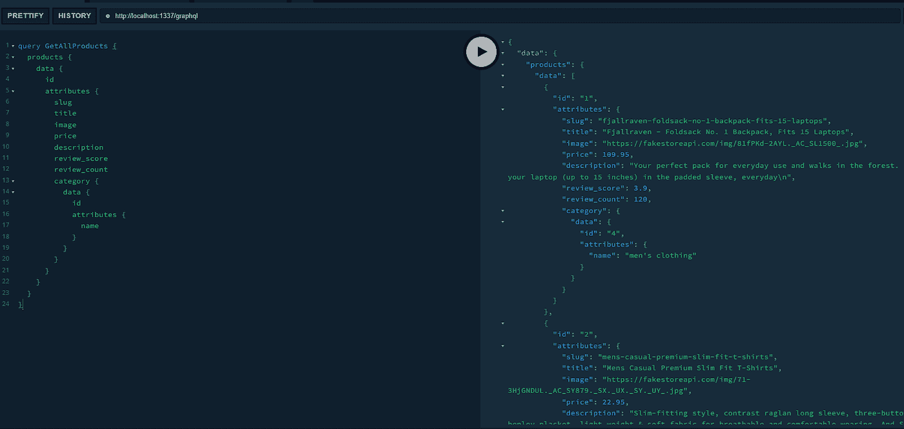

# 2.建立 wunder graph——和我们的前端。

现在我们有了 GraphQL 数据源，是时候将 WunderGraph 设置为我们的 BFF 了。幸运的是，WunderGraph 开发人员已经提供了一个[启动模板](https://github.com/wundergraph/wundergraph/tree/main/examples/nextjs)，我们可以用它同时启动和运行 WunderGraph 和一个样板 Next.js 应用程序。

# 第一步:WunderGraph + Next.js 快速入门

CD 进入项目根目录(在后端之外)，并键入:

```
> npx -y @wundergraph/wunderctl init — template nextjs-starter -o frontend
```

然后，将 CD 放入项目目录:

```
> cd frontend
```

安装依赖项，并启动:

```
> npm i && npm start
```

这将启动 WunderGraph **和** Next.js 服务器(利用 [npm-run-all](https://www.npmjs.com/package/npm-run-all) 包)，在`localhost:3000`给你一个带有示例查询的 splash/intro 页面(我相信是针对 SpaceX 火箭的)。如果你看到了，一切都正常。

现在实际配置 WunderGraph 来查看我们的 Strapi 数据，并为我们生成一个 Next.js 客户端——包括查询/变异挂钩，我们的前端可以使用和显示来自我们的 Strapi 产品目录的数据。

# 第二步:奇迹 101

因此，WunderGraph 的工作方式是，你告诉它你的应用程序依赖于哪些数据源，它将这些不同的数据源整合到一个单一的虚拟图形层中，然后你可以在其上定义数据操作(使用 GraphQL)。通过强大的自省，WunderGraph 可以将你能想到的几乎任何数据源转变成一个安全的、类型安全的 JSON-over-RPC API；OpenAPI REST、GraphQL、PlanetScale、Fauna、MongoDB 等等，以及任何 Postgres/SQLite/MySQL 数据库。

这对我们来说很好；我们已经有了一个工作的 GraphQL 数据源！

所以让我们开门见山。在`.wundergraph`目录中打开`wundergraph.config.ts` ，添加我们的 Strapi + GraphQL 端点作为我们的 app 所依赖的数据源，一个 WunderGraph 应该自省的数据源。

Notice how every introspected datasource needs a namespace — as every one of them has to get consolidated into a single virtual graph.

一旦你运行了`npm start`，WunderGraph 会自动监控你的项目目录中的必要文件，所以只要点击这里的 save 就会让代码生成器运行，它会生成一个你可以检查的模式(如果你想的话)——在`/.wundergraph/generated`中的 `wundergraph.app.schema.graphql`文件。

# 步骤 3:使用 GraphQL 定义操作

这是我们在 GraphQL 中编写查询/变异来操作 WunderGraph 生成的虚拟图形层，并获得我们想要的数据的部分。

所以转到 `./wundergraph/operations`并创建一个新的 GraphQL 文件。我们就叫它`AllProducts.graphql`。文件/查询名称无关紧要；它的内容和命名空间(以'`namespace_collection`'格式)做。

这是我们获取所有产品的查询。

先别庆祝；下面是另一个操作，这次通过 ID(或 slug)获得一个产品。您的选择，但 slug 可能更适合 SEO)。

在这个过程中，每次你点击 save，WunderGraph 的代码生成都在后台工作(只要它的服务器在运行，它就会在后台工作)，为你动态地生成类型安全的、特定于客户端的数据获取 React 钩子。

你可以在`/components/nextjs.ts`里检查这些。

Fine; you can probably celebrate a little now.

正如你所看到的，WunderGraph 给了你两个钩子供你使用，你可以在建立你的网站时使用— `AllProducts`和`ProductByID`。两者都接受输入；前者是一个分页限制，而后者是一个用来过滤的 ID。

# 3.构建 Next.js 前端

好消息；我们的大部分重活都做完了。从现在开始，我们完全生活在 UI 世界里。如果你熟悉 Next.js，这应该轻而易举。我们要做的就是为我们的电子商务应用程序建立一个前端，使用在上一步中导出的 2 个钩子。

/products/[id].tsx

# 4.用 Snipcart 实现购物车管理

Snipcart 为任何 webapp 提供端到端的购物车管理和结账解决方案，以定制脚本和样式表的形式提供，使集成变得简单。

一旦你注册了，仔细检查以确保你处于测试模式，并有你的公共 API 密匙(并存储在你的`.env.local`文件中)，你就一切就绪了。

只有一个变化:不是手动添加 Snipcart 脚本(这里是的[)到我们应用的`<body>` 标签，我们将为它们创建一个组件，并包含在我们的`Index.tsx`中。](https://docs.snipcart.com/v3/setup/installation)

一旦完成，我们所要做的就是添加 Snipcart 的必要属性来提供购物车元数据，只要我们有一个`<button>`来添加一个商品到购物车。

全部完成！只要确保你已经[阅读了他们的文档](https://docs.snipcart.com/v3/)，因为这篇文章是**而不是【Snipcart 的 API 的综合教程。**

# 总结一下

就这些了，伙计们！希望本教程能让您深入了解如何使用 WunderGraph 利用 JAMstack 的强大功能，超越仅使用 JAMstack 工具所能做到的。

有意义地分离前端和后端——然后弥合它们之间的差距，并以安全的方式启动——可能是构建 webapps 时最常见的痛点。像 JAMstack 这样的新范例——在使 web 变得更简单、更快速的同时，对开发者和用户来说都是一样的，它有自己的一套*陷阱*和编写胶合代码的单调乏味。

与 JAMstack 和 GraphQL 一起作为服务层/BFF 使用，WunderGraph 解决了大部分这些棘手问题，确保您只关心业务逻辑，并为您的客户构建和交付出色的东西。完整的端到端解决方案，没有任何额外的依赖性。