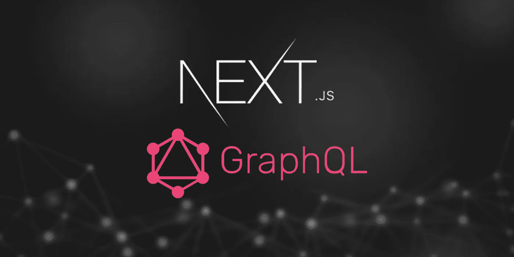
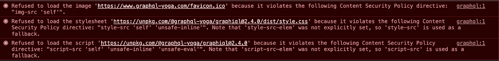
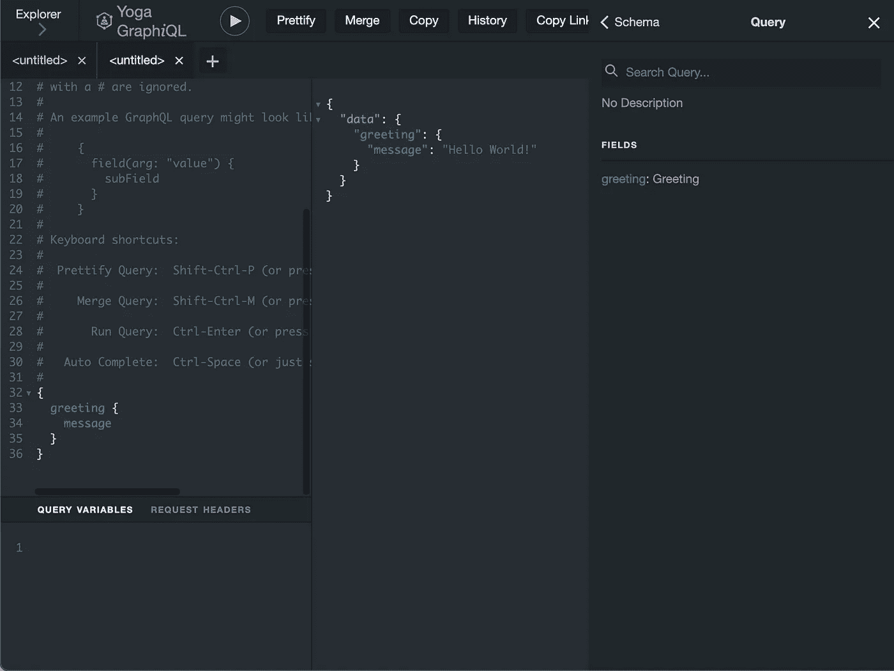
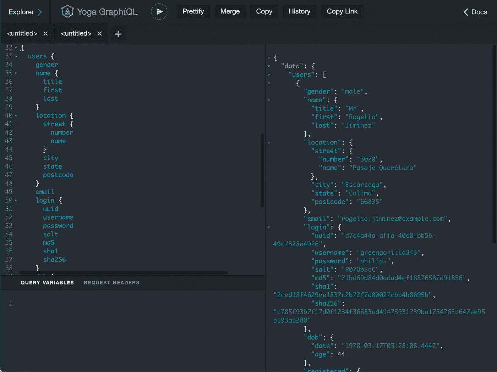
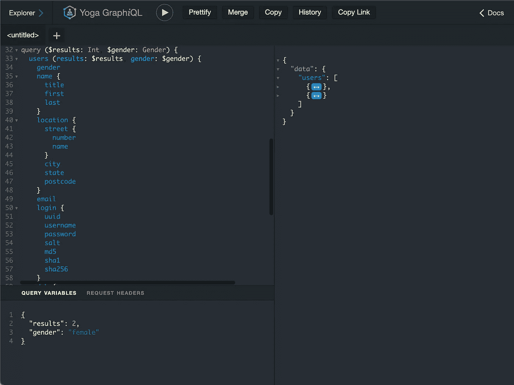
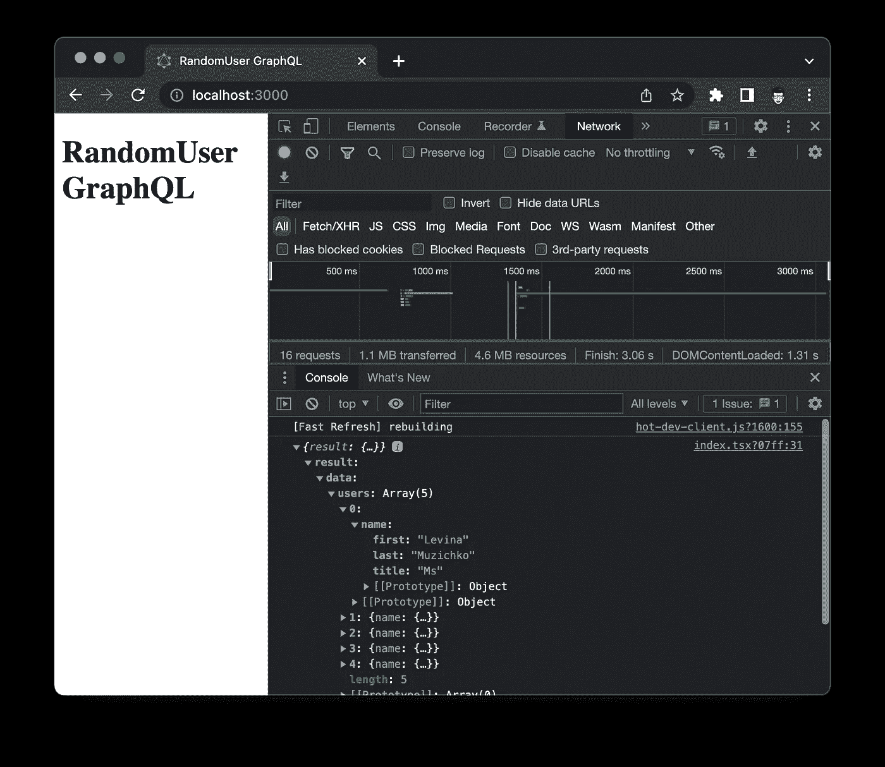

# 如何使用 Next.js API 路由构建 GraphQL 服务器

> 原文：<https://javascript.plainenglish.io/how-to-build-a-graphql-server-using-next-js-api-routes-68859018ab31?source=collection_archive---------7----------------------->

## 用 GraphQL 包装一个 RESTful API 并部署到 Vercel



# 介绍

作为一名 web 开发人员，我敢打赌您已经非常熟悉 RESTful APIs，并且已经用它们构建了非常棒的应用程序。RESTful API 被视为设计 API 的常规标准，它使用 HTTP 方法来执行 CRUD 操作。`GET`检索，`POST`创建，`PUT`更新，`DELETE`删除。然而，RESTful API 也有一些限制。例如，过度提取意味着有效负载返回的数据比客户端需要的多。有时，客户端需要发出多个请求来获取必要的数据。

## RESTful vs GraphQL

为了克服这些问题，脸书发布了 GraphQL，这是一种请求数据并让客户端精确指定应该返回什么数据的语法。GraphQL 还允许将多个模式组合成一个模式，拼接模式有助于客户端通过一个请求检索所有数据。

# 使用 Next.js 设置 GraphQL 服务器

本文将介绍如何使用 Next.js API 路由构建 GraphQL API 服务。我们将用 GraphQL API 包装我最喜欢的 RESTful API 之一 randomuser.me。

## 启动 Next.js 应用程序

`nextjs-100-ts`模板是一个很好的起点。

```
# yarn create next-app nextjs-graphql-server -e [https://github.com/rockyliyanlok/nextjs-100-ts](https://github.com/rockyliyanlok/nextjs-100-ts)
```

这是一个非常基础的 Next.js 样板文件，它在安全级别上获得了 100%的 lighthouse 分数和 A 级。如果你感兴趣，请看看下面的文章。

[](/how-to-set-up-next-js-with-typescript-to-get-a-100-score-in-google-lighthouse-and-vercel-analytics-6f97501a91c7) [## 如何用 TypeScript 设置 Next.js 在 Google Lighthouse 和 Vercel Analytics 中获得 100 分

### 建立一个 PWA 来获得 Google Lighthouse、Vercel Analytics 和 Webpagetest.org 安全公司的许可

javascript.plainenglish.io](/how-to-set-up-next-js-with-typescript-to-get-a-100-score-in-google-lighthouse-and-vercel-analytics-6f97501a91c7) 

让我们稍微清理一下应用程序，并添加一些应用程序签名，例如应用程序描述和 favicon。

## API 路由中的 GraphQL 服务器

我们可以在 Next.js 中设置一个 GraphQL 服务器，从[官方示例](https://github.com/vercel/next.js/tree/canary/examples/api-routes-graphql)来看，在 Next.is API Routes 中用`@graphql-yoga`创建一个 GraphQL 服务器相当简单。

```
# yarn add @graphql-yoga/node graphql lodash
```

./pages/api/graphql.tsx

```
├── **graphql**
│   ├── **resolvers**
│   │   ├── **greeting.ts**
│   │   └── **index.ts**
│   └── **typeDefs**
│       ├── **greeting.ts**
│       ├── **index.ts**
│       └── **query.ts**
├── pages
├── public
├── ...
```

让我们创建一个简单的问候查询来测试 GraphQL 端点。在**中*。/graphql*** 我们为 GraphQL `resolvers`和`type definitions`创建了文件夹。`typeDefs`包含查询的模式，`resolver`是一个负责填充数据的函数。

./graphql/typeDefs/greeting.ts

./graphql/typeDefs/query.ts

./graphql/typeDefs/index.ts

./graphql/resolvers/greeting.ts

./graphql/resolvers/index.ts

这里，问候解析器函数返回一个静态的 ***Hello World！*** 消息。问候查询非常简单，因为这个查询不需要参数。

有了这些，我们就可以尝试从[http://localhost:3000/API/graphql](http://localhost:3000/api/graphql)访问我们的 graph QL 工具了。

但是，页面是空的，并且`Console`中有一些错误。



**Figure 1** CSP issues from GraphiQL tool

问题来自内容安全策略。我们可以简单地通过在内容安全策略配置中添加 graphql-yoga 域来解决这个问题。

./next.config.js

之后，我们可以用`graphql-yoga`提供的 GraphQL 工具测试我们的 graph QL 端点。



**Figure 2** Greeting query in GraphiQL tool

# 用 GraphQL 包装 randomuser.me

是时候用 GraphQL 包装 [randomuser.me](https://randomuser.me/) RESTful 应用了。

randomuser.me 是一个 RESTful API，可以生成随机用户数据。查看[官方文件](https://randomuser.me/documentation)了解更多详情。

首先，根据用户负载在`typeDefs`中创建一个模式。

./graphql/typeDefs/user.ts

./graphql/typeDefs/query.ts

random user . me API 接受参数来指定结果，比如要返回的用户数量和返回用户的性别。因此，我们应该在用户查询中添加参数。

一些众所周知的属性类型可以用`graphql-scalars`工具进行验证。例如，***【UUID】***和 ***电子邮件地址*** 标量有助于使用正则表达式验证字符串数据。

```
# yarn add graphql-scalars graphql-parse-resolve-info
```

./graphql/typeDefs/index.ts

然后，为用户查询创建解析程序。

./graphql/resolvers/user.ts

./types/graphql.ts

./types/index.ts

./next.config.js

当 GraphQL 服务接收到用户查询时，用户解析器将从查询中提取所需的字段，并构建`inc`参数。`inc`参数是指定 [randomuser.me](https://randomuser.me/) 结果包含的字段。然后，来自用户查询的所有参数将被传递到查询字符串中的 [randomuser.me](https://randomuser.me/) 。

由于`graphql-scalars`用于验证，我们也应该在标量解析器中合并它们。

./graphql/resolvers/index.ts

最后，构建用户查询，我们可以用 GraphiQL 工具测试它。



**Figure 3** User query in GraphiQL tool without variables



**Figure 4** User query in GraphiQL tool with variables

# 使用图表 QL

是时候尝试从页面发出 GraphQL 请求了。

我们可以整合`apollo-client`或者`graphql-tool`。然而，让我们用 ***fetch()*** 代替`POST`请求，以保持这个故事中的一切简单。

./pages/index.tsx

在`POST`主体中，查询包含 GraphQL 查询和指定传递给查询的参数的变量。



**Figure 5** Consume the GraphQL endpoint from a page

它就像一个魔咒！

# 结论

GraphQL 目前是实现类型安全 API 的主要方式，在这种 API 中，消费者可以从 API 中检索他们需要的内容。让您的下一个 API 支持 GraphQL 或者甚至用 GraphQL 服务包装您当前的 API 是一个好主意。

在这个故事中，我们演示了如何用 GraphQL 包装 RESTful API，用 Next.js API routes 来做这件事非常简单。

在[链接](https://nextjs-randomuser-graphql.vercel.app/api/graphql)查看 randomuser.me GraphQL 端点，并在这里随意克隆或派生存储库[。](https://github.com/rockyliyanlok/nextjs-randomuser-graphql)

编码快乐！💻

*更多内容看* [***说白了。报名参加我们的***](https://plainenglish.io/) **[***免费周报***](http://newsletter.plainenglish.io/) *。关注我们*[***Twitter***](https://twitter.com/inPlainEngHQ)*和*[***LinkedIn***](https://www.linkedin.com/company/inplainenglish/)*。查看我们的* [***社区不和谐***](https://discord.gg/GtDtUAvyhW) *加入我们的* [***人才集体***](https://inplainenglish.pallet.com/talent/welcome) *。***