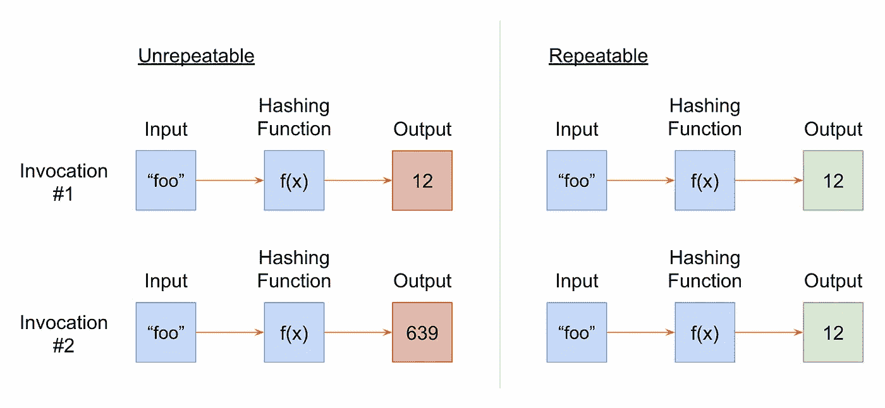
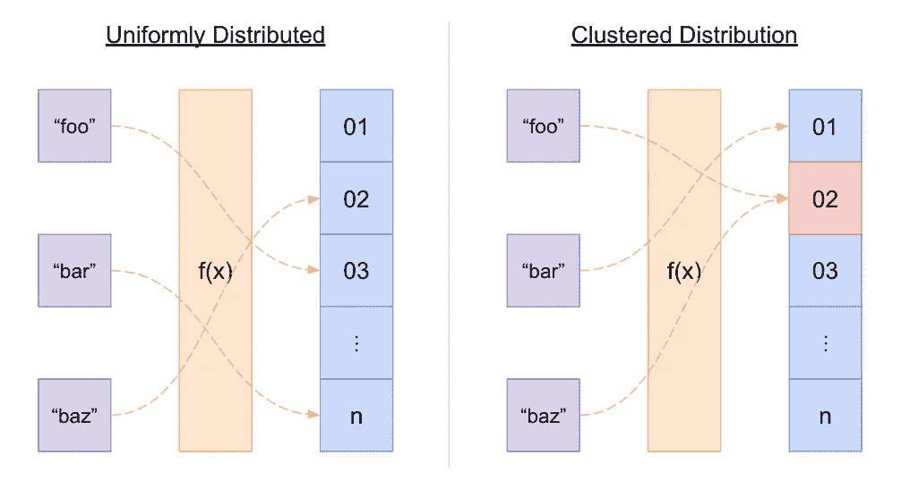
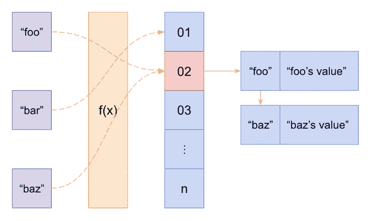
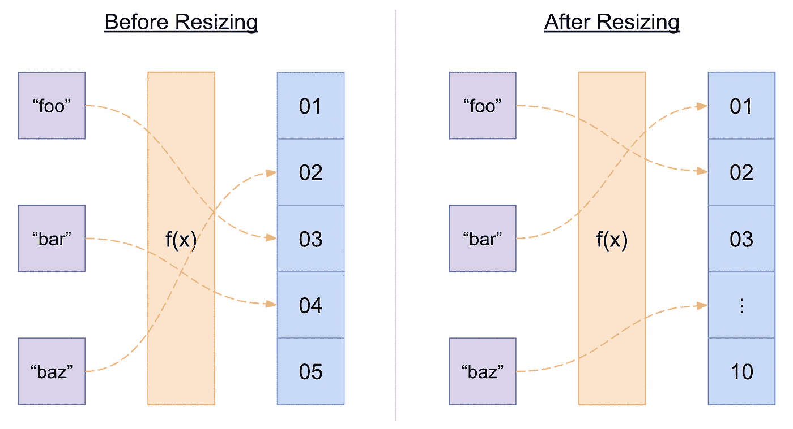
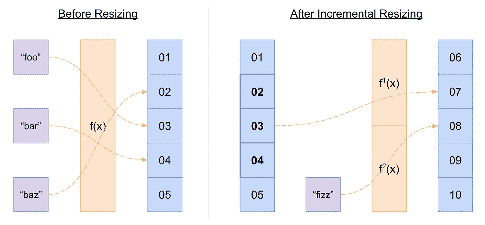
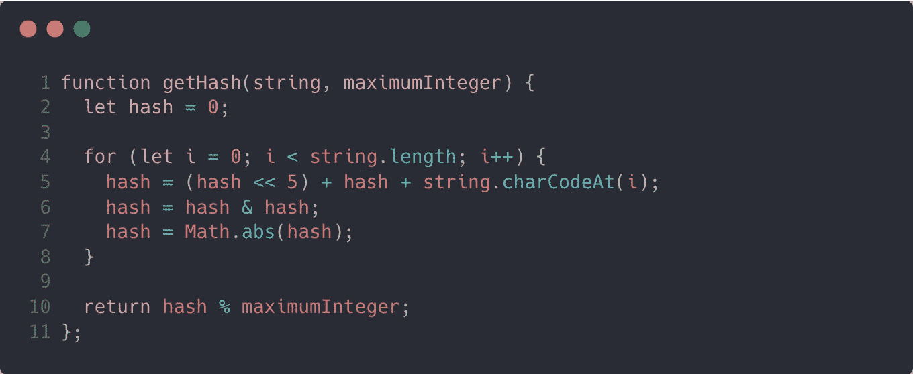
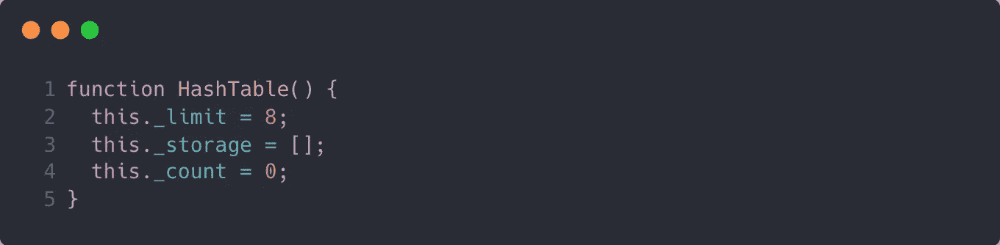
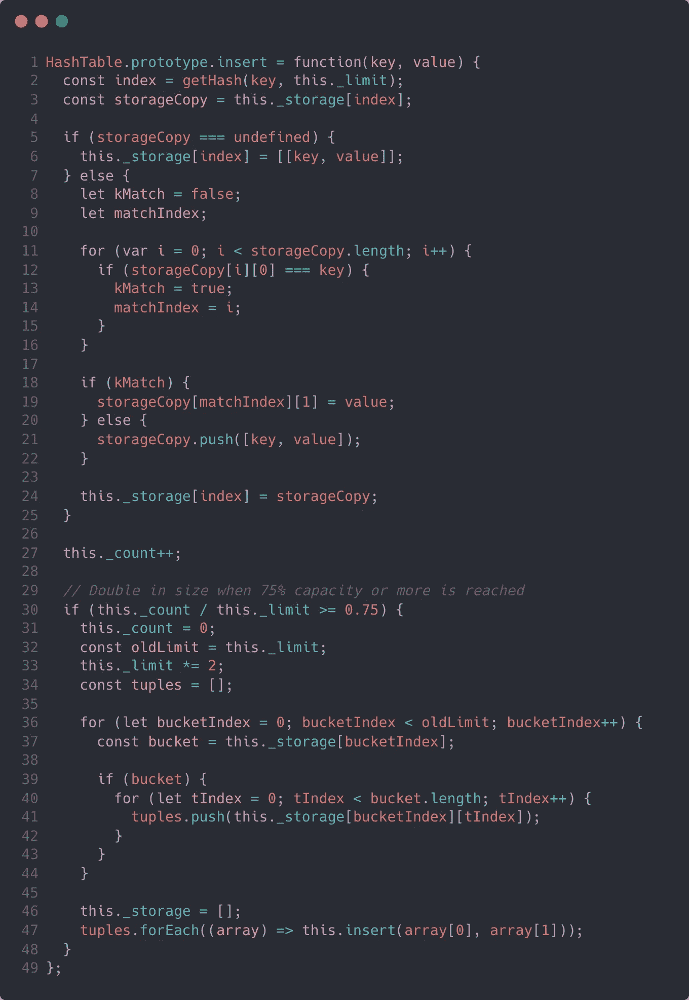
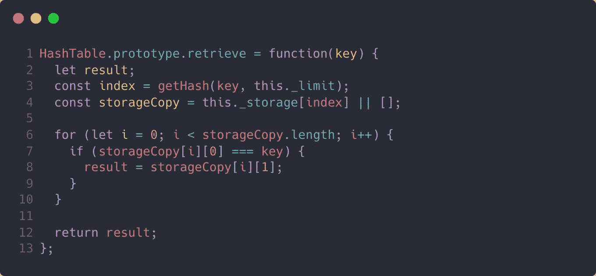
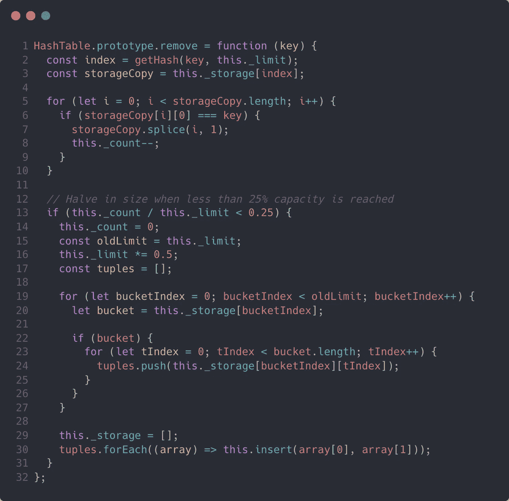

# 如何用 JavaScript 构建哈希表

> 原文：<https://javascript.plainenglish.io/how-to-build-a-hash-table-in-javascript-f09483c9ccc4?source=collection_archive---------5----------------------->

Photo by [Z](https://unsplash.com/es/@dead____artist?utm_source=medium&utm_medium=referral) on [Unsplash](https://unsplash.com?utm_source=medium&utm_medium=referral)

无论你是在面试一个入门级的软件工程职位，还是在大规模构建企业软件，数据结构都将是你成功的关键。它们是编程的一个基本支柱，有时很难驾驭。数据结构就像你工具箱中的工具，你需要知道每个工具是如何工作的，以便决定哪一个适合你的用例。

JavaScript 从很早开始就成为 web 浏览器事实上的脚本语言，从而变得流行起来。因此，JavaScript 不是一种全功能的编程语言，而是为了给网站增加一点动态交互而创建的。在像 [Node.js](https://nodejs.org/en/) 这样的跨 JavaScript 运行时环境允许开发人员在浏览器之外构建原生应用程序之后，它的受欢迎程度爆发了。JavaScript 随着其用例的发展而发展，所以随着时间的推移，JavaScript 开始扩展其原生数据结构支持。

虽然 JavaScript 没有纯哈希表的本机实现，但它有一个具有类似特征的`Map`类。然而，哈希表在软件工程中是一个非常重要的数据结构，理解它是如何工作的将有助于在软件开发中获得成功。

# 哈希表

哈希表也称为哈希映射，是一种将键映射到值的数据结构。它们使用散列函数来进行映射，在某些实现中，关键字可以是任意类型。哈希表有许多不同的用途，通常是在幕后。它们有时用在缓存实现中，并作为底层逻辑来构建一个[集合数据结构](https://en.wikipedia.org/wiki/Set_(abstract_data_type))。

接下来，我们将研究散列表的基本结构、它的效率以及如何用 JavaScript 实现散列表。

## 哈希函数

哈希表是令人难以置信的数据结构，因为它们不仅具有高效的属性查找的优势，而且平均来说，它们还具有高效的插入。实现这一点的方法部分是通过使用散列函数。哈希函数以一种可重复且均匀分布的方式将您的键强制到索引中。它还将任意大小的键域缩减为固定大小的索引域，时间代价可以忽略不计。

我们来解释一下重复性。给定相同的输入，可重复散列函数是每次都产生相同输出的函数。例如，使用字符串输入的长度作为输出的函数被认为是可重复的。相反，将字符串输入的长度与当前日历月数相加来计算输出指数的函数是不可重复的。这是因为如果您在一月份调用该函数，然后在二月份调用它，则指数会有所不同。

An illustration explaining a repeatable hashing function

如上所述，散列函数均匀分布其输出索引的能力是它服务的另一个关键角色。均匀指数分布意味着输出指数在输出范围的任何部分都有大致相同的着陆概率。这是为了尽可能避免索引冲突，因为解决冲突的代价很高。让我们进一步说明这一点。

An illustration explaining the uniform distribution of a hashing function

## 冲突解决

当然，在某种程度上，索引冲突是不可避免的，因为您正在将一个潜在的大关键字域缩减为一个固定的大小。因此，当您的属性数量接近您的总索引范围时，发生冲突的边际可能性就会增加。幸运的是，一些才华横溢的人已经想到了这一点，有一些技术可以帮助解决碰撞。

一种常见的方法称为“单独链接”。当存在冲突时，不是在为该键计算的索引处插入值，而是将那些键-值对插入到位于同一索引处的链表(或另一个数据结构)中。然后，当在该索引处进行查找或插入时，链表被线性遍历，直到找到该键。如果找不到目标键，则哈希表中不存在该属性。

An illustration of Separate Chaining as a collision resolution method

哈希表中另一种流行的冲突解决方法叫做“开放寻址”。在这种方法中，所有值都存储在哈希表本身中，而不是存储在附加的链表数据结构中。当发生冲突时，使用一种算法来探测下一个可用空间以插入值。通常，这种算法只是哈希函数的另一次传递，称为“双重哈希”，但也有其他算法。双重散列的好处是针对集群进行了相当优化。

## 动态调整大小

哈希表需要解决的索引冲突越多，操作哈希表的成本就越高。因此，当哈希表达到一定的容量(也称为“加载因子”)时，调整哈希表的大小是有益的虽然解决索引冲突的计算开销相对较大，但调整哈希表的大小也是如此，因为它涉及重新散列所有或部分现有的表属性。此外，抢先调整哈希表的大小以保持最小的加载因子会不必要地消耗内存。因此，可能需要动态调整大小来使表格变大和变小。

调整哈希表大小最简单的方法是完全重新散列所有现有的属性。当达到所需的加载因子时，现有属性被重新散列到具有新的适当大小的新哈希表中。

An illustration of complete rehashing during hash table resizing

有时，在动态调整哈希表大小时，对所有现有属性进行完全的重新哈希可能不切实际。在一些实时应用程序中，时间非常重要，哈希表非常大，一次重新散列所有属性是不可接受的。相反，增量再散列可能是一个更实用的解决方案。这通常涉及到在旧的哈希表旁边创建一个新的哈希表，将传入的属性插入到新的哈希表中，然后在每次操作时将少量的旧属性递增地移动到新的表中。这仍然具有分摊效率的优点，但是这意味着在调整大小的过程中，每个操作(即插入、查找和删除)可能都需要在两个表中查找属性。

An illustration of incremental rehashing during hash table resizing

# 效率

当使用任何数据结构时，首要考虑的应该是效率。有许多不同的数据结构和这些数据结构的后续变体，所有这些都可能在任何给定的用例中被使用，但是通常有一种特定的数据结构最适合您的考虑。

为了理解数据结构有多高效，你需要理解效率的语言。[大 O 符号](https://en.wikipedia.org/wiki/Big_O_notation)是确定效率的标准，通常用于表达数据结构在不同条件下的行为。当谈到时间复杂性时，最坏情况和平均情况是大多数工程师在决定使用哪种数据结构时感兴趣的主要条件。空间复杂性有时确实会发挥作用，但大多数数据结构都具有线性空间复杂性(即`O(n)`)，并且内存使用通常很容易调整，因此这一点通常会被忽略。

在一个维度良好的哈希表中，每次查找、插入和删除的平均时间复杂度与表中存储的元素数量无关。在大 O 术语中，这将被认为是`O(1)`，或恒定时间复杂度。这就是哈希表如此强大的原因，但这里的关键是术语“良好维度”。这意味着哈希表的大小足够大，因此很少发生调整大小的情况。当调整发生时，它会占用宝贵的运行时间。然而，这种额外的成本可以被认为是分摊到所有的插入和删除中，因此可以忽略不计。

# 用 JavaScript 实现

## 哈希函数

首先，我们需要一个散列函数。正如我前面所描述的，散列函数是这个数据结构的基础，因为它将您的键强制到一个索引，实际上没有时间损失。我们将在另一篇文章中深入探讨散列函数是如何工作的。现在，看一下下面的代码，它用 JavaScript 将字符串转换成索引。

An example of a hashing function to convert a string to an integer, written in JavaScript

理解“左移”或“按位 and”操作符的工作原理以及为什么在这里使用它们并不重要，但是了解高层发生了什么是有用的。

我想让你从这个职能中吸取两个主要的东西。首先，您可以在第`4`和`5`行看到，我们正在将输入字符串中的每个字符合并到最终的散列索引中。因为在计算散列索引时使用了每个字符，所以散列冲突的可能性降低了。其次，你会注意到在第`10`行，我们在最后的哈希值上使用了“余数”操作符。这确保了结果散列索引总是小于提供给函数调用的`maximumInteger`值。

## 总体结构

我们可以在这里使用一个`class`类型，但是这样做不会有太大的好处。相反，我们将使用一个函数并将三个属性添加到它的`this`绑定中。看一看:

The general structure of a function to construct a hash table in JavaScript

我们将一个`_storage`属性初始化为一个空数组文字，这就是我们存储哈希表属性的地方。出于动态调整大小的目的，我们需要跟踪我们当前拥有的属性总数和哈希表的大小限制。我们将使用`_count`属性跟踪属性计数，并在每次哈希表中添加或删除内容时更新它。类似地，我们将使用`_limit` 属性跟踪大小限制，并在每次需要扩展或减少哈希表的容量时更新它。

如果您想知道，我们不能简单地使用`_storage`数组上的`length`属性来测量我们的属性数，因为我们将在哈希函数生成的索引处插入项目。这些索引不太可能是连续的，因此，我们在数组中会有间隙，这不会反映在`length`属性中。在您的浏览器控制台中尝试一下。将一个空数组赋给一个变量，在索引 5 或任何其他非零索引处插入一个值，然后读取数组上的`length`属性。您将看到 length 属性是`6`，尽管我们只插入了一项。

## 插入方法

接下来，我们将定义插入方法，并将它附加到`HashTable`原型上，以便我们可以使用它。

A JavaScript implementation of an insert function for a hash table

让我们分析代码，以便更好地理解发生了什么。该函数可以分为两个主要部分:添加属性和有条件地调整数据结构的大小。

为了将属性添加到我们的数据结构中，我们首先使用前面描述的散列函数来计算`index`。这将为我们提供一个介于 0 和我们之前定义的存储限制之间的值，`_limit`。从那里，我们检查我们的`_storage`数组，看看在那个索引中是否已经存在一些东西。如果那里不存在任何东西，我们将从我们的`key`和`value`对中创建一个[元组](https://en.wikipedia.org/wiki/Tuple)，并将其放入一个数组中。否则，如果在那个索引中已经存在某些东西，我们将遍历现有的数组并比较键。如果该键已经存在，则更新与该键关联的值。如果没有，我们就把它加到数组的末尾。最后，我们将更新`_storage` 数组上属性，并增加我们的`_count`值，以正确跟踪我们当前的属性计数。

既然我们的`_count`值是最新的，我们需要检查哈希表的大小是否合适。决定何时调整哈希表的大小主要取决于空间和时间的考虑，但是为了便于演示，当[负载系数](https://en.wikipedia.org/wiki/Hash_table#Load_factor)或当前使用的容量百分比超过 75%阈值时，我们选择将大小加倍。为此，我们将重置我们的`_storage`和`_count`变量，加倍我们的`_limit`，最重要的是，我们将重新散列我们的整个属性清单。为了进行重新散列，我们将遍历嵌套的存储结构，将所有对收集到一个平面数组中，然后在每个对上递归调用我们的`insert`方法。

## 检索方法

`retrieve`方法比我们的`insert`方法简单得多，但同样重要。为了获得与特定的`key`相关的值，我们需要使用完全相同的散列函数来计算`index`(记住，我们的散列函数是可重复的)。然后，我们在那个`index`对我们的`_storage`数组进行查找，并在那里遍历结果数组以找到匹配的`key`。看看下面用 JavaScript 实现的内容。

A JavaScript implementation of a retrieve function for a hash table

## 移除方法

`remove`方法完全类似于我们之前描述的`insert`方法。我们计算`index`，如果存在匹配的`key`，从嵌套数组中移除该值，并递减我们的`_count`。然后，如果较低属性计数的结果使我们低于我们的下限加载因子(在本例中为 25%)，我们使用与我们的`insert`方法类似的递归算法将我们的存储大小减半。您可以在下面看到它的 JavaScript 实现。

# 结论

哈希表是开发人员可用的最有效的数据结构之一，它被用作我们今天使用的许多基础技术的基础。了解如何自己构建一个将会让您更好地了解如何以及何时在您自己的代码中使用它们。

如果你对如何在 JavaScript 中构建其他基本数据结构感兴趣，可以看看这篇文章[如何在 JavaScript 中构建链表](/how-to-build-a-linked-list-in-javascript-985543952a5a)。或者，如果你正在考虑加入一个编码训练营，我作为编码训练营毕业生学到的 10 件事是一个学习更多的好地方。

*原载于*[*https://codingbootcampguides.com*](https://codingbootcampguides.com/how-to-build-a-hash-table-in-javascript/)*由* [*迪伦费尔德曼*](https://www.linkedin.com/in/dylan-feldman/) *。*

*更多内容请看*[***plain English . io***](https://plainenglish.io/)*。报名参加我们的* [***免费周报***](http://newsletter.plainenglish.io/) *。关注我们上*[***Twitter***](https://twitter.com/inPlainEngHQ)[***LinkedIn***](https://www.linkedin.com/company/inplainenglish/)*[***YouTube***](https://www.youtube.com/channel/UCtipWUghju290NWcn8jhyAw)**和* [***不和***](https://discord.gg/GtDtUAvyhW) *对成长黑客感兴趣？检查* [***电路***](https://circuit.ooo/) ***。*****