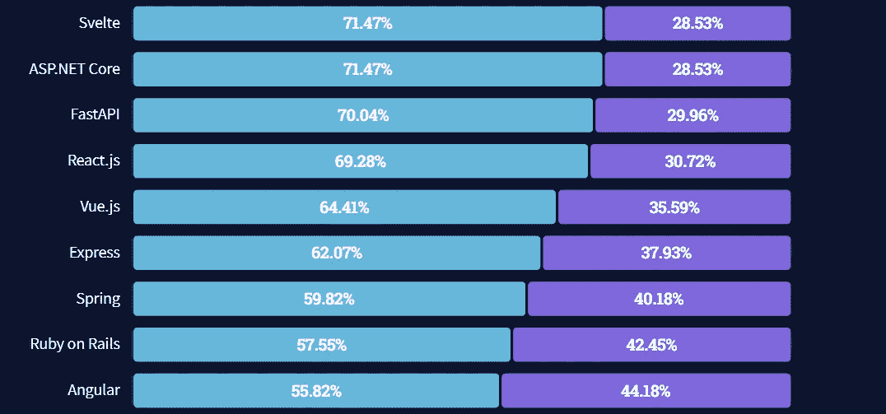

# 如何用 Angular 构建一个无头的 WordPress 以及为什么你应该这样做

> 原文：<https://javascript.plainenglish.io/how-to-build-a-headless-wordpress-with-angular-and-why-you-should-f87075fb57e3?source=collection_archive---------12----------------------->

## WordPress 被广泛认为是世界上最流行的内容管理系统之一。但是在前端使用角状岩石。

WordPress 被广泛认为是世界上最流行的内容管理系统之一。

事实上，截至 2021 年末，WordPress 为全球前 100 万网站中的 35%提供了支持。大约 25%的网站。

为什么这么受欢迎？

首先，它是免费下载和使用的。但是，如果你想定制它，WordPress 确实会对它的一些模板和插件收取费用。尤其是最好的。

除了免费，WordPress 的无处不在意味着如果你是互联网上的内容创作者，你可能以前用过它。

如果您还没有，那也没关系，因为它非常用户友好。此外，它足够灵活，不仅可以像博客一样发挥作用，还可以用于许多不同的项目。

## WordPress 的缺点

然而，使用 WordPress 也有严重的缺点。

一个是安全性，因为它太受欢迎了。黑客使用的逻辑是，如果它流行，弄清楚如何侵入内部更有意义。然后，一旦发现，这个过程可以重复。

另一个缺点是 WordPress 网站下载速度慢。这意味着观众在等待网站加载，可能会变得不感兴趣并离开。他们使用多余的代码和沉重的主题肯定会损害他们网站的速度。

最后，插件的必要性是第三个缺点。一次使用许多插件会导致加载时间缓慢。最重要的是，许多重要的插件只有通过支付年费才能获得。这意味着你的“免费”网站一年的运营时间要长得多。

# 解决方案:使用 Angular 的无头 WordPress 和使用 Fathym 的 deploy

在 Fathym，我们不仅仅是一个网络主机，我们还提供一个微前端平台。

这意味着我们为[开发者提供自由选择他们想要使用的 JavaScript 框架](https://www.fathym.com/blog/articles/2022/february/2022-02-28-angular-vs-react-vs-vue-you-choose)来和我们一起建立网站。在这种情况下，我们用 Angular 作为例子。

# 角度历史

在顶部，Angular 是一个 JavaScript 框架。Angular 由谷歌在 2010 年创建并发布，然后在 2016 年重新制作并重新发布。该框架目前被谷歌用于他们的谷歌广告中。

总的来说，Angular 被定义为比 React 和 Vue 具有更陡峭的学习曲线，这很可能是因为它非常复杂。然而，这意味着它也更有可能被用于更大规模的开发。它以代码一致性、高性能和一旦你开始学习就易于使用而闻名。与其他公司相比，他们还拥有大量的文档。Angular 被 HBO、Forbes、PayPal 和 Sony 等大公司使用。

# 打造棱角分明，独一无二地展示您的内容

一个无头的 WordPress 意味着，基本上，用户仍然在创建内容(博客，照片库，等等)。)在 WordPress 的后端，但是通过使用 API，这些内容显示在前端，由 Angular 构建。

为什么要用 Angular？

# 用户化

在 WordPress 内部，创作者受到限制。它们被打包到 CMS 已经建立的任何插件中。

相反，开发人员有能力创造新的和独特的设计布局。您可以决定如何最好地显示您的内容，以及您的最终用户如何与该内容进行交互。

假设你是一家时装公司。你可以有一个你设计的最新 T 恤衫陈列室。但是，当用户点击图片时，他们会被带到一个新的页面，这是一个模特穿着那件衬衫走过街道的视频。

选项基本上是无限的！

# 流行

一个框架的受欢迎程度很重要，因为这是它实际工作情况的一个指标。

根据 stack overflow 2021 年对开发者的调查，Angular 是去年第九大最受欢迎的 JavaScript 框架。事实上， [55.82%的受访者表示他们“喜欢”使用它](https://www.fathym.com/blog/articles/2022/april/2022-04-13-micro-frontend-popularity)，45%的人表示他们害怕使用 Angular。

知名度也很重要，因为如果你遇到问题，有一个强大的社区可以回答你的问题。

# 改善用户体验

由于 Angular 的应用程序大小，用它建立的网站加载速度会比在 WordPress 上快一些。这是一件大事，因为在 2022 年，当网站加载缓慢时，有时用户会失去兴趣并退出。不仅如此，加载时间也可以表明专业性，对于网速较慢的用户来说，更小的尺寸是需要的，而不仅仅是额外的好处。

用户体验持续改善，安全性也比 WordPress 更好。因为 WordPress 网站如此普遍，黑客们已经花时间进入它们，有时是 DDoS 攻击。当使用一个无头的 WordPress 选项时，因为前端与后端(所有信息都存储在那里)是分离的，黑客几乎不可能得到这些信息。

此外，由于 Angular 能够制作非常有趣、健壮、功能良好的用户界面，用户体验也将得到改善。一些 WordPress 插件可能有点慢或者有点小故障，但是一个强大的 React 开发者可以帮助创造一些美妙的东西。

# 让法西姆主持

最后，把这个新的无头 WordPress 站点带到 Fathym 来满足你的主机需求。我们利用微软 Azure，有免费启动计划，并为开发者提供独特的优势，如[社交 UI](https://www.fathym.com/blog/articles/2022/march/2022-03-02-introducing-fathyms-social-ui) 。

Fathym 可以免费试用，非常容易使用，而且非常安全。

[今天就加入 Fathym！](https://www.fathym.com/dashboard)

【https://www.fathym.com】最初发表于**。**

**更多内容看* [***说白了。报名参加我们的***](https://plainenglish.io/) **[***免费周报***](http://newsletter.plainenglish.io/) *。关注我们*[***Twitter***](https://twitter.com/inPlainEngHQ)*和*[***LinkedIn***](https://www.linkedin.com/company/inplainenglish/)*。查看我们的* [***社区不和谐***](https://discord.gg/GtDtUAvyhW) *加入我们的* [***人才集体***](https://inplainenglish.pallet.com/talent/welcome) *。****