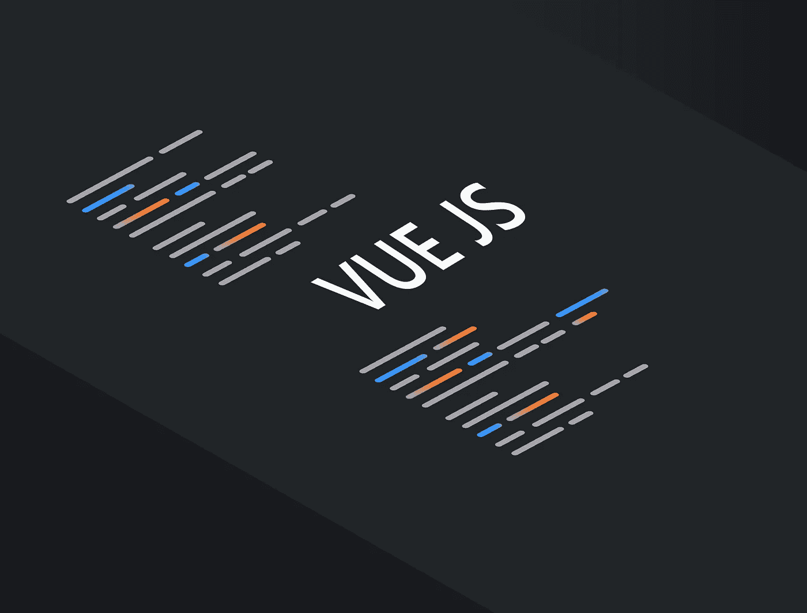

# 如何用 Vue.js 构建一个无头 WordPress

> 原文：<https://javascript.plainenglish.io/how-to-build-a-headless-wordpress-with-vue-450d00ad6633?source=collection_archive---------16----------------------->

WordPress 被广泛认为是世界上最流行的内容管理系统之一。

事实上，截至 2021 年末，世界上 100 万家网站中有 35%是由 WordPress 支持的。大约 25%的网站。

为什么这么受欢迎？

首先，它是免费下载和使用的。但是，如果你想定制它，WordPress 确实会对他们的一些模板和插件收取费用。尤其是最好的。

除了免费，WordPress 的无处不在意味着如果你是互联网上的内容创作者，你可能以前用过它。

如果您还没有，那也没关系，因为它非常用户友好。此外，它足够灵活，不仅可以像博客一样发挥作用，还可以用于许多不同的项目。

## WordPress 的缺点

然而，使用 WordPress 也有严重的缺点。

一个是安全性，因为它太受欢迎了。黑客用的逻辑是，如果流行，弄清楚如何黑进去更有意义。然后，一旦发现，这个过程可以重复。

另一个缺点是 WordPress 网站下载速度慢。这意味着观众在等待网站加载，可能会变得不感兴趣并离开。他们使用多余的代码和沉重的主题肯定会损害他们网站的速度。

最后，插件的必要性是第三个缺点。一次使用许多插件会导致加载时间缓慢。最重要的是，许多重要的插件只有通过支付年费才能获得。这意味着你的“免费”网站一年的运营时间要长得多。

## 解决方案:使用 Vue.js 的 Headless WordPress 和使用 Fathym 部署

在 Fathym，我们不仅仅是一个网络主机，我们还提供一个[微前端平台。](https://www.fathym.com/blog/articles/2022/march/2022-03-14-a-simple-micro-frontends-explainer)

这意味着我们为[开发者提供自由选择他们想要使用的 JavaScript 框架](https://www.fathym.com/blog/articles/2022/february/2022-02-28-angular-vs-react-vs-vue-you-choose)来和我们一起建立网站。在这种情况下，我们以 Vue.js 为例。

## Vue 历史

Vue 于 2014 年推出，由尤雨溪开发。这是一个极其简单的开源 JavaScript 框架。

虽然有些人喜欢使用 Angular 或 React，但 Vue 被认为是三者中最容易学习的。它也像这两个竞争对手一样以基于组件的架构为特色，拥有简洁的文档，其微小的尺寸有助于网站运行得更快。

Vue 的受欢迎程度也在上升。

# 使用 Vue 构建，独特地显示您的内容

一个无头的 WordPress 意味着，基本上，用户仍然在 WordPress 的后端创建内容(博客，图片库等)，但是通过使用 API，这些内容显示在前端，由 Vue.js 构建。

为什么要用 Vue？

## 用户化

在 WordPress 内部，创作者受到限制。它们被打包到 CMS 已经建立的任何插件中。

相反，开发人员有能力创造新的和独特的设计布局。您可以决定如何最好地显示您的内容，以及您的最终用户如何与该内容进行交互。

假设你是一家时装公司。你可以有一个你设计的最新 T 恤衫陈列室。但是，当用户点击图片时，他们会被带到一个新的页面，这是一个模特穿着那件衬衫走过街道的视频。

选项基本上是无限的！

## 易用性

同样，Vue 是最容易学习的 JavaScript 框架之一。事实上，虽然有一些编码经验会更容易建立网站，但一些人认为从 Vue.js 开始没有必要了解任何 JavaScript，而另一些人认为了解一些 JavaScript 基础知识肯定会有所帮助。

除了入门之外，使用 Vue.js 作为前端的最大好处之一就是提高了可伸缩性。WordPress 站点很难扩展，因为它们是老式的整体设计。由于 Vue 可以处理较小的独立部分，因此您可以更新网站的一部分——博客、画廊、主页——而不必更新整个网站。

## 改善用户体验

因为 Vue 的尺寸更小，用它建立的网站比在 WordPress 上加载要快得多。这是一件大事，因为在 2022 年，当网站加载缓慢时，有时用户会失去兴趣并退出。不仅如此，加载时间也可以表明专业性，对于网速较慢的用户来说，更小的尺寸是需要的，而不仅仅是额外的好处。

用户体验持续改善，安全性也比 WordPress 更好。因为 WordPress 网站如此普遍，黑客们已经花了时间进入它们，有时是 DDoS 攻击。当使用一个无头的 WordPress 选项时，因为前端与后端(所有信息都存储在那里)是分离的，黑客几乎不可能得到这些信息。

最后，把这个新的无头 WordPress 站点带到 Fathym 来满足你的主机需求。我们利用微软 Azure，有一个免费的启动计划，并为开发者提供独特的优势，如社交用户界面。

## 加入 Fathym

Fathym 可以免费试用，非常容易使用，而且非常安全。

我们希望你今天就来 Fathym 建立一个网站。

*最初发表于*[T5【https://www.fathym.com】](https://www.fathym.com/blog/articles/2022/april/2022-04-11-headless-wordpress-vue)*。*

*更多内容看* [***说白了。报名参加我们的***](https://plainenglish.io/) **[***免费周报***](http://newsletter.plainenglish.io/) *。关注我们关于*[***Twitter***](https://twitter.com/inPlainEngHQ)*和*[***LinkedIn***](https://www.linkedin.com/company/inplainenglish/)*。加入我们的* [***社区不和谐***](https://discord.gg/GtDtUAvyhW) *。***