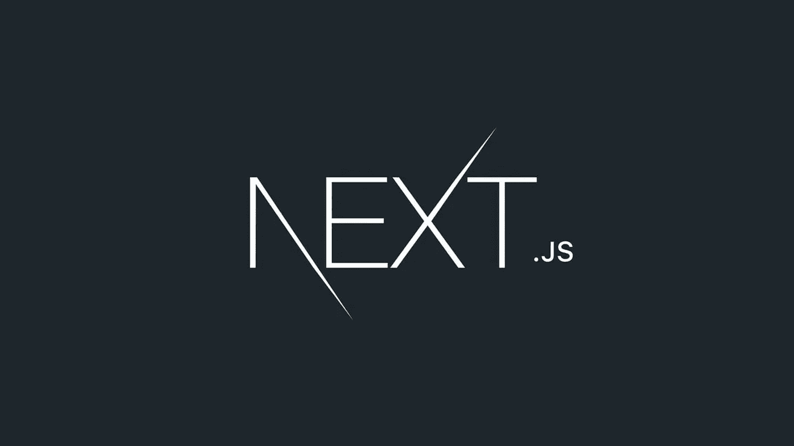
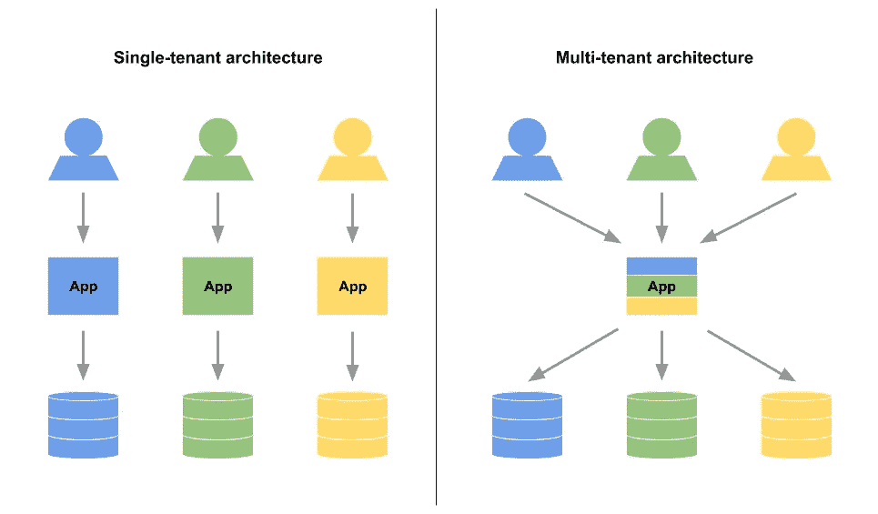

# 如何用 Vercel 的 Next.js 中间件构建多租户 App

> 原文：<https://javascript.plainenglish.io/how-to-build-a-multi-tenant-app-with-vercels-next-js-middleware-eeb02e08d41d?source=collection_archive---------4----------------------->

好吧，这是一项非常酷的技术，几乎有无限的可能性。最近，我使用 Next.js 中间件提前接触到了 Vercel 的多租户技术，我被其易用性惊呆了。

在不到 15 分钟的时间里，我就能够将示例存储库转换成能够为我正在构建的项目增加显著商业价值的东西。
今天，我将向您展示如何做到这一点！

但是首先，让我快速解释一下我所说的中间件和多租户是什么意思！



# 什么是中间件？🧐

中间件是一个在请求被传递到你的应用程序之前运行的功能。在中间件功能内部，您可以执行逻辑并实际更改请求。改变请求正是我们将用来创建多租户系统的技术！

看看 [Vercel 的文档](https://vercel.com/docs/concepts/functions/edge-functions#middleware-use-cases)中可能的用例。

# 什么是多租户应用程序？🤔

多租户应用程序是一项非常酷的技术，它允许您从不同的(子)域运行应用程序，并根据所使用的域显示不同的内容。

如果你还不相信它超级酷，看看你现在使用的平台吧！是的，没错。Medium 实际上使用了这项技术，今天您将学习如何做同样的事情。

## 多租户应用程序的一些示例

*   一个类似博客的媒介，每个人都有自己的子域
*   像 Gumroad 或 Redbubble 这样的电子商务商店
*   任何你能想象到的💭

让我向您展示如何构建相同的内容！



A graphic explaining multi-tenancy

# 入门指南🎬

我们需要做的第一件事是创建一个新的 Next.js 应用程序。

为此，请在终端中运行以下命令:

```
yarn create next-app
```

按照设置，当它完成后，你就可以开始了！

对于那些想要在他们现有的 Next.js 应用中实现这一点的人来说，这只是一个快速的提醒。中间件只从 Next.js 12 开始提供。

# 设置我们的中间件

我们需要做的第一件事是创建我们的中间件。
要在 Next.js 中创建一个新的中间件函数，您需要做的就是在 pages 目录中添加一个名为`_middleware.js`的新文件。

创建该文件后，向其中添加以下内容。

我没有一步一步地解释，而是决定在 Vercel 已经给我的评论的基础上添加大量的评论来解释正在发生的事情！

这个中间件功能的作用是解析用于调用应用程序的子域，并将主机名重写为`_sites`路由的参数。

现在剩下要做就是创建`_sites`路由并检索主机名！

# 正在检索主机名

让我们创建解析主机名所需的路由！

请遵循以下步骤:

*   在 pages 文件夹中创建一个新文件夹`_sites`
*   在`_sites`文件夹中，创建另一个名为`[site]`的文件夹
*   在`[site]`文件夹中，创建一个名为`index.js`的文件

这就是你完成所有设置后 pages 文件夹的样子！

```
pages              
├─ _sites          
│  └─ [site]       
│     └─ index.js  
├─ _app.js         
├─ _middleware.js  
└─ index.js
```

## 获取所有路径

我们需要做的第一件事是让 Next.js 知道所有可能的路径是什么。为此，我们将使用方便的`getStaticPaths`函数。在我的例子中，我们将使用一个模拟设置，但是您可以很容易地将它连接到您自己的 API 上！

## 获取数据

在我们检索了所有的路由之后，是时候根据正在使用的子域获取正确的数据了。

为了实现这一点，我们将使用服务器端渲染的强大功能。

创建一个新的`getStaticProps`函数，从上下文中读取`site`参数，您就可以开始了！

该函数看起来会像这样:

就像我们的`getStaticPaths`函数一样，我们使用的是我们数据的模拟，但是你可以很容易地调用你的 API 并返回正确的数据。

## 创建组件

关于`getStaticProps`的美妙之处在于，我们获取的项目现在可以作为我们组件中的常规道具使用了。不需要`await`它或用钩子找到它。所有这些都是服务器端渲染的。

我们最基本的组件如下所示:

## 整个组件

如果一切顺利，那么您的整个组件应该看起来像这样。你准备好测试它了吗？

# 测试它

用`yarn dev`启动你的开发服务器，打开你最喜欢的浏览器。

现在剩下要做的就是浏览两个子域名中的一个。您可以选择`[http://test.localhost:3000](http://test.localhost:3000)`或`[http://test2.localhost:3000](http://test2.localhost:3000.)`或[。根据您选择的不同，您将看到不同的输出！](http://test2.localhost:3000.)

很漂亮吧？🥳

## 小小的改进

在我们当前的例子中，对于未知的域没有回退。

当有人试图访问未知的子域时，你的应用程序会崩溃，但幸运的是，我们可以很容易地解决这个问题！

用这个快速检查更改您的`getStaticProps`功能，您就一切就绪了！

当有人试图访问一个未知的 URL 时，我们会自动向他们显示内置的 404 页 Next.js。

## 添加额外页面

如果您正在使用这种技术构建一个实际的应用程序，您可能希望向平台添加额外的页面。不要担心，这是超级容易做到的！
在这个`[site]`文件夹中，您可以使用常规的 Next.js 基于页面的路由！你在那里添加的任何文件都会自动成为平台上的新页面。

这就是关于 Next.js 多租户设置的所有信息。是时候发挥创造力，建立自己的项目了。

祝你有美好的一天💙

*更多内容看* [***说白了。报名参加我们的***](http://plainenglish.io/) **[***免费周报***](http://newsletter.plainenglish.io/) *。在我们的* [***社区获得独家访问写作机会和建议***](https://discord.gg/GtDtUAvyhW) *。***