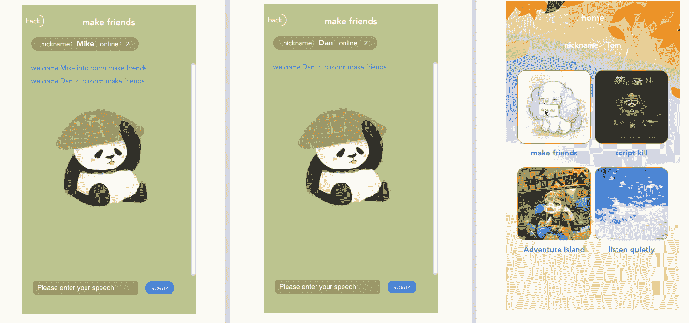
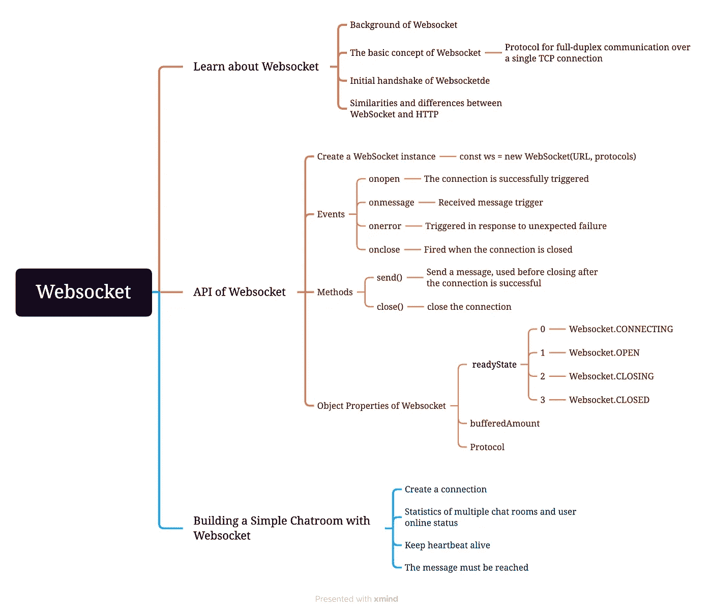
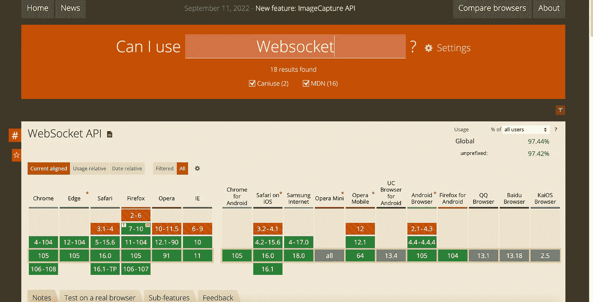
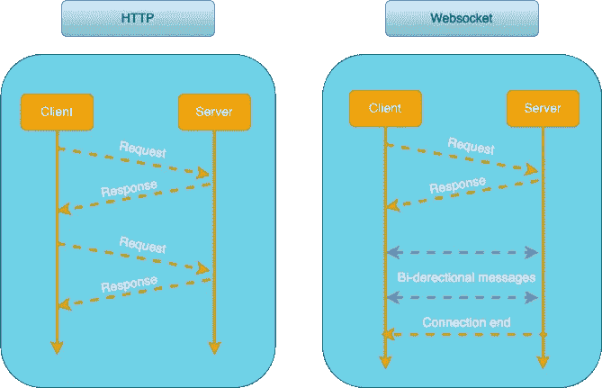
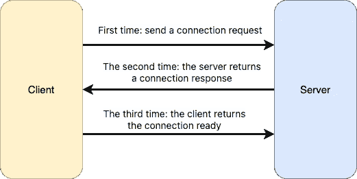
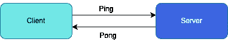
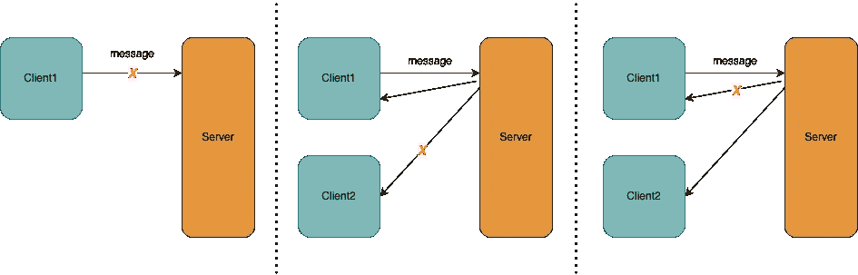
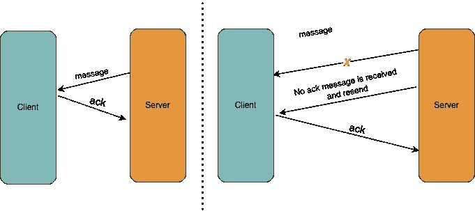
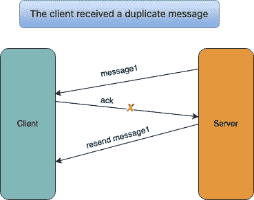

# 如何在 10 分钟内用 WebSocket 建立一个多人聊天室

> 原文：<https://javascript.plainenglish.io/how-to-build-a-multiplayer-chatroom-with-websocket-in-10-minutes-6694f2a6f971?source=collection_archive---------3----------------------->

## 使用 WebSocket 建立多人聊天室的快速指南。

# 演示

[去 GitHub 查看完整源代码](https://github.com/ReeceLeaf/websocket-chatroom)

[点击此处体验完整服务](http://qianlongo-1300947007.cos.ap-nanjing.myqcloud.com/websocket-chatroom/index.html)

# 概述

# 前言

我们通常看到的聊天室似乎很神秘。实际上，它们通常是用`Websocket`构建的。本文总结了`Websocket`的基础知识，并实现了一个简单的多人聊天室演示。看完之后，你可以用`Websocket`建立一个聊天室。

# 了解 Websocket

## `Websocket`的背景

在很多场景下，用户需要实时消息，比如聊天、医疗设备读数等。旧的解决方案是基于轮询来获取最新数据，但它并不完全同步实时消息。在大多数情况下，请求是不必要的，会浪费大量流量和服务器资源。基于这样的背景，`WebSocket`诞生了。

## Websocket 的基本概念

`WebSocket`是 HTML5 提供的单一 TCP 连接上的全双工通信协议。`WebSocket`通信协议诞生于 2008 年，2011 年成为国际标准`WebSocket`使得客户端和服务器之间的数据交换更加容易，允许服务器主动向客户端推送数据。在`WebSocket` API 中，浏览器和服务器只需要完成一次握手，然后就可以直接创建持久连接，进行双向数据传输。

兼容性问题(主流浏览器支持)

## Websocket 的特性

*   控制开销。建立连接后，当服务器和客户端之间交换数据时，用于协议控制的数据包报头相对较小。在没有扩展的情况下，对于从服务器到客户端的内容，报头大小仅为 2 到 10 个字节(与数据包长度相关)；对于客户端到服务器的内容，该报头需要用额外的 4 个字节来屏蔽。与 HTTP 请求每次需要携带完整的头相比，这种开销大大降低。
*   实时通信。由于协议是全双工的，服务器可以随时主动向客户端发送数据。与 HTTP 请求相比，服务器需要等待客户端发起请求后才能响应，延迟明显更少；即使与 Comet 这样的长轮询相比，也能在短时间内交付更多次数据。
*   保持联系。与 HTTP 不同，Web 套接字需要首先创建一个连接，这使它成为一个有状态协议。后来交流的时候可以省略一些状态信息。
*   支持二进制传输。您可以发送文本或二进制数据。`Websocket`定义二进制框架，比 HTTP 更容易处理二进制内容。
*   协议标识符是`ws`(或者`wss`，如果加密的话)，服务器 URL 是 URL。
*   实现很简单。基于 TCP 协议，服务器端的实现相对容易，没有源码限制。客户端可以与任何服务器通信。
*   它对 HTTP 协议有很好的兼容性。默认端口也是 80 和 443，握手阶段使用 HTTP 协议。所以不容易阻塞握手，可以通过各种 HTTP 代理服务器。
*   支持扩展。`Websocket`定义扩展。用户可以扩展协议，实现一些用户自定义的子协议。例如，一些浏览器支持压缩。

## Websocketde 的初始握手

每个 Web socket 连接都从一个 HTTP 请求开始，这个请求类似于其他请求，但是包含一个特殊的头— `Upgrade`。`Upgrade`表示客户端将连接升级到`Websocket`协议。

握手之前，`Websocket`遵循 HTTP/1.1 协议。

客户端发送的升级到 Web socket 的请求也叫初始握手。客户端发送 HTTP 升级请求后，直到服务器响应 101 状态码、`Upgrade`和 Sec `WebSocket` Accept 头，连接才成功。否则，连接无法成功。以下是复制的`WebSocket`握手的请求头和对应的头:

## WebSocket 和 HTTP 的异同

1.  相同点

*   都是基于`TCP`的应用层协议。
*   两者都使用`Request/Response`模型来建立连接。
*   在连接建立期间，错误处理方法是相同的。在此阶段，`WebSocket`可能会返回与`HTTP`相同的返回码。

2.差异

*   `HTTP`协议基于请求/响应。只能进行单向传输，是半双工通信，而`WebSocket`是全双工通信。

`Half duplex communication`:单向流，服务器不主动向客户端推送数据。
`Full duplex communication`:服务器可以主动向客户端推送信息，客户端也可以主动向服务器发送信息。是真正的双向平等对话，属于服务器推送技术。

*   `HTTP`是无状态的，因此请求在收到响应后被关闭。无状态的好处是服务器不需要存储相关的会话信息。缺点是每个`HTTP`请求和响应都会发送关于请求的冗余信息；而`WebSocket`只需要建立一次`Request/Response`消息对，之后再建立一次`TCP`连接，避免了多个`Request/Response`消息对产生的冗余头信息。节省了大量的流量和服务器资源。

*   当`WebSocket`建立握手连接时，数据通过`HTTP`协议传输，但连接建立后，实际的数据传输阶段不需要`HTTP`协议参与。`HTTP`需要三次握手。

*   `WebSocket`传输的数据是二进制流，基于帧。`HTTP`传输是明文传输，是字符串传输。

# Websocket 的 API

`WebSocket`在客户端与服务器第一次握手时，将`HTTP`协议升级为`WebSocket`协议。连接建立后，下面的消息直接在`WebSocket`接口定义的方法上来回传递。

## WebSocket 的实例

`WebSocket`协议本质上是基于`TCP`的协议。调用`WebSocket`构造函数创建一个`WebSocket`连接并返回`WebSocket`的对象实例。

`WebSocket`协议定义了两种 URL 方案:

*   ws:未加密
*   wss:加密(使用 HTTPS 采用的安全机制来确保 HTTP 连接的安全性)。

为了建立一个`WebSocket`连接，客户端浏览器必须首先向服务器发送一个`HTTP`请求。这个请求不同于通常的`HTTP`请求，它包含一些额外的报头信息。附加报头信息“Upgrade: WebSocket”表明这是一个`HTTP`协议升级请求。服务器解析附加的头信息，然后生成响应信息返回给客户端，客户端和服务器之间的`WebSocket`连接就建立了。双方可以通过这个连接通道自由地传递信息，连接会一直持续，直到其中一方客户端或服务器主动关闭连接。

## Websocket 事件

`WebSocket`纯粹是事件驱动。您可以通过监听`WebSocket`对象上的事件来处理数据输入和连接状态变化。下面是`WebSocket`对象的四个事件。

*   `onopen`:客户端与服务器建立连接后触发。它被称为客户端和服务器之间的初始握手。如果收到 open，则连接成功，通信准备就绪。
*   `onmessage`:收到消息时触发。服务器发送给客户端的消息可以包括纯文本消息和二进制数据(blob 消息或 ArrayBuffer 消息)。
*   `onerror`:响应意外故障时触发。出错后，连接总是被终止。
*   `onclose`:连接关闭时触发。一旦连接关闭，客户端和服务器将不会发送和接收消息。还可以主动调用 close()方法来关闭连接。

## Websocket 方法

*   `send()`:连接成功后关闭前发送消息(消息只能在打开后关闭前发送)。
*   `close()`:关闭连接。

## Websocket 的对象属性

*   `readyState`:只读属性，表示 Web socket 的连接状态。这些值如下所示:

*   `bufferedAmount`:只读属性。由`send()`放入队列等待传输但尚未发布的 UTF-8 文本字节数。
*   `Protocol`:开放握手过程中使用的协议。

# 用 Websocket 构建一个简单的聊天室

`WebSocket`的基础学习结束了。现在让我们用我们所学的知识来手动实现一个聊天室演示。

## 创建连接

在这里，我们使用`nodejs`来实现服务器端逻辑，并使用第三方`WebSocket`通信模块`ws`来建立一个简单的`WebSocket`连接。

1.  你需要先安装`ws`。

2.服务器:创建一个`server.js`文件，建立一个`WebSocket`连接，启动服务(这里用的是端口 3000)。使用`ws`第三方插件创建一个新的`WebSocket`实例。连接成功后，监听`onmessage`事件获取收到的消息，监听`onclose`事件处理连接断开逻辑，使用 send 方法向客户端发送消息。

3.客户端:这里，`Vue`用于构建一个基本项目，并在`home.vue`页面上创建一个连接。首先使用原生的`WebSocket`创建一个`ws`实例，通过`onopen`方法监控`WebSocket`连接是否成功，即当 readyState 为“1”时，连接成功。然后在 open 中处理用户登录聊天室逻辑，用`onmessage`接收服务器消息，用`onclose`监听断线并进行相应处理，当用户离开聊天室时手动使用 close 方法。

## 统计多个聊天室和用户的在线状态

创建多个聊天室的逻辑是在服务器上执行的。这里我们根据`roomId`区分多个聊天室。首先，创建一个数组来存储`roomId`。每当创建一个新的聊天室，就在数组中添加一个`roomId`。如果进入一个现有房间，在现有房间的在线人数上加“1”。前端负责向服务器发送用户登录和注销通知以及相应的用户信息，并根据服务器发送的消息渲染页面所需的信息。代码如下:

home.vue

serve.js

## 保持心跳活跃

在长连接场景中，客户端和服务器并不总是通信。如果双方长时间没有沟通，不清楚对方是否还在联系。所以需要发一条小消息告诉对方“我还活着”才能保证正常连接。

Keep heartbeat alive

如上图所示，在应用层，客户端通常会向服务器发送一个心跳包“ping”，服务器收到后回复一个“pong”，表示双方都活着。

除了确保正常连接，心跳还有以下功能:

*   当服务器检测到客户端没有心跳时，它可以主动关闭通道并让其离线。
*   如果客户端检测到服务器没有响应心跳，它可以重新连接以获得新的连接。

例如，当 PC 用户使用 TCP/IP 通过 Telnet 向主机注册时。如果在一天结束时，他们只是关闭电源而没有注销，他们会留下一个半开放的连接。如果客户端已经消失，在服务器上留下一个半开的连接，并且服务器正在等待来自客户端的数据，那么服务器将永远等待。活保持功能试图在服务器端检测这种半开连接。

对于服务器来说，及时了解连接可用性也是非常重要的:一方面，服务器需要及时清理无效连接，以减轻负载；另一方面，这也是业务需求。比如游戏副本中，服务器需要及时处理玩家断线带来的问题。

以下是保持心跳活跃的代码:

home.vue

在`home.vue`中，我们创建了一个定时器`heartbeatTimer`，在监听`onopen`之后，每隔一段时间向服务器发送一次实时“ping”消息。同时，在`heartBeatTimer`中创建一个定时器`heartBeatTimeoutJob`来检查服务器是否响应了“pong”消息。如果在`heartBeatTimeoutJob`设定的时间内没有收到来自服务器的 pong 消息，将被视为心跳超时。听到心跳超时后，您可以断开连接并重新连接。

注意`heartbeatTimer`的持续时间应该比`heartBeatTimeoutJob`长。否则，`heartBeatTimeoutJob`不会超时。具体时长可以根据你的业务需求来确定。

当您在`onmessage`回调中收到来自服务器的“pong”消息时，您需要清除并重置心跳超时定时器`heartBeatTimeoutJob`。还需要注意的是，在每一个新的定时器创建之前，都需要确定当前环境中是否存在同名的定时器，并将其清除，避免定时器多次运行时出现 bug。此外，每次关闭`WebSocket`连接时，定时器必须及时清零。否则，即使用户已经离开房间，后台计时器也不会停止运行，这可能会导致内存泄漏和其他未知问题。

server.js

在`server.js`中，服务器还应该有一个定时器，检查心跳是否超时。如果超时，它将断开连接并重新计算在线人数。

## 必须传达这一信息

为什么我们需要获取新闻？

Message Bida 用于处理长连接过程中的一些重要消息。由于网络、服务器等原因，用户收不到消息。

消息丢失的几种情况:

(1) (2) (3)

在上图(1)中，当客户端向服务器发送消息时，消息丢失。这种情况无法处理。

在上图(2) (3)中，如果你已经成功向服务器发送了消息，但在服务器通知用户或其他用户时，由于断网、切换等原因发送失败，则用户无法收到消息。在这种情况下，用户可以通过 ack 接收重要消息，提高消息到达率。

## 使用 ack 机制处理消息 Bida

ack 机制用于处理必须到达的消息，即客户端收到消息时，需要发送 ack 回执告诉服务器消息已收到。如果服务器没有从客户端接收到 ack 消息，则认为客户端没有接收到该消息，并将重新发送该消息以确保用户能够接收到该消息。当客户端需要接收消息时，使用 ack 处理消息可能会出现以下情况:

1.  正常条件

*   收到消息后，用户向服务器发送 ack。当服务器知道客户端收到消息后，服务器不会推送消息(如下左图所示)。
*   用户没有收到消息，所以他没有发送`ack`到服务器。服务器没有收到`ack`然后重新发送消息。当用户收到消息时，该消息必须完成(见右图)。

2.故障条件

收到消息后，用户向服务器发送 ack。在发送过程中，网络中断。结果服务器误以为客户端没有收到消息，重传消息，客户端显示多条重复消息。(这是由 ack 处理消息绑定流量引起的问题。客户端需要在消息去重复方面进行合作)。

# 收场白

`Websocket`还需要房间认证、离线消息同步、漫游消息等。开发完善的聊天室和即时通讯功能。有兴趣可以多了解一下。

*更多内容尽在* [***说白了. io***](https://plainenglish.io/) *。报名参加我们的* [***免费周报***](http://newsletter.plainenglish.io/) *。关注我们关于* [***推特***](https://twitter.com/inPlainEngHQ) ，[***LinkedIn***](https://www.linkedin.com/company/inplainenglish/)*，*[***YouTube***](https://www.youtube.com/channel/UCtipWUghju290NWcn8jhyAw)*，* [***不和***](https://discord.gg/GtDtUAvyhW) *。对增长黑客感兴趣？检查* [***电路***](https://circuit.ooo/) *。*