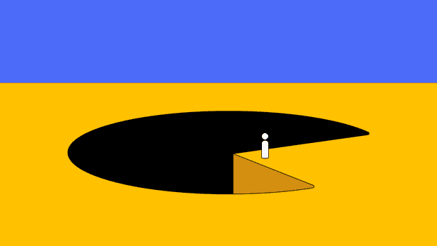
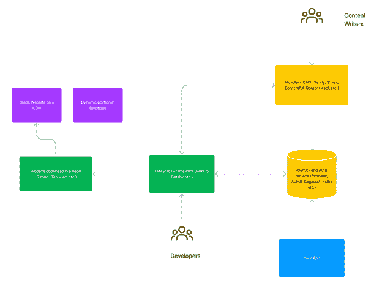
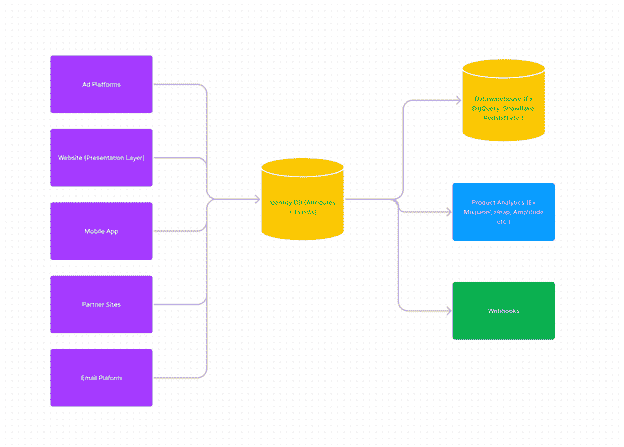
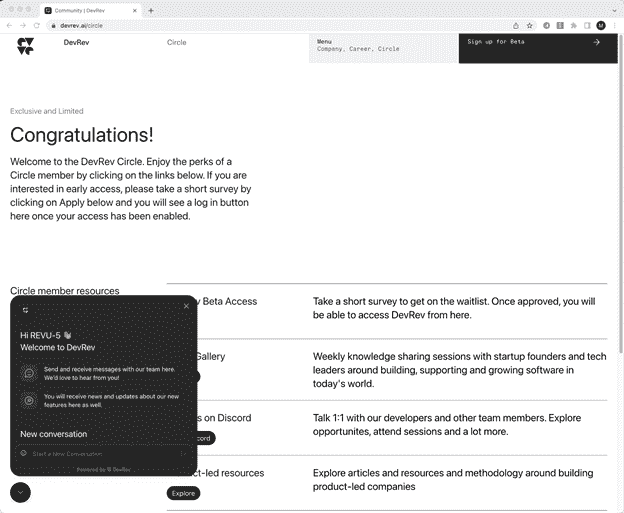

# 如何为你的创业公司建立一个 PLG 科技栈？

> 原文：<https://javascript.plainenglish.io/how-to-build-a-plg-tech-stack-for-your-startup-ca1424972176?source=collection_archive---------20----------------------->

在以产品为导向的增长世界(PLG)中，优雅的产品设计推动了客户的采用，公司的网站通常是产品体验的入口，也可以说是最关键的点。从很多方面来说，这就是为什么以产品为导向的公司网站慢慢开始与产品体验融合的原因。

让我解释一下。

假设一个用户访问你的网站并注册了一个在线活动。此时，他们会提供一些关于他们自己的信息，甚至可能会设置他们的个人资料来查看活动前和活动后的详细信息。活动结束后，他们决定报名参加产品试用。在产品试用注册过程中，你会再次询问细节吗？或者你会通过电子邮件认出同一个用户，然后以最小的摩擦将他们无缝地引入到你的产品体验中吗？此外，入职体验是根据用户在访问你的网站时已经提供的信息和他们的意图信号为用户定制的吗？

一个合适的 PLG 堆栈应该能够让公司建立一个无缝的用户之旅，从访问网站到试用产品，最后使用产品。

我们一直在为我们的[初创公司](https://devrev.ai/blog/you-have-jira-you-like-slack-you-ll-love-dev-rev)构建这个，在本文中，我将介绍 PLG 堆栈的一些关键特性和一些最佳实践。

根据我的经验，**高效的 PLG 技术体系有三个主要要求**:

1.能够在所有公司网站上实现单一注册和登录体验。

2.能够跨多个渠道(网站、应用程序等)捕获用户行为的所有细节。).

3.根据这些信息定制用户体验的能力。

锦上添花的是，如果用户有问题，您的公司应该能够与他们实时互动，并且您的公司应该及时有效地响应他们的请求和意图信号。

让我们来看看这些需求，看看架构和一些选择。

**1。表示层——网站**

在我过去的经历中，我见过许多网站依赖于代码和内容紧密耦合的架构。当你的网站有更多的页面和额外的语言，并最终开始有迷你应用程序，例如，社区门户，活动门户等时，这种架构就成问题了。所以我们决定使用一个 JAM stack 架构来与一个无头 CMS 对话。这允许我们将代码和内容分开。开发人员使用他们选择的 IDE，可以直接对代码库进行代码更改，通过我们的 CI/CD 管道，我们可以根据需要随时发布代码。另一方面，内容编写者直接在所见即所得的无头内容管理系统中工作，该系统在我们的 CI/CD 管道中触发网站构建，因此代码或内容中的任何更改都可以部署到我们的开发、试运行，并最终部署到我们的生产站点，而不会出现任何停机。

**2。数据层—用户身份和授权**

早期，我们认为这将是公司网站用户和注册并使用我们产品的用户之间的粘合剂。从用户身份的角度来看，我们决定需要一种方法来管理这两种用户属性(例如，姓名、电子邮件、成员类型等。)和用户行为(他们是否阅读了博客，是否参加了活动，是否注册了试用等。).

从几个方面来说，可以把它想象成一个用户对象，它有一个与用户相关的事件的时序数据库。

有多种方法可以构建用户身份和事件数据库，但我们还希望获得注册和登录的无缝认证体验，这使我们能够灵活地在网站上的多个“应用”之间进行单点登录。因此，我们最终构建了自己的身份认证解决方案和现成的身份认证解决方案，该解决方案目前允许我们在一个位置管理用户身份，并能够通过工作流查看和响应用户事件。

下图给出了这种数据架构的高级概述和一些现成的选择。

**3。编排层**

最后，我们需要一个高效的工作流系统，允许我们通过电子邮件、短信等多种渠道与用户进行交互。最初，我们通过一个开源的 Lambda 函数式平台来实现这一点，该平台允许我们侦听 webhook 事件，并通过 API 触发操作，如通过 Sendgrid 发送电子邮件。最近，我们已经开始为我们的客户和我们自己建立工作流程，它更加灵活，适应性更强。

为了与我们的用户进行实时交流，我们使用我们的产品功能之一， [PLuG](https://devrev.ai) 。该插件直接在我们登录的社区体验中启用。这使我们能够与客户实时互动。然后，每一次对话都连接到我们的用户身份数据库，另一边是我们的产品特性和功能。这意味着当出现问题时，我们的员工可以及时帮助我们的用户。

## **总结**

PLG 整合了用户访问公司网站、浏览内容、注册试用以及最终推动用户增长和采用的体验。在这个世界中，技术堆栈应该是解耦的，并且高效地对用户做出反应，以最少的摩擦定制他们的体验。构建该架构的技术有多种选择，但关键的选择包括围绕用户身份和认证、表示以及编排层的设计。

【PlainEnglish.io/blog】本帖原载于**。**

**更多内容看* [***说白了就是***](https://plainenglish.io/) *。报名参加我们的* [***免费周报***](http://newsletter.plainenglish.io/) *。关注我们* [***推特***](https://twitter.com/inPlainEngHQ) *和*[***LinkedIn***](https://www.linkedin.com/company/inplainenglish/)*。查看我们的* [***社区不和谐***](https://discord.gg/GtDtUAvyhW) *加入我们的* [***人才集体***](https://inplainenglish.pallet.com/talent/welcome) *。**