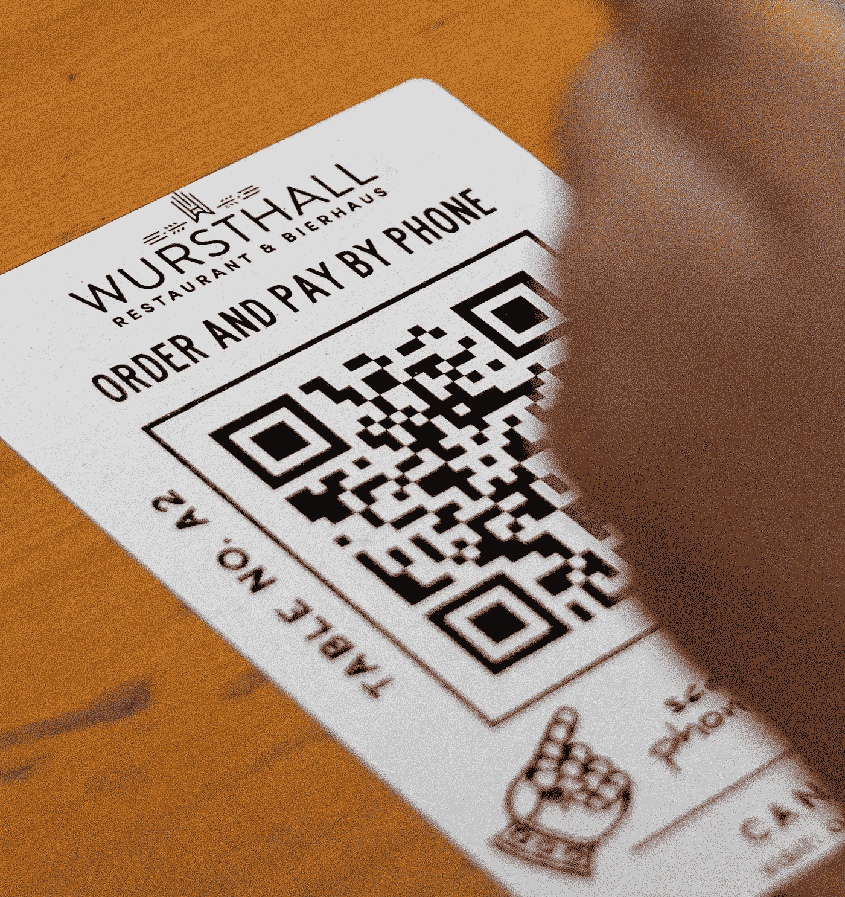
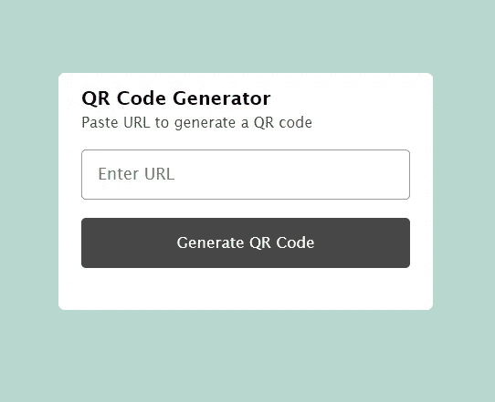
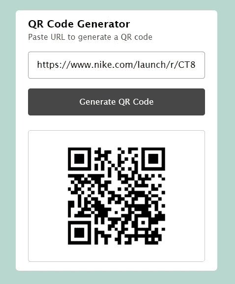

# 如何使用 JavaScript 构建二维码生成器

> 原文：<https://javascript.plainenglish.io/how-to-build-a-qr-code-generator-using-javascript-53bbee9bb10e?source=collection_archive---------6----------------------->

## 使用 JavaScript 和代码构建 QR 码生成器的教程。

快速获取信息是适应这个快速发展的世界的方法之一。二维码现在很受欢迎，因为它能以更少的摩擦快速获取信息。术语“QR”代表“快速响应”，指的是快速访问由黑白图案组成的编码信息。二维码不仅仅用于获取信息。许多企业使用二维码进行无现金支付、交易和轻松登录。本文面向熟悉 HTML5、CSS3 和 JavaScript 基础知识的人。本文不包括对 HTML5 和 CSS3 的详细阐述，但是会提供源代码。

## 下面是一个使用 QR code API 生成 QR 码的简单方法

**让我们开始**
首先，我们需要使用 HTML5 和 CSS3 创建 UI。

**HTML 的示例代码**

Html sample code

**CSS 的示例代码**

**这是 HTML 和 CSS 之后的样子**

**现在是 JavaScript**

使用二维码 API。您可以使用 API 生成和解码/读取 QR 码。你所要做的就是调用网址[https://api.qrserver.com/v1/create-qr-code/?size=150x150&data = C](https://api.qrserver.com/v1/create-qr-code/?size=150x150&data=Example)hairman 获得一个内容为“主席”的二维码。您可以将网址中的“主席”替换为新的二维码。你可以在这里找到更多关于 API [的信息](https://goqr.me/api/)。

**JavaScript 的示例代码**

**最后，**这是添加 JavaScript 后的样子:

QR code for a Nike product

现在我们可以走了。恭喜你，你成功了。你造了一个二维码生成器。

*更多内容请看*[***plain English . io***](https://plainenglish.io/)*。报名参加我们的* [***免费周报***](http://newsletter.plainenglish.io/) *。关注我们关于*[***Twitter***](https://twitter.com/inPlainEngHQ)[***LinkedIn***](https://www.linkedin.com/company/inplainenglish/)*[***YouTube***](https://www.youtube.com/channel/UCtipWUghju290NWcn8jhyAw)*[***不和***](https://discord.gg/GtDtUAvyhW) *。***