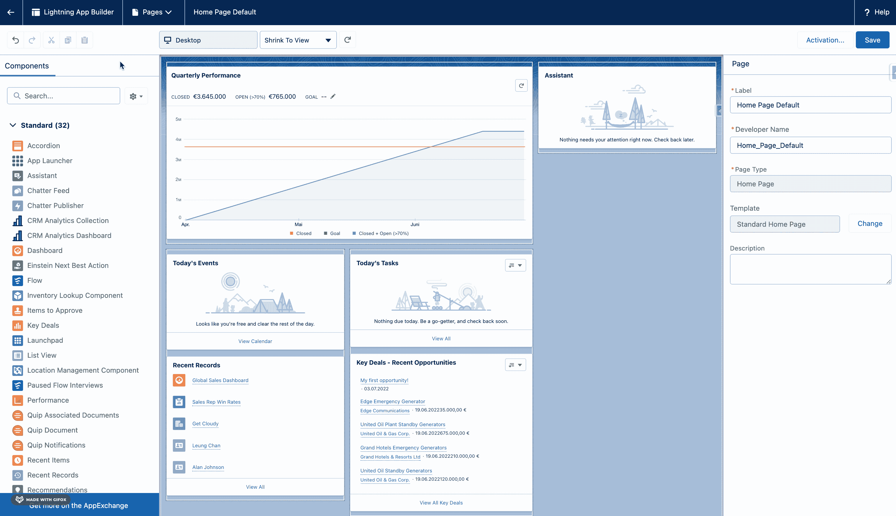
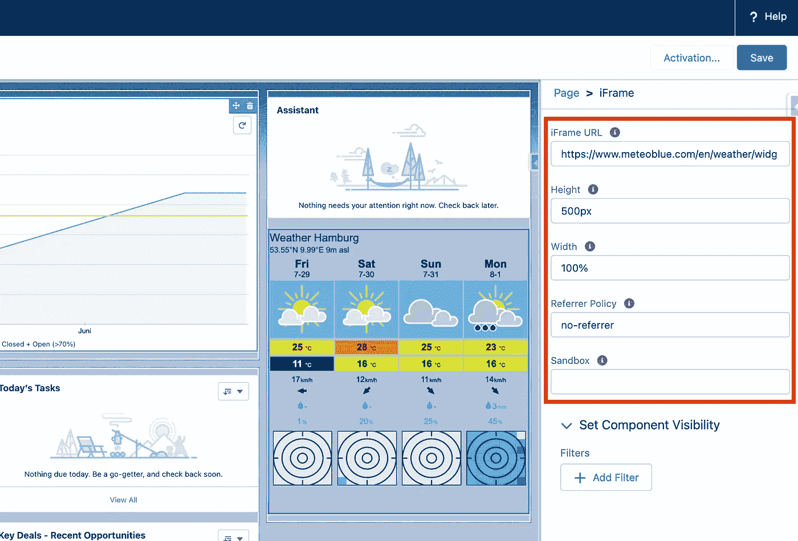
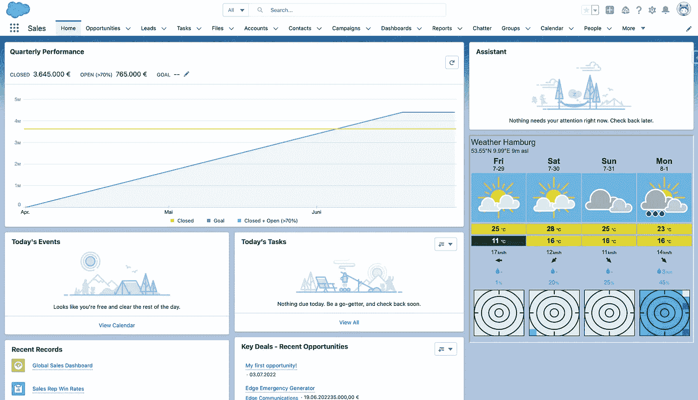

# 如何用 Lightning Web 组件构建可重用的 iFrame

> 原文：<https://javascript.plainenglish.io/how-to-build-a-reusable-iframe-with-lightning-web-components-76a2ad27286?source=collection_archive---------0----------------------->

## 在 Salesforce 平台中显示外部网站的简单方法。

Photo by [pine watt](https://unsplash.com/@pinewatt?utm_source=medium&utm_medium=referral) on [Unsplash](https://unsplash.com?utm_source=medium&utm_medium=referral)

有时，Salesforce 项目的开发人员会面临将其他网站的内容或功能集成到平台中的需求，以使用户更容易访问它们。

在这些场景中，使用 iFrame 通常是集成外部视频或 PDF 文件以及网站小部件的快速简单的解决方案，例如，显示股票交易信息或当前天气预报。

在 Salesforce 中，我们可以使用 Lightning Web 组件来构建 iFrame 组件，然后我们可以在平台的不同位置使用该组件。所以让我们看看这是如何工作的！

# 建造 iFrame LWC 酒店

首先，我们需要将 iFrame 元素及其可配置属性添加到 LWC 的 HTML 模板中。

在组件的 JS 文件中，我们还需要选取这些属性，并通过 *@api* 注释将它们暴露给外部。这是必要的，这样我们以后就可以从外部随意配置 iFrame 的属性，而不必再次修改组件代码中的任何内容。

# 使 iFrame 可配置

为了使 iFrame LWC 可重用和更加动态，必须公开其属性，以便可以在 Lightning 应用程序构建器中轻松配置它们。

为此，我们可以将已经通过 JS 文件中的 *@api* 注释公开的属性添加到 LWC 的 XML 文件中，如下所示:

此外，还添加了各种目标，以便以后可以在不同类型的页面和流中使用该组件。

# iFrame LWC 的示例性使用

现在我们的组件已经准备好了，我们可以在任何页面上使用它。例如，让我们将组件添加到我们组织的主页。然而，在我们这样做之前，我们应该将我们想要加载内容的网站的域名添加到我们的 [Salesforce org 的可信站点](https://help.salesforce.com/s/articleView?id=sf.csp_trusted_sites.htm&type=5)。

Add iFrame LWC to Home Page using Lightning App Builder

在我们使用 App Builder 将组件拖动到主页上的所需位置后，我们仍然需要配置之前定义的属性。对于我们的例子，我们想要显示德国汉堡的当前天气预报，我居住的城市。为此，我们使用[meteoblue.com](https://www.meteoblue.com/)来配置一个适当的天气小部件，然后将它的 URL 复制到组件的适当 iFrame URL 属性中。

Configured LWC Properties in Lightning App Builder

瞧，在我们保存页面后，现在所有用户都可以在他们的主页上看到我们的组件。

Home Page with embedded Weather Forecast iFrame

# 结论

我们已经看到了如何通过 LWC 使用 iFrames 快速将外部内容集成到 Salesforce 平台中。只要不需要在 Salesforce 和 iFrame 之间交换数据，这对于这种情况可能是一个很好的解决方案。

此外，应该考虑到不是所有的网站都允许通过 iFrame 嵌入。在某些情况下，甚至有必要从 LWC 代码中删除[沙箱属性](https://developer.mozilla.org/en-US/docs/Web/HTML/Element/iframe#attr-sandbox)以包含某些网站，因为这将对 iFrame 的允许内容施加额外的限制。当然，这应该只在例外情况下使用，因为一般来说，在使用 iFrames 时，安全性应该总是最重要的。

GitHub 上提供了完整的源代码，包括 JEST 单元测试和 JSDoc 注释:

 [## awesome-LWC-collection/force-app/main/default/LWC/iFrame at main svierk/awesome-LWC-collection

### ⚡️收集了一些现成的 Lightning Web 组件，可能会对您的 SFDX 项目有所帮助…

github.com](https://github.com/svierk/awesome-lwc-collection/tree/main/force-app/main/default/lwc/iFrame) 

*更多内容看* [***说白了。报名参加我们的***](https://plainenglish.io/) **[***免费周报***](http://newsletter.plainenglish.io/) *。关注我们关于*[***Twitter***](https://twitter.com/inPlainEngHQ)*和*[***LinkedIn***](https://www.linkedin.com/company/inplainenglish/)*。查看我们的* [***社区不和谐***](https://discord.gg/GtDtUAvyhW) *，加入我们的* [***人才集体***](https://inplainenglish.pallet.com/talent/welcome) *。***