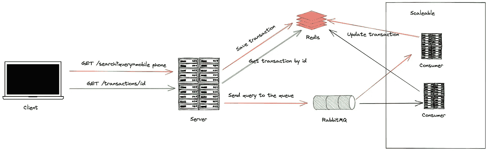

# 如何用木偶师搭建一个可扩展的 Scrawler 服务？

> 原文：<https://javascript.plainenglish.io/how-to-build-a-scalable-scrawler-service-with-puppeteer-8e08905ed7e3?source=collection_archive---------3----------------------->

## 第 2 部分:使它变得可伸缩



Scalable system

这个故事是“[如何用木偶师构建一个可扩展的涂鸦服务”的第 2 部分？](/how-to-build-a-scaleable-scrawler-service-with-puppeteer-80f928f43950)”。在第 1 部分中，我们已经有了一个简单的爬虫系统。在该系统中，所有查询请求都由一台服务器处理。如果查询的数量太多，服务器可能会崩溃，并且不会有更多的请求被处理。

在这个故事中，我们将尝试解决这个问题。通过使爬虫进程变得异步来处理成千上万的请求。

# 安装 RabbitMQ 和 Redis 服务

更新`docker-compose.yml`以定义 RabbitMQ 和 Redis 容器:

我们在系统中添加了`rabbitmq`和`redis`服务。这些服务使用最新的官方形象。

现在`api`服务将使用`node:latest`图像代替 docker 自定义图像。因为`api`服务不会使用 chrome 应用。它将连接到`rabbitmq`和`redis`，然后我们必须更新`environtment`块和`depent_on`块。

`consumer`是一个新服务，这个服务将处理爬虫进程。

`.env`的例子:

```
API_PORT=3000RABBITMQ_ADMIN_WEB_PORT=15672
RABBITMQ_HOST=rabbitmq
RABBITMQ_PORT=5672
RABBITMQ_USERNAME=rabbitmq
RABBITMQ_PASSWORD=r@bb1tmq
RABBITMQ_QUEUE=google_scraper_queueREDIS_URL=redis://redis:6379
```

# RabbitMQ 和 Redis 与 Typescript

我们创建 until 文件来与 RabbitMQ 和 Redis 一起工作:

`src/utils/environments.ts`

```
const apiPort = Number(process.env.API_PORT || 3000);const rabbitMQHostname = process.env.RABBITMQ_HOST;
const rabbitMQPort = Number(process.env.RABBITMQ_PORT || 5672);
const rabbitMQUsername = process.env.RABBITMQ_USERNAME;
const rabbitMQPassword = process.env.RABBITMQ_PASSWORD;
const rabbitMQScraperQueue = process.env.RABBITMQ_QUEUE || 'google_scraper_queue';const redisUrl = process.env.REDIS_URL || 'redis://redis:6379';export default {
  apiPort,
  rabbitMQHostname,
  rabbitMQPort,
  rabbitMQUsername,
  rabbitMQPassword,
  rabbitMQScraperQueue,
  redisUrl,
};
```

`src/utils/interfaces.ts`

## RabbitMQ 客户端

`src/utils/scraper-queue.ts`

`sendQueryToQueue`函数只是向队列发送一条消息。

`consume`函数将回调函数作为参数。当队列有新消息时，回调函数将随消息一起被调用。消费者逻辑将调用这个函数来注册回调函数。

`src/utils/rabbitmq.ts`

我们必须安装`amqplib`包及其类型:

```
$ npm install amqplib
$ npm install @types/amqplib -D
```

这个文件导出`getChannel`函数，它返回一个 rabbitmq 通道实例。通道实例将被缓存在内存中，我们可以通过队列名获得相同的实例。`prefetch(1)`设置确保消费者只处理一条消息，直到该过程完成。

## Redis 客户端

`src/utils/scraper-transaction.ts`

导出的函数:

*   `addTransaction`创建一个状态为`ON_QUEUE`的新交易项目。物品的过期时间是 15 分钟。
*   `updateTransactionToProcessing`将交易状态更改为`PROCESSING`。
*   `updateTransactionToDone`将交易状态改为`DONE`，并将查询结果保存到该交易中。
*   `getTransactionResult`按交易 id 返回交易。

交易生命周期:`ON_QUEUE`->-`PROCESSING`->-`DONE`

`src/utils/redis.ts`

```
import { createClient, RedisClientType } from 'redis';
import environments from './environments';let client: RedisClientType;export default async function getRedisClient():       Promise<RedisClientType> {
  if (!client) {
    client = createClient({ url: environments.redisUrl });
    await client.connect();
  } return client;
}
```

`getRedisClient`返回一个 Redis 客户端实例。

# RabbitMQ 生产者和新的 api 端点

我们必须更新`GET /search?query=` api 并添加一个新的 api — `GET /transactions/:id`。`src/index.ts`会是这样的:

`GET /search` handler 只向队列发送一个查询项，并向 Redis 添加一个新事务。这个 api 将立即响应，而不是等待爬虫程序的结果。

新的 api 处理程序— `GET /transactions/:id`只需通过 id 获取事务的当前状态。此 api 的响应可能包括查询结果(如果爬虫进程完成)。客户端将多次调用这个 api，直到它返回查询结果。

# RabbitMQ 消费者

消费者进程将监听队列。

`src/consumer.ts`

它从队列中获取一条消息，将事务状态更改为`PROCESSING`，通过查询字符串查询链接，然后用查询结果将状态更新为`DONE`。

我们必须像独立流程一样启动消费者流程，然后让我们向`package.json`添加一个新的 npm 脚本

```
"dev:consumer": "nodemon ./dist/consumer.js",
```

我们在`docker-compose.yml`文件中使用这个脚本。

现在，让我们开始我们的系统

```
$ docker-compose up
```

并等到所有服务都已启动

```
$ docker-compose ps
# all service are running
```

调用查询 API:

```
$ curl --request GET \
  --url '[http://localhost:3000/search?query=Oauth%20nodejs16'](http://localhost:3000/search?query=Oauth%20nodejs16')
# {"transactionId":1648304965114,"message":"The query is already in the queue"}
```

检查交易状态:

```
$ curl --request GET \
  --url [http://localhost:3000/transactions/](http://localhost:3000/transactions/1648304901954)1648304965114
# {"status": "ON_QUEUE"}$ curl --request GET \
  --url [http://localhost:3000/transactions/](http://localhost:3000/transactions/1648304901954)1648304965114
# {"status": "PROCESSING"}$ curl --request GET \
  --url [http://localhost:3000/transactions/1648304965114](http://localhost:3000/transactions/1648304965114)
# {"status": "DONE", "data": {"links": [...]}}
```

# 结论

现在，服务器资源足以处理大量查询。但是，在这种情况下，我们将花费更多的时间来获得最后一个查询的结果。因为我们只有一个消费者(`docker-compose.yml`中的`scale`设置)，所以会逐个处理查询。直到消费者服务器资源，我们可以增加消费者的数量来同时处理多个查询。

crawler 系统是一个简单的系统，它实现了异步处理，使其具有可伸缩性。希望这个故事能帮助您更好地构建您的应用程序。

本文使用的源代码发表在 [Github](https://github.com/hoangsetup/scraper-service) 上。

感谢阅读！

*更多内容看* [***说白了。报名参加我们的***](https://plainenglish.io/) **[***免费周报***](http://newsletter.plainenglish.io/) *。关注我们关于*[***Twitter***](https://twitter.com/inPlainEngHQ)*和*[***LinkedIn***](https://www.linkedin.com/company/inplainenglish/)*。加入我们的* [***社区***](https://discord.gg/GtDtUAvyhW) *。***