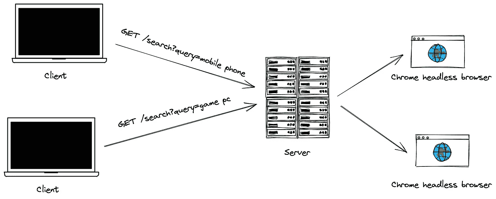

# 如何用木偶师搭建一个可扩展的 Scrawler 服务？

> 原文：<https://javascript.plainenglish.io/how-to-build-a-scaleable-scrawler-service-with-puppeteer-80f928f43950?source=collection_archive---------5----------------------->

## 第 1 部分:用 docker 开发打字稿



A simple crawler service

今天我要讲一个故事——如何用木偶师建立一个可扩展的涂鸦服务？该服务只有一个公共 API，该 API 提供一个查询字符串，然后返回一个 Google 搜索结果链接列表。

在第 1 部分中，我们只是构建了一个简单的服务来完成基本需求。我们将使用 Node.js 作为运行时环境，使用 Puppeteer chrome headless 浏览器和 TypeScript。我们还使用 Docker 和 Docker compose 来建立本地开发环境。

# 用 docker-compose 开发一个打字稿项目

让我们用 Express 和 TypeScript 实现一个简单的 HTTP 服务。

作为一个普通的 Node.js 项目，我们将从 npm 的初始命令开始:

```
$ npm init
```

然后，安装 TypeScript 作为开发依赖和其他依赖:

```
$ npm install typescript nodemon @types/express -D
$ npm install express -S
```

生成`tsconfig.json`文件:

```
$ npx tsc --init
```

并更新`tsconfig.json`更改一些设置:

```
...
"target": es2018,
"rootDir": "./src",
"outDir": "./dist"
...
```

TS 文件将放在`src`文件夹中，编译后的文件放在`dist`文件夹中。

在`src`我们创建`index.ts`文件，这个文件是项目的切入点。让我们实现一个简单的 express 服务器:

```
# index.ts
import express from 'express';
import environments from './utils/environments';const app = express();app.get('/', (req, res) => {
  res.json({ message: 'Hello World!' });
});app.listen(environments.apiPort, () => {
  console.log(`Server is running on: ${environments.apiPort}`);
});
```

带`utils/environment.ts`:

```
const apiPort = Number(process.env.API_PORT || 3000);export default {
  apiPort,
};
```

我们可以通过`API_PORT`环境变量来控制服务器 HTTP 端口。

现在，我们将验证我们的设置和新服务器。首先，我们将类型脚本代码转换为 JavaScript 代码:

```
$ npx tsc
```

终端中不应打印任何输出，并且将创建`dist`文件夹。

启动服务器:

```
$ node dist/index.js
> Server is running on: 3000
```

当我们访问`http://localhost:3000`时，会显示一条消息:

```
{
    message: "Hello World!"
}
```

当我们更新一个 ts 文件时，我们必须重复这些步骤，以确保服务器运行的是最新的逻辑。让我们通过使用`nodemon`的 watch 特性和 Typescript 编译器来试着让它变得简单一些。

创建`nodemon.json`来配置 nodemon 进程:只需监听`dist`目录，只需观察 js 文件的变化。

```
{
    "watch": ["dist/"]",
    "ext": "js",
    "delay": 500
}
```

现在，在`package.json`文件中创建 2 个 npm 脚本:

```
...
"scripts": {
    "dev": "nodemon ./dist/index.js",
    "build:watch": "rm -rf dist && tsc --watch",
  },
...
```

我们仍然需要 2 个终端窗口，1 个窗口 transpile ts 到 JavaScript。

```
$ npm run build:watch
```

1 窗口监视`dist`目录的变化并重启服务器:

```
$ npm run dev
```

现在，当我们保存一个 ts 文件时，服务器将自动重启。

## Dockerzile 开发环境

直到现在，我们都不需要自定义 docker 映像，只需要使用节点映像。

```
# docker-compose.yml
version: '3.9'
services:
  api:
    build: node:latest
    working_dir: /api
    volumes:
      - .:/api
    command: npm run dev
    ports:
      - '${API_PORT}:${API_PORT}'
    depends_on:
      compile:
        condition: service_healthy
    environment:
      - API_PORT=${API_PORT}
  compile:
    image: node:latest
    working_dir: /source
    volumes:
      - .:/source
    command: npm run build:watch
    healthcheck:
      test: bash -c "[ -f dist/index.js ]"
      interval: 10s
      timeout: 5s
      retries: 5
```

我们将所有项目文件挂载到容器中。`compile`服务处理`npm run build:watch`命令。而`api`服务处理`npm run dev`命令。只有当`dist/index.js`文件存在时`api`服务才会启动(这意味着`compile`服务运行成功。

现在，我们只需要一个终端窗口:

```
$ docker-compose up
```

# 爬虫谷歌搜索结果与木偶师

木偶师需要一个 chrome 浏览器实例，然后我们将在`api` docker 容器上安装 Chrome。为此，我们需要一个定制的 docker 图像。

```
# Dockerfile
FROM node:latest# Install dependencies
RUN apt-get update -qq \
  && apt-get install -qq --no-install-recommends \
    ca-certificates \
    apt-transport-https \
  && apt-get upgrade -qq# Install chrome
RUN wget -q -O - [https://dl-ssl.google.com/linux/linux_signing_key.pub](https://dl-ssl.google.com/linux/linux_signing_key.pub) | apt-key add - \
  && echo "deb [https://dl.google.com/linux/chrome/deb/](https://dl.google.com/linux/chrome/deb/) stable main" >> /etc/apt/sources.list.d/google-chrome.list \
  && apt-get update -qq \
  && apt-get install -qq --no-install-recommends \
    google-chrome-stable \
  && apt-get clean \
  && rm -rf /var/lib/apt/lists/*
```

基于`node`镜像创建新镜像，安装 Chrome 稳定版。chrome 二进制文件路径是`/usr/bin/google-chrome`，我们需要这个信息来配置木偶师。

更新`docker-compose.yml`以更改`api`服务图像设置:

```
services:
  api:
    build: . # instead of image: node:latest
```

现在我们可以实现搜索 API: `GET /search?query=`。

安装`puppeteer-core`包，核心包不会安装 chrome。我们已经在 docker 文件中自己安装了 Chrome。

```
$ npm install puppeeter-core -S
```

在`index.ts`文件中，为 express 服务器注册一个新的请求句柄:

```
...
import { ISearchResult } from './utils/interfaces';
import { getLinksByQuery } from './utils/scraper';
...app.get('/search', async (req, res) => {
  try {
    const now = Date.now(); const { query = '' } = req.query as { query: string };
    if (!query) {
      return res.json({
        query,
        took: (Date.now() - now) / 1000,
        links: [],
      } as ISearchResult);
    } const links = await getLinksByQuery(query); return res.json({
      query,
      took: (Date.now() - now) / 1000,
      links,
    } as ISearchResult);
  } catch (error) {
    console.error(error);
    return res.status(500).json({ message: (error as Error).message    });
  }
});
```

我们从查询对象中获取一个`query`字符串，如果查询是空的，我们用一个空列表来响应。否则，尝试通过`getLinksByQuery`函数获取结果链接并返回给客户端。

接口定义`./utils/interfaces`:

```
export interface ILink {
  title: string;
  link: string;
}export interface ISearchResult {
  query: string;
  took: number;
  links: ILink[];
}
```

`getLinksByQuery`功能来自`./utils/scraper`:

```
import withPage from './browser';
import { ILink } from './interfaces';export function getLinksByQuery(query: string): Promise<ILink[]> {
  return withPage(async (page) => {
    await page.goto('[https://www.google.com/'](https://www.google.com/'), {
      timeout: 0,
      waitUntil: 'networkidle2',
    });
    await page.type('input', query);
    await page.keyboard.press('Enter');
    await page.waitForSelector('div.yuRUbf > a'); return page.evaluate(() => {
      const data: ILink[] = [];
      document.querySelectorAll('div.yuRUbf > a').forEach((ele) => {
        data.push({
          title: ele.querySelector('h3')?.textContent as string,
          link: (ele as HTMLAnchorElement).href,
        });
      }); return data;
    });
  });
}
```

这个函数调用`withPage` helper 来获得一个新的 chrome 页面实例，然后通过 Google 搜索查询。它在第一个搜索结果页面上返回所有结果链接。

最后，`./utils/browser.ts`中的`withPage`辅助函数:

```
import puppeteer, { Page } from 'puppeteer-core';export default async function withPage<T>(func: (page: Page) => Promise<T>): Promise<T> {
  const browser = await puppeteer.launch({
    executablePath: '/usr/bin/google-chrome',
    headless: true,
    args: [
      '--no-sandbox',
      '--disable-background-networking',
      '--disable-default-apps',
      '--disable-extensions',
      '--disable-sync',
      '--disable-translate',
      '--headless',
      '--hide-scrollbars',
      '--metrics-recording-only',
      '--mute-audio',
      '--no-first-run',
      '--safebrowsing-disable-auto-update',
      '--ignore-certificate-errors',
      '--ignore-ssl-errors',
      '--ignore-certificate-errors-spki-list',
      '--user-data-dir=/tmp',
    ],
  }); const page = await browser.newPage(); try {
    return await func(page);
  } finally {
    await page.close();
    await browser.close();
  }
}
```

`withPage`是一个通用函数，它接受一个参数——一个“动作”函数。我们通过 puppeteer 创建一个新的无头浏览器，并通过这个浏览器实例创建一个新的页面实例。将页面实例传递给“action”函数，返回 action 函数的结果。最后，关闭页面和浏览器即可。

`await` ***关键字在调用动作函数时非常重要，它确保页面和浏览器只有在动作函数完成时才关闭。***

现在，我们可以通过浏览器或任何 HTTP 客户端来尝试新的 API:

```
$ curl '[http://localhost:3000/search?query=typescript%202022'](http://localhost:3000/search?query=typescript%202022')
```

它将返回如下内容:

```
{
  "query": "typescript 2022",
  "took": 4.052,
  "links": [
    {
      "title": "100 万行の大規模なJavaScript 製システムをTypeScriptに移行 ...",
      "link": "[https://developers.cyberagent.co.jp/blog/archives/34364/](https://developers.cyberagent.co.jp/blog/archives/34364/)"
    },
    ...
  ]
}
```

01 部分到此为止！

# 结论

我希望你喜欢这篇文章，并从中获得一些有用的东西。这是我最喜欢的开始 Node.js + TypeScript 项目的方式。
本文使用的源代码发表在 [Github](https://github.com/hoangsetup/scraper-service/tree/368ae525a4027364bf56611ac0b45615e46afeba) 上。
感谢阅读！

*更多内容看* [***说白了就是***](https://plainenglish.io/) *。报名参加我们的* [***免费周报***](http://newsletter.plainenglish.io/) *。关注我们关于*[***Twitter***](https://twitter.com/inPlainEngHQ)*和*[***LinkedIn***](https://www.linkedin.com/company/inplainenglish/)*。加入我们的* [***社区***](https://discord.gg/GtDtUAvyhW) *。*