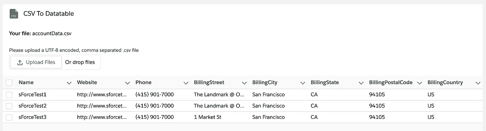

# 如何用 Lightning Web 组件构建简单的 CSV 解析器

> 原文：<https://javascript.plainenglish.io/how-to-build-a-simple-csv-parser-with-lightning-web-components-464a110a1cd2?source=collection_archive---------2----------------------->

## 创建 LWC 以在 Salesforce 中上传 CSV 文件，并在 Lightning 数据表中显示其内容

Original from [Pixabay](https://pixabay.com/images/id-1568698/) under [Pixabay License](https://pixabay.com/service/license/)

在 Salesforce 项目中，您经常会遇到允许上传 Excel 列表或 CSV 文件并基于其内容创建数据记录的要求。

在这些情况下，通常会考虑使用第三方库。然而，在 Salesforce 中，外部库的使用相对麻烦，因为它们只能作为[静态资源](https://developer.salesforce.com/docs/component-library/documentation/en/lwc/lwc.create_resources)使用，也不提供任何合理的版本控制。

然而，根据需求的复杂程度，也可以用普通的 JavaScript 轻松地编写一个 CSV 解析器。所以这正是我们在这篇文章中想要做的，只是建立我们自己的 CSV 解析器 LWC。

# 上传 CSV 文件

我们将从最重要的开始，提供文件上传以使我们的 CSV 文件可用于解析其内容。幸运的是，Salesforce 提供了一个标准组件，我们可以在我们的 LWC - [闪电输入](https://developer.salesforce.com/docs/component-library/bundle/lightning-input/example)中使用该组件。因此，让我们在 LWC 的 HTML 模板中添加一个“file”类型的输入字段来处理传入的文件上传。我们将上传配置为仅接受 CSV 文件。

在 LWC 的 JS 部分，我们将使用来自[文件 API](https://developer.mozilla.org/en-US/docs/Web/API/File_API) 的 [FileReader](https://developer.mozilla.org/en-US/docs/Web/API/FileReader) 对象来读取 CSV 上传，并使它们可用于进一步处理，如下所示:

文件上传通常也支持多个文件的上传。然而，在我们的用例中，我们只想允许上传单个文件并读取其内容。因此，我们在代码中使用 *files[0]* ，只考虑列表中的第一个文件。

# 构建 CSV 解析器

现在我们已经实现了 CSV 文件的一般上传和读取，我们可以开始构建解析器了。

必要的解析方法基本上只是检查 CSV 文件的内容，并将其转换为一种数据结构，以便我们在以后的代码中更容易处理。因为我们还想在以后向用户显示我们的数据，所以我们已经将它转换成一种支持简单的表格显示的格式。以下代码包含描述最重要步骤的注释:

有了上面的代码，我们现在已经处理并准备好了我们的数据以进行进一步的操作。所以接下来我们应该考虑它们在用户界面中的表现。

# 在数据表中显示 CSV 内容

最后，我们希望向用户展示 CSV 处理的结果。为此，我们将使用另一个标准 LWC - [Lightning 数据表](https://developer.salesforce.com/docs/component-library/bundle/lightning-datatable/example)。在上一节中，我们已经准备好了 CSV 数据，以匹配 datatable 组件支持的格式。因此，唯一缺少的就是将 datatable 组件添加到我们的 HTML 模板中，并为*数据*和*列*属性分配适当的值。为了让我们的组件看起来格式更好，我们还额外添加了一个 [Lightning 卡](https://developer.salesforce.com/docs/component-library/bundle/lightning-card/example)作为包装器。

瞧，我们的表现在应该显示上传的 CSV 文件的格式良好的内容，如下所示:

Preview of the finished CSV Parser LWC showing uploaded file contents

原则上，我们现在可以在组织的任何地方使用我们的组件。我们的 LWC 的以下示例 XML 文件允许在应用程序、主页和记录页面上使用:

# 结论

我们创建了一个简单的 CSV 上传组件，允许我们读取上传文件的内容。我们还添加了一个 [Lightning 数据表](https://developer.salesforce.com/docs/component-library/bundle/lightning-datatable/example)来在 UI 中显示解析结果。

然而，这仅仅是一个起点，对于真实项目中的用例来说，这种状态是不够的。为了在这样的上下文中使用我们的组件，现在必须为数据的实际处理添加适当的业务逻辑。例如，通过添加 Apex 类来创建文件内容，作为 org 中特定类型对象的实际记录。

此外，我们的组件目前只支持 UTF-8 编码，逗号分隔的 CSV 文件。当然，不同的 CSV 文件之间的分隔符可能不同。为了在这里创造更多的灵活性，如果用户可以动态地设置分隔符，例如通过一个额外的输入字段，这也将是我们组件的一个有用的扩展。

GitHub 上提供了完整的源代码，包括 JEST 单元测试和 JSDoc 注释:

 [## awesome-LWC-collection/force-app/main/default/LWC/csvtodatable at main…

### ⚡️收集了一些现成的 Lightning Web 组件，可能会对您的 SFDX 项目有所帮助…

github.com](https://github.com/svierk/awesome-lwc-collection/tree/main/force-app/main/default/lwc/csvToDatatable) 

*更多内容请看*[***plain English . io***](https://plainenglish.io/)*。报名参加我们的* [***免费周报***](http://newsletter.plainenglish.io/) *。关注我们关于*[***Twitter***](https://twitter.com/inPlainEngHQ)[***LinkedIn***](https://www.linkedin.com/company/inplainenglish/)*[***YouTube***](https://www.youtube.com/channel/UCtipWUghju290NWcn8jhyAw)*[***不和***](https://discord.gg/GtDtUAvyhW) *。对增长黑客感兴趣？检查* [***电路***](https://circuit.ooo/) *。***