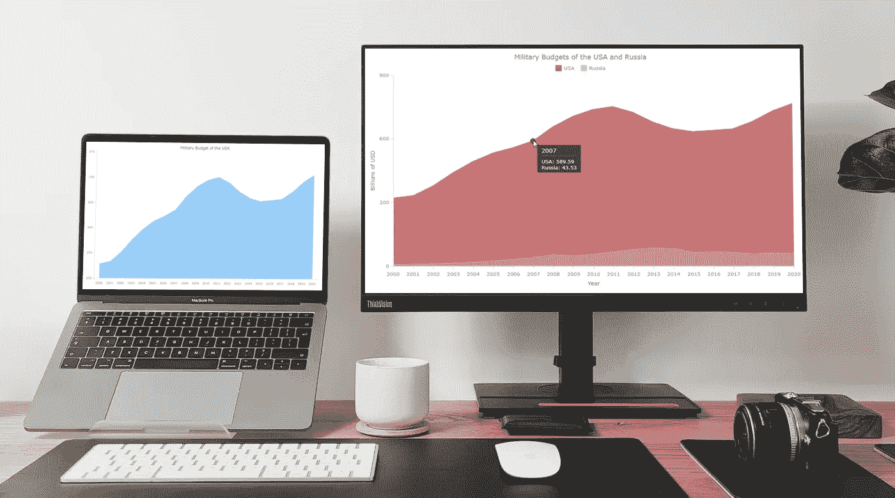
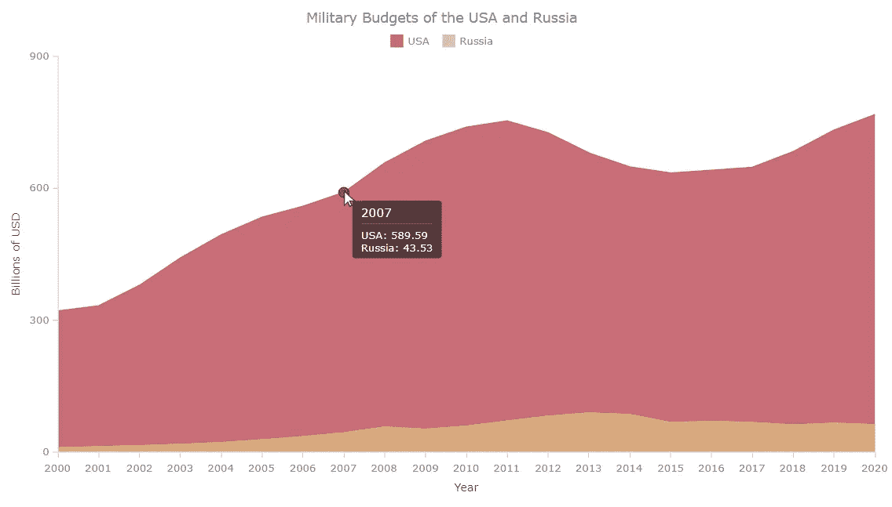
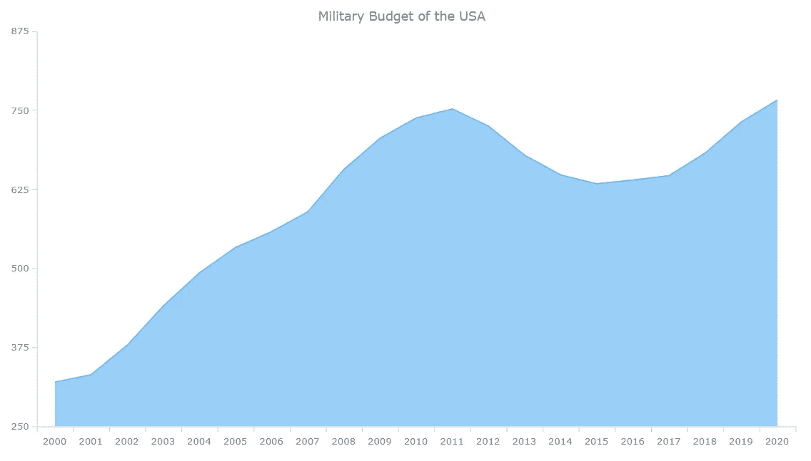
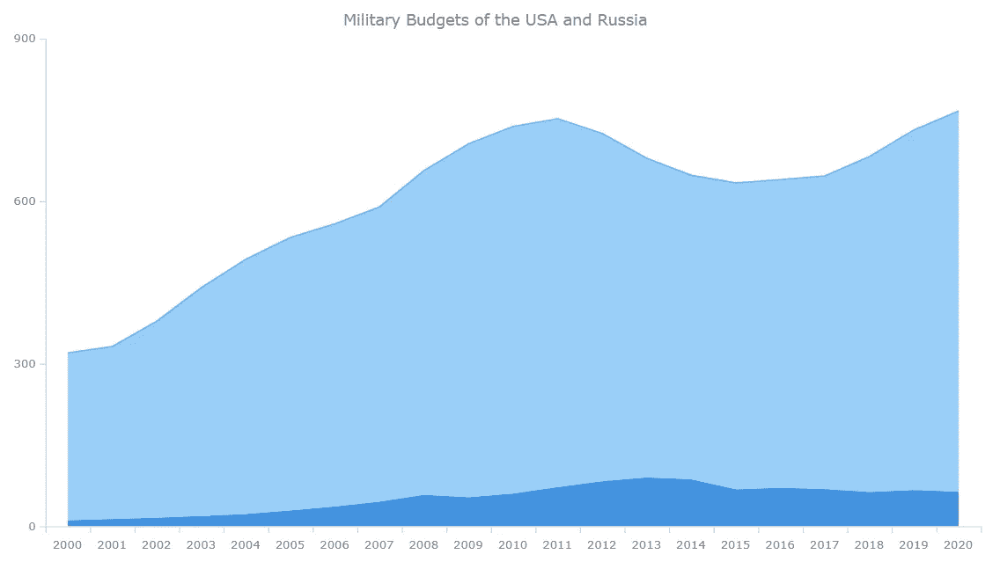
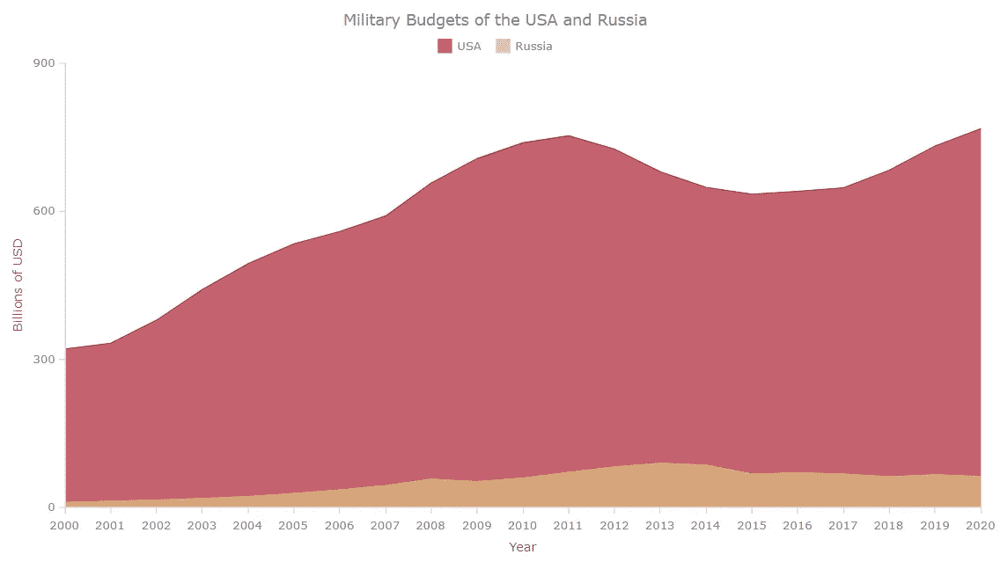

# 如何使用 JavaScript 构建面积图

> 原文：<https://javascript.plainenglish.io/how-to-build-an-area-charts-using-javascript-4f82938c0ea5?source=collection_archive---------15----------------------->



如果你对[数据可视化](https://www.anychart.com/blog/2018/11/20/data-visualization-definition-history-examples/)感兴趣，你可能经常需要做的事情之一就是表示一个变量的值随时间的变化。或者，您可能需要比较多个数据集在特定时期内的变化情况。这就是面积图有用的地方。

不确定如何构建优雅的面积图？现在你将掌握一个非常简单的方法！在这个循序渐进的教程中，我们将使用 JavaScript 在交互式区域图中可视化美国和俄罗斯过去二十年的军事预算数据。上船啦

# 什么是面积图？

面积图是数据的图形表示，显示一个或多个数据集的数值相对于第二个变量(通常是时间)的变化情况。

面积图类型是由[威廉·普莱费尔](https://en.wikipedia.org/wiki/William_Playfair)于 1786 年引入的，他也被认为是折线图、条形图和饼图的发明者。它由一条线条组成，底层区域用一种颜色填充。在多系列面积图中，可以想象，有几条线带有阴影面积。

# 将创建的面积图

在本教程中，首先，我们将绘制美国从 2000 年到 2020 年的军事预算。然后，我们将通过添加俄罗斯联邦的同类数据，将单系列 JS 面积图转换为多系列。

看看最终的基于 JavaScript 的面积图会是什么样子，它显示了两国在过去二十年中为国防目的花费了多少亿美元:



# 如何建立一个基本的 JS 面积图

从头开始构建交互式面积图可能会令人生畏且耗时。但是有很多有用的 [JavaScript 图表库](https://en.wikipedia.org/wiki/Comparison_of_JavaScript_charting_libraries)会很有帮助。实际上，无论您使用哪一个，创建任何基于 JS 的图表的整个过程，包括我们的面积图，都可以分为四个基本步骤:

1.  用 HTML 创建一个基本的网页。
2.  添加所需的 JavaScript 文件。
3.  加载数据。
4.  写一些 JavaScript 代码来画图表。

作为本教程中的一个示例，我选择了 [AnyChart](https://www.anychart.com/) 。这个 JavaScript 库看起来不难上手，因为有相当全面的[文档](https://docs.anychart.com/)和许多[示例](https://www.anychart.com/products/anychart/gallery/)，并且对于任何非商业用途都是免费的。

虽然这不是必需的，但是 HTML、CSS 和 JavaScript 的一些背景知识将有助于更快地理解这些概念。但是即使你是一个完全的初学者也不用担心。我们将详细介绍每个步骤，到本教程结束时，即使您是一个编码经验有限的新手，您也已经学会了构建 JS 面积图。

# 1.用 HTML 创建一个基本网页

我们需要做的第一件事是为面积图创建一个基本的 HTML 页面。我们将其命名为“JavaScript 面积图”

在这个页面上，我们添加了一个 HTML 块元素，`<div>`。我们给它一个惟一的 id 属性“container ”,这样我们可以在后面的代码中引用它。

我们还在`<style>`块中添加了一些 CSS 规则，以在整个屏幕上显示我们的图表，并将`width`和`height`属性定义为 100%,将边距和填充定义为 0。你可以根据自己的需要随意定义。

```
<!DOCTYPE html>
<html lang="en">
  <head>
    <meta charset="utf-8">
    <title>JavaScript Area Chart</title>
    <style type="text/css">      
      html, body, #container { 
        width: 100%; 
        height: 100%; 
        margin: 0; 
        padding: 0; 
      } 
    </style>
  </head>
  <body>
    <div id="container"></div>
  </body>
</html>
```

# 2.添加所需的 JavaScript 文件

接下来，我们需要在`<head>`部分添加图表库的 JavaScript 文件。我们既可以在本地下载，也可以使用 CDN(内容交付网络)。

对于本教程，让我们从 [AnyChart CDN](https://cdn.anychart.com/) 添加必要的脚本文件。AnyChart 有一个模块化的结构，这使得只连接我们目前需要的图表类型和特性变得很容易，减少了运行 JavaScript 代码的大小。

例如，对于面积图类型，我们可以只包含一个[基本](https://docs.anychart.com/Quick_Start/Modules#base)模块。

我们的 HTML 现在可以看起来像这样。

```
<!DOCTYPE html>
<html lang="en">
  <head>
    <meta charset="utf-8">
    <title>JavaScript Area Chart</title>
    <script src="https://cdn.anychart.com/releases/8.11.0/js/anychart-base.min.js"></script>
    <style type="text/css">      
      html, body, #container { 
        width: 100%; 
        height: 100%; 
        margin: 0; 
        padding: 0; 
      } 
    </style>
  </head>
  <body>
    <div id="container"></div>
  </body>
</html>
```

# 3.加载数据

如前所述，我们将可视化军事预算数据，并从美国的 JavaScript 面积图开始。我在 [Statista](https://www.statista.com/statistics/272473/us-military-spending-from-2000-to-2012/) 上找到了一个合适的数据集。

为了正确地将数据加载到图表中，我们创建了一个[数组](https://docs.anychart.com/Working_with_Data/Data_Sets#array_of_arrays)，其中数组的每个元素由两个元素组成。第一个是年份，第二个是美国的军事预算，以十亿美元计。

例如，在 2000 年，美国的军事预算是 3200.9 亿美元。所以，我们的第一个数组变成了`["2000", 320.09]`。

```
var dataSet = [
  ["2000", 320.09],
  ["2001", 331.81],
  ["2002", 378.46],
  ["2003", 440.53],
  ["2004", 493],
  ["2005", 533.2],
  ["2006", 558.34],
  ["2007", 589.59],
  ["2008", 656.76],
  ["2009", 705.92],
  ["2010", 738.01],
  ["2011", 752.29],
  ["2012", 725.21],
  ["2013", 679.23],
  ["2014", 647.79],
  ["2015", 633.83],
  ["2016", 639.86],
  ["2017", 646.75],
  ["2018", 682.49],
  ["2019", 731.75],
  ["2020", 766.58]
];
```

# 4.写一些 JavaScript 代码来绘制图表

现在，只需几行 JavaScript 代码就可以启动并运行我们的区域聊天。

我们在这里做的第一件事是添加`anychart.onDocumentReady()`函数，它将包含面积图的全部 JavaScript 代码。这确保了在页面完全加载之前不会执行代码。

```
<script> anychart.onDocumentReady(function () {
 ***// The area chart's code will be written here.***  });</script>
```

接下来，我们添加步骤 3 中的数据。

```
anychart.onDocumentReady(function () { var dataSet = [
    ["2000", 320.09],
    ["2001", 331.81],
    ["2002", 378.46],
    ["2003", 440.53],
    ["2004", 493],
    ["2005", 533.2],
    ["2006", 558.34],
    ["2007", 589.59],
    ["2008", 656.76],
    ["2009", 705.92],
    ["2010", 738.01],
    ["2011", 752.29],
    ["2012", 725.21],
    ["2013", 679.23],
    ["2014", 647.79],
    ["2015", 633.83],
    ["2016", 639.86],
    ["2017", 646.75],
    ["2018", 682.49],
    ["2019", 731.75],
    ["2020", 766.58]
  ];});</script>
```

然后，我们创建图表，将图表类型指定为“area ”,并添加数据。

```
var chart = anychart.area();
chart.data(dataSet);
```

最后，我们添加一个标题，将图表放入之前定义的`<div>`容器中，并使用`draw`命令显示它。

```
chart.title("Military Budget of the USA");
chart.container("container");
chart.draw();
```

找到了。我们的面积图准备好了。



这个基本的 JavaScript 面积图的交互式版本及其完整代码可以在 [AnyChart Playground](https://playground.anychart.com/dcAQZsCK/) 上找到。你可以随意摆弄它。

为了您的方便，我把完整的代码放在下面。

```
<!DOCTYPE html>
<html lang="en">
  <head>
    <meta charset="utf-8">
    <title>JavaScript Area Chart</title>
    <script src="https://cdn.anychart.com/releases/8.11.0/js/anychart-base.min.js"></script>
    <style type="text/css">      
      html, body, #container { 
        width: 100%; 
        height: 100%; 
        margin: 0; 
        padding: 0; 
      } 
    </style>
  </head>
  <body>
    <div id="container"></div>
    <script> anychart.onDocumentReady(function () { ***// add the data as an array***        var dataSet = [
          ["2000", 320.09],
          ["2001", 331.81],
          ["2002", 378.46],
          ["2003", 440.53],
          ["2004", 493],
          ["2005", 533.2],
          ["2006", 558.34],
          ["2007", 589.59],
          ["2008", 656.76],
          ["2009", 705.92],
          ["2010", 738.01],
          ["2011", 752.29],
          ["2012", 725.21],
          ["2013", 679.23],
          ["2014", 647.79],
          ["2015", 633.83],
          ["2016", 639.86],
          ["2017", 646.75],
          ["2018", 682.49],
          ["2019", 731.75],
          ["2020", 766.58] ]; ***// create an area chart***        var chart= anychart.area(); ***// set the chart title***        chart.title("Military Budget of the USA");

 ***// set the container id for the chart***        chart.container("container");

 ***// initiate drawing the chart***        chart.draw(); }); </script>

  </body>
</html>
```

实际上，这只是面积图的一个基本的单系列版本。现在，让我们添加第二个系列。

# 如何创建多系列 JS 面积图

用 JavaScript 构建多序列面积图也没什么大不了的。对我们来说，只需要三个简单的步骤就可以将我们的单系列面积图变成多系列面积图。

# A.添加数据

首先，让我们将俄罗斯的军事预算数据添加到数组中。同样，我们使用来自 [Statista](https://www.statista.com/statistics/1203160/military-expenditure-russia/) 的数据集。现在，每一行将由三个元素组成:年份、美国的值和俄罗斯的值。

例如，2000 年，美国和俄罗斯的军事预算分别为 3200.9 亿美元和 92.3 亿美元。所以，我们的第一个数组变成了`["2000", 320.09, 9.23]`。

```
var dataSet = [
  ["2000", 320.09, 9.23],
  ["2001", 331.81, 11.68],
  ["2002", 378.46, 13.94],
  ["2003", 440.53, 16.97],
  ["2004", 493, 20.96],
  ["2005", 533.2, 27.34],
  ["2006", 558.34, 34.52],
  ["2007", 589.59, 43.53],
  ["2008", 656.76, 56.18],
  ["2009", 705.92, 51.53],
  ["2010", 738.01, 58.72],
  ["2011", 752.29, 70.24],
  ["2012", 725.21, 81.47],
  ["2013", 679.23, 88.35],
  ["2014", 647.79, 84.7],
  ["2015", 633.83, 66.42],
  ["2016", 639.86, 69.25],
  ["2017", 646.75, 66.53],
  ["2018", 682.49, 61.39],
  ["2019", 731.75, 65.1],
  ["2020", 766.58, 61.71]
];
```

# B.映射数据

其次，让我们利用 AnyChart 的便利的[数据集](https://docs.anychart.com/Working_with_Data/Data_Sets)特性:我们将从数据中创建一个数据集，然后为每个系列映射它:

```
var chart = anychart.area(); 

var seriesData_1 = budgetData.mapAs({ x: 0, value: 1 });
var seriesData_2 = budgetData.mapAs({ x: 0, value: 2 });
```

# C.配置系列

最后，我们用映射的数据创建系列，并给它们命名。

```
var series1= chart.area(seriesData_1);
series1.name("USA");var series2= chart.area(seriesData_2);
series2.name("Russia");
```

就这样，一个很酷的基于 JavaScript 的多系列面积图已经准备好了，提供了美国和俄罗斯在同一地块上的军事预算的长期视图。



在 [AnyChart 游乐场](https://playground.anychart.com/uFrTxGlp/)探索它的完整代码。

我们的面积图已经很不错了。但是有时候，好是不够的。而且，有时您可能需要调整图表的功能和美观。现在，让我们做更多的工作，看看如何定制这样的图形，使它们看起来更好。

# 如何自定义 JavaScript 面积图

幸运的是，AnyChart 支持的 JavaScript 图表可以很容易地修改，以满足您的需求和偏好。

我将向您展示如何进行一些快速定制来增强我们的图表:微调 X 刻度、添加十字准线、更改区域的颜色、添加图例和轴标题，以及配置悬停模式。

# 微调 X 标尺

从一个快速的调整开始会很棒——去掉这个区域左右两边的空白。我们只需为 X 标尺设置“连续”模式。

```
chart.xScale().mode('continuous');
```

# 添加十字准线

十字线有助于快速理解悬停数据点的 X 和 Y 值。在我们的例子中，让我们只留下一个垂直的十字准线。

```
var crosshair = chart.crosshair();
crosshair.enabled(true)
  .yStroke(null)
  .xStroke('#fff');
crosshair.yLabel().enabled(false);
```

短短几行 JS 代码，就有了我们的十字线，让面积图更有美感。

# 更改区域的颜色

根据我记得的一项研究，在一个十人小组中，每四个人都有蓝色作为他们最喜欢的颜色。但这并不意味着我们要保留图表的颜色，默认情况下是蓝色。

让我们把美国系列涂成红色，把俄罗斯系列涂成棕色。

```
series1.fill("#AC2132", 0.7);
  .stroke("#AC2132", 1);series2.fill("#DEC081", 0.7)
  .stroke("#DEC081", 1);
```

这里，我们添加了`fill`和`stroke`方法来改变面积图的颜色。还有许多其他的[外观设置](https://docs.anychart.com/Appearance_Settings)，可以应用到你可视化的不同[状态](https://docs.anychart.com/Common_Settings/Interactivity/States)。



该面积图的互动版可在 [AnyChart 游乐场](https://playground.anychart.com/FfFrlNXs/)获得。随意换颜色看看:*“蝴蝶，蝴蝶，你喜欢哪种颜色？”*

# 添加图例和轴标题

我们可以用一行代码为 JavaScript 面积图添加一个图例。

```
chart.legend(true);
```

类似地，我们可以很容易地为轴提供标题。在我们的图表中，X 轴是年份，Y 轴是以十亿美元为单位的军事预算数字。

```
chart.xAxis().title("Year");
chart.yAxis().title("Billions of USD");
```

这就是我们基于 JS 的面积图现在的样子，带有图例和轴标题。

# 配置悬停模式

目前，当我们将鼠标悬停在图表上时，对应年份的两个系列的数据点都用标记突出显示。但是如果我们想把他们分开呢？

让我们启用“单个”悬停模式，然后当您悬停在某个区域上时，将只显示该特定系列的标记。

```
chart.interactivity().hoverMode("single");
```

当我们处于“单个”悬停模式时，十字准线没有多大意义。因此，为了配置悬停模式，我们可以删除或注释掉我们在本教程的“添加十字准线”一节中编写的代码。


查看下面这个最终的交互式 JavaScript 区域图的全部代码，也可以在 [AnyChart 游乐场](https://playground.anychart.com/XzGpeUU6/)上查看。请随意尝试一些实验。

```
<!DOCTYPE html>
<html lang="en">
  <head>
    <meta charset="utf-8">
    <title>JavaScript Area Chart</title>
    <script src="https://cdn.anychart.com/releases/8.11.0/js/anychart-core.min.js"></script>
  <script src="https://cdn.anychart.com/releases/8.11.0/js/anychart-cartesian.min.js"></script>
    <style type="text/css">      
      html, body, #container { 
        width: 100%; 
        height: 100%; 
        margin: 0; 
        padding: 0; 
      } 
    </style>
  </head>
  <body>
    <div id="container"></div>
    <script> anychart.onDocumentReady(function () { ***// add the data as an array***        var dataSet = [
          ["2000", 320.09, 9.23],
          ["2001", 331.81, 11.68],
          ["2002", 378.46, 13.94],
          ["2003", 440.53, 16.97],
          ["2004", 493, 20.96],
          ["2005", 533.2, 27.34],
          ["2006", 558.34, 34.52],
          ["2007", 589.59, 43.53],
          ["2008", 656.76, 56.18],
          ["2009", 705.92, 51.53],
          ["2010", 738.01, 58.72],
          ["2011", 752.29, 70.24],
          ["2012", 725.21, 81.47],
          ["2013", 679.23, 88.35],
          ["2014", 647.79, 84.7],
          ["2015", 633.83, 66.42],
          ["2016", 639.86, 69.25],
          ["2017", 646.75, 66.53],
          ["2018", 682.49, 61.39],
          ["2019", 731.75, 65.1],
          ["2020", 766.58, 61.71]
        ];

 ***// create an area chart***        var chart= anychart.area();

 ***// create a dataset for mapping***        var budgetData = anychart.data.set(dataSet); ***// map the data***        var seriesData_1 = budgetData.mapAs({ x: 0, value: 1 });
        var seriesData_2 = budgetData.mapAs({ x: 0, value: 2 });

 ***// create the first series, set the data and name***        var series1= chart.area(seriesData_1);
        series1.name("USA"); ***// create the second series, set the data and name***        var series2= chart.area(seriesData_2);
        series2.name("Russia"); ***// set the chart title***        chart.title("Military Budget of the USA and Russia"); *// add and configure the crosshair
        // var crosshair = chart.crosshair();
        // crosshair.enabled(true)
        //   .yStroke(null)
        //   .xStroke('#fff');
        // crosshair.yLabel().enabled(false);* ***// configure the visual settings of the first series***        series1.fill("#AC2132", 0.7);
          .stroke("#AC2132", 1); ***// configure the visual settings of the second series***        series2.fill("#DEC081", 0.7)
          .stroke("#DEC081", 1); ***// add the legend***        chart.legend(true); ***// set the titles of the axes***        chart.xAxis().title("Year");
        chart.yAxis().title("Billions of US $"); ***// set the hover mode as single***        chart.interactivity().hoverMode("single");

 ***// set the container id for the chart***        chart.container("container");

 ***// initiate drawing the chart***        chart.draw(); }); </script>
  </body>
</html>
```

# 结论

厉害！我们已经构建了 JavaScript 面积图。过程很简单，不是吗？继续构建您自己的基于 JS 的区域图可视化。

请不要犹豫，看看[面积图文档](https://docs.anychart.com/Basic_Charts/Area_Chart)，还有成吨的其他[图表类型](https://docs.anychart.com/Quick_Start/Supported_Charts_Types)，你可能想看看。

最后，请随意问我任何问题或提出建议。迫不及待地想看到您将构建的 JavaScript 面积图。

***经阿万·施雷斯塔许可出版。最初出现在*** [***上一级编码***](https://levelup.gitconnected.com/building-area-charts-with-javascript-580891398e0)***2022 年 5 月 10 日标题为“用 JavaScript 编写建筑面积图”。***

***你可能也喜欢查阅我们自己的基础 JavaScript***[***面积图教程***](https://www.anychart.com/blog/2017/10/28/create-javascript-area-chart/) ***。***

***查看更多***[***JavaScript 制图教程***](https://www.anychart.com/blog/category/javascript-chart-tutorials/) ***。***

[***如果你想贡献一篇牛逼的客帖，就让我们知道***](https://www.anychart.com/support/) ***。***

*原载于 2022 年 5 月 12 日*[](https://www.anychart.com/blog/2022/05/12/area-chart-js/)**。**

**更多内容看* [***说白了。报名参加我们的***](https://plainenglish.io/) **[***免费周报***](http://newsletter.plainenglish.io/) *。关注我们关于*[***Twitter***](https://twitter.com/inPlainEngHQ)*和*[***LinkedIn***](https://www.linkedin.com/company/inplainenglish/)*。查看我们的* [***社区不和谐***](https://discord.gg/GtDtUAvyhW) *加入我们的* [***人才集体***](https://inplainenglish.pallet.com/talent/welcome) *。****