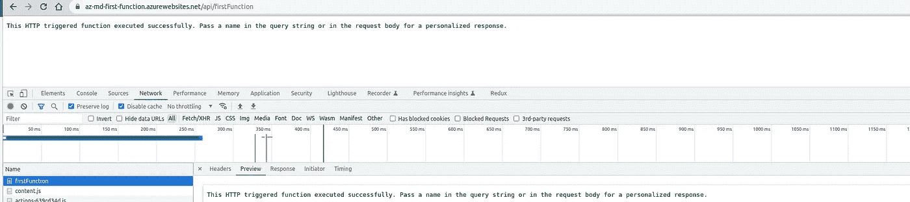

# 如何构建 Azure 无服务器功能及其工作原理

> 原文：<https://javascript.plainenglish.io/how-to-build-an-azure-serverless-function-and-how-it-works-fa10c28fc5a9?source=collection_archive---------6----------------------->

我们经常构建系统来对一系列关键事件做出反应。无论是构建 web API、响应数据库变化、处理物联网数据流，甚至是管理消息队列，每个应用程序都需要一种方法在这些事件发生时运行一些代码。

在本文中，我打算向您展示 Azure 函数是如何工作的，以及我们需要什么来构建一个好的 Node.js HTTP 函数。

为此，我们将了解以下主题:

*   ***Azure 函数的概念***
*   ***支持绑定***
*   ***先决条件***
*   ***Azure 功能中支持的语言***
*   ***功能 App***
*   ***文件夹结构***
*   ***第一个函数 App 用 Node.js***
*   ***创建你的本地函数***
*   ***了解一下文件夹结构提供***
*   ***改进我们的局部功能***
*   **添加测试到我们的函数**
*   ***部署到 Azure 功能 App***
*   ***演示***
*   ***监控 API***
*   ***总结***
*   ***结论***

# ***Azure 函数的概念***

首先，当您使用无服务器功能时，您将能够将系统的逻辑实现到容易获得的代码块中。这些代码块被称为“函数”。许多功能可以在您需要响应关键事件的任何时候运行。

其次，随着请求的增加，Azure Functions 会根据需要提供尽可能多的资源和函数实例来满足需求——但只是在需要的时候。随着请求的减少，任何额外的资源和应用程序实例都会自动减少。

# 我们能够创建哪种受支持的绑定？

下表显示了 Azure Functions 运行时的主要版本中支持的绑定:

[https://docs.microsoft.com/en-us/azure/azure-functions/functions-triggers-bindings?tabs=javascript#supported-bindings](https://docs.microsoft.com/en-us/azure/azure-functions/functions-triggers-bindings?tabs=javascript#supported-bindings)

# 先决条件

首先，你需要理清你的思路，这是一个新概念，它与无服务器工作有关，你需要知道的关于 Azure 功能的一切都可以在官方文档上搜索到，你需要创建一个微软 Azure 帐户。

*   [微软 Azure 账户](https://azure.microsoft.com/en-us/)
*   [微软 Azure 功能](https://azure.microsoft.com/en-us/services/functions/#overview)

假设您已经了解 Node.js REST API 应用程序，那么您需要熟悉 Node.js 和 JavaScript。您需要在本地机器上安装 Node.js。

*   [Node.js](https://nodejs.org/en/download/)
*   Java Script 语言
*   [VSCode](https://code.visualstudio.com/)

所有的 API 代码都是用 Node.js Azure 函数编写的。您需要熟悉以下内容。

*   [Azure 函数](https://azure.microsoft.com/en-us/services/functions/)
*   [Azure 功能核心工具](https://github.com/Azure/azure-functions-core-tools)
*   用于 Visual Studio 代码的 Azure 函数扩展

# Azure 函数中支持的语言

下表显示了函数支持的哪些语言可以在 Linux 或 Windows 上运行。它还表明您的语言是否支持在 Azure 门户中编辑。该语言基于你在 Azure 门户[中创建函数应用](https://docs.microsoft.com/en-us/azure/azure-functions/functions-create-function-app-portal#create-a-function-app)时选择的运行时堆栈选项。这与在 Azure Functions 核心工具中使用`func init`命令时的`--worker-runtime`选项相同。

Generally available (GA) — Fully supported and approved for production use. Preview — Not yet supported, but expected to reach GA status in the future.

# 功能应用

一个函数 app 在 Azure 中提供了一个执行*上下文*，你的函数在其中运行。因此，它是您的功能的部署和管理单元。一个功能应用程序由一个或多个单独的功能组成，这些功能被一起管理、部署和扩展。

功能应用中的所有功能共享相同的定价方案、部署方法和运行时版本。将功能应用程序视为组织和集中管理您的功能的一种方式。

# 文件夹结构

特定函数应用程序中所有函数的代码位于包含主机配置文件的根项目文件夹中。 [host.json](https://docs.microsoft.com/en-us/azure/azure-functions/functions-host-json) 文件包含运行时特定的配置，位于 function app 的根文件夹中。一个 *bin* 文件夹包含功能应用程序需要的包和其他库文件。功能应用程序所需的特定文件夹结构取决于语言。

## JavaScript 的文件夹结构

默认情况下，JavaScript 函数从`index.js`开始执行，这个文件与其对应的`function.json`共享同一个父目录。

# Node.js 的第一个函数应用

有两种方法可以创建 Azure 函数，你可以使用 Azure 门户直接创建它，另一种方法是通过 VSCode 创建它。所以，我通常用 VSCode 创建一个函数。

你应该做的第一件事是使用你的 Azure 帐户进行身份验证，并通过登录 Azure 选择合适的订阅。除此之外，你还需要安装 [Azure 功能扩展](https://marketplace.visualstudio.com/items?itemName=ms-azuretools.vscode-azurefunctions)。一旦安装了 Visual Studio 代码的 Azure Functions 扩展，就可以从 VSCode 本身创建整个项目。

为了在本地机器上创建/测试任何函数，你需要安装的最后一个工具是 [Azure Functions Core Tools](https://github.com/Azure/azure-functions-core-tools) ，它包括一个支持 Azure Functions 运行时的相同运行时版本，你可以在本地开发计算机上运行。

# 创建您的本地函数

在本节中，我们将使用 javascript 创建一个新的本地 Azure 函数。稍后我们将把这段代码发布到 Azure。

1.  选择活动栏上的 Azure 图标，然后点击**工作区本地选项卡，**点击 **+** 创建一个新的本地函数。

2.选择将创建此本地函数的位置，请不要选择已经是工作区一部分的文件夹。

3.设置本地功能提示:

3.1 为您的功能选择一种语言:选择 *JavaScript* :

3.2 为项目的第一个函数选择一个模板:选择 *HTTP 触发器*。

3.3 提供一个函数名:Type *HttpFirstFunction*

3.4 选择访问级别:选择*匿名*，使得任何人都可以调用该功能，要了解更多关于授权级别的信息，请看这里

使用这些信息，Visual Studio 代码生成一个带有 HTTP 触发器的 Azure Functions 项目。您可以在浏览器中查看本地项目文件。

# 如何执行本地功能

创建该函数后，您将能够单击 F5 或在调试模式下在 Visual Studio 代码的调试资源管理器中运行该函数。

本地功能运行:

为此函数做一个 GET:
[http://localhost:7071/API/HttpFirstFunction](http://localhost:7071/api/HttpFirstFunction)

[http://localhost:7071/API/HttpFirstFunction？name = dei vision](http://localhost:7071/api/HttpFirstFunction?name=Deivison)

# 更多地了解所提供的文件夹结构。

在项目的根目录下，有一个共享的 [host.json](https://docs.microsoft.com/en-us/azure/azure-functions/functions-host-json) 文件，可以用来配置函数 app。每个函数都有一个文件夹，其中有自己的代码文件(。js)和绑定配置文件(function.json)。`function.json`的父目录名总是你的函数名。

# 导出函数

JavaScript 函数必须通过`[module.exports](https://nodejs.org/api/modules.html#modules_module_exports)`(或`[exports](https://nodejs.org/api/modules.html#modules_exports)`)导出。您导出的函数应该是一个 JavaScript 函数，在被触发时执行。

默认情况下，函数运行时在`index.js`中查找您的函数，其中`index.js`与其对应的`function.json`共享相同的父目录。在默认情况下，您的导出函数应该是从它的文件中导出的唯一的导出，或者是名为`run`或`index`的导出。

# 从函数返回

> 如果你愿意，你可以返回 object 而不是 context.res{…}来响应函数。要使用`return`分配输出，将`function.json`中的`name`属性更改为`$return`。

> 在这种情况下，您的函数应该如下例所示:

# 粘合剂

在 JavaScript 中，[绑定](https://docs.microsoft.com/en-us/azure/azure-functions/functions-triggers-bindings)是在函数的 function.json 中配置和定义的。

> 输入
> 
> Azure 函数中的输入分为两类:一类是触发输入，另一类是附加输入。触发器和其他输入绑定(`direction === "in"`的绑定)可以通过三种方式被函数读取:
> 
> 输出
> 
> 函数可以通过多种方式写入输出(绑定`direction === "out"`)。在所有情况下，在 *function.json* 中定义的绑定的`name`属性对应于函数中写入的对象成员的名称。

# 上下文对象

运行时使用一个`context`对象在函数和运行时之间传递数据。用于从绑定中读取和设置数据以及写入日志，`context`对象总是传递给函数的第一个参数。

# HTTP 触发器和绑定

HTTP 和 webhook 触发器以及 HTTP 输出绑定使用请求和响应对象来表示 HTTP 消息传递。

# 请求对象

`context.req`(请求)对象具有以下属性:

# 响应对象

`context.res`(响应)对象具有以下属性:

# 改善我们的本地功能

首先，我们将创建一个 HTTP GET 函数，因此我们需要从`*function.json*`中删除“POST”

为此 GET 添加自定义`*router*`

# 向我们的函数添加测试

测试您的功能包括:

*   **HTTP 端到端**:要从 HTTP 端点测试一个函数，您可以使用任何能够发出 HTTP 请求的工具，比如 cURL、Postman 或 JavaScript 的 fetch 方法。
*   **集成测试**:集成测试包括功能 app 层。这种测试意味着您需要控制函数的参数，包括请求和上下文。
*   **单元测试:**单元测试在功能 app 内进行。你可以使用任何可以测试 JavaScript 的工具，比如 Jest 或者 Mocha。

# 单元测试:

我已经用 Jest 测试了我们的功能，也就是一个简单的单元测试:

# E2E 测试:

> 了解更多关于集成测试和用实验性 GitHub repo 模仿上下文层的信息，[https://github.com/anthonychu/azure-functions-test-utils](https://github.com/anthonychu/azure-functions-test-utils)

# 部署到 Azure 功能

## 登录 Azure

您必须先登录 Azure，然后才能发布您的应用。

如果您尚未登录，请选择活动栏中的 Azure 图标。然后在资源区域，选择登录 Azure…

1.  如果您已经登录并且可以看到您现有的订阅，请转到下一部分。如果您还没有 Azure 帐户，请选择创建和 Azure 帐户…学生可以选择创建和 Azure for Students 帐户…
2.  当浏览器中出现提示时，选择您的 Azure 帐户并使用您的 Azure 帐户凭据登录。如果您创建了新帐户，您可以在创建帐户后登录。
3.  成功登录后，您可以关闭新的浏览器窗口。属于你的 Azure 帐户的订阅显示在侧栏中。

## 在 Azure 中创建功能应用

在本节中，您将在 Azure 订阅中创建一个功能应用和相关资源。

1.  在活动栏中选择 Azure 图标。然后在 Resources 区域，选择+图标，选择 Create Function App in Azure 选项。

根据提示提供以下信息:

选择订阅->选择要使用的订阅。当您在**资源**下只有一个可见的订阅时，您不会看到此提示。

输入函数 app ->的全局唯一名称，键入在 URL 路径中有效的名称。你输入的名字会被验证以确保它在 Azure 函数中是唯一的**。**

选择一个运行时栈->选择你在本地运行的语言版本。

选择新资源的位置->为了获得更好的性能，请选择您附近的[地区](https://azure.microsoft.com/regions/) **。**

该扩展在 Azure: Activity Log 面板中显示了各个资源在 Azure 中创建时的状态。

创建完成后，将在您的订阅中创建以下 Azure 资源。资源根据您的功能应用程序名称命名:

*   一个[资源组](https://docs.microsoft.com/en-us/azure/azure-resource-manager/management/overview)，它是相关资源的逻辑容器。
*   一个标准的 [Azure 存储帐户](https://docs.microsoft.com/en-us/azure/storage/common/storage-account-create)，它维护你的项目的状态和其他信息。
*   一个函数应用程序，它提供了执行函数代码的环境。功能应用程序允许您将功能分组为一个逻辑单元，以便在同一个托管计划中更轻松地管理、部署和共享资源。
*   应用服务计划，为您的功能应用定义底层主机。
*   连接到功能应用程序的应用洞察实例，可跟踪应用程序中功能的使用情况。

## 部署到 Azure

> **重要提示:**部署到现有的功能应用程序总是会覆盖 Azure 中该应用程序的内容。

在活动栏中选择 Azure 图标，然后在工作区中，选择您的项目文件夹并选择 Deploy…按钮。

选择**部署到功能应用** …，选择您刚刚创建的功能应用，然后选择部署。

部署完成后，选择**查看输出**来查看创建和部署结果，包括您创建的 Azure 资源。如果您错过了通知，请选择右下角的铃声图标再次查看。

功能已发布

功能按预期运行

# 监控 API

你可以在 Azure 门户上访问日志。当您点击任何功能并点击监视器时，您可以检查日志。

# 摘要

*   Azure Functions 是一个无服务器的应用程序，它允许你托管无需提供基础设施就能执行的业务逻辑。
*   您可以用一些语言编写函数，如 C#、java、JavaScript、TypeScript、Python 等。
*   您需要安装 Azure Functions 扩展。一旦安装了 Azure Functions extension for Visual Studio 代码，就可以从 VSCode 本身创建整个项目。
*   每个功能 app 都要关联一个存储账号。创建功能应用程序时，它必须链接到存储帐户。
*   您可以通过访问 Azure 门户上每个函数的 monitor 部分来监控 API 的日志。

# 结论

Azure Function 为我们提供了最简单的方法来构建一个无服务器的应用平台，在这个平台上你可以编写无状态的逻辑，并且它是事件驱动的，使用这种方法你不需要关心基础设施。

*更多内容请看*[***plain English . io***](https://plainenglish.io/)*。报名参加我们的* [***免费周报***](http://newsletter.plainenglish.io/) *。关注我们关于* [***推特***](https://twitter.com/inPlainEngHQ)[***领英***](https://www.linkedin.com/company/inplainenglish/)**和* [***不和***](https://discord.gg/GtDtUAvyhW) ***。****