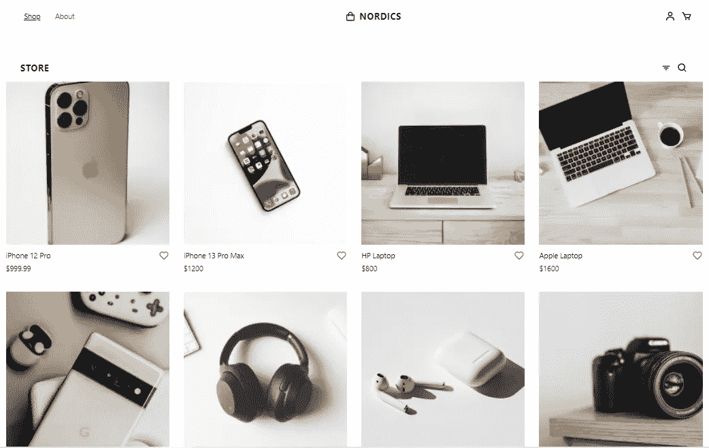

# 如何建立一个电子商务反应模板

> 原文：<https://javascript.plainenglish.io/how-to-build-an-ecommerce-react-template-bd27f7687f77?source=collection_archive---------13----------------------->

## 第 2 章:如何在 React 上使用 RESTful API 的分步指南



Consume a RESTful API on React

在第[章](/how-to-build-an-ecommerce-reactjs-template-chapter-1-the-beginning-bf67f0500e92)中，我们用 [Tailwind CSS](https://tailwindcss.com/) 和 [React Router](https://reactrouter.com/) 创建了一个基本的 React app。此外，我们用产品对象创建了一个静态主页。

在本章中，我们将在 React 上为主页产品列表使用 RESTful API。

# 第 2 章:在 React 上使用 RESTful API

在本章中，我们将执行以下任务:

*   1.创建 API
*   2.删除主页产品对象
*   3.消费 API
*   — 3.1 创建国家
*   — 3.2 API 要求
*   — 3.3 渲染产品

## 1.创建 API

对于演示，我们将使用 JSON 文件创建一个内部 API。因此，在“public/data/”文件夹中创建一个 products.json 文件。将以下 JSON 数据复制到`products.json`

`public/data/products.json`

```
{
  "products": [
    {
      "id": 1,
      "name": "iPhone 12 Pro",
      "href": "#",
      "price": "$999.99",
      "brand": "Apple",
      "category": "Cell Phones",
      "thumbnail": "https://images.unsplash.com/photo-1611791483458-6da70329aac6?ixlib=rb-1.2.1&ixid=eyJhcHBfaWQiOjEyMDd9&auto=format&fit=crop&w=400&h=400&q=80"
    },
    {
      "id": 2,
      "name": "iPhone 13 Pro Max",
      "href": "#",
      "price": "$1200",
      "brand": "Apple",
      "category": "Cell Phones",
      "thumbnail": "https://images.unsplash.com/photo-1632633728024-e1fd4bef561a?ixlib=rb-1.2.1&ixid=eyJhcHBfaWQiOjEyMDd9&auto=format&fit=crop&w=400&h=400&q=80"
    },
    {
      "id": 3,
      "name": "HP Laptop",
      "href": "#",
      "price": "$800",
      "brand": "HP",
      "category": "Computers",
      "thumbnail": "https://images.unsplash.com/photo-1496181133206-80ce9b88a853?ixlib=rb-1.2.1&ixid=eyJhcHBfaWQiOjEyMDd9&auto=format&fit=crop&w=400&h=400&q=80"
    },
    {
      "id": 4,
      "name": "Apple Laptop",
      "href": "#",
      "price": "1600",
      "brand": "Apple",
      "category": "Computers",
      "thumbnail": "https://images.unsplash.com/photo-1453928582365-b6ad33cbcf64?ixlib=rb-1.2.1&ixid=eyJhcHBfaWQiOjEyMDd9&auto=format&fit=crop&w=400&h=400&q=80"
    },
    {
      "id": 5,
      "name": "Google pixel 6",
      "href": "#",
      "price": "$1000",
      "brand": "Google",
      "category": "Cell Phones",
      "thumbnail": "https://images.unsplash.com/photo-1635870664257-430f094c25db?ixlib=rb-1.2.1&ixid=eyJhcHBfaWQiOjEyMDd9&auto=format&fit=crop&w=400&h=400&q=80"
    },
    {
      "id": 6,
      "name": "Sony headphone",
      "href": "#",
      "price": "$499.99",
      "brand": "Sony",
      "category": "Headphones",
      "thumbnail": "https://images.unsplash.com/photo-1546435770-a3e426bf472b?ixlib=rb-1.2.1&ixid=eyJhcHBfaWQiOjEyMDd9&auto=format&fit=crop&w=400&h=400&q=80"
    },
    {
      "id": 7,
      "name": "Apple AirPods",
      "href": "#",
      "price": "$222.99",
      "brand": "Apple",
      "category": "Headphones",
      "thumbnail": "https://images.unsplash.com/photo-1600294037681-c80b4cb5b434?ixlib=rb-1.2.1&ixid=eyJhcHBfaWQiOjEyMDd9&auto=format&fit=crop&w=400&h=400&q=80"
    },
    {
      "id": 8,
      "name": "Canon camera",
      "href": "#",
      "price": "$999.99",
      "brand": "Canon",
      "category": "Cameras",
      "thumbnail": "https://images.unsplash.com/photo-1500646953400-045056a916d7?ixlib=rb-1.2.1&auto=format&fit=crop&w=400&h=400&q=80"
    }
  ]
}
```

我们还可以通过使用 [JSON Server](https://github.com/typicode/json-server) 得到一个零编码的全假 REST API。但是在这一章中，我们只是在 public 文件夹中添加了一个 JSON 文件。

## 2.删除主页产品对象

移除主页上的`const products`组件`src/pages/Home.js`

```
+++ b/src/pages/Home.js
@@ -1,102 +1,64 @@
 import React from 'react';

-const products = [
-  {
-    id: 1,
-    name: 'Product Name',
-    href: '#',
-    price: '$9.99',
-    imageSrc: 'https://images.unsplash.com/photo-1555982105-d25af4182e4e?ixlib=rb-1.2.1&ixid=eyJhcHBfaWQiOjEyMDd9&auto=format&fit=crop&w=400&h=400&q=80',
-  },
-  {
-    id: 2,
-    name: 'Product Name',
-    href: '#',
-    price: '$10.99',
-    imageSrc: 'https://images.unsplash.com/photo-1508423134147-addf71308178?ixlib=rb-1.2.1&ixid=eyJhcHBfaWQiOjEyMDd9&auto=format&fit=crop&w=400&h=400&q=80',
-  },
-  {
-    id: 3,
-    name: 'Product Name',
-    href: '#',
```

## 3.消费 API

为了使用 API，我们需要发出一个 AJAX 请求。我们将为 API 请求使用浏览器内置的 [window.fetch](https://developer.mozilla.org/en-US/docs/Web/API/Fetch_API) 方法。

## 3.1 创建一个国家

我们将创建一个组件`state`对象来存储获取的产品。创建一个构造函数并添加初始状态对象值。`isLoaded`用于显示加载信息。

```
class Home extends React.Component {
  constructor(props) {
    super(props);
    this.state = {
      isLoaded: false,
      products: []
    };
  }
```

## 3.2 API 要求

我们将使用`[componentDidMount](https://reactjs.org/docs/react-component.html#mounting)`生命周期方法从远程端点加载数据。

`*componentDidMount()*` *在组件安装(插入到树中)后立即调用。需要 DOM 节点的初始化应该放在这里。如果需要从远程端点加载数据，这是实例化网络请求的好地方。*

```
componentDidMount() {
  fetch("/data/products.json")
    .then(res => res.json())
    .then(
      (result) => {
        this.setState({
        isLoaded: true,
        products: result.products
        });
      }
    )
}
```

## 3.3 渲染产品

在 Home 组件上复制下面的 render()方法。

```
import React from 'react';
class Home extends React.Component {
  constructor(props) {
    super(props);
    this.state = {
      isLoaded: false,
      products: []
    };
  }
componentDidMount() {
    fetch("/data/products.json")
      .then(res => res.json())
      .then(
        (result) => {
          this.setState({
            isLoaded: true,
            products: result.products
          });
        }
      )
  }
render() {
    const { isLoaded, products } = this.state;
    return (
      <div>
        <section className="bg-white py-8">
          <div className="container mx-auto flex items-center flex-wrap pt-4 pb-12">
            <nav id="store" className="w-full z-30 top-0 px-6 py-1">
              <div className="w-full container mx-auto flex flex-wrap items-center justify-between mt-0 px-2 py-3">
                <a className="uppercase tracking-wide no-underline hover:no-underline font-bold text-gray-800 text-xl " href="#">
                  Store
                </a>
                <div className="flex items-center" id="store-nav-content">
                  <a className="pl-3 inline-block no-underline hover:text-black" href="#">
                    <svg className="fill-current hover:text-black"  width="24" height="24" viewBox="0 0 24 24">
                      <path d="M7 11H17V13H7zM4 7H20V9H4zM10 15H14V17H10z" />
                    </svg>
                  </a>
                  <a className="pl-3 inline-block no-underline hover:text-black" href="#">
                    <svg className="fill-current hover:text-black"  width="24" height="24" viewBox="0 0 24 24">
                      <path d="M10,18c1.846,0,3.543-0.635,4.897-1.688l4.396,4.396l1.414-1.414l-4.396-4.396C17.365,13.543,18,11.846,18,10 c0-4.411-3.589-8-8-8s-8,3.589-8,8S5.589,18,10,18z M10,4c3.309,0,6,2.691,6,6s-2.691,6-6,6s-6-2.691-6-6S6.691,4,10,4z" />
                    </svg>
                  </a>
                </div>
              </div>
            </nav>
            {!isLoaded ? (
              <div class="w-full">
                <div class="flex items-center justify-center">
                  Loading...
                </div>
              </div>
            ) : (
            <div className="grid grid-cols-1 gap-y-10 sm:grid-cols-2 gap-x-6 lg:grid-cols-3 xl:grid-cols-4 xl:gap-x-8">
              {products.map((product) => (
                <a key={product.id} href={product.href}>
                  
                  <div className="pt-3 flex items-center justify-between">
                    <p className="">{product.name}</p>
                    <svg className="h-6 w-6 fill-current text-gray-500 hover:text-black"  viewBox="0 0 24 24">
                      <path d="M12,4.595c-1.104-1.006-2.512-1.558-3.996-1.558c-1.578,0-3.072,0.623-4.213,1.758c-2.353,2.363-2.352,6.059,0.002,8.412 l7.332,7.332c0.17,0.299,0.498,0.492,0.875,0.492c0.322,0,0.609-0.163,0.792-0.409l7.415-7.415 c2.354-2.354,2.354-6.049-0.002-8.416c-1.137-1.131-2.631-1.754-4.209-1.754C14.513,3.037,13.104,3.589,12,4.595z M18.791,6.205 c1.563,1.571,1.564,4.025,0.002,5.588L12,18.586l-6.793-6.793C3.645,10.23,3.646,7.776,5.205,6.209 c0.76-0.756,1.754-1.172,2.799-1.172s2.035,0.416,2.789,1.17l0.5,0.5c0.391,0.391,1.023,0.391,1.414,0l0.5-0.5 C14.719,4.698,17.281,4.702,18.791,6.205z" />
                    </svg>
                  </div>
                  <p className="pt-1 text-gray-900">{product.price}</p>
                </a>
              ))}
            </div>
            )}
          </div>
        </section>
      </div>
    );
  }
}
export default Home;
```

本章完整工作代码推送，可在 Github—[archive/Chapter _ 2](https://github.com/balajidharma/tailwindcss-nordic-store/tree/archive/Chapter_2)上获取。

**完整演示:**

 [## React 应用

### 网站是使用 create-react-app 创建的

balajidharma.github.io](https://balajidharma.github.io/tailwindcss-nordic-store/) 

**上一篇:** [第 1 章:如何使用 Tailwind CSS 构建 React 电子商务模板的分步指南](/how-to-build-an-ecommerce-reactjs-template-chapter-1-the-beginning-bf67f0500e92)

**接下来:**即将推出

感谢您的阅读。

敬请关注更多内容！

*更多内容看* [***说白了。报名参加我们的***](https://plainenglish.io/) **[***免费周报***](http://newsletter.plainenglish.io/) *。关注我们关于*[***Twitter***](https://twitter.com/inPlainEngHQ)*和**[***LinkedIn***](https://www.linkedin.com/company/inplainenglish/)*。查看我们的* [***社区不和谐***](https://discord.gg/GtDtUAvyhW) *加入我们的* [***人才集体***](https://inplainenglish.pallet.com/talent/welcome) *。****