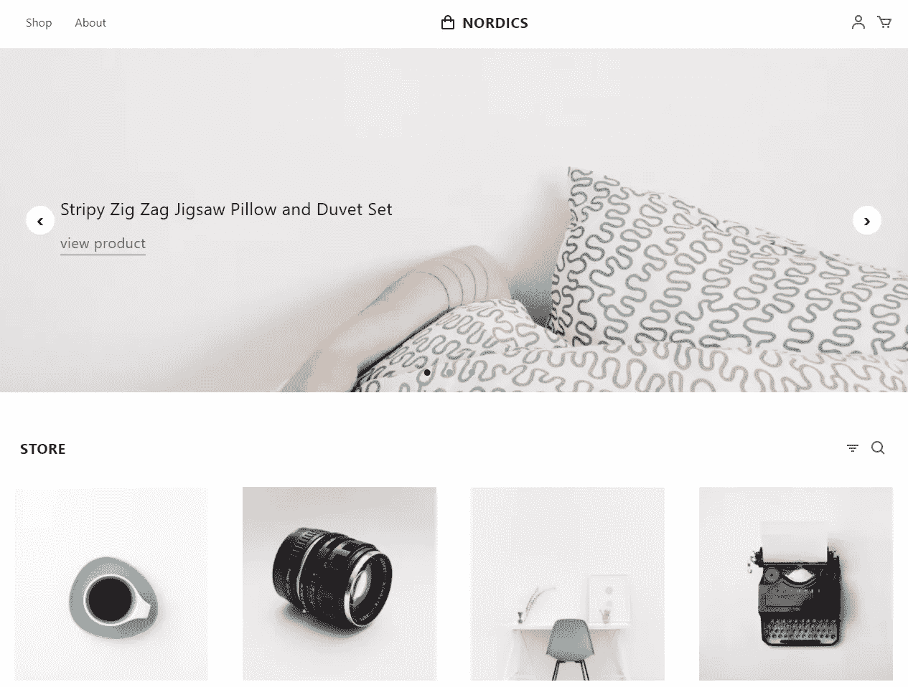
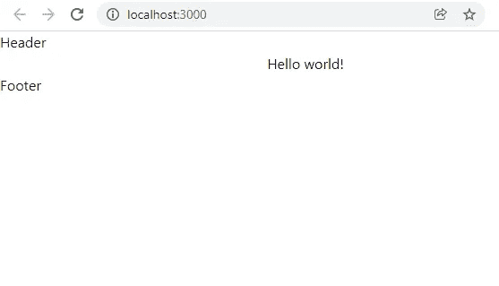
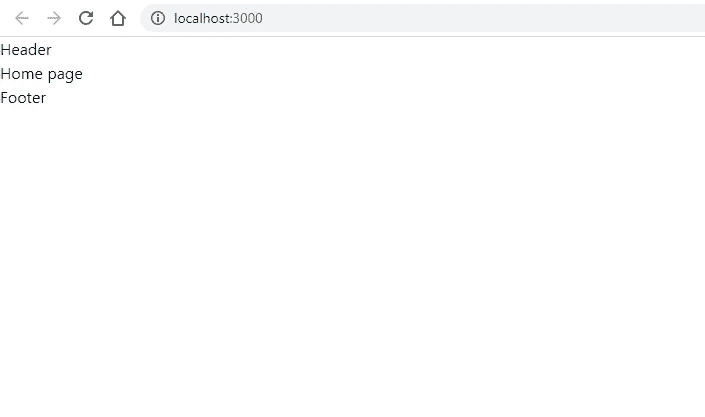
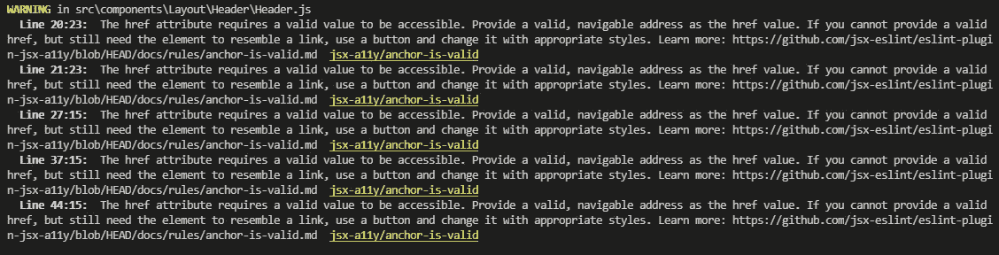
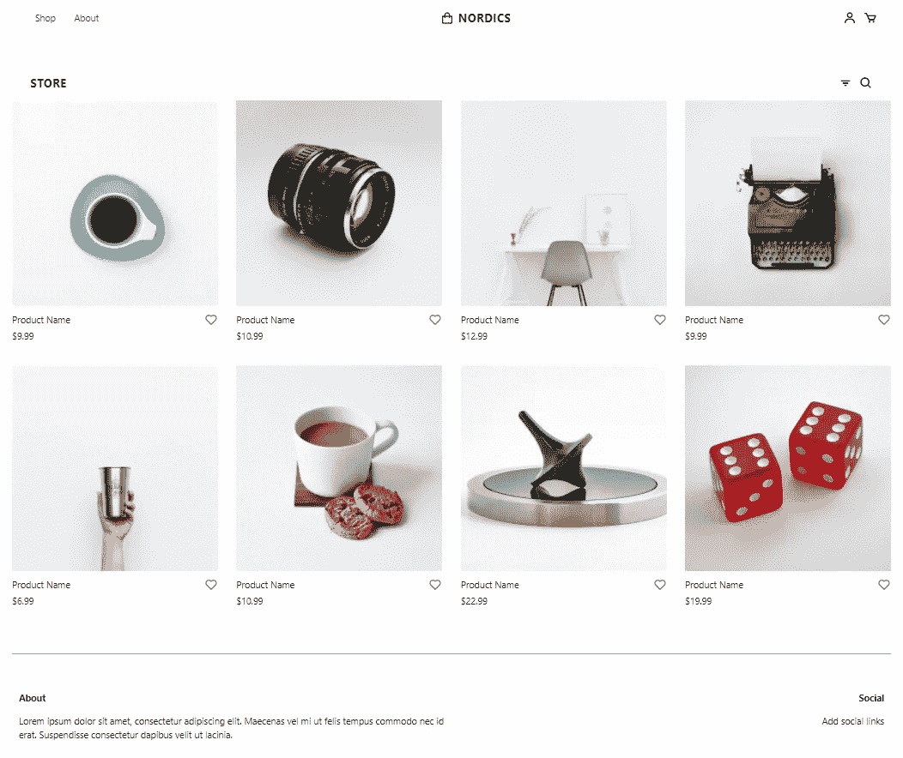

# 如何建立一个电子商务反应模板

> 原文：<https://javascript.plainenglish.io/how-to-build-an-ecommerce-reactjs-template-chapter-1-the-beginning-bf67f0500e92?source=collection_archive---------7----------------------->

## 第 1 章:如何使用 Tailwind CSS 构建 React 电子商务模板的分步指南。



我的灵感来自电子商务产品列表[北欧商店](https://github.com/tailwindtoolbox/Nordic-Store)模板。该模板使用[顺风 CSS](https://tailwindcss.com/) ，由[顺风工具箱](https://www.tailwindtoolbox.com/)创建

Nordic Store 模板是一个静态的 Tailwind CSS 模板。所以我打算用 React 建立一个动态的北欧商店模板。

在这个博客系列中，我们将使用 React 和 Tailwind CSS 构建一个电子商务动态模板。

# 为什么使用 Tailwind CSS

Tailwind 是一个实用至上的 CSS 框架，用于快速构建定制用户界面。简单地说，实用程序类帮助您设计 web 应用程序的样式。因此，我们可以在实用程序类的帮助下完成所有的样式设计，而不需要接触样式表。

另外，在[顺风 UI](https://tailwindui.com/) 上有现成的组件。

# 第一章:开始

在本章中，我们将执行以下任务:

*   创建新的 React 应用程序
*   安装[顺风 CSS](https://tailwindcss.com/) 和[反作用路由器](https://reactrouter.com/)
*   安装依赖项
*   创建基本布局组件
*   创建主页
*   构建北欧商店静态主页

## 创建新的 React 应用程序

使用`create-react-app`创建您的新 React 应用程序

`Terminal`

```
npx create-react-app tailwindcss-nordic-store
cd tailwindcss-nordic-store
```

## 安装顺风 CSS 和反应路由器

顺风 CSS 文件[中对此处](https://tailwindcss.com/docs/guides/create-react-app)的顺风 CSS 安装进行了说明

首先，安装`tailwindcss`、`postcss`和`autoprefixer`，然后运行 init 命令生成`tailwind.config.js`和`postcss.config.js`。

`Terminal`

```
npm install -D tailwindcss postcss autoprefixer
npx tailwindcss init -p
```

打开`tailwind.config.js`文件，将所有路径添加到模板文件中。

`tailwind.config.js`

```
module.exports = {
  content: [
    "./src/**/*.{js,jsx,ts,tsx}",
  ],
  theme: {
    extend: {},
  },
  plugins: [],
}
```

将每个顺风层的`@tailwind`指令添加到`src/index.css`文件中。

`src/index.css`

```
@tailwind base;
@tailwind components;
@tailwind utilities;
```

我们已成功在您的应用上安装了 Tailwind CSS。对于动态模板，我们需要不同的页面，所以我们要安装反应路由器到您的应用程序。

`Terminal`

```
npm install react-router-dom@6
```

## 安装依赖项

用于支持所有交互行为的 [Headless UI](https://headlessui.dev/) 和用于图标的 [Heroicons](https://heroicons.com/) ，所以你需要将这两个库添加到你的应用中。

`Terminal`

```
npm install @headlessui/react @heroicons/react
```

## 创建基本布局组件

基本的布局创建步骤发布在我之前的博客[在 React](/create-your-own-layout-component-in-react-5d48f0433d9) 中创建你自己的布局组件。

[](/create-your-own-layout-component-in-react-5d48f0433d9) [## 在 React 中创建自己的布局组件

### 关于如何创建具有页眉、页脚和内容部分的基本布局组件的指南。

javascript.plainenglish.io](/create-your-own-layout-component-in-react-5d48f0433d9) 

下载应用程序并将组件文件夹复制到您的[https://github . com/balajidharma/react-basic-layout/archive/refs/heads/master . zip](https://github.com/balajidharma/react-basic-layout/archive/refs/heads/master.zip)

更新您的 App.js 并将我们的布局包含在您的 index.js 中:

`src/App.js`

```
import './App.css';function App() {
  return (
    <div className="App">
      Hello world!
    </div>
  );
}export default App;
```

`src/index.js`

```
import React from 'react';
import ReactDOM from 'react-dom';
import './index.css';
import App from './App';
import Layout from './components/Layout/Layout';ReactDOM.render(
  <Layout>
    <App />
  </Layout>,
  document.getElementById('root')
);
```

现在启动您的应用程序，查看浏览器的基本页眉、页脚和内容部分。

`Terminal`

```
npm start
```

`Browser`



## 创建主页

是时候使用 React 路由器创建我们的页面了。在`src`文件夹下新建一个`pages`文件夹。在`pages`文件夹中创建`Home`组件

`src/pages/Home.js`

```
import React from 'react';
class Home extends React.Component {
  render() {
    return (
      <div>
        Home page
      </div>
    );
  }
}
export default Home;
```

用于我们应用程序的 React `class`组件。点击阅读更多关于 React 组件[的信息。](https://reactjs.org/docs/components-and-props.html)

另外，阅读 React 中功能组件和类组件之间的[差异。](/which-is-better-class-components-or-functional-component-in-react-a417b4ef6c1a)

包括 React 路由器和主页作为一个`index.js`文件。此外，我们将删除`app.js`。

`src/index.js`

```
import React from 'react';
import ReactDOM from 'react-dom';
import { BrowserRouter, Routes, Route } from "react-router-dom";
import './index.css';
import Layout from './components/Layout/Layout';
import Home from './pages/Home';
ReactDOM.render(
  <BrowserRouter>
    <Layout>
      <Routes>
        <Route path="/" element={<Home/>} />
      </Routes>
    </Layout>
  </BrowserRouter>,
  document.getElementById('root')
);
```



## 构建北欧商店静态主页

我们几乎完成了基本设置。我们将 [Nordic Store](https://github.com/tailwindtoolbox/Nordic-Store) 模板拆分为应用程序中的页眉、页脚和主页部分。

`src/components/Layout/Header/Header.js`

```
import React from "react";
class Header extends React.Component {
  render() {
    return (
      <header>
        <nav id="header" className="w-full z-30 top-0 py-1">
          <div className="w-full container mx-auto flex flex-wrap items-center justify-between mt-0 px-6 py-3">
<label htmlFor="menu-toggle" className="cursor-pointer md:hidden block">
              <svg className="fill-current text-gray-900"  width="20" height="20" viewBox="0 0 20 20">
                <title>menu</title>
                <path d="M0 3h20v2H0V3zm0 6h20v2H0V9zm0 6h20v2H0v-2z"></path>
              </svg>
            </label>
            <input className="hidden" type="checkbox" id="menu-toggle" />
<div className="hidden md:flex md:items-center md:w-auto w-full order-3 md:order-1" id="menu">
              <nav>
                <ul className="md:flex items-center justify-between text-base text-gray-700 pt-4 md:pt-0">
                  <li><a className="inline-block no-underline hover:text-black hover:underline py-2 px-4" href="#">Shop</a></li>
                  <li><a className="inline-block no-underline hover:text-black hover:underline py-2 px-4" href="#">About</a></li>
                </ul>
              </nav>
            </div>
<div className="order-1 md:order-2">
              <a className="flex items-center tracking-wide no-underline hover:no-underline font-bold text-gray-800 text-xl " href="#">
                <svg className="fill-current text-gray-800 mr-2"  width="24" height="24" viewBox="0 0 24 24">
                  <path d="M5,22h14c1.103,0,2-0.897,2-2V9c0-0.553-0.447-1-1-1h-3V7c0-2.757-2.243-5-5-5S7,4.243,7,7v1H4C3.447,8,3,8.447,3,9v11 C3,21.103,3.897,22,5,22z M9,7c0-1.654,1.346-3,3-3s3,1.346,3,3v1H9V7z M5,10h2v2h2v-2h6v2h2v-2h2l0.002,10H5V10z" />
                </svg>
                NORDICS
              </a>
            </div>
<div className="order-2 md:order-3 flex items-center" id="nav-content">
<a className="inline-block no-underline hover:text-black" href="#">
                <svg className="fill-current hover:text-black"  width="24" height="24" viewBox="0 0 24 24">
                  <circle fill="none" cx="12" cy="7" r="3" />
                  <path d="M12 2C9.243 2 7 4.243 7 7s2.243 5 5 5 5-2.243 5-5S14.757 2 12 2zM12 10c-1.654 0-3-1.346-3-3s1.346-3 3-3 3 1.346 3 3S13.654 10 12 10zM21 21v-1c0-3.859-3.141-7-7-7h-4c-3.86 0-7 3.141-7 7v1h2v-1c0-2.757 2.243-5 5-5h4c2.757 0 5 2.243 5 5v1H21z" />
                </svg>
              </a>
<a className="pl-3 inline-block no-underline hover:text-black" href="#">
                <svg className="fill-current hover:text-black"  width="24" height="24" viewBox="0 0 24 24">
                  <path d="M21,7H7.462L5.91,3.586C5.748,3.229,5.392,3,5,3H2v2h2.356L9.09,15.414C9.252,15.771,9.608,16,10,16h8 c0.4,0,0.762-0.238,0.919-0.606l3-7c0.133-0.309,0.101-0.663-0.084-0.944C21.649,7.169,21.336,7,21,7z M17.341,14h-6.697L8.371,9 h11.112L17.341,14z" />
                  <circle cx="10.5" cy="18.5" r="1.5" />
                  <circle cx="17.5" cy="18.5" r="1.5" />
                </svg>
              </a>
</div>
          </div>
        </nav>
      </header>
    );
  }
}
export default Header;
```

确保在应对时将`class` 换成`className` 并将`for` 换成`htmlFor`。同样，忽略有效的`href` 警告:



`src/components/Layout/Footer/Footer.js`

```
import React from "react";
class Footer extends React.Component {
  render() {
    return (
      <footer className="container mx-auto bg-white py-8 border-t border-gray-400">
        <div className="container flex px-3 py-8 ">
          <div className="w-full mx-auto flex flex-wrap">
            <div className="flex w-full lg:w-1/2 ">
              <div className="px-3 md:px-0">
                <h3 className="font-bold text-gray-900">About</h3>
                <p className="py-4">
                  Lorem ipsum dolor sit amet, consectetur adipiscing elit. Maecenas vel mi ut felis tempus commodo nec id erat. Suspendisse consectetur dapibus velit ut lacinia.
                </p>
              </div>
            </div>
            <div className="flex w-full lg:w-1/2 lg:justify-end lg:text-right">
              <div className="px-3 md:px-0">
                <h3 className="font-bold text-gray-900">Social</h3>
                <ul className="list-reset items-center pt-3">
                  <li>
                    <a className="inline-block no-underline hover:text-black hover:underline py-1" href="#">Add social links</a>
                  </li>
                </ul>
              </div>
            </div>
          </div>
        </div>
      </footer>
    );
  }
}
export default Footer;
```

`src/pages/Home.js`

```
import React from 'react';
const products = [
  {
    id: 1,
    name: 'Product Name',
    href: '#',
    price: '$9.99',
    imageSrc: 'https://images.unsplash.com/photo-1555982105-d25af4182e4e?ixlib=rb-1.2.1&ixid=eyJhcHBfaWQiOjEyMDd9&auto=format&fit=crop&w=400&h=400&q=80',
  },
  {
    id: 2,
    name: 'Product Name',
    href: '#',
    price: '$10.99',
    imageSrc: 'https://images.unsplash.com/photo-1508423134147-addf71308178?ixlib=rb-1.2.1&ixid=eyJhcHBfaWQiOjEyMDd9&auto=format&fit=crop&w=400&h=400&q=80',
  },
  {
    id: 3,
    name: 'Product Name',
    href: '#',
    price: '$12.99',
    imageSrc: 'https://images.unsplash.com/photo-1449247709967-d4461a6a6103?ixlib=rb-1.2.1&ixid=eyJhcHBfaWQiOjEyMDd9&auto=format&fit=crop&w=400&h=400&q=80',
  },
  {
    id: 4,
    name: 'Product Name',
    href: '#',
    price: '$9.99',
    imageSrc: 'https://images.unsplash.com/reserve/LJIZlzHgQ7WPSh5KVTCB_Typewriter.jpg?ixlib=rb-1.2.1&ixid=eyJhcHBfaWQiOjEyMDd9&auto=format&fit=crop&w=400&h=400&q=80',
  },
  {
    id: 5,
    name: 'Product Name',
    href: '#',
    price: '$6.99',
    imageSrc: 'https://images.unsplash.com/photo-1467949576168-6ce8e2df4e13?ixlib=rb-1.2.1&ixid=eyJhcHBfaWQiOjEyMDd9&auto=format&fit=crop&w=400&h=400&q=80',
  },
  {
    id: 6,
    name: 'Product Name',
    href: '#',
    price: '$10.99',
    imageSrc: 'https://images.unsplash.com/photo-1544787219-7f47ccb76574?ixlib=rb-1.2.1&ixid=eyJhcHBfaWQiOjEyMDd9&auto=format&fit=crop&w=400&h=400&q=80',
  },
  {
    id: 7,
    name: 'Product Name',
    href: '#',
    price: '$22.99',
    imageSrc: 'https://images.unsplash.com/photo-1550837368-6594235de85c?ixlib=rb-1.2.1&ixid=eyJhcHBfaWQiOjEyMDd9&auto=format&fit=crop&w=400&h=400&q=80',
  },
  {
    id: 8,
    name: 'Product Name',
    href: '#',
    price: '$19.99',
    imageSrc: 'https://images.unsplash.com/photo-1551431009-a802eeec77b1?ixlib=rb-1.2.1&auto=format&fit=crop&w=400&h=400&q=80',
  },
]
class Home extends React.Component {
  render() {
    return (
      <div>
<section className="bg-white py-8">
<div className="container mx-auto flex items-center flex-wrap pt-4 pb-12">
<nav id="store" className="w-full z-30 top-0 px-6 py-1">
              <div className="w-full container mx-auto flex flex-wrap items-center justify-between mt-0 px-2 py-3">
<a className="uppercase tracking-wide no-underline hover:no-underline font-bold text-gray-800 text-xl " href="#">
                  Store
                </a>
<div className="flex items-center" id="store-nav-content">
<a className="pl-3 inline-block no-underline hover:text-black" href="#">
                    <svg className="fill-current hover:text-black"  width="24" height="24" viewBox="0 0 24 24">
                      <path d="M7 11H17V13H7zM4 7H20V9H4zM10 15H14V17H10z" />
                    </svg>
                  </a>
<a className="pl-3 inline-block no-underline hover:text-black" href="#">
                    <svg className="fill-current hover:text-black"  width="24" height="24" viewBox="0 0 24 24">
                      <path d="M10,18c1.846,0,3.543-0.635,4.897-1.688l4.396,4.396l1.414-1.414l-4.396-4.396C17.365,13.543,18,11.846,18,10 c0-4.411-3.589-8-8-8s-8,3.589-8,8S5.589,18,10,18z M10,4c3.309,0,6,2.691,6,6s-2.691,6-6,6s-6-2.691-6-6S6.691,4,10,4z" />
                    </svg>
                  </a>
</div>
              </div>
            </nav>
<div className="grid grid-cols-1 gap-y-10 sm:grid-cols-2 gap-x-6 lg:grid-cols-3 xl:grid-cols-4 xl:gap-x-8">
              {products.map((product) => (
                <a key={product.id} href={product.href}>
                  
                  <div className="pt-3 flex items-center justify-between">
                    <p className="">{product.name}</p>
                    <svg className="h-6 w-6 fill-current text-gray-500 hover:text-black"  viewBox="0 0 24 24">
                      <path d="M12,4.595c-1.104-1.006-2.512-1.558-3.996-1.558c-1.578,0-3.072,0.623-4.213,1.758c-2.353,2.363-2.352,6.059,0.002,8.412 l7.332,7.332c0.17,0.299,0.498,0.492,0.875,0.492c0.322,0,0.609-0.163,0.792-0.409l7.415-7.415 c2.354-2.354,2.354-6.049-0.002-8.416c-1.137-1.131-2.631-1.754-4.209-1.754C14.513,3.037,13.104,3.589,12,4.595z M18.791,6.205 c1.563,1.571,1.564,4.025,0.002,5.588L12,18.586l-6.793-6.793C3.645,10.23,3.646,7.776,5.205,6.209 c0.76-0.756,1.754-1.172,2.799-1.172s2.035,0.416,2.789,1.17l0.5,0.5c0.391,0.391,1.023,0.391,1.414,0l0.5-0.5 C14.719,4.698,17.281,4.702,18.791,6.205z" />
                    </svg>
                  </div>
                  <p className="pt-1 text-gray-900">{product.price}</p>
                </a>
              ))}
            </div>
</div>
</section>
</div>
    );
  }
}
export default Home;
```

我们创建了一个没有旋转木马的主页。我们将在下一章实现轮播。

为移动菜单添加下面的样式。

`src/index.css`

```
@tailwind base;
@tailwind components;
@tailwind utilities;
#menu-toggle:checked + #menu {
  display: block;
}
```

本章完整工作代码推送，可在 Github—[archive/Chapter _ 1](https://github.com/balajidharma/tailwindcss-nordic-store/tree/archive/Chapter_1)上获取。

**完整演示:**[https://balajidharma.github.io/tailwindcss-nordic-store/](https://balajidharma.github.io/tailwindcss-nordic-store/)



Chapter 1 — Final output

**接下来:** [第 2 章如何在 React 上使用 RESTful API 的分步指南](/how-to-build-an-ecommerce-react-template-bd27f7687f77)

我们的第一章到此结束。感谢您的阅读。

敬请关注更多内容！

*更多内容请看*[*plain English . io*](http://plainenglish.io/)*。报名参加我们的* [*免费每周简讯*](http://newsletter.plainenglish.io/) *。在我们的* [*社区不和谐*](https://discord.gg/GtDtUAvyhW) *获得独家获得写作机会和建议。*