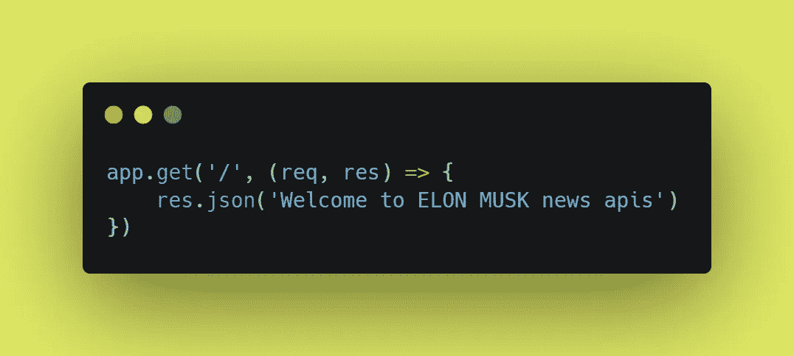

# 如何使用 Node.js 构建一个 Elon Musk 新闻刮刀 API

> 原文：<https://javascript.plainenglish.io/how-to-build-an-elon-musk-news-scraper-api-using-node-js-cad47f98f20b?source=collection_archive---------19----------------------->

大家好！🖐it's·罗汉·卡达姆。😊

几乎地球上的每个人都喜欢新闻，无论是个人新闻、商业新闻、娱乐新闻还是其他新闻。新闻是我们日常生活的一部分，无论是在乘坐地铁时阅读新闻还是在收音机里听到新闻。但在本文中，我们将尝试为令人钦佩的创新者埃隆·马斯克(Elon Musk)打造一个新闻刮刀。

我们将试着回答一些同样的问题。什么是新闻刮刀？开始构建 API 之前的先决条件是什么？如何使用 Node.js 构建 API？


How to Build Elon Musk Scrapper API using NodeJs?

> 嘿 DevCommunity 别忘了在 Instagram 上查看更多内容，时间:[**@ rohankadam _ codes**](https://www.instagram.com/rohankadam_codes/)

## ⚡What 是个新闻记者？

一个网页抓取器将允许你呈现你正在寻找的网站**来抓取**，并点击你想要抓取的数据。对于这个例子，从彭博和许多其他与 Elon Musk 相关的新闻出版物中搜集文章。

## ⚡What 是开始构建 API 之前的先决条件？

在直接开始开发新闻抓取器之前，我们应该了解某些技术，以便更顺利地进行开发。

1.  Java Script 语言
2.  节点. js
3.  代码编辑器
4.  邮递员

**⚡How 使用 Node.js 构建 API？**

制造任何产品都需要过程。让我们深入研究使用 Node.js 构建 API 的过程。

**第一步:如何创建 Node.js 项目？**

让我们从创建一个名为“Elon-musk-API”的空文件夹开始，导航到该文件夹并打开 VS Code:

```
mkdir elon-musk-news-api
cd elon-musk-news-api
```

**步骤 2:在开始构建 API 之前，我们需要安装哪些库？**

让我们来回答上面关于如何安装库以及为什么要使用它们的问题。

⚡ **如何在我们的系统中安装 Node.js？**

[](https://nodejs.org/en/) [## 节点. js

### Node.js 是基于 Chrome 的 V8 JavaScript 引擎构建的 JavaScript 运行时。

nodejs.org](https://nodejs.org/en/) 

为了检查 Node.js 是否正确安装到我们各自的系统中，我们使用以下命令:

```
intput command:- node --version
output :- v14.17.0
```

**步骤 3:现在如何开始编写 API？**

假设我们所有人都成功地将 Node.js 库下载/安装到我们的系统中，让我们现在开始编写 API。

**第一步:如何截取项目中的初始化文件？**

```
input command :- npm init
output        :- package.json
```

它允许我们将其他包和模块安装到我们的项目中来使用。在文件创建并准备好之前，我们需要回答一些问题，比如包名、版本、描述、作者等等。查看下图，了解 package.json 的外观。👇👇


package.json

在 package.json 中，我们将字段名/变量名作为 main，将值作为 server.js，这只是我们项目的一个入口点。

**步骤 2:如何导入所需的库并在我们的文件中使用它们？**

如上所述，它是我们应用程序的入口点。为了运行 API，我们需要一个服务器和一些外部库或包。

让我们安装一些库

1.  **快递**

Express 是一个最小且灵活的 Node.js web 应用程序框架，为 web 和移动应用程序提供了一组强大的功能。

```
npm i express
```

详情请点击以下链接:

[](http://expressjs.com/) [## Express - Node.js web 应用程序框架

### Express 是一个最小且灵活的 Node.js web 应用程序框架，它为 web 和…

expressjs.com](http://expressjs.com/) [](https://www.npmjs.com/package/express) [## 表达

### node 的快速、非个性化、极简的 web 框架。这是一个 Node.js 模块，可通过 npm 注册表获得…

www.npmjs.com](https://www.npmjs.com/package/express) 

**2。Axios**

Axios 是一个简单的基于 promise 的 HTTP 客户端，用于浏览器和 node.js。

```
npm i axios
```

有关详细信息，请访问以下链接:

 [## Axios

### Axios 是一个简单的基于 promise 的 HTTP 客户端，用于浏览器和 node.js

axios-http.com](https://axios-http.com/) [](https://www.npmjs.com/package/axios) [## Axios

### 基于 Promise 的浏览器和 node . js HTTP 客户端新的 Axios docs 网站:单击此处从…

www.npmjs.com](https://www.npmjs.com/package/axios) 

**3。再见**

Cheerio 解析标记并提供一个 API 来遍历/操作结果数据结构。它不像 web 浏览器那样解释结果。

```
npm i cheerio
```

有关详细信息，请访问以下链接:

[](https://www.npmjs.com/package/cheerio) [## 再见

### 专为服务器设计的核心 jQuery 的微小、快速和优雅的实现

www.npmjs.com](https://www.npmjs.com/package/cheerio) 

查看下面的代码块，将库导入到我们的 server.js 文件中。


importing libraries

**第三步:如何从新闻网站上刮新闻？**

首先，让我们创建一个基本端点。



Welcome Endpoint

我们需要新闻来源从他们那里收集文章，看看下面的 JSON 作为参考。


New Article JSON

最后，抓取文章，从而创建一个与 Elon musk 相关的精选文章列表


Scrapping logic

## ⚡Where 为埃隆·马斯克新闻 API 寻找代码库？

[](https://github.com/Rohan2596/elon-musk-news-api) [## GitHub-rohan 2596/elon-musk-news-API

### 此时您不能执行该操作。您已使用另一个标签页或窗口登录。您已在另一个选项卡中注销，或者…

github.com](https://github.com/Rohan2596/elon-musk-news-api) 

你可以通过下面的链接在 [RapidAPI 团队](https://medium.com/u/3dd6824b6022?source=post_page-----cad47f98f20b--------------------------------)的网站上找到已部署的版本。

[](https://rapidapi.com/rohankadam965@gmail.com/api/elon-musk-news/) [## Elon Musk 新闻 API 文档(rohankadam965@gmail.com)| RapidAPI

### 使用我们的 JSON API 从新闻来源和博客中找到关于 Elon Musk 的文章

rapidapi.com](https://rapidapi.com/rohankadam965@gmail.com/api/elon-musk-news/) 

## ⚡Conclusion

文章中，我们尝试用 Node.js 搭建了一个抓取新闻的新闻抓取器，嘿，开发者社区，请分享和点赞💖如果你觉得文章有用。在 Medium[Rohan Ravindra Kadam](https://medium.com/u/a1b33b7cda75?source=post_page-----cad47f98f20b--------------------------------)和 Twitter[**rohankadam 25**](https://twitter.com/rohankadam25)**关注我。**

不要忘记通过下面的链接查看更多关于我的信息:

 [## 罗汉·拉温德拉·卡达姆

### 来自印度孟买的全栈开发人员，拥有大约 3 年的软件开发经验。

kadamrohan.com](https://kadamrohan.com/) 

Thank You Viewer — Rohan Kadam

*更多内容看* [***说白了。报名参加我们的***](http://plainenglish.io/) **[***免费周报***](http://newsletter.plainenglish.io/) *。在我们的* [***社区不和谐***](https://discord.gg/GtDtUAvyhW) *获得独家获取写作机会和建议。***