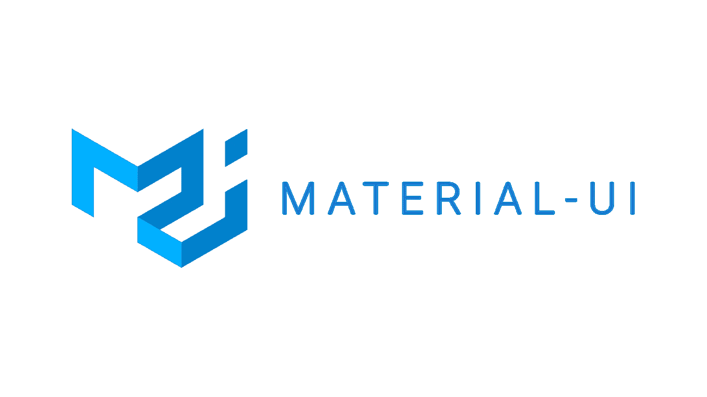
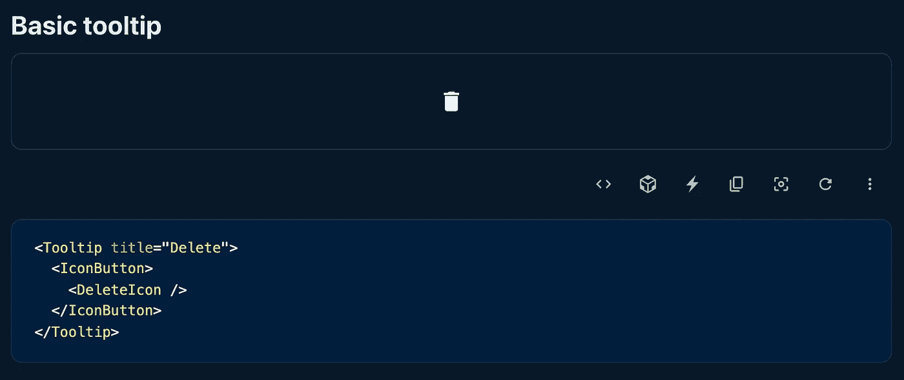
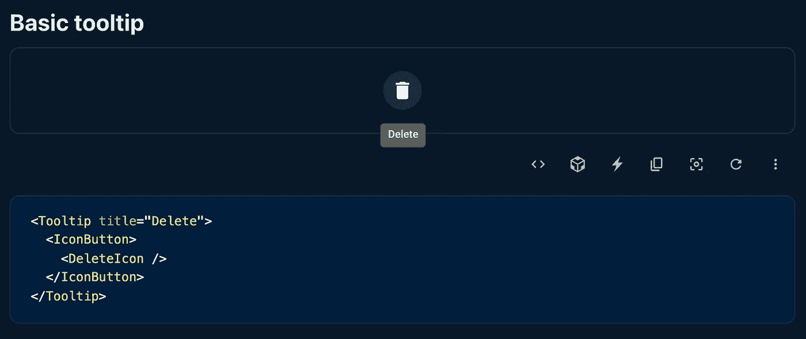
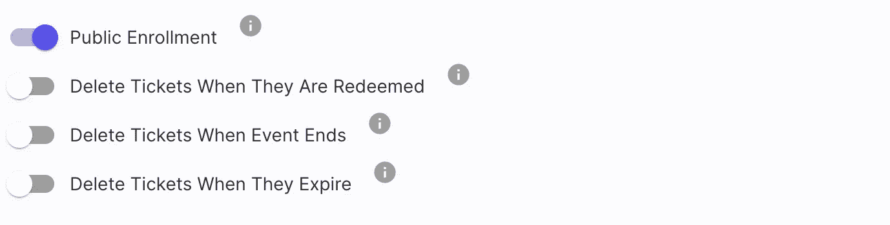
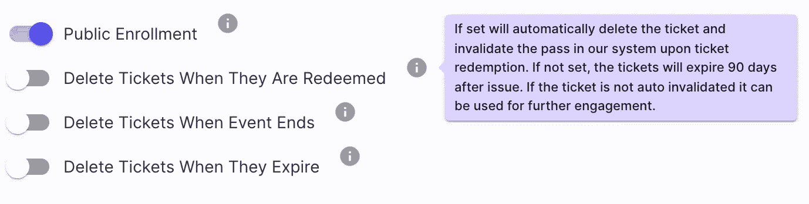

# 如何构建增强的材质用户界面工具提示

> 原文：<https://javascript.plainenglish.io/how-to-build-an-enhanced-material-ui-tooltip-d4c09e36fca4?source=collection_archive---------8----------------------->



工具提示非常适合提供额外的上下文。

我想分享一个我用材料用户界面的工具提示组件构建的自定义工具提示实现。现成的工具提示组件非常强大且易于使用。对我来说，唯一的缺点是他们缺乏对他们存在的指标的支持。

** *本文中的示例是使用 Material UI 诉 5***

在材料界面文档中:



这是一个基本的工具提示实现，当您将鼠标悬停在被包装的子元素上时，工具提示会显示出来。



这完全符合工具提示的[材料设计规范。](https://material.io/components/tooltips)

工具提示的特征之一是它应该是[简洁的](https://material.io/components/tooltips#usage)。这一要求并不总是容易保持一致。我经常需要提供冗长的文本来告知用户特定设置的特征或行为。

根据我构建用户界面的经验，我在页面上放的文本越多，用户就越不可能阅读它。我的偏好(以及每一个与我合作过的设计师的偏好)是将冗长的描述文本放在一个用户可以选择看到的提示中。

示例用户界面:

我希望有一个元素，当悬停在上面时，显示信息文本。因为文本会占用很多空间，所以我希望它包含在一个小的信息图标中。只有当我将鼠标悬停在信息图标上时，我才能看到工具提示文本。



悬停状态



这是上面使用的完整组件。

这是它使用时的样子:

在本文的其余部分，我将逐一介绍重要的元素。工具提示的结构和风格可能不适用于您的应用程序，但对于任何关注自定义实现的人来说，这应该是一个很好的起点。

```
interface IProps extends TooltipProps {}export const CustomTooltip: React.FunctionComponent<IProps> = (props) => {
```

这两行允许我导出具有所有原始材料用户界面工具提示属性的组件。定制道具可以添加到 IProps 中。我没有，但我想包括它作为一个额外的任何人可能需要它。

```
const { children, ...rest } = props
ex. const { children, customProps, ...rest } = props
```

将孩子与这里的其他财产分开很重要。如果你有定制的道具，你也需要把它们分开。

```
<StyledTooltip arrow {...rest}>
```

如果您想要在工具提示上设置任何默认属性，请确保在添加其余属性之前定义它们。

我希望这个例子能对任何需要灵感的人有所帮助。

*更多内容看* [*说白了. io*](http://plainenglish.io/) *。报名参加我们的* [*免费每周简讯*](http://newsletter.plainenglish.io/) *。在我们的* [*社区*](https://discord.gg/GtDtUAvyhW) *获得独家写作机会和建议。*