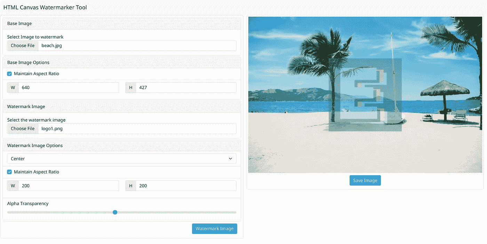

# 如何用 HTML Canvas 构建图像水印工具

> 原文：<https://javascript.plainenglish.io/how-to-build-an-image-watermarking-tool-with-html-canvas-9dd45bb4f13?source=collection_archive---------11----------------------->


Photo by [Ho Hyou](https://unsplash.com/@mihodango?utm_source=medium&utm_medium=referral) on [Unsplash](https://unsplash.com?utm_source=medium&utm_medium=referral)

HTML Canvas 是一个非常通用的元素，可用于绘图、动画和图像处理。在这篇文章中，我们将建立一个浏览器内的工具，你可以用它来给图片添加水印。我们将使用普通的 JavaScript 和 Bootstrap 进行样式设计。

我们将介绍 HTML Canvas 的一些基础知识，比如绘图、定位以及保存图像。如果您是 Canvas API 的新手，这将是一个不错的入门教程。

# 我们要建造什么



用户界面非常简单。我们有两个文件输入上传的基础图像(图像，我们将水印)和另一个图像将被放置在我们的第一个图像的顶部。我们还可以选择调整图像大小，改变水印的位置和透明度。看起来很简单对吧！开始编码吧。

> 另外，如果你想看现场演示，你可以在这里找到。

# 创建新项目

为此我们将使用 [Vite](https://vitejs.dev/) ，但是一个简单的 HTML 和 Javascript 文件也可以。如果您不想设置开发服务器，可以跳过这一步。我更喜欢使用开发服务器，从热重装等有趣的特性中获益。

要创建新项目，只需运行:

```
$ yarn create vite
```

它会提示您填写项目名称和框架。你应该选择 **vanilla，**我们将只使用普通的 JavaScript。

完成后，我们可以使用以下命令启动我们的开发服务器:

```
$ yarn dev
```

# 网络界面

我们将从 HTML 页面开始。如果您遵循上一步，文件`index.html`已经存在于项目文件夹的根目录下。

我们需要做的第一件事是在 HTML 文件中添加引导样式。转到[引导主页](https://getbootstrap.com/)，在安装部分，您将找到 CSS 文件的代码片段。我们需要把这个加到我们的头牌上。

我们现在可以使用 Bootstrap 中的不同组件来添加 HTML 的主体。如果你想了解更多，可以查看[文档](https://getbootstrap.com/docs/5.1/getting-started/introduction/)。

# JavaScript 部分…

我们将把所有的 JavaScript 代码放到一个名为`main.js`的文件中。我们将从创建执行特定任务的小函数开始，最后我们将把它们集合在一起。

## 读取本地图像

我们将定义一个函数`getImage`，它将从输入中读取所选文件，创建一个新的`HTMLImageElement`实例，并在图像加载完成时调用一个回调函数。

## 调整图像尺寸

我们在 UI 中有一个选项来调整图像的大小。我们还有一个复选框，用于在调整大小时保持纵横比之间切换。那么我们如何实现它呢？

> 一张图片的**长宽比**就是它的宽高比。

我们将定义三个函数:

*   `**getAspectRatio**`:返回给定宽度和高度的图像的长宽比
*   `**getWidthFromRatio**`:返回宽度，给定图像的高度和纵横比
*   `**getHeightFromRatio**`:给定图片的宽度和长宽比，返回高度

现在我们已经定义了这些函数，我们可以再添加两个方法来改变图像的宽度和高度。

这两个函数有相似的参数。`image`参数将接受一个`HTMLImageElement`，它有一个`width`和`height`属性。如果`maintainAspectRatio`的值为真，那么图像也应该根据长宽比进行缩放。因此，我们将使用前面定义的函数，根据长宽比找到正确的尺寸。

## 定位水印图像

要在画布上定位图像，我们首先需要了解画布坐标是如何工作的。与我们在数学中习惯的笛卡尔坐标系不同，HTML 画布坐标中的原点(0，0)位于左上角。正 x 轴向右延伸，正 y 轴向下延伸。因此，在画布上绘制图像需要设置图像左上角所在的 x 和 y 坐标。

记住这一点，如果我们知道水印图像和画布的大小，我们计算不同位置的坐标值。这里有一个图表，可以让它更清楚一点。


watermark position and coordinate values

因此，用黄色突出显示的坐标值就是我们在这些位置绘制水印图像所需的坐标值。好，让我们写一个函数来完成这项工作。

## 让我们水印

到目前为止，我们还没有编写任何与 Canvas API 交互的代码。现在让我们开始编写将为我们做水印的函数。

我们做的第一件事是从画布中获取 2D 渲染上下文。这让我们能够画出我们的图像。然后，我们将画布的宽度和高度设置为与基本图像相同的尺寸。我们还使用了`clearRect`方法，每次调用函数时总是在一个干净的画布上绘制。

接下来，我们调用`drawImage`将我们的基本图像绘制到画布上。然后，在我们将水印图像绘制到画布上之前，我们设置一个新的`globalAlpha`值，以增加图像的透明度。我们在这里也使用了`getCoordinates`方法来根据我们想要的位置获得水印图像的 x 和 y 坐标。

## 保存图像

为了保存图像，我们首先从画布中获取图像数据，然后创建一个链接，然后以编程方式单击它。为了获得图像数据，我们在画布上调用`toDataURL`方法。

## 一些效用函数

`updateImageSizeValueDOM`方法将根据当前图像尺寸更新 DOM 上的宽度和高度输入值。

`isChecked`方法根据复选框的当前状态返回一个布尔值。

## 将这一切结合在一起

因此，我们已经定义了我们需要的所有方法，下一步是基于用户交互调用这些方法。

首先，让我们从 DOM 中获取我们需要的所有元素的引用，并将它们存储为变量。

我们还需要初始化一些变量来存储图像和它们的初始纵横比。

接下来，我们需要监听文件输入元素上的新输入事件，并更新我们的图像和纵横比变量。我们使用之前编写的`getImage`函数从输入事件中获取图像数据。我们还需要更新 DOM 中的宽度和高度值，所以我们将在这里使用我们的`updateImageSizeValueDOM`函数。

我们现在向高度和宽度输入添加事件侦听器来调整图像的大小。这里我们将使用`changeImageHeight`和`changeImageWidth`方法来调整图像的尺寸。

最后，我们将在水印和保存按钮中添加点击事件处理程序。

# 我们完了！

如果你想看看源代码，可以在 [Github](https://github.com/eyuelberga/HTMLCanvasImageWatermarker) 上找到。希望你喜欢这篇文章。感谢您的阅读。

*更多内容请看*[***plain English . io***](https://plainenglish.io/)*。报名参加我们的* [***免费周报***](http://newsletter.plainenglish.io/) *。关注我们关于*[***Twitter***](https://twitter.com/inPlainEngHQ)*和*[***LinkedIn***](https://www.linkedin.com/company/inplainenglish/)*。加入我们的* [***社区不和谐***](https://discord.gg/GtDtUAvyhW) *。*