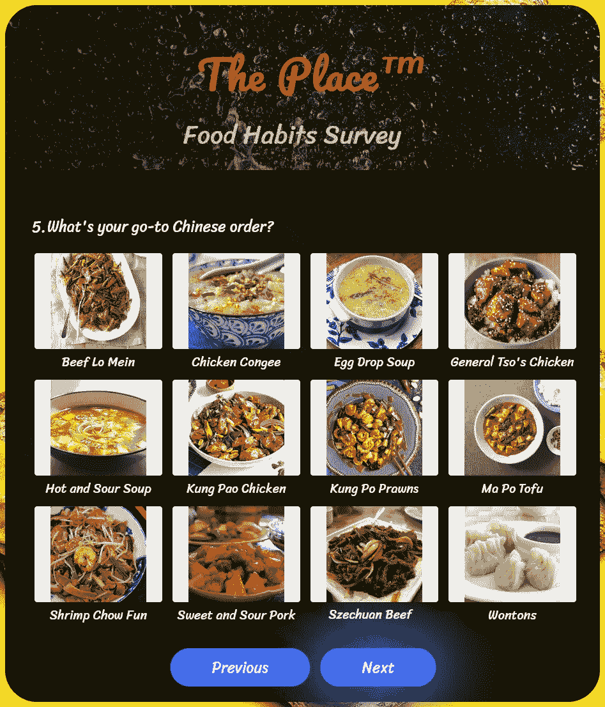
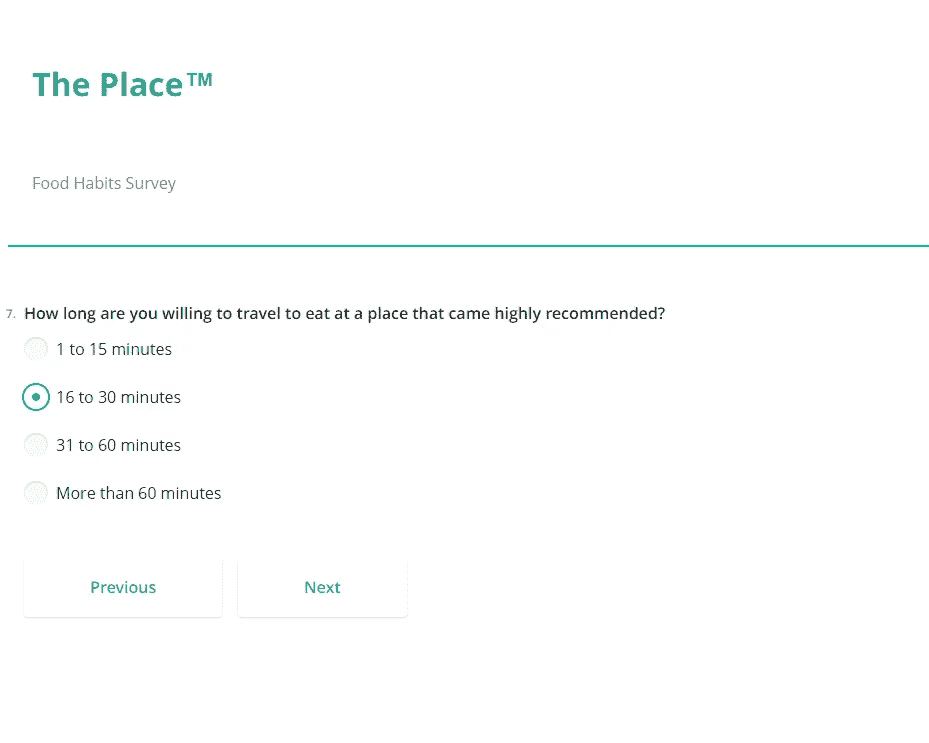
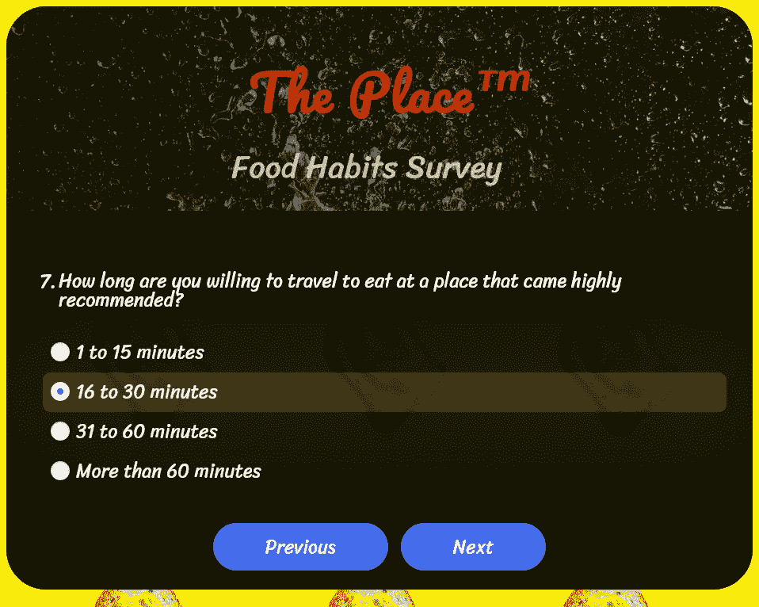
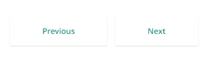

# 如何用 React + REST API + SurveyJS 构建数据驱动的调查

> 原文：<https://javascript.plainenglish.io/how-to-build-data-driven-surveys-with-react-rest-api-surveyjs-eab8c3e87c9d?source=collection_archive---------5----------------------->

## 使用开源的 SurveyJS 和 RESTful 服务构建动态表单和调查。



调查是一种很好的方式来收集你需要的信息，以更好地满足你的用户群，然后将这些数据分解成你需要的任何容易跟踪的指数——对于你的利益相关者会发现有用的模式，或者只是随着时间的推移进行内部监控。

[SurveyJS](https://surveyjs.io/?utm_source=medium&utm_medium=referral&utm_campaign=JS_in_Plain_English_5) 是一个免费的开源( [FOSS](https://en.wikipedia.org/wiki/Free_and_open-source_software) ) JavaScript 库，它让你可以做到所有这些——但更进一步——使用动态的、数据驱动的方法，使用行业标准的 JSON 作为共同点:你将你的调查定义为 JSON 数据模型(“模式”)，并从使用所述数据模型的模板构建表单 UI 元素。

但是这里有什么会真正让你大吃一惊。

SurveyJS 让您可以全身心投入动态性，并从 REST API 中填充任何**值。您的数据源可以通过`choicesByUrl` 属性在**模式本身**中定义。告别由异步 [XMLHttpRequest](https://developer.mozilla.org/en-US/docs/Web/API/XMLHttpRequest) s 行导致的[代码膨胀](https://en.wikipedia.org/wiki/Code_bloat)！**

# 演示

为了证明这给任何设计调查的人带来了多大的方便，让我们为一个虚拟的餐馆建立一个饮食习惯调查，它需要衡量潜在客户群最喜欢的食物和服务期望。

这个例子可以作为你自己在营养咨询、餐馆和快餐店市场调查中的一个很好的起点，或者只是观察人们在外出就餐时的态度差异。

That’s what you’ll be building!

# 入门指南

首先，为您选择的框架安装 SurveyJS 客户端库— [React](https://www.npmjs.com/package/survey-react-ui) ， [Angular](https://www.npmjs.com/package/survey-angular) ， [Vue.js](https://www.npmjs.com/package/survey-vue-ui) ， [Knockout](https://surveyjs.io/Documentation/Library?id=get-started-knockout) —或者如果您不使用框架，请按照这里的说明安装 [**jQuery**](https://surveyjs.io/Documentation/Library?id=get-started-jquery&utm_source=medium&utm_medium=referral&utm_campaign=JS_in_Plain_English_5) 。我们在代码示例中使用 React。

现在，游戏计划是这样的:

1.  我们将使用 SurveyJS 从 RESTful 服务中填充选项的特性，
2.  利用两个 REST APIs， [RESTCountries API](https://restcountries.com/#api-endpoints-v3-all) 和[theme ldb API](https://themealdb.com/api.php)。两者都有一个不需要认证的免费公共层。
3.  一项针对一家旨在成为热门、时尚、文化中心的餐厅的调查需要反映出同样的活力。因此，我们将使用 CSS 进行广泛的定制，将我们看起来很实用的调查变成…这个！



Before and After.

# 但是首先…休息一下。

在我们开始之前，让我们使用两个测试案例快速了解一下 SurveyJS RESTful 服务是如何工作的——我们将使用的两个 API。一个是地理定位，流行的 RESTCountries API，第二个是我们的主要用例，TheMealDB API。

第一，地理定位。这个特定 REST API 的响应格式如下:

如果我们想要国家的通用名称“澳大利亚”，我们可以用`name.common`在这个 JSON 对象中访问这个属性。

所以在我们的模式中，我们将只在`choicesByUrl`属性中定义我们的数据源，指定`valueName` 像这样访问数据:

很简单，对吧？但是如果我们的顶级属性是一个数组而不是一个标准的 JSON 对象呢？我们如何在调查方案中定义这一点？我们显然不能做`meals.strArea`，正如我们在第二个 API 示例中看到的:

这就是`path`地产的用武之地！

与`valueName`一起，您可以访问 REST API 响应中的任何数据。

最后，我们使用 SurveyJS' `ImagePicker` 字段类型，它填充了可供选择的图像网格——当然，所说的选择来自 REST API。除了`path`和`valueName`之外，在编写这个模式时，您还会遇到最后的属性——`titleName`和`imageLinkName`。原则上它们的工作方式完全相同；您可以在响应 JSON 对象中指定属性，分别包括该图像的标题和实际的图像 URL。

我们的 API 响应格式在`strMeal` 中有图像标题，在`strMealThumb`中有图像 URL，所以…

…这些分别是我们对`titleName` 和`imageLinkName`的要求值。

# 开始有趣的事情吧！

明白了吗？很好。让我们开始编码吧。

## 1.调查方案

surveySchema.json

我们在多个页面中有 9 个问题，其中一些填充了我们刚刚谈到的 REST APIs 中的选项。这里还发生了其他一些事情，值得再看一看:

*   **自定义变量。**您可以在 JSON 变量中存储对每个问题的回答(包括问题 9——要求回答者拖放以按照重要性排列服务的各个方面),并在您想要的调查中随时随地使用它们。这可以用于确定后续的问题字符串(如问题 4，它使用问题 3 的答案)、逻辑和 yes — **甚至其他 REST API 调用！**
*   **条件逻辑**。问题 2(国家)是隐藏的，只有在选择了问题 1(地区)中的值时才会弹出。
*   **动态 HTML 生成**动态调查后完成，使用顶级`completedHtml` 属性。我们在这里使用它来显示在`<table>`中选择的答案，但是您甚至可以使用逻辑通过`completedHtmlOnCondition` 属性来有条件地确定 HTML—**基于答案生成标记**！

更重要的是，如果你愿意，你甚至可以使用条件逻辑根据某些答案动态重定向到 URL。例如，根据回答者选择的区域，将他们发送到您公司站点的区域子域。

```
“navigateToUrlOnCondition”: [{“expression”: “{question1} = ‘asia’”,“url”: “https://yourcompanysite.com/region/asia"}]
```

## 2.React 应用程序

App.js

这里没什么特别的。我们导入模式(在一个真实的例子中，您可以从作为后端的代理服务器中检索)，然后使用 SurveyJS 的 React 库中的组件生成一个调查。

在`onComplete`触发器中有 JSON 格式的调查答案，您可以使用它来完成调查后的任何事情。无论是发送 HTTP POST 请求并将其作为有效负载来触发定制的异地行为(例如一个 [webhook](https://en.wikipedia.org/wiki/Webhook) )，将其保存到数据库，还是使用它创建动态可视化；狂野一点。

我们还通过 React 的默认[数据绑定](https://reactjs.org/docs/introducing-jsx.html#embedding-expressions-in-jsx)(花括号)得到了一些基本的 [XSS](https://en.wikipedia.org/wiki/Cross-site_scripting) 保护。

最后，这是我们的 CSS:

styles.css

继续阅读 SurveyJS 文档中的这一部分，了解哪些 CSS 类可以用自定义 CSS 覆盖。

例如，我们的按钮是如何工作的:

First, define custom CSS classes for each UI element you’re using…

…then write them.



Cause and Effect.

# 动态的“构建模块”方法

就这些了，伙计们！希望现在您已经有了一个相当不错的想法，知道如何创建看起来很棒的、灵活的、动态的调查，而不需要为定制的小部件库倾家荡产，或者为定制的解决方案开发自己的 HTML/CSS/JS，这些解决方案不可伸缩，并且不会耗费公司的资源来创建、更新和维护。

因此，通过使用 [SurveyJS](https://surveyjs.io/?utm_source=medium&utm_medium=referral&utm_campaign=JS_in_Plain_English_5) ，我们已经确保:

1.  你没有被束缚在使用的技术栈之间。JavaScript，Python 等。如果技术要求发生变化，就没有灵活的余地。JSON 和 REST 是通用的数据交换格式/标准——使用你想要的任何前端、服务器或数据库技术栈。
2.  您可以**对您的调查进行快速修改和添加，而无需考虑技术专长**，因为 JSON 结构良好，易于理解，编辑它就像编辑文本文件一样。
3.  既然您的**设计层已经与数据和逻辑**完全分离，您就可以按照您认为合适的方式可视化地定制您的调查。通过完全自定义的样式获得创意——无论是 CSS、s CSS、CSS-in-JS，无论哪种都适合您的用例——或者使用 SurveyJS 附带的许多主题之一。

这就是它如此强大的原因。这是一种**优雅的**、**松散耦合、**、**构建模块**的调查/表单创建方法，带来了可伸缩性，并简化了代码维护。

*更多内容请看*[***plain English . io***](https://plainenglish.io/)*。报名参加我们的* [***免费周报***](http://newsletter.plainenglish.io/) *。关注我们关于*[***Twitter***](https://twitter.com/inPlainEngHQ)*和*[***LinkedIn***](https://www.linkedin.com/company/inplainenglish/)*。查看我们的* [***社区不和谐***](https://discord.gg/GtDtUAvyhW) *加入我们的* [***人才集体***](https://inplainenglish.pallet.com/talent/welcome) *。*