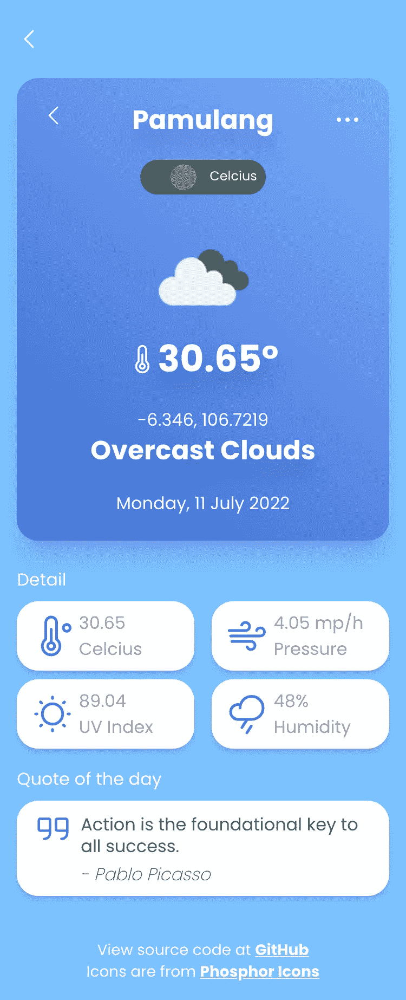

# 如何构建 Vue.js 地理位置天气应用

> 原文：<https://javascript.plainenglish.io/how-to-build-vuejs-geo-location-weather-application-f65f5cc2fa4f?source=collection_archive---------5----------------------->

## 如果你想开始一个副业项目或添加另一个组合到你的堆栈中，诸如 OpenWeatherMap API、Google Maps Embed API、Random Quotes API 和 Hacker News API 之类的开放公共 API 是非常有用的


Homepage of Vue.js Geo Location Weather Application — [https://gerimis-app.vercel.app/](https://gerimis-app.vercel.app/)

# 目录:

*   [简介](#da8d)
*   [目标](#3ee0)
*   [为什么 Vue.js 带有公共 API？](#380d)
*   [安装带有依赖关系的 Vue.js 项目](#e204)
*   [设置 OpenWeatherMap API 键](#1fb8)
*   [设置 Google 控制台地图嵌入 API 键](#e71c)
*   [设置环境变量](#dcdc)
*   [将 OpenWeatherMap API 与 Google Maps 静态 API 相结合](#1572)
*   [为项目编写 app . vue](#0941)
*   [为项目编写实用程序功能](#8a7e)
*   [在 Vuex 商店开发 API 调用库](#1481)
*   [开发页面和路线](#bdd4)
*   [部署应用](#865e)
*   [要做的事情](#8b92)
*   [结论、源代码和演示](#95da)
*   [关闭](#67ee)

# 介绍

基于位置的 web 或 apps 应用程序在任何 web 或移动应用程序中都非常常见。与任何其他功能和服务相结合，可以成为一个真正强大的应用程序。公共 API 为您提供了优势，可以将您的前端开发实践应用到您可以与公众共享的真实项目中。

你可能已经有了 Instagram、Spotify 或其他应用程序的公共 API 提供者。这个故事只是我的一个参考，它具有 OpenWeatherMap API、Google Map Embed API 和使用 Vue.js 的 Hacker News API 的优势，您可能希望在您的下一个项目中注意这些优势。这也可以在 [Nuxt.js 项目](https://medium.com/geekculture/chart-js-in-nuxt-js-how-to-implement-c255a2657b02)中实现，因为该框架是基于 Vue.js 的。


Splashscreen and Detail page on Vue.js Geo Location Weather Application — [https://gerimis-app.vercel.app/](https://gerimis-app.vercel.app/)



Features on Vue.js Geo Location Application — [https://gerimis-app.vercel.app/](https://gerimis-app.vercel.app/)

# 目标

了解如何利用和优化公共 API 来创建和构建网站应用程序项目。

清楚地使用浏览器 API 功能，这些功能可以在任何带有 Vue.js 的浏览器中使用。为您的网站项目创建一些有用的东西，并了解其背后的流程和机制。


Browser access permission feature to ask location on your devices — [https://gerimis-app.vercel.app/](https://gerimis-app.vercel.app/)

通过浏览器访问权限处理来自应用程序的请求权限，以便从浏览器使用地理位置 [API。](https://medium.com/@code-road/online-and-offline-detection-web-navigator-api-using-vuejs-5b7262ae016c)

# 为什么要用公共 API 的 Vue.js？

***Vue.js*** 是由尤雨溪创建的一个流行的开源 JavaScript 框架，已经获得了一个庞大的开发者社区。有一个大的生态系统来支撑，就很好理解了。


Vue.js The Progressive JavaScript Framework

## 公共 API

***公共 API***服务可在他们的项目中公开使用，以满足各种需求。这涉及到他们想要使用并集成到应用程序中的服务，但需要他们的应用程序中没有的第三方服务。

[***Google Maps Embed API***](https://developers.google.com/maps/documentation/embed/map-generator)由 Google 提供，是一种将地图嵌入到你的网站中的服务，并且是免费的。谷歌在地图服务和其他优秀服务方面大有可为。


[Maps Embed API](https://developers.google.com/maps/documentation/embed/)

[***OpenWeatherMap***](https://openweathermap.org/)是一个基于位置的天气 API，它可以为您提供关于您在项目中从经纬度坐标指向 API 的任何位置的天气信息。对于开始一个新的项目或投资组合，这将是一个良好的开端，以建立一个具有天气或基于位置的 API 功能的应用程序。[【转到顶部】](#e819)


[https://openweathermap.org/](https://openweathermap.org/)

[***HackerNews API***](https://github.com/HackerNews/API)**是为开发者创建自己版本的不同于原版的 hacker news 网站而创建的。从 HackerNews 网站获取数据的许多完整功能和格式在原始网站上也可以获得。[【转到顶部】](#e819)**

****

**[https://news.ycombinator.com/](https://news.ycombinator.com/)**

# **安装带有依赖项的 Vue.js 项目**

**Vue.js 版本 2 对于我们的项目至关重要，通过 Vuex 和 Vue 路由器进行状态管理，使我们的应用程序可以通过客户端浏览器访问。至于这个写法，我用的是 app 用的 ***vue@2.6.11*** 。**

**我将为这个应用程序使用[***TailwindCSS***](https://tailwindcss.com/docs/utility-first)，因为这将基于移动优先的设计。我正在使用这些来自磷光图标的美妙图标作为这个应用程序中使用的图标。**

**其他模块是 Vue.js 安装的默认基础。既然我们要使用本地存储进行数据管理的例子，这是一个从 Mike Street 开始使用本地存储的好例子[***Vuex***](https://www.mikestreety.co.uk/blog/vue-js-using-localstorage-with-the-vuex-store/)。**

**这是`package.json`文件中列出的所有节点模块:**

**package.json Vue.js Geo Location Weather Application**

**键入`yarn install`或`npm install`为该项目安装节点模块。之后，我们需要从 OpenWeatherMap 和 Google Map Embed API 设置一些配置。模块安装完成后，通过键入`yarn serve`或`npm run serve`开始运行项目开发。[【转到顶部】](#e819)**

**使用`tree`命令的目录结构:**

```
.
├── babel.config.js
├── jsconfig.json
├── package.json
├── postcss.config.js
├── public
│   ├── favicon.ico
│   ├── favicon.png
│   └── index.html
├── src
│   ├── App.vue
│   ├── assets
│   │   ├── css
│   │   │   └── tailwind.css
│   │   └── icon-search.svg
│   ├── components
│   │   ├── Dashboard.vue
│   │   ├── Detail.vue
│   │   ├── Home.vue
│   │   ├── Search.vue
│   │   └── global
│   │       └── Footer.vue
│   ├── constants
│   │   ├── actionTypes.js
│   │   ├── env.js
│   │   └── statusTypes.js
│   ├── main.js
│   ├── store
│   │   └── index.js
│   └── utils
│       └── index.js
└── tailwind.config.js
```

# **设置 OpenWeatherMap API 密钥**

**登录或注册 [OpenWeatherMap](https://openweathermap.org/) 获取该应用的密钥。单击菜单中的 My API keys，然后单击 Generate 创建一个密钥。**

****

**OpenWeatherMap API Dashboard on Vue.js Geo Location Weather Application**

# **设置 Google 控制台地图嵌入 API 密钥**

**登录到您的谷歌开发控制台浏览 API 部分，并启用地图嵌入 API 将在此应用程序中使用。Google API 有 1000 个免费使用的请求率限制，除此之外，他们会向你收取费用，让你继续使用他们的 API。**

**出于这个目的，因为我们将使用嵌入式 API，这些不会有问题，因为它们为这个 API 提供了无限制的请求，而没有成本。这里是[链接](https://mapsplatform.google.com/pricing/)到 Google API 服务成本。**

****

**Google Cloud Platform Developer Console**

**一旦您创建了 Maps Embed API 访问键并在您的项目中使用它们，您将能够在 Google APIs 仪表板上查看有多少请求。**

****

**Google Cloud API & Services Dashboard**

**之后，浏览凭证部分，有一些设置允许您将使用此 API 服务的网站列入白名单。在字段中管理您的网站 URL，这些 URL 将可供 Google map API 使用。复制你的 API 密匙并写在`.env`文件的**VUE _ 应用程序 _ API _ GMAP _ 密匙**部分。[【转到顶部】](#e819)**

# **设置环境变量**

**在 Vue.js 项目根目录下创建`.env.local`,或者从`.env.local-example`文件中复制文件和变量。git 会自动忽略它，将文件提交到您的存储库中。从 Vue.js 官方文档和最佳实践来看，不要将敏感变量放入`.env`文件中，尤其是放入开放的公共 git 存储库中。**

**如果您使用的是 Vercel 或任何 Jamstack 静态主机，它们通常会为任何项目提供设置，以便将您的服务器环境变量放入它们的主机中。**

```
**VUE_APP_API_OMAP_KEY** = YourRandomOmapKeyAPI
**VUE_APP_API_GMAP_KEY** = YourRandomGmapEmbedAPI
```

**这些变量可以在源代码[的`.env.local-example`中找到，这里是](https://github.com/devcoderoad/gerimis-app/blob/main/.env.local-example)。用官方的 API 键替换变量。[【转到顶部】](#e819)**

# **将 OpenWeatherMap API 与 Google Maps 静态 API 结合使用**

**在`src/constants/env.js`中打开或创建一个文件，从谷歌开发者控制台和 OpenWeatherMap 中编写 URL 和密钥变量。**

**`.env`文件上的变量将通过`process.env.VUE_APP_API_OMAP_KEY`和`process.env.VUE_APP_API_GMAP_API`语法从 Vue 文件中暴露出来。**

```
export const API_OMAP_BASE = 'https://openweathermap.org/'
export const API_GMAP_BASE = 'https://www.google.com/'export const API_OMAP_URL = 'https://api.openweathermap.org/data/2.5/weather?'
export const API_GMAP_URL = 'https://www.google.com/maps/embed/v1/place?'export const API_OMAP_KEY = process.env.**VUE_APP_API_OMAP_KEY**
export const API_GMAP_KEY = process.env.**VUE_APP_API_GMAP_KEY**
```

**这些变量可以在`./constants/env.js`的源代码[这里](https://github.com/devcoderoad/gerimis-app/blob/main/src/constants/env.js)中找到。[【转到顶部】](#e819)**

# **为项目编写 App.vue**

**默认的`App.vue`将处理应用程序中的主界面和`<router-view>`组件。这将在 Vue.js 项目应用程序中加载所有必要的状态、变量和错误处理。**

**App.vue from the Vue.js application**

# **为项目编写实用程序功能**

**为任何项目编写实用程序都变得很重要，因此您不必在源代码文件中编写重复的函数代码。这种做法还有助于优化项目文件的大小。**

**在`./src/utils/index.js`目录中创建或添加一个文件，并放入任何可以在任何文件中使用的实用程序代码。[【转到顶部】](#e819)**

**Utility files in Vue.js application**

# **开发 Vuex 商店中的 API 调用库**

**对于 Vue.js 中的状态和商店管理，使用[***Vuex***](https://vuex.vuejs.org/)已经涵盖了我们设置这个项目所需要的一切。**

**我使用 javascript ***fetch*** 方法来处理对 API 服务器的请求，但是您可以为请求选择一个库，如 ***Axios*** 。**

**Vue.js 在`./store/index.js`中有一个默认的状态管理目录:**

**Vue and Vuex store in Vue.js application**

**商店将处理来自 ***API_OMAP_URL*** ， ***API_OMAP_KEY*** ， ***API_NEWS_URL*** ，***API _ QUOTE _ URL***的请求，然后将响应映射到状态。[【转到顶部】](#e819)**

# **开发页面和路线**

************

**Search feature and listing on Vue.js Geo Location Weather Application — [https://gerimis-app.vercel.app/](https://gerimis-app.vercel.app/)**

************

**Pages and Routes in Vue.js Geo Location Weather Application — [https://gerimis-app.vercel.app/](https://gerimis-app.vercel.app/)**

**使用 Vue 路由器`vue-router`设置路由，以提供应用程序中可用的所有页面路由。打开 Vue.js default `src\main.js`，包含必要的导入，定义所有的路线。**

## **页**

1.  ****Home.vue**
    Home 将是 Vue.js Gerimis 应用程序上的闪屏。点击[此处](https://github.com/devcoderoad/gerimis-app/blob/main/src/components/Home.vue)查看 Vue.js 源码链接。**
2.  **Dashboard.vue 点击[此处](https://github.com/devcoderoad/gerimis-app/blob/main/src/components/Dashboard.vue)查看 Vue.js 源码链接。**
3.  ****Detail.vue** 点击[这里](https://github.com/devcoderoad/gerimis-app/blob/main/src/components/Detail.vue)查看 Vue.js 源码链接。**
4.  ****Search.vue** 点击[这里](https://github.com/devcoderoad/gerimis-app/blob/main/src/components/Search.vue)查看 Vue.js 源码链接。**

## **路线**

**由于该应用程序有五个页面，因此路由也将由五个路由组成，定义如下:**

**main.js file for Vue.js routes**

**[【转到顶部】](#e819)**

# **部署应用程序**

*****Vercel*** 和 ***Netlify*** 可用于向公众部署本网站。他们为任何基于 JavaScript 的框架提供免费的静态网站托管。**

********

**NuxtJS build and start command in Vercel and Netlify**

**登录到 Vercel 或 Netlify 仪表板，使用 ***build*** 或 ***start*** 命令设置您的存储库、环境变量和分支。根据您的框架，如***nuxt . js***,`generate`命令将构建静态文件。**

**您在`.env`中的凭证环境产品应该转到这些服务设置。**

**Vue.js 的构建和部署命令默认为`yarn serve`或`npm run serve`。Vercel 将自动检测或读取 Vue.js 应用程序中的`package.json`文件中的`scripts`。**

****

**Vue.js build and deployment settings**

**在 build 命令之后， ***Vercel*** 或 ***Netlify*** 会通知你你的网站已经上线并部署了。[【转到顶部】](#e819)**

# **要做的事情**

**我们可以做几件事来改进这款应用:**

1.  **升级到具有新功能的 Vue 3。**
2.  **提高 API 调用的加载速度。**
3.  **添加新功能，如设置页面。**

**[【转到顶部】](#e819)**

# **结论、源代码和演示**

**由此得出结论，Vue.js web 应用程序可以处理来自浏览器 API 的地理定位功能，并与其他公共 API 相结合。**

**你可以使用基于 Vue.js 的 Nuxt.js 框架来使用它，Nuxt 有[方便有用的模块](https://medium.com/geekculture/11-handy-nuxt-modules-for-your-nuxt-js-21c686485e08)和[优秀的入门 UI 主题](https://medium.com/geekculture/chart-js-in-nuxt-js-how-to-implement-c255a2657b02)，比如 Vuetify 和 Chakra UI。**

**下面是这个 Vue.js 地理位置天气应用的 [***源代码***](https://github.com/devcoderoad/gerimis-app) 和 [***演示***](https://gerimis-app.vercel.app/) 链接。[【转到顶部】](#e819)**

## **另请阅读:**

**[](https://medium.com/geekculture/11-handy-nuxt-modules-for-your-nuxt-js-21c686485e08) [## 在你的 Nuxt.js 中考虑这 11 个有用的模块

### Nuxt.js 是一个非常强大的 Vue.js 框架，得到了社区的大力支持。

medium.com](https://medium.com/geekculture/11-handy-nuxt-modules-for-your-nuxt-js-21c686485e08) [](https://code-road.medium.com/next-js-and-reactstrap-admin-dashboard-project-e32ff3205eb2) [## Next.js 和 Reactstrap 管理仪表板项目

### React、SSR(服务器端渲染)和静态导出是 Next 的众多优势之一。JS 框架特性…

code-road.medium.com](https://code-road.medium.com/next-js-and-reactstrap-admin-dashboard-project-e32ff3205eb2) [](https://code-road.medium.com/introducing-mysql-docker-container-for-mysql-workbench-and-phpmyadmin-8fe1e599d82a) [## MySQL 工作台和 PhpMyAdmin 的 MySQL Docker 容器简介

### 用 MySQL Workbench 和 phpMyAdmin 连接 Docker 容器中的 MySQL 数据库进行数据库管理

code-road.medium.com](https://code-road.medium.com/introducing-mysql-docker-container-for-mysql-workbench-and-phpmyadmin-8fe1e599d82a) 

# 关闭

当与公共开放 API 或[浏览器 API](https://medium.com/@code-road/online-and-offline-detection-web-navigator-api-using-vuejs-5b7262ae016c)结合使用时，使用 Vue.js 等 JavaScript 框架的 Web 应用程序开发变得既有挑战性又很诱人。通过浏览器地理定位 API 的附加功能，该应用程序变得对用户具有交互性。[【前往顶端】](#e819)

请[关注我](https://code-road.medium.com/membership)以获得更多 web 开发的技巧和诀窍，谢谢！

*更多内容看* [***说白了就是 io***](https://plainenglish.io/) *。报名参加我们的* [***免费周报***](http://newsletter.plainenglish.io/) *。关注我们关于*[***Twitter***](https://twitter.com/inPlainEngHQ)**和*[***LinkedIn***](https://www.linkedin.com/company/inplainenglish/)*。查看我们的* [***社区不和谐***](https://discord.gg/GtDtUAvyhW) *加入我们的* [***人才集体***](https://inplainenglish.pallet.com/talent/welcome) *。****