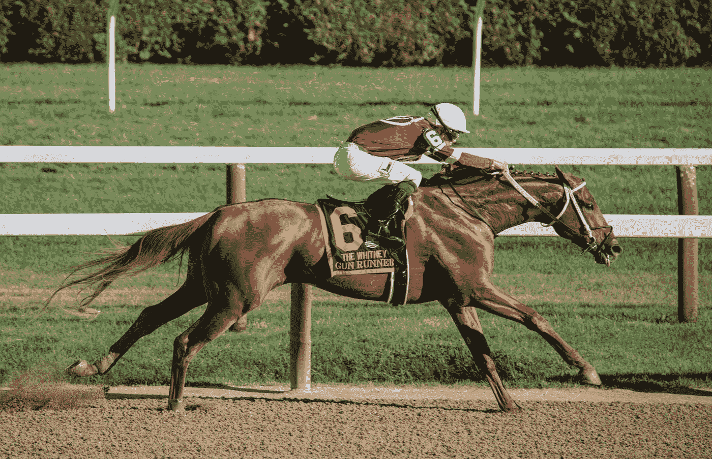

# 如何用 Zed Run 克隆平台建立你的数字赛马事业？

> 原文：<https://javascript.plainenglish.io/how-to-build-your-digital-horse-racing-venture-with-a-zed-run-clone-platform-511806e26507?source=collection_archive---------12----------------------->

## 你是那个决心为赛马开创一个基于 Web 3.0 的市场的企业家吗？创建 Zed 运行克隆。

马术运动现在也进入了元宇宙。骑马者可以参加活动，建造马厩，也可以繁殖小马和种马。哪一个平台是所有这些活动发生的地方？这是泽德润。游戏平台在多边形边链上的以太坊区块链网络上运行。你是那个决心为赛马开创一个基于 Web 3.0 的市场的企业家吗？创建 Zed 运行克隆。

Photo by [Alice Donovan Rouse](https://unsplash.com/@alicekat?utm_source=medium&utm_medium=referral) on [Unsplash](https://unsplash.com?utm_source=medium&utm_medium=referral)

# **Zed 运行克隆脚本的核心特性是**

*   **直播仪表盘—** 骑手们可以看到全球各地正在进行的赛马比赛。他们可以看到以太坊(ETH)的浏览量、距离、位置和奖池。此外，用户可以点击语音、自动摄像头和声音等选项来增强他们的观看体验。
*   **即将举行的比赛部分—** 重要的是，体育迷可以通过点击日程选项查看未来比赛的列表。他们将获得关于比赛名称、类别、美元奖金以及剩余门数的结果。随后，如果有任何空位，骑手可以在 [**Zed Run like 平台**](https://www.appdupe.com/zed-run-clone) 上参加比赛。
*   **创建稳定选项—** 用户可以在 Zed Run like 平台上毫不费力地开发一个健壮的稳定选项。他们可以选择他们的 MetaMask 软件钱包，也可以同步他们的 Magic Link 帐户。这使他们能够轻松地验证自己的身份。
*   **众多过滤器—** 骑手可以通过使用过滤器和搜索机制轻松发现一系列的公马和母马。他们可以选择世代(数量方面)、血统(中本聪、萨博、芬尼和布特林)、性别(小马和种马)和品种(创世、传奇、独家、精英和杂交)。而且，准赛马爱好者可以根据价格(从最高到最低，最近上市，即将到期)来整理收藏品。
*   **帮助中心—** 毫无疑问，几分之差将决定赛马的胜负。他们可以联系帮助台，并获得专门的帮助，如购买和出售马匹、创建马厩、参加竞赛和处理点对点(P2P)交易。
*   **分级区—** 像 NFT 市场这样的 Zed 运行是以分级机制运行的。一般来说，赛马应该参加最少数量的比赛，以获得进入下一阶段的资格。排名靠前的马可以根据它们的排名在锦标赛中一决高下。在 Zed Run clone 脚本上完成比赛后会发生什么？短跑运动员、中跑运动员和马拉松运动员将被安排在不同的位置。体育爱好者将收到有关比赛次数、平均积分、以美元(USD)为单位的奖金、级别、获胜百分比以及最近 5 场比赛的名次的数据。
*   **实时聊天选项—** 用户可以与其他玩家互动，并知道在参加赛马时应该遵循的策略。他们可以利用实时聊天工具，获得对他们问题的回复。

此外，骑手们可以在“问我任何事(AMA)”环节分享他们的观点。这有助于他们收集虚拟赛马，按照规则和规定玩游戏，并在成功完成比赛后轻松地从他们的数字钱包中提取资产。有什么好处？您可以通过实时共享所有信息来构建一个强大的社区。

Photo by [Keith Luke](https://unsplash.com/@lukephotography?utm_source=medium&utm_medium=referral) on [Unsplash](https://unsplash.com?utm_source=medium&utm_medium=referral)

# **起源和花名册:分析赛马如何繁殖和比赛**

**第一代马—** 它们被称为创世马。一般来说，在分散的生态系统中，马的数量是有限的。骑手将获得数据，如整体稀有性(超级稀有)、可用性(非常低)、基因型纯度(百分比)和血统稀缺性。投资者如何购买赛马？他们可以直接从主要平台购买，也可以在 NFT 市场如 OpenSea 上竞价购买。

准备好比赛的马——通常情况下，最先起跑的人有优势赢得比赛。所有购买或饲养的马匹都将显示在这个仪表板上。它显示了马的名称、血统、性别(小雌马、小马、公马和母马)、上市日期和时间、品种(创世纪、传奇、独家、精英、杂交)和交易历史等数据。

Photo by [Guillaume de Germain](https://unsplash.com/@guillaumedegermain?utm_source=medium&utm_medium=referral) on [Unsplash](https://unsplash.com?utm_source=medium&utm_medium=referral)

# **Zed Run 如何在 2022 年为骑马者提供下一代体验？**

*   **新的评分系统—** 所有的马在比赛结束后都会得到一个基于位置的评分。重要的是，它取决于比赛领域、过去的表现以及比赛中的班级数量等因素。
*   **原生代币—** 玩家可以使用 Zed Run 代币进行支付并参与激烈的挑战。例如，Zed Run 与一家筹款活动企业 Republic Crypto 合作。骑手可以利用这些数字资产参与活动，赢得与现有骑手的战斗，并获得奖金。
*   **令牌分发—** 将组织空投活动。因此，Zed Run 代币的持有者将获得专属的皮肤饰品和活动通行证。重要的是，这个策略取决于赛马的数量、拥有时间和马的种类。代币有优惠分配吗？是啊！赛马的活跃马主和长期持有者将实时收到 Zed Run 代币。除此之外，赛马的买家和卖家可以获得与马的繁殖、比赛、买卖相关的全天候技术支持。

Photo by [Jeremy Bishop](https://unsplash.com/@jeremybishop?utm_source=medium&utm_medium=referral) on [Unsplash](https://unsplash.com?utm_source=medium&utm_medium=referral)

# **生命终结(EOL)选项是虚拟赛马的未来吗？**

每个骑手都讨厌自己的马退役。然而，Zed Run 将在 2022 年推出一项创新功能。你猜怎么着？稳定的主人可以永久牺牲他们对虚拟马的所有权。因此，国库中储存的小马和种马的数量发生了变化。

然而，Zed Run 将在 2022 年推出一项创新功能。你猜怎么着？稳定的主人可以永久牺牲他们对虚拟马的所有权。因此，国库中储存的小马和种马的数量发生了变化。

这样有利吗？当然了。是啊！它导致赛马数量的通货紧缩趋势。此外，乘客可以通过从最初购买中回收价值来赚取利润。

# **收尾**

Zed Run 正在继续改变赛马的模式。它还计划推出租赁选项，以吸引更大的社区。有趣的是，Zed Run token 将获得更多的效用，因为利润可以从未售出的 Genesis 赛马中获得。

奖励分配给租房的人和剩下的社区成员。你想让马术运动变得更好吗？与白牌 NFT 市场开发公司联系，尽快创建一个 [**Zed Run like 平台**](https://www.appdupe.com/zed-run-clone) 。

*更多内容看* [***说白了。报名参加我们的***](http://plainenglish.io/) **[***免费周报***](http://newsletter.plainenglish.io/) *。在我们的* [***社区不和谐***](https://discord.gg/GtDtUAvyhW) *获得独家获取写作机会和建议。***