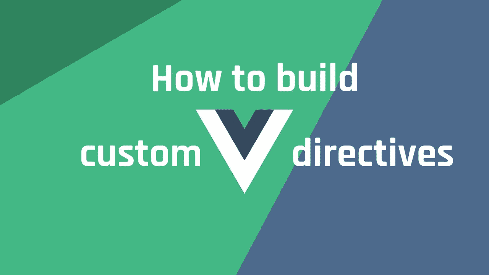
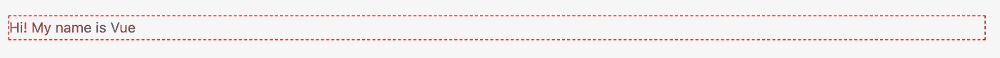

# 如何在 2 分钟内在 Vue 3 中构建自己的自定义指令

> 原文：<https://javascript.plainenglish.io/how-to-build-your-own-custom-directive-in-vue-3-in-2-minutes-dd94f4e5be01?source=collection_archive---------6----------------------->

## 关于如何在几分钟内开始在 Vue.js 中构建自己的自定义指令的指南。



您可能已经知道，Vue.js 附带了许多不同的本机指令，您可以使用它们。还有指令如***v-代表*** 、 ***v-if*** 、 ***v-show*** 等等。这些都超级厉害，真的很有用。但是，在某些情况下，您可能需要创建自己的自定义指令，因为您想要某种非 Vue 内置的功能。

幸运的是，在 Vue.js 中构建自定义指令非常简单。在本文中，我将向您展示如何在几分钟内开始构建您自己的自定义指令。

# 构建自定义指令

为了使本文尽可能简单，我们将构建一个非常简单的指令，用我们自己选择的颜色为元素添加虚线边框。这应该会让您在构建定制指令方面有一个良好的开端。这个例子可能不是您在实际应用程序中会做的事情，但同样，这只是为了演示如何创建一个指令。一旦您掌握了如何构建它们，我相信您可以从那里扩展并开始制定更高级的指令。

首先，我们需要利用 ***app*** 上的 ***指令()*** 功能。这需要两个论据。指令的名称和指令本身。让我们试着设置一下。首先打开 ***src*** 文件夹中的 **main.ts(或 js)** 文件

```
....const app = ***createApp***(App);//Register the directive + functionality
app.directive("dashed-border", {
  beforeMount: (el, { value }) => {
    el.style.border = `1px dashed ${value}`;
  },
});
```

正如你在上面的例子中看到的，我们注册了一个名为**虚线边框**的指令，它具有一些功能。您可能会注意到，我们正在获取想要应用该指令的元素，并为其添加一些样式。

这允许我们在 HTML 元素上使用它，如下所示:

```
<div **v-dashed-border**="'#f00'">Hi! My name is Vue</div>
```

如果您运行这个，您应该能够看到如下内容:



干得好！你现在有了一个工作指令。
请注意，红色边框来自向元素添加指令时指定的参数:

```
<div v-dashed-border="'#f00'"> <----- The red color
```

现在，假设您有许多不同的指令， **main.ts** 文件将很快变得混乱。一个好主意是将每个指令拆分到各自的文件中。为此，请创建一个新的。ts 文件—将其保存到:**指令/虚线边框. ts** 中，并添加以下代码:

```
import { App } from 'vue';

const directiveDashedBorder = (app: App<Element>) => {
  return app.directive("dashed-border", {
    beforeMount: (el, { value }) => {
      el.style.border = `1px dashed ${value}`;
    },
  });
}

export default directiveDashedBorder;
```

为了利用这一点，我们需要稍微改变一下要点:

```
.....
import directiveDashedBorder from './test-directive';const app = ***createApp***(App);// Custom directives
directiveDashedBorder(app);
```

再次运行您的应用程序，您应该会看到与之前相同的结果。
这一切！看看开始构建自己的定制指令有多容易？我很好奇你下一步会构建什么指令？请在评论中让我知道。

感谢你的阅读，我希望你喜欢这篇文章，如果是的话，请点击按钮支持我。

*附注:首先，你应该在收件箱里收到我的帖子。* [***做到这里*** *！*](https://nickychristensen.medium.com/subscribe)

*其次，如果你自己喜欢体验媒介，可以考虑通过报名成为会员* *来支持我和其他成千上万的作家* [***。*通过这个链接**](https://nickychristensen.medium.com/membership) **[***报名***](https://nickychristensen.medium.com/membership) *，你就直接用你的一部分费用支持我，不会多花你多少钱。如果你这样做了，万分感谢。***

[](https://medium.com/js-dojo/vue-3-tips-tricks-d820b04f452f) [## Vue 3 提示和技巧

### 使用这些提示和技巧，成为更好、更高效的 Vue 开发人员

medium.com](https://medium.com/js-dojo/vue-3-tips-tricks-d820b04f452f) [](https://blog.devgenius.io/convert-text-to-speech-with-javascript-using-the-web-speech-api-97bc2a9df75d) [## 使用 Web Speech API 通过 JavaScript 将文本转换为语音

### 如何用几行 JavaScript 轻松地将文本转换成语音。

blog.devgenius.io](https://blog.devgenius.io/convert-text-to-speech-with-javascript-using-the-web-speech-api-97bc2a9df75d) [](/how-to-conditionally-add-properties-to-an-object-with-javascript-in-2-minutes-7cce88b316b4) [## 如何在 2 分钟内用 JavaScript 有条件地向对象添加属性

### 您是否曾经遇到过想要有条件地给对象添加属性的情况？有几种方法可以…

javascript.plainenglish.io](/how-to-conditionally-add-properties-to-an-object-with-javascript-in-2-minutes-7cce88b316b4) 

*如果你想找个时间和我聊聊，可以关注我的*[*Twitter*](https://twitter.com/nickycdk)*|*[*LinkedIn*](https://www.linkedin.com/in/dknickychristensen/)*或者直接访问我的* [*网站*](https://nickychristensen.dk/) *。*

*更多内容请看*[***plain English . io***](https://plainenglish.io/)*。报名参加我们的* [***免费周报***](http://newsletter.plainenglish.io/) *。关注我们关于*[***Twitter***](https://twitter.com/inPlainEngHQ)*和*[***LinkedIn***](https://www.linkedin.com/company/inplainenglish/)*。加入我们的* [***社区不和谐***](https://discord.gg/GtDtUAvyhW) *。*