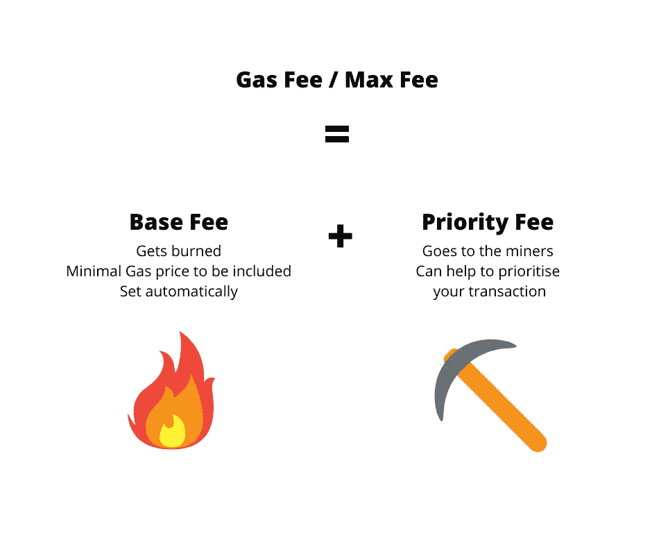
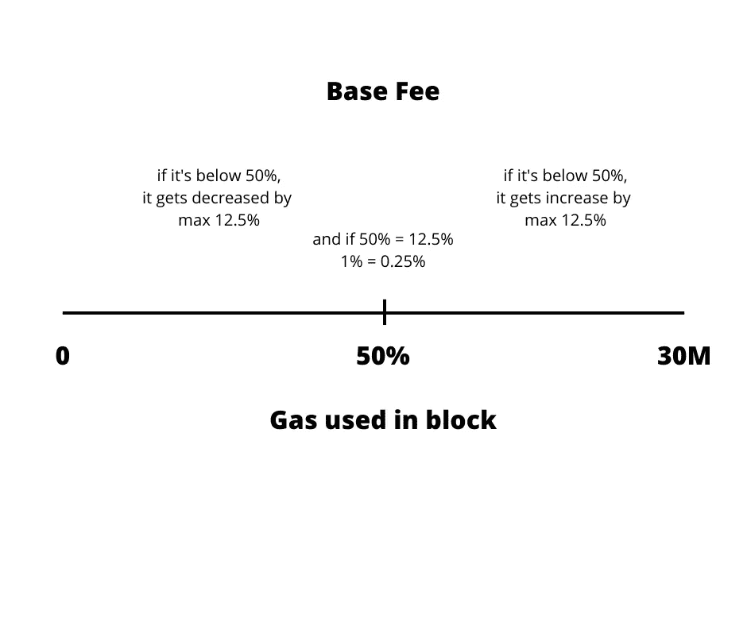
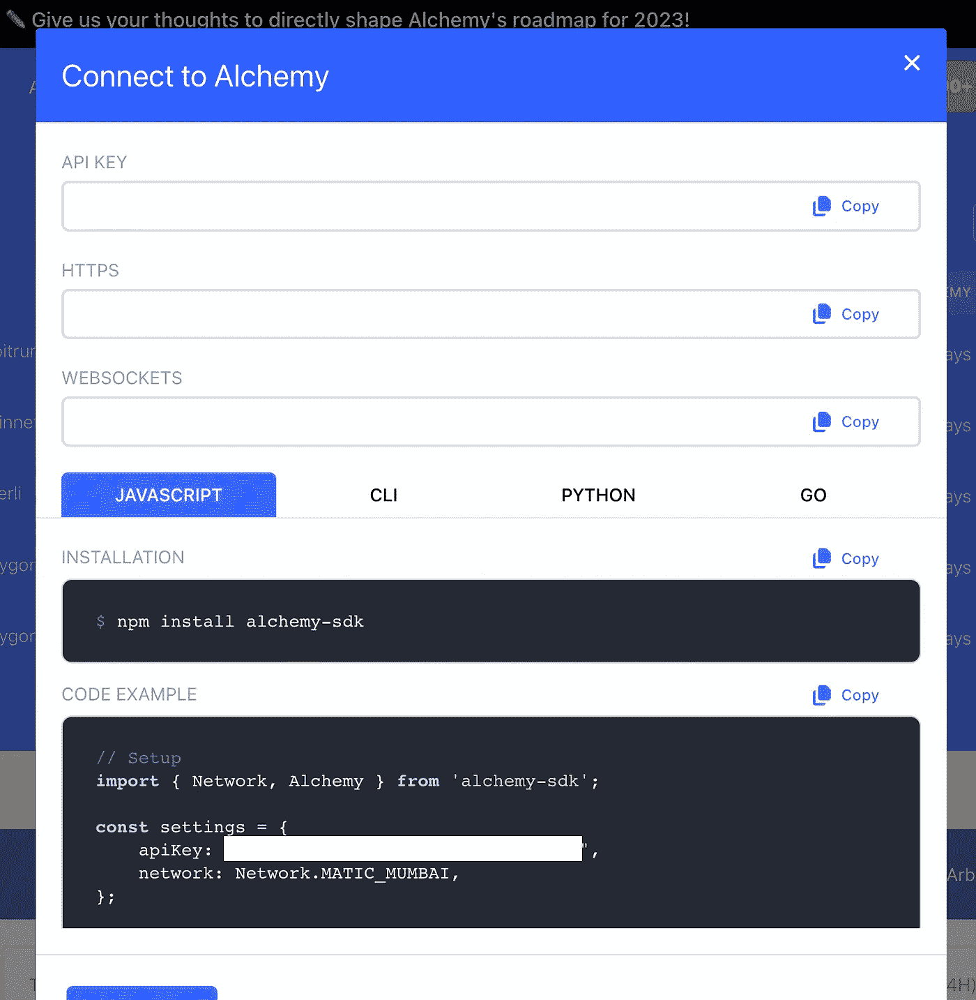
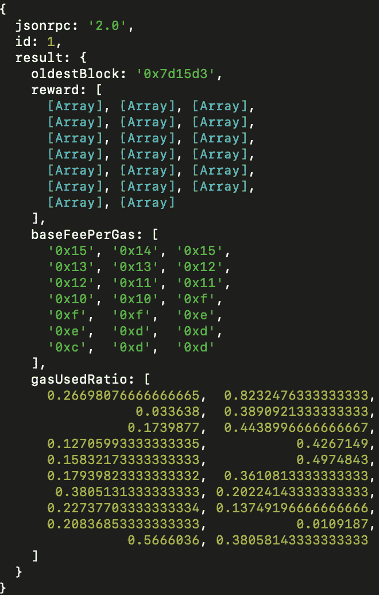
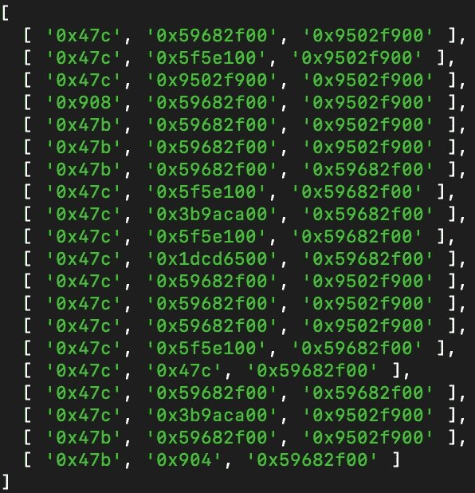
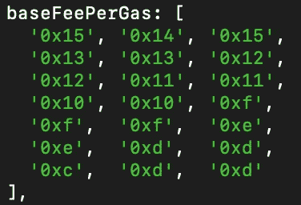
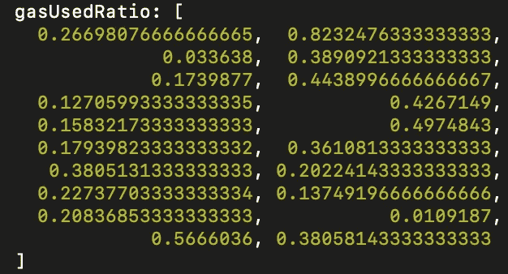
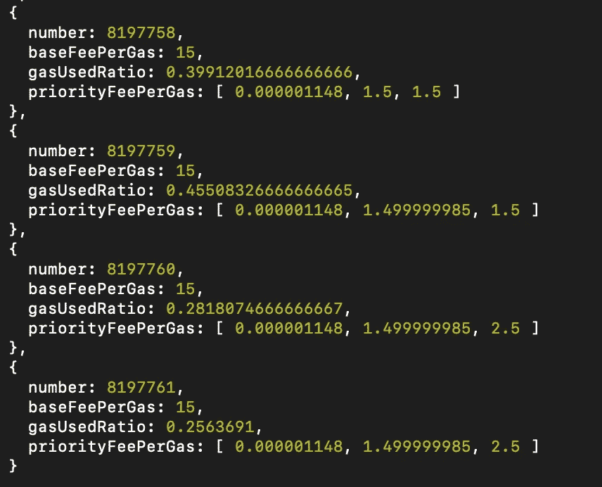
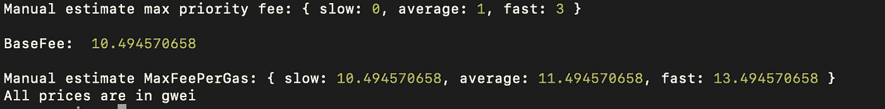

# 如何构建自己的气体估算器—以太坊 EIP-1559

> 原文：<https://javascript.plainenglish.io/how-to-build-your-own-gas-estimator-ethereum-eip-1559-4c340cf8992b?source=collection_archive---------14----------------------->

## 使用 Alchemy，即最流行的区块链提供商，JavaScript 和 ethers 库


Build your own gas estimator with JS and Alchemy

让我向您展示如何创建您自己的天然气估算器，以确保您的交易将被包括在内，并尽可能具有成本效益。顺便说一句，如果你只是为了一个解决方案而来，完整的脚本可以在文章末尾找到。

## EIP 之后的气体类型和理论——1559



Different types of fees that we specify in EIP 1559

首先，让我们把理论提高到足够的水平，这样你就可以知道发生了什么，以及如何正确使用它。自从 EIP-1559 合并以来，气体机制发生了变化。我们有两种费用:

**基本费用:**由网络自行确定。怎么会？每个区块都有一个用气量限制，设置为 30M，所以可以是 0 到 30M 之间的一个数字。如果气体使用比率，即根据最大值使用的气体百分比超过 50%，则增加 12.5%，如果低于最大值，则减少 12.5%，如果正好为 50%，则保持不变。简单计算，结果是 50%的 1%的变动和基本费用增加或减少 0.25%。



Base fee determination

**优先权费:**另一方面优先权费是矿工的。所以才叫优先。如果你想成为第一，你需要付钱。发送交易的最常见方式是指定优先费用，因为基本费用会自动设置。

**最高费用:**告诉你总共要花多少钱，即基本费用+优先费用。

## 如何估计你需要多少汽油

“估计”是这里的关键词。你永远不知道你需要多少优先权费才能被收录，但是你可以非常接近。在这种情况下，非常接近通常就足够了。这是我们将遵循的三步流程:

1.  获取最后 x 块费用信息
2.  重组它，这样更容易从信息中得出结论
3.  退回估价

## 建立

因为我们使用炼金术，你需要做的第一件事就是获得你的 API 密匙/ URL。你可以通过进入 [alchemy dashboard](https://alchemy.com/?r=e4ff0bfe-6af8-4b99-aed8-ed199ae6cc2a) (是的，这是一个参考链接)，为你想要的任何网络创建一个应用程序，并获得你需要的东西。



Alchemy Keys Modal

## 获取最后 20 块费用信息

Fetchfees script



Data we get back

为什么是 20 个历史街区？因为这是大多数商业解决方案(ethers、web3 等)的数量。)使用。这里的要点是获取足够的数据以得出有意义的结论。每个参数是什么意思？让我们深入研究一下。

## **奖励**



Reward array

这些数组代表什么？他们告诉我们什么是优先权费的门槛，用在一个给定的百分位数。我们将其指定为 params 的最后一个参数。为什么是 1、50、90？这又是一个试错的问题。我启动了一个多边形加油站，并正在调整它。

```
const { data } = await axios.post(URL, {
  id: 1,
  jsonrpc: "2.0",
  method: "eth_feeHistory",
  params: [historicalBlocks, "latest", [1, 50, 90]],
});
```

百分位数告诉我们什么是给定百分比的优先费用。基本上，这意味着如果 0x9502f900 是[1，50，90]数组中的最后一个，那么如果您发送具有该优先级费用的事务，它将有 90%的可能性被包含在下一个块中。

## 每气基本费用



baseFeePerGas return parameter

第一块是最新的一块，即最近的一块。因为基本费用是自动设定的，所以历史费用并不那么有用。也许你会知道如何进一步使用它，所以我就把它留在这里。

## 气体使用比率



Gas Used Ratio

由于这个参数，我们能够判断下一个块的基本费用是大于还是小于前一个。不过，你只需要最后一个。

## 重组

通常，我们希望以更有用的方式组织数据。归根结底，代码的简单性很重要。这正是 formatFeeHistory 函数的作用。

```
function formatFeeHistory(result) {
  let blockNum = Number(result.oldestBlock);
  let index = 0;
  const blocks = [];

  while (blockNum < Number(result.oldestBlock) + historicalBlocks) {
    blocks.push({
      number: blockNum,
      baseFeePerGas: Number(result.baseFeePerGas[index]),
      gasUsedRatio: Number(result.gasUsedRatio[index]),
      priorityFeePerGas: result.reward[index].map((x) => Number(x) / 1e9),
    });
    blockNum += 1;
    index += 1;
  }

  return blocks;
}
```

我们从响应中获取 data.result，并创建保存所有与数据块相关的数据的对象，也就是说，我们希望将所有变量放在一个对象中，而不是跳到多个数据源上。由于这个原因，我们得到了一个简单的迭代结构，就像这样:



Results of formatFeeHistory function

## 退回估价

到目前为止，我们已经了解了我们需要的所有信息，包括块数、基本费用、用气比率和根据百分比的优先费用。还有一件事:

```
function avg(arr) {
  const sum = arr.reduce((a, v) => a + v);
  return Math.round(sum / arr.length);
}
...

const blocks = formatFeeHistory(data.result);

console.log(blocks);

const slow = avg(blocks.map((b) => b.priorityFeePerGas[0]));
const average = avg(blocks.map((b) => b.priorityFeePerGas[1]));
const fast = avg(blocks.map((b) => b.priorityFeePerGas[2]));

const provider = new ethers.providers.JsonRpcProvider(URL);

const currentBlock = await provider.getBlock("latest");

const baseFee = Number(currentBlock.baseFeePerGas.toString()) / 1e9;

console.log("Manual estimate max priority fee:", {
  slow: slow,
  average: average,
  fast: fast,
});

console.log("\nBaseFee: ", baseFee, "\n");

console.log("Manual estimate MaxFeePerGas:", {
  slow: slow + baseFee,
  average: average + baseFee,
  fast: fast + baseFee,
});

console.log("All prices are in gwei");
```

最后一件事是通过索引聚合 priorityFeePerGas，表示我们在前面的步骤中作为 params 的最后一个参数传递的索引。我们用平均值作为函数来估算气体。



正如你所看到的，所有的价格都用 gwei 表示，也就是从到的 wei，以便于阅读。把结果除以 1e9 也可以得到同样的结果。

## 如何在代码中设置 maxFeePerGas

如果您想在事务中使用 maxFeePerGas，您可以这样做:

```
// Setting in transaction object
tx.maxFeePerGas = maxFeePerGas;
...
const sentTx = await wallet.sendTransaction(tx);

// Setting in deploy contract function
contract = await Factory.deploy({ maxFeePerGas: fees.maxFeePerGas.fast });
```

## 总结一下

如你所见，创建自己的气体估算器并不复杂。有了炼金术，你可以接触到每一个主要的 EVM 区块链，所以这很简单。如果你想获得完整的脚本，这里是:

```
import { ethers } from "ethers";
import axios from "axios";

const historicalBlocks = 20;

export const getGasPriceAlchemy = async (chain) => {
  const { data } = await axios.post(
    `https://eth-mainnet.g.alchemy.com/v2/${API_KEY}`,
    {
      id: 1,
      jsonrpc: "2.0",
      method: "eth_maxPriorityFeePerGas",
    }
  );

  console.log(data.result);
  console.log(parseInt(data.result, 16));
};

function formatFeeHistory(result) {
  let blockNum = Number(result.oldestBlock);
  let index = 0;
  const blocks = [];

  while (blockNum < Number(result.oldestBlock) + historicalBlocks) {
    blocks.push({
      number: blockNum,
      baseFeePerGas: Number(result.baseFeePerGas[index]),
      gasUsedRatio: Number(result.gasUsedRatio[index]),
      priorityFeePerGas: result.reward[index].map((x) => Number(x) / 1e9),
    });
    blockNum += 1;
    index += 1;
  }

  return blocks;
}

function avg(arr) {
  const sum = arr.reduce((a, v) => a + v);
  return Math.round(sum / arr.length);
}

const getFeeHistory = async (chain) => {
  const URL = `https://${chain}.g.alchemy.com/v2/${API_KEY}`;

  const { data } = await axios.post(URL, {
    id: 1,
    jsonrpc: "2.0",
    method: "eth_feeHistory",
    params: [historicalBlocks, "latest", [1, 50, 99]],
  });

  // console.log(data.result.reward);

  // return;

  const blocks = formatFeeHistory(data.result);

  // console.log(blocks);

  const slow = avg(blocks.map((b) => b.priorityFeePerGas[0]));
  const average = avg(blocks.map((b) => b.priorityFeePerGas[1]));
  const fast = avg(blocks.map((b) => b.priorityFeePerGas[2]));

  const provider = new ethers.providers.JsonRpcProvider(URL);

  const currentBlock = await provider.getBlock("latest");

  const baseFee = Number(currentBlock.baseFeePerGas.toString()) / 1e9;

  console.log("Manual estimate max priority fee:", {
    slow: slow,
    average: average,
    fast: fast,
  });

  console.log("\nBaseFee: ", baseFee, "\n");

  console.log("Manual estimate MaxFeePerGas:", {
    slow: slow + baseFee,
    average: average + baseFee,
    fast: fast + baseFee,
  });

  console.log("All prices are in gwei");

};

getFeeHistory("eth-mainnet");
```

如果对你有帮助，你可以关注我的推特(Twitter ),获取更多类似❤.的内容

再见编码员💻

*更多内容请看*[***plain English . io***](https://plainenglish.io/)*。报名参加我们的* [***免费周报***](http://newsletter.plainenglish.io/) *。关注我们关于*[***Twitter***](https://twitter.com/inPlainEngHQ)[***LinkedIn***](https://www.linkedin.com/company/inplainenglish/)*[***YouTube***](https://www.youtube.com/channel/UCtipWUghju290NWcn8jhyAw)***，以及****[***不和***](https://discord.gg/GtDtUAvyhW) **

*****用*** [***电路***](https://circuit.ooo/?utm=publication-post-cta) *为你的科技创业建立认知和采用。***