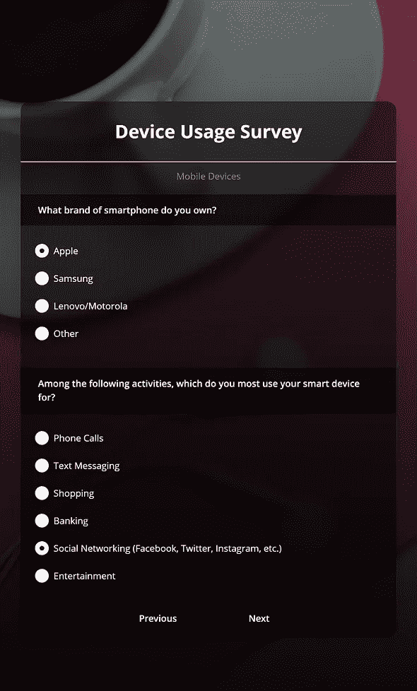
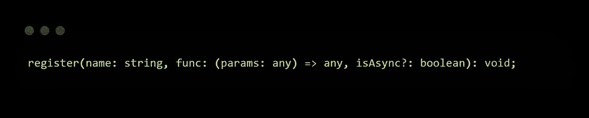

# 如何构建自己的调查并使用定制的 JavaScript 扩展它们

> 原文：<https://javascript.plainenglish.io/how-to-build-your-own-surveys-extend-them-with-custom-javascript-b4c7eb5648c4?source=collection_archive---------14----------------------->

## 这是一本关于如何使用自己的 JS 函数来扩充 SurveyJS 附带的条件逻辑和验证器的入门书。

Want to write custom JavaScript functions so your surveys can auto-detect user devices? Read on!

当涉及到最大化调查的投资回报率时——无论是新广告活动的市场研究，衡量客户满意度，还是患者病历记录——最大的不同在于相关性。简单来说，**不要浪费自己的时间。**

你的回答者不应该看到不适合他们的问题或者与他们已经*提供的信息相矛盾的样板问题。*

这就是为什么为您的调查实现条件分支(更好地称为“跳过逻辑”)是至关重要的。你需要确保你的回答者*总是*得到最相关的问题——因为这将为你带来更高的完成率和更大的数据样本量。此外，使用条件逻辑，您可以根据之前问题的答案来确定问题，所有这些都可以为您提供更好的分析，并为您的利益相关者提供更准确的预测和指数。

SurveyJS 是一个免费的开源(在 MIT 许可下)JavaScript 库，它不仅能让你做到这一点，而且更进一步，它允许你用自己的 JavaScript 代码扩展你的条件逻辑和输入验证，去做仅仅依靠 survey library 无法完成的事情。

太棒了，对吧？让我们构建我们自己的条件和验证器——完全坚持使用普通的 JavaScript——来看看这有多简单，不管您使用的是什么框架。

Feel free to check out the finished product here; custom functions, schema, all that jazz.

# 自定义条件逻辑

对于一个非人为的真实世界的例子，假设您正在设计一个数字使用调查，并希望以这样一种方式对问题进行分类，即在一个页面上为 PC 用户提供问题，在另一个页面上为移动用户提供问题，两者在可见性方面是互斥的。

[Background image](https://www.pexels.com/photo/closeup-photo-of-silver-iphone-7-plus-with-earpods-1038628/) by PhotoMIX Company @ Pexels

现在，SurveyJS 为您提供了几个内置的客户端[条件可见性选项](https://surveyjs.io/Documentation/Library?id=design-survey-conditional-logic&utm_source=medium&utm_medium=referral&utm_campaign=JS_in_Plain_English_7#conditional-visibility)和[触发器](https://surveyjs.io/Documentation/Library?id=design-survey-conditional-logic&utm_source=medium&utm_medium=referral&utm_campaign=JS_in_Plain_English_7#conditional-survey-logic-triggers)来帮助您实现分支和跳过逻辑——例如， [visibleIf](https://surveyjs.io/Documentation/Library?id=Question&utm_source=medium&utm_medium=referral&utm_campaign=JS_in_Plain_English_7#visibleIf) 、 [enableIf](https://surveyjs.io/Documentation/Library?id=Question&utm_source=medium&utm_medium=referral&utm_campaign=JS_in_Plain_English_7#enableIf) 和 [requiredIf](https://surveyjs.io/Documentation/Library?id=Question&utm_source=medium&utm_medium=referral&utm_campaign=JS_in_Plain_English_7#requiredIf) 属性有:

**a.** 设置在调查模式(JSON)本身，

**b.** 直观地接受布尔表达式，并且

**c.** 可以应用于问题、面板、*甚至整个页面*。

Have a look at the survey from [here](/overcome-the-language-barrier-in-your-surveys-with-easy-i18n-using-surveyjs-228cd4248126). The second question (ideal team size) would be visible **if and only if** the previous question (prior team experience) had an affirmative ‘Yes’ answer.

在我们现在讨论的*设备使用调查中，如果没有一个额外的起始问题，比如“您目前使用的是什么设备？”这个内置的条件评估就帮不了我们这是无关紧要的，需要时间，而回答者可能更喜欢自动检测。*

所以现在，你可能在想，“哎呀，如果我能……写一个 JS 函数，让*自动*检测我的回答者是在电脑上还是在移动设备上，并有条件地显示两页中的一页，那就太好了。”

如果是的话，给自己一个鼓励，因为你完全可以做到。

This is *all* vanilla JavaScript, by the way. For older/unsupported web browsers, try the [matchMedia() polyfill](https://github.com/paulirish/matchMedia.js/).

这是我们的第一步。编写一个使用 [matchMedia API](https://developer.mozilla.org/en-US/docs/Web/API/Window/matchMedia) 来运行 CSS 媒体查询的函数，并对返回的对象运行一个`matches` 函数，根据查询是否匹配来给出一个`true` 或`false` 值——这对我们来说是完美的，因为当然，我们**确实**想要调查中的条件逻辑的布尔值！

我们的函数检查响应者的设备并返回`true` ，只要它至少有一个细粒度的[指针](https://developer.mozilla.org/en-US/docs/Web/CSS/@media/pointer)(也就是鼠标或触摸板)。如果不是，那么，你的回答者可能正在使用移动设备。

> *💡*当然，边缘情况是存在的，但这是检查设备使用情况的一种快速而肮脏的方法，不需要外部库(如 [UAParser.js](https://github.com/faisalman/ua-parser-js) ),并且将很好地服务于我们的示例。

定制函数的下一步是“注册”它们，就像这样。

register 函数的参数是:

*   函数名(一个字符串)，
*   功能本身，
*   以及一个布尔值来指示这是否是一个异步函数(在这种情况下，库将期待一个**回调**，而不是一个常规的返回语句— ***)记住这一点，我们稍后将回到这一点！***

最后，在 JSON 模式中包含函数名作为要检查的条件，这样就可以了。

And as you’ve already guessed, for your PC specific page, the visibleIf property needs to be “!ifMobile()” or “ifMobile() = false” instead.

# 自定义输入验证—本地*和*服务器端。

就像我们做自定义条件来实现跳过逻辑一样容易，我们可以做自定义输入验证来超越 SurveyJS 提供的现成功能。

在开始激动人心的部分之前，让我们看一个自定义输入验证的基本例子。

这是一个足够简单的例子，它使用正则表达式模式来确保在`Comment` 字段中不存在 HTML 代码，作为防止潜在恶意脚本攻击的安全措施。

在`App.jsx`(或者任何实例化和呈现您的调查的组件)中，您注册它，就像我们对自定义条件逻辑的函数所做的那样。

不要忘记在我们的 JSON 模式中包含这个函数名作为验证器，就像前面一样。

你可以走了。这与您预期的完全一样。

现在，有趣的是。

还记得 register 函数有一个**可选布尔参数**来指示您是否注册了一个需要回调的**异步函数吗？**

If you needed a refresher, here’s the type declaration.

是的，你猜对了。接下来，我们将构建一个定制的输入验证器，它实际上使用`fetch` 调用一个**外部的第三方 REST API** 来验证用户提供的电子邮件地址，确保它是**实际上可交付的**，而不仅仅是*有效的*——这非常有用，因为字段正则表达式仅仅是愚蠢的模式，很容易被伪造的电子邮件地址欺骗，但是*看起来*正确，就像`fake@notreal.com`。

We’re using the [EVA](https://eva.pingutil.com/) here, which is a nifty little public API that quickly does email verification for you, including checking for reachability, webmail status, and spam filtering.

注册，并将其作为验证器包含在您的 JSON 模式中…

…我们完成了！将所有这些放在一起，这是我们正在运行的验证代码。

# 无限的潜力

构建调查是一项艰苦的工作。不要让它变得更难。

你的想象力和数据收集能力不应该是平台工具的功能，也不应该受到你所使用的库的技术能力的限制。

这就是使 [SurveyJS](https://surveyjs.io/?utm_source=medium&utm_medium=referral&utm_campaign=JS_in_Plain_English_7) 脱颖而出的地方——用完全定制的 JavaScript 代码来扩充现有功能的能力，以准确地做您想要做的事情，而不管您碰巧使用的是哪种框架。当然，提供的例子是用 React 构建的，但是**没有一个自定义条件逻辑或输入验证是 React 特定的**——我们只是用**框架无关的普通 JavaScript** 扩展了 SurveyJS。这给我们提供了无数的可能性。

*更多内容请看* [***说白了就是***](https://plainenglish.io/) *。报名参加我们的* [***免费每周简讯***](http://newsletter.plainenglish.io/) *。关注我们关于* [***推特***](https://twitter.com/inPlainEngHQ) ，[***LinkedIn***](https://www.linkedin.com/company/inplainenglish/)*，*[***YouTube***](https://www.youtube.com/channel/UCtipWUghju290NWcn8jhyAw)*[***不和***](https://discord.gg/GtDtUAvyhW) *。**