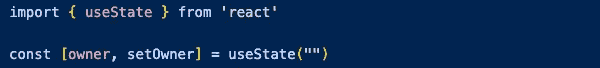
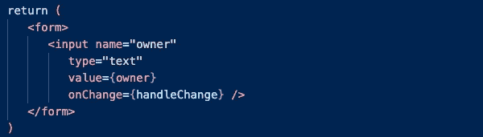
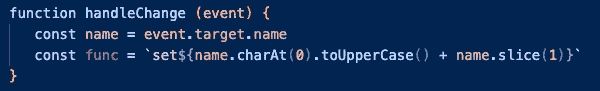
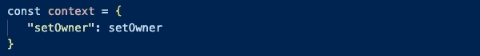
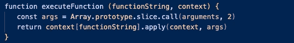
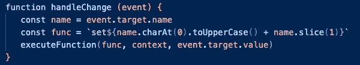

# 如何将字符串作为函数调用:具有多个受控输入的表单中的用例

> 原文：<https://javascript.plainenglish.io/how-to-call-a-string-as-a-function-use-case-in-a-form-with-multiple-controlled-inputs-c22f86baf57b?source=collection_archive---------6----------------------->

受控组件是那些[使用状态](https://reactjs.org/docs/hooks-state.html)来处理数据的组件。它们使程序不仅能在用户输入后验证用户输入，还能从一开始就禁止用户输入无效的输入。

# 1.用受控组件设置表单。

要设置受控组件，您必须首先从 React 导入`useState`。然后，您声明您的变量，并将其设置为等于`useState`。`useState`接受一种说法:初始状态。



接下来，您设置您的表单。在每个输入中，将`name`属性设置为一个字符串，将`value`属性设置为受控变量，将`onChange`属性设置为`handleChange`，我们将在下面声明。



# 2.设置一个函数来处理 onChange 事件。

在计算机科学中，DRY 代表“不要重复自己。”干燥的一个方面是当我们认识到一种模式时，我们会抽象出一些功能。在本例中，我们有许多不同的表单输入需要更新，我们可以看到 setter 函数有一个命名模式:`setVariable`。与其为每个变量的组件声明不同的`handleChange`函数，不如有一个为所有受控组件工作的`handleChange`函数。

因为我们的输入组件同时具有`name`和`value`属性，这些属性将作为`event`对象的一部分传递给`handleChange`。我们可以使用`event.target.name`和`event.target.value`来访问这些属性。

首先，我们需要创建一个匹配 setter 函数模式的字符串变量。这里，这是使用字符串插值完成的。`"set"`是硬编码的，那么选择`name`的第一个字母并大写，然后添加`name`的剩余字母，仍然是小写。结果就是`func = "setOwner"`。



# 3.设置上下文对象。

接下来我们需要一种方法来调用这个字符串变量作为一个函数。为此，我们需要设置一个映射 setter 函数的`context`对象。对于我们希望调用的每个函数，键应该是函数名的字符串版本，值应该是回调函数。



# 4.声明一个函数来处理函数执行。

接下来，我们需要编写一个接受 setter 字符串并调用它的函数:



在这里，`executeFunction`接受了`functionString`和`context`对象。它还隐式地接受我们需要访问的其他`arguments`。我们通过调用`Array.prototype.slice.call(arguments, 2)`来做到这一点。

通常我们可以直接在一个数组上调用 slice】。`slice`方法隐式地假设它应该切片的`this`变量是您调用该方法的数组。不过，在这种情况下，我们希望`slice`对一个类似于对象`arguments`的数组*进行操作。我们通过使用`call`并传递类似数组的对象来实现这一点。*

下一步是`context`对象的重要性:每个键/值对代表一个字符串/函数对。我们不能直接调用插值函数。相反，我们需要利用`context`对象通过字符串键访问回调值。

然后我们使用`apply`来调用回调函数。我们再次传递包含我们的字符串/函数引用的`context`变量，并传递提供的任何附加参数。

# 5.调用执行函数。

在这种情况下，对 executeFunction 的调用将如下所示:



你有它！现在，您可以使用字符串来调用同名的函数。如果你觉得这很有帮助，请在下面的评论中告诉我！

```
import { useState } from 'react'const [owner, setOwner] = useState("")const context = {
   "setOwner": setOwner
}function executeFunction (functionString, context) {
   const args = Array.prototype.slice.call(arguments, 2)
   return context[functionString].apply(context, args)
}function handleChange (event) {
   const name = event.target.name
   const func = `set${name.charAt(0).toUpperCase() + name.slice(1)}`
   executeFunction(func, context, event.target.value)
}return (
   <form>
      <input name="owner"
         type="text"
         value={owner}
         onChange={handleChange} />
   </form>
)
```

*更多内容看* [***说白了就是***](https://plainenglish.io/) *。*

*报名参加我们的* [***免费周报***](http://newsletter.plainenglish.io/) *。关注我们上* [***推特***](https://twitter.com/inPlainEngHQ) ， [***领英***](https://www.linkedin.com/company/inplainenglish/) ***，***[***YouTube***](https://www.youtube.com/channel/UCtipWUghju290NWcn8jhyAw)***，以及****[***不和***](https://discord.com/invite/GtDtUAvyhW) *

****用*** [***电路***](https://circuit.ooo/?utm=publication-post-cta) *为你的科技创业建立认知和采用。**