# 如何使用 Auth0 操作捕获和验证用户的电话号码

> 原文：<https://javascript.plainenglish.io/how-to-capture-and-verify-users-phone-number-using-auth0-action-3bd48d0d6d6c?source=collection_archive---------5----------------------->

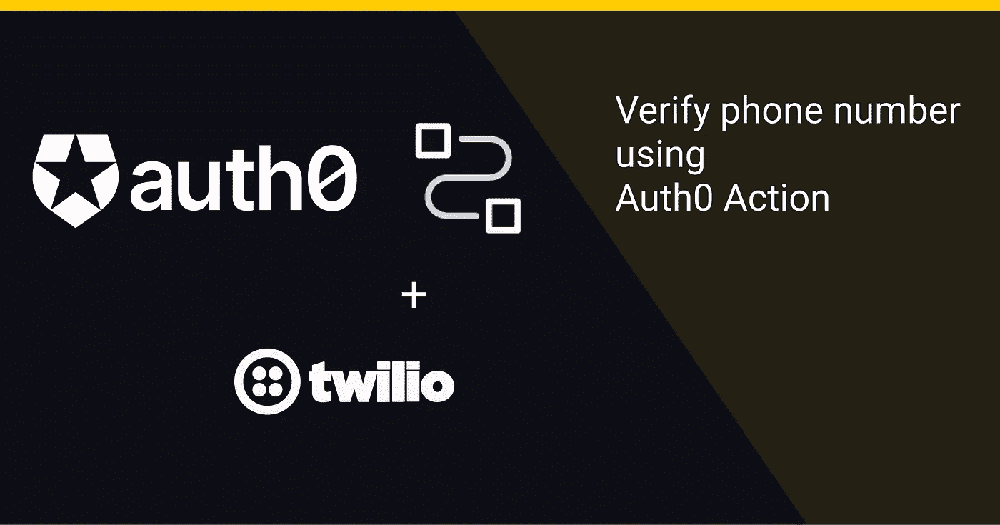

对于各种场景，企业可能需要在提供服务之前记录并验证用户的电话号码。

这个例子演示了如何使用 Auth0 操作在注册(第一次登录)时获取并验证用户的电话号码。

> Auth0 操作是在 Node.js 中编写的安全、特定于租户的版本化函数，在 Auth0 运行时的特定时间点执行。
> 动作用于通过自定义逻辑自定义和扩展 Auth0 的功能。https://auth0.com/docs/customize/actions
> T2

下面的图表显示了该解决方案的工作原理。

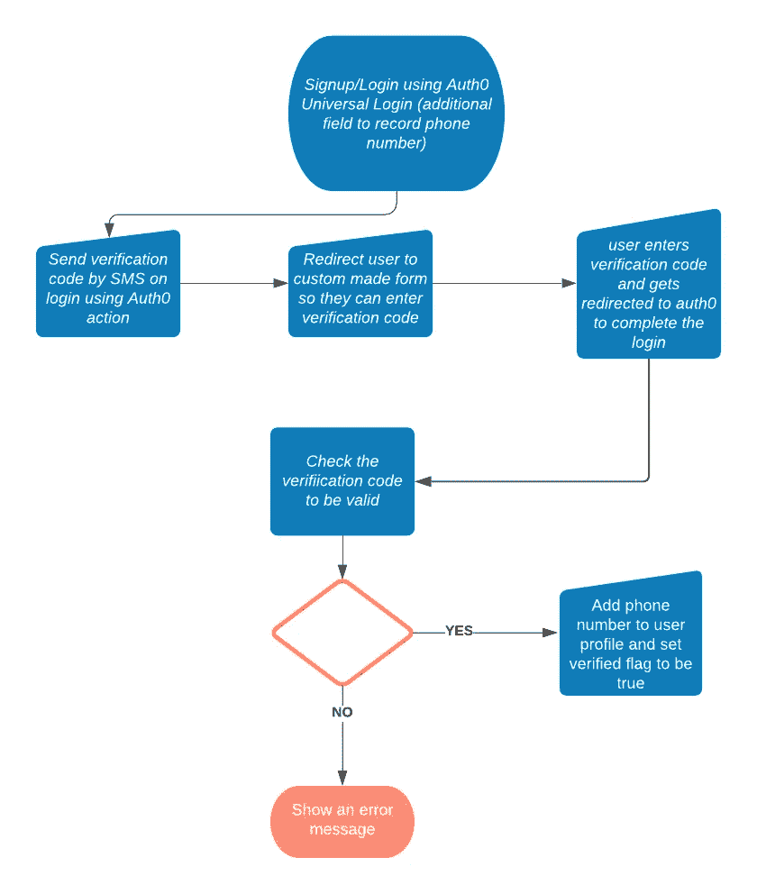

## **免责声明**

如果您正在寻找使用 SMS 的[多因素认证，Auth0 支持开箱即用。](https://auth0.com/docs/secure/multi-factor-authentication/multi-factor-authentication-factors/configure-sms-voice-notifications-mfa)

这个解决方案只是一个解决移动验证问题的建议。
我发现一些用户在 Auth0 论坛上询问此功能，所以我决定看看是否可以使用 Auth0 操作来提供解决方案。

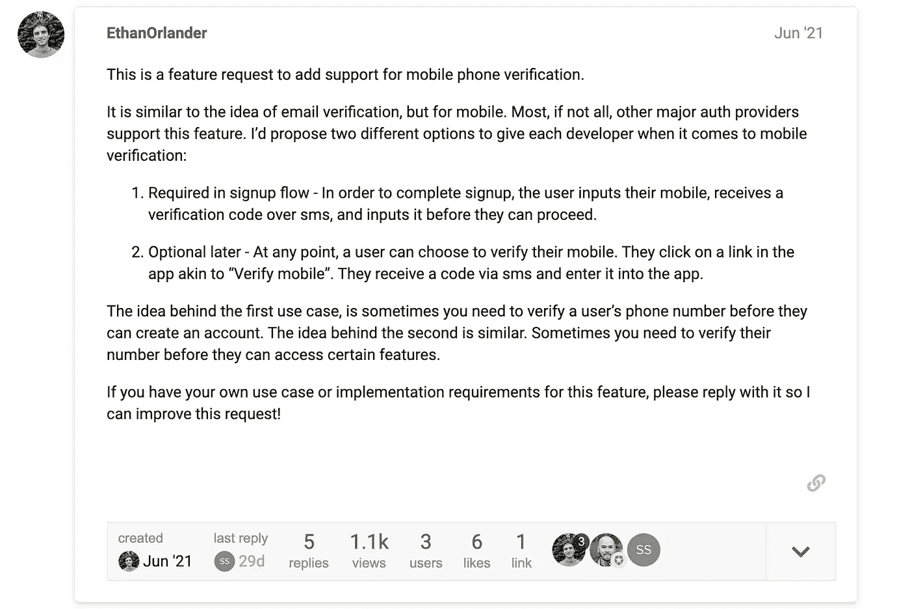

[https://community.auth0.com/t/mobile-verification/65206](https://community.auth0.com/t/mobile-verification/65206)

# 解决方案中断

我们需要以下几个部分来实现这个流程:

*   一个 Twilio 账户。Twillio 提供了我们发送验证短信以及在用户提交代码后验证代码所需的 API。
*   带有额外字段的自定义注册表单，用于记录用户的电话号码。
*   将在登录时执行的 Auth0 操作，并利用记录的电话号码通过 SMS 向用户设备发送验证码。
    该操作还负责重定向到代码验证表单。
*   一个简单的 web 应用程序，它将承载表单以从用户处获取验证码，并将用户和代码一起重定向到 Auth0 以完成登录。

## 1-创建 Twilio 帐户和验证服务

要创建帐户，请前往[https://www.twilio.com/try-twilio](https://www.twilio.com/try-twilio)并创建一个免费帐户。

登录后，点击侧面菜单中的验证。这是我们可以添加验证服务的地方。这项服务将帮助我们向用户电话号码发送短信，并使用短信中的代码来验证号码。

点击**验证- >试用**并创建新服务。

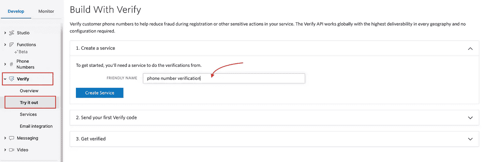

在第二步和第三步中，您有机会在控制台中测试您新创建的服务。这有助于您验证需要调用的 URL 和需要为有效负载传递的参数。在您测试了您的新服务并且对它的运行感到满意之后，我们就完成了 Twillio 的设置。

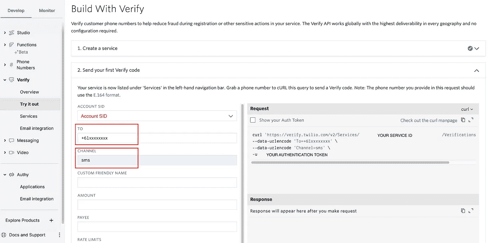

如果您需要在稍后阶段查看您的服务 id，您可以回来进行验证，它将列在服务下。

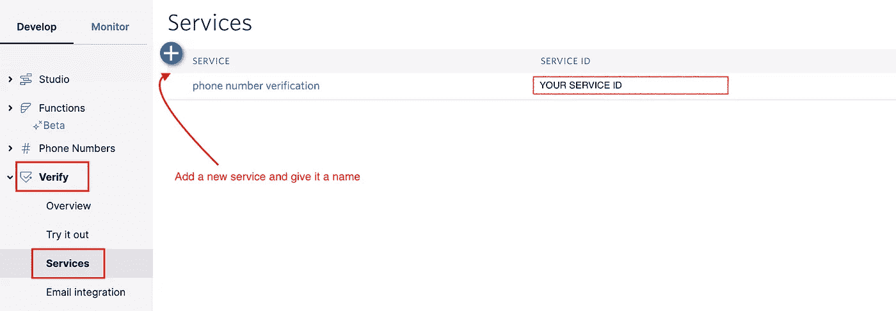

## 2-带有额外字段的自定义注册表单，用于记录用户的电话号码

有多种方法可以定制您的登录/注册表单。
在这个例子中，我使用了 Auth0 锁并传递了额外字段的配置。

要了解更多关于自定义注册体验的其他方式，请查看[本页](https://auth0.com/docs/libraries/custom-signup)。
这是您可以传递给 Auth0 锁以添加额外字段的配置。

你会得到一个注册表单，如下所示:

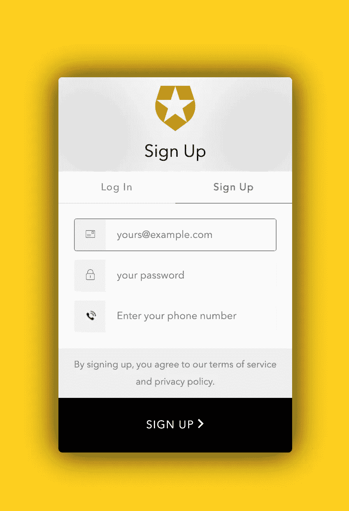

现在，用户注册后，电话号码将被添加到用户资料的`user_metadata`下。在这个阶段，我们还没有核实电话号码。

## 3-创建一个登录操作来验证电话号码

下一步，我们需要一个登录操作来从用户配置文件中读取电话号码，并向用户的电话号码发送验证短信。

在 Auth0 动作触发器中，Login 是唯一一个支持[重定向](https://auth0.com/docs/customize/actions/triggers/post-login/redirect-with-actions)的触发器，这正是我们对于这个流所需要的。因为电话号码验证只发生一次，所以用户只会在第一次登录时进行验证。

对于随后的登录，该操作将检查电话号码是否存在，并针对特定用户进行了验证，如果存在，它将忽略其余部分。

要开始，您需要一个 Auth0 帐户。如果您还没有，请按照这些说明[设置一个。](https://auth0.com/docs/get-started)

要创建登录操作，单击**操作>流程>登录**

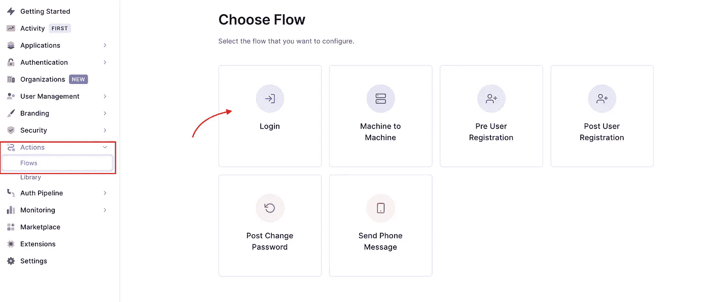

这创建了一个作为登录流的一部分运行的`post-login`触发器。
在用户登录后，当请求刷新令牌时执行。

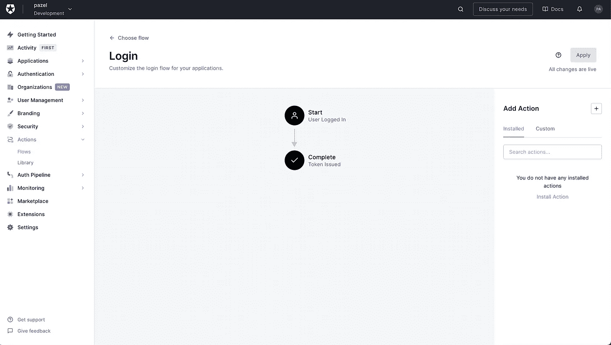

点击添加操作中的`+`按钮，并选择构建定制。称之为 ***验证电话号码*** ，其余保持原样。

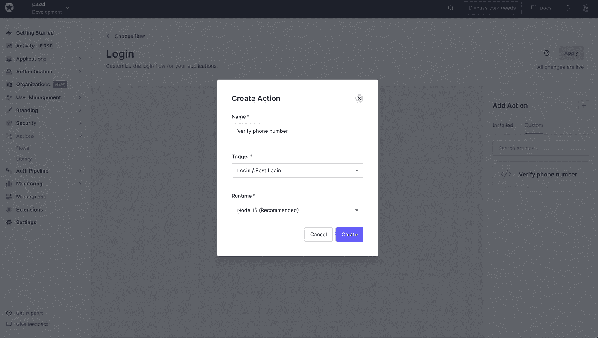

创建完成后，您将进入编辑屏幕。
在这里，您可以编辑代码并编写逻辑来调用 Twilio APIs 发送验证码并进行验证。

为此，我们需要编写两个独立的函数。

*   `onExecutePostLogin` —在 PostLogin 流程执行期间将被调用的处理程序。
*   `onContinuePostLogin` —外部重定向后恢复此操作时将调用的处理程序。

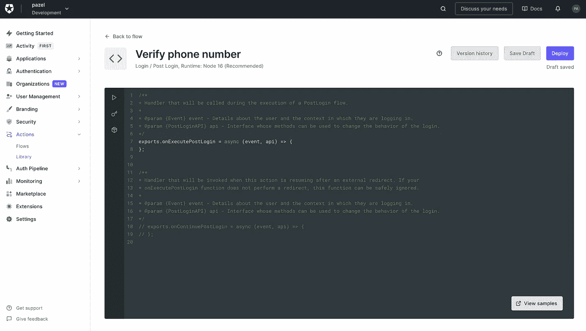

1- In `onExecutePostLogin`功能代码只是读取用户`user_metadata`的电话号码，并使用 Twilio REST API 向该电话号码发送短信。
成功发送短信后，该功能会将用户重定向至网络表单，以输入我们刚刚发送给他们的验证码。
这个 webform 只是一个您需要自己创建和托管的 web 应用程序。
不需要什么花里胡哨的东西，只要能拿到验证码，把用户重定向回 Auth0 就行。

2-在用户被重定向回 Auth0 之后,`onContinuePostLogin`开始发挥作用。此时，您将使用重定向将验证码从 webform 发送到函数。
所以我们可以使用代码并从 Twilio 调用另一个 REST API 来验证它。
如果一切顺利，并且 Twillio 成功回复了您的电话号码，我们会将此信息添加到用户资料中，但这次是在`app_metadata`下。

*提示:* `*user_metadata*` *登录用户可以编辑，但是用户不能编辑* `*app_metadata*` *。*

下面是该操作的代码。

## 4-获取验证码并执行重定向的示例 webform

代码验证表单是一个基本的 HTML 页面，带有一小段 JavaScript 来处理表单提交。(根据[迪伦·斯沃茨的例子](https://github.com/dylanswartz/actions-consent-form-example)获取同意书)

在这个例子中，我们将使用 [Vercel](https://vercel.com/) 来托管表单，但是您可以使用任何托管提供商。

1.  如果您还没有这样做，请[注册一个 Vercel 帐户](https://vercel.com/signup)并安装带有`npm i -g vercel`的 [Vercel CLI](https://github.com/vercel/vercel/tree/main/packages/cli) 。
2.  当您与`index.html`在同一个目录中时，只需在 Vercel 中运行下面的命令来启动它:

```
$ vercel
```

对于`vercel`命令给出的每个提示，按回车键选择默认值。此命令的输出将包含您新托管的代码验证表单的 URL。

1.  在您的动作代码中，确保删除现有的`VERIFY_FORM_URL`，并用上一步中输出的 URL 值替换它。
2.  如果您想对代码验证表进行更改，只需运行与之前相同的`vercel`命令即可上传新版本。

下面是这个 web 应用程序的代码。

[](https://github.com/pazel-io/auth0-twilio-phone-verification) [## GitHub-pazel-io/auth 0-twilio-phone-verification:这个示例演示了一个最小的…

### 这个示例演示了“重定向”协议的最小实现。它包含一个 Auth0 操作…

github.com](https://github.com/pazel-io/auth0-twilio-phone-verification) 

在这里，您拥有一个端到端的解决方案来验证电话号码，作为您 Auth0 登录和帐户创建的一部分。

## 最终注释

要使这成为一个生产就绪的解决方案，还需要考虑更多的因素。

*   **错误处理**
    你需要考虑和处理可能发生的不同错误。
    示例动作代码利用`api.access.deny()`在发生错误的情况下拒绝登录。
*   **为不同阶段设置不同的环境(租户)。**
    当您设置 Auth0 租户或 Twilio 服务时，您需要将您的开发和生产环境分开。
*   **保证您的秘密(API)密钥的安全** 本解决方案中使用的所有秘密只存在于代码的服务器端(action.js 和 verify.js ),这使得保证它们的安全更加容易。
    确保不要在客户端代码中暴露敏感密钥，也不要将它们提交给 repo。
    动作具有内置的秘密管理功能，可保护您的秘密安全，并在您的动作代码中提供便捷的访问方式。

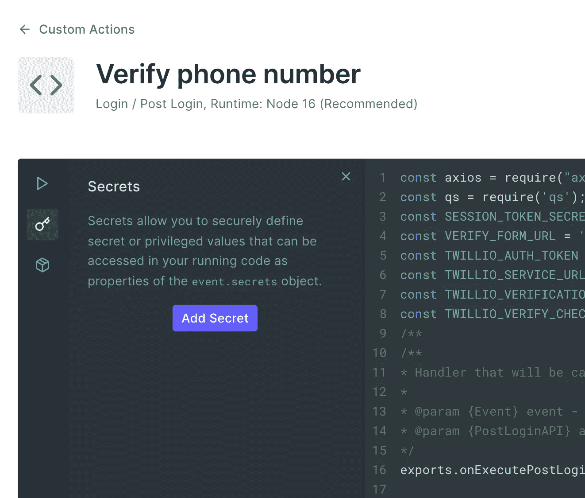

你可以像这样访问它们

```
event.secrets.SESSION_TOKEN_SECRET
```

*   **可信回调 URL (** 引自 [Dylan Swartz 示例](https://github.com/dylanswartz/actions-consent-form-example) **)** 为了方便起见，我们的示例操作和同意表单做出了一个安全妥协:规则将 Auth0 域(即`your-tenant.auth0.com`)传递给表单网站，表单使用它来构造一个回调 URL(即`https://your-tenant.auth0.com/continue`)以返回到规则。这本质上是一个[开放重定向](https://www.owasp.org/index.php/Unvalidated_Redirects_and_Forwards_Cheat_Sheet)，不应该在生产场景中使用。
    您可以通过将表单网站实现配置为仅返回特定的 URL(即，仅您的 Auth0 租户),而不是从查询参数生成的 URL，来锁定这一点。然后，您也可以简化规则，使其不再通过 Auth0 域。
*   **数据完整性(**引自[迪伦·斯沃茨的例子](https://github.com/dylanswartz/actions-consent-form-example) **)** 如上所述，这是一个使用动作重定向来调用同意表格的非常基本的例子。也就是说，在 Auth0，我们非常重视安全性。使用共享的`SESSION_TOKEN_SECRET`将作为签名令牌传递回 auth0 的`confirm`字段(其值为`yes`)。
    在生产场景中，您需要保证外部网站返回的数据的完整性(在这种情况下，在我们的托管代码验证表单中)。例如，如果您想确定数据确实来自可信的来源，那么应该对其进行签名。如果数据是敏感的，那么它应该被加密。做这件事的一个好机制是使用一个 [JWT](http://jwt.io/) (JSON Web 令牌)。您可以使用声明(您可以选择加密)构建 JWT，然后使用与您的 Auth0 操作共享的秘密或私钥对其进行签名，该操作知道私钥的公钥。然后，该操作可以验证声明是否合法，并在必要时对其进行解密。
*   **社交登录** 如果你想提供社交登录/注册，这个解决方案需要一些调整。
    在社交登录的情况下，用户不会使用我们的注册表单，因此我们需要在应用程序中通过一个单独的表单来获取电话号码。

感谢阅读这篇文章。
如果您有任何反馈或问题，请点击这里或在 [Twitter](https://twitter.com/_pazel) 上联系我们。

这里是我的示例代码库的链接:
【https://github.com/pazel-io/auth0-twilio-phone-verification 

参考资料:

*   [授权 0 行动文件](https://auth0.com/docs/customize/actions)
*   [动作重定向](https://auth0.com/docs/customize/actions/triggers/post-login/redirect-with-actions)
*   [迪伦·史瓦兹的例子](https://github.com/dylanswartz/actions-consent-form-example)征求同意书
*   [Twilio 验证服务](https://www.twilio.com/docs/verify)

*更多内容请看*[***plain English . io***](http://plainenglish.io/)*。报名参加我们的* [***免费周报***](http://newsletter.plainenglish.io/) *。在我们的* [***社区***](https://discord.gg/GtDtUAvyhW) *获得独家获得写作机会和建议。*