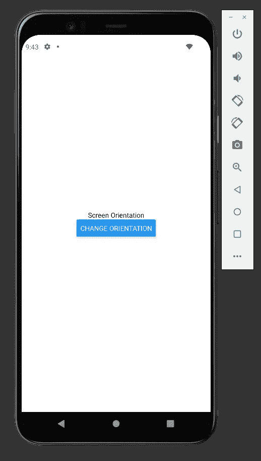

# 如何在 React Native 中使用 Expo 更改设备的屏幕方向

> 原文：<https://javascript.plainenglish.io/how-to-change-a-devices-screen-orientation-using-expo-in-react-native-af69c10032fb?source=collection_archive---------4----------------------->

## [反应土著](https://medium.com/@bookeraziz/list/react-native-3e476cc05fe3)

## React Native 中处理屏幕方向的初学者指南


Photo by [Maxwell Nelson](https://unsplash.com/@maxcodes?utm_source=medium&utm_medium=referral) on [Unsplash](https://unsplash.com?utm_source=medium&utm_medium=referral)

在今天的文章中，我将向您展示在 React 原生应用中处理屏幕方向的两种不同方法。第一种方式是使用`[expo-screen-orientaiton](https://www.npmjs.com/package/expo-screen-orientation)`包，第二种方式是允许 expo 处理我们的应用程序何时应该被旋转。

# 项目设置

## 添加应用程序样板

在我们开始阅读设备定位之前。我们首先需要一个应用程序。将以下样板代码粘贴到 app.js 文件中:

App Boilerplate

您的屏幕应该是这样的:



Screenshot of what your HomeScreen should look like

## 导入 Expo 屏幕方向

在我们开始读取我们设备的屏幕方向之前，我们首先必须安装`[expo-screen-orientaiton](https://www.npmjs.com/package/expo-screen-orientation)`包。在终端中运行以下命令:

```
expo install expo-screen-orientation
```

并将以下导入语句添加到 app.js 文件的顶部:

```
import * as ScreenOrientation from 'expo-screen-orientation'
```

# 读取屏幕方向

## 存放我们的设备方向

我们将使用 **getOrientaitonAsync** 函数来读取屏幕的方向。getOrientationAsync 返回一个承诺，指定我们的设备是处于横向模式还是纵向模式。

我们需要一种方法来保存我们的设备的方向。为此，我们将使用 useState 钩子。

导入 [](https://www.npmjs.com/package/expo-screen-orientation) **使用项目顶部的状态**:

```
import {useState} from 'react'
```

并添加以下代码:

```
const [orientationIsLandscape,setOrientation]=useState(true)
```

您的代码应该如下所示:

Importing and Using the useState Hook

旋转你的 app 其实有两种 ***方式。***

**第一种**方式是通过调用 getOrientationAsync 函数手动改变布局。这可以通过点击按钮后创建并调用一个异步函数来实现。

第二种方法是让 expo 在用户倾斜设备时旋转我们的应用程序。这只需要对 app.json 文件做一点小小的修改。

我会向你展示两种方式。

## 使用 getOrientationAsync 更改方向

要使用 getorientationasync 更改我们的屏幕方向，我们需要两个函数:一个 toggleOrientation 函数和一个 async changeScreenOrientation 函数。

我们的 toggleOrientaiton 函数会将 orientationIsLandscape 状态设置为其相反的值。

如果它是真的，orientationIsLandscape 就会变成假的，反之亦然。这个函数也将调用 changeScreenOrientation。

changeScreenOrientation 将实际处理我们的屏幕旋转。

这方面的代码如下:

Our Two functions

现在我们必须将 toggleOrientation 函数添加到按钮的 onPress 中。

```
<Button title="Change Orientation" onPress={toggleOrientation} />
```

现在，一旦点击按钮，我们的应用程序将从纵向模式旋转到横向模式。如果你再次按下按钮，应用程序将旋转回到纵向模式。

## 让 Expo 处理屏幕方向

为了让 expo 处理屏幕方向的改变，我们必须编辑 app.json 文件。进入你的 app.json 文件，删除标题为 **orientation 的那一行。**

Delete Line 5 Of the App.json File

现在，如果你倾斜你的设备，你的应用程序将自动旋转。如果您的应用程序不旋转，您可能需要在设备的设置中启用自动旋转。

# 结论

感谢您阅读完我的文章**“如何在 React Native 中使用 Expo 更改设备屏幕方向”**。如果你有任何问题，请随意提问，我会尽快回答。

我希望你有美好的一天。如果你刚接触媒体，你可以点击这里的[链接](https://bookeraziz.medium.com/membership)加入。

## 资源

1.  [Github 项目链接](https://github.com/AzizBooker/rn-screen-orientation-example)
2.  [世博屏幕方向](https://www.npmjs.com/package/expo-screen-orientation)

*更多内容看* [***说白了。报名参加我们的***](http://plainenglish.io/) **[***免费周报***](http://newsletter.plainenglish.io/) *。在我们的* [***社区不和谐***](https://discord.gg/GtDtUAvyhW) *获得独家获取写作机会和建议。***