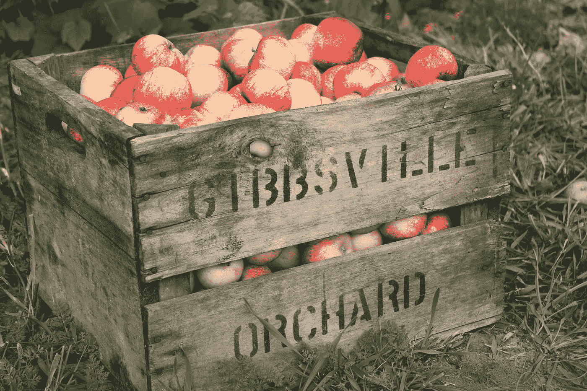

# 如何使用 JavaScript 更改 HTML 选定的选项？

> 原文：<https://javascript.plainenglish.io/how-to-change-an-html-selected-option-using-javascript-460bfdd8dbc7?source=collection_archive---------3----------------------->



Photo by [Jen Theodore](https://unsplash.com/@jentheodore?utm_source=medium&utm_medium=referral) on [Unsplash](https://unsplash.com?utm_source=medium&utm_medium=referral)

有时候，我们可能想用 JavaScript 改变选中的下拉选项。

在本文中，我们将看看如何用 JavaScript 改变 HTML 选择的选项。

# 设置选择下拉列表的值属性

我们可以用 JavaScript 通过设置`select`元素对象的`value`属性来改变 HTML `select`元素的选择选项。

例如，我们可以编写以下 HTML:

```
<select>
  <option value="apple">Apple</option>
  <option value="orange">Orange</option>
  <option value="grape">Grape</option>
</select><button id='apple'>
  apple
</button>
<button id='orange'>
  orange
</button>
```

我们有一个选择下拉菜单，其中有一些选项和 2 个按钮，单击时可以设置所选的选项。

然后，我们可以添加以下 JavaScript 代码来设置按钮选项:

```
const appleBtn = document.getElementById('apple')
const orangeBtn = document.getElementById('orange')
const select = document.querySelector('select')appleBtn.addEventListener('click', () => {
  select.value = 'apple'
})orangeBtn.addEventListener('click', () => {
  select.value = 'orange'
})
```

我们用`getElementById`得到 2 个按钮。

我们得到了`select`和`querySelector`的下拉。

然后我们用`'click'`调用`addEventListener`在按钮上添加点击监听器。

我们将每个的`select.value`设置为我们想要选择的值。

`value`应该设置为`value`属性的值，这样才能工作。

现在，当我们单击按钮时，我们应该看到下拉列表中的选定值更改为我们在 click listener 中设置的值。

# 结论

我们可以通过设置`value`属性，用 JavaScript 的 HTML select 下拉菜单设置 select 选项。

*更多内容看* [***说白了。报名参加我们的***](https://plainenglish.io/) **[***免费周报***](http://newsletter.plainenglish.io/) *。关注我们*[***Twitter***](https://twitter.com/inPlainEngHQ)*和*[***LinkedIn***](https://www.linkedin.com/company/inplainenglish/)*。加入我们的* [***社区***](https://discord.gg/GtDtUAvyhW) *。***