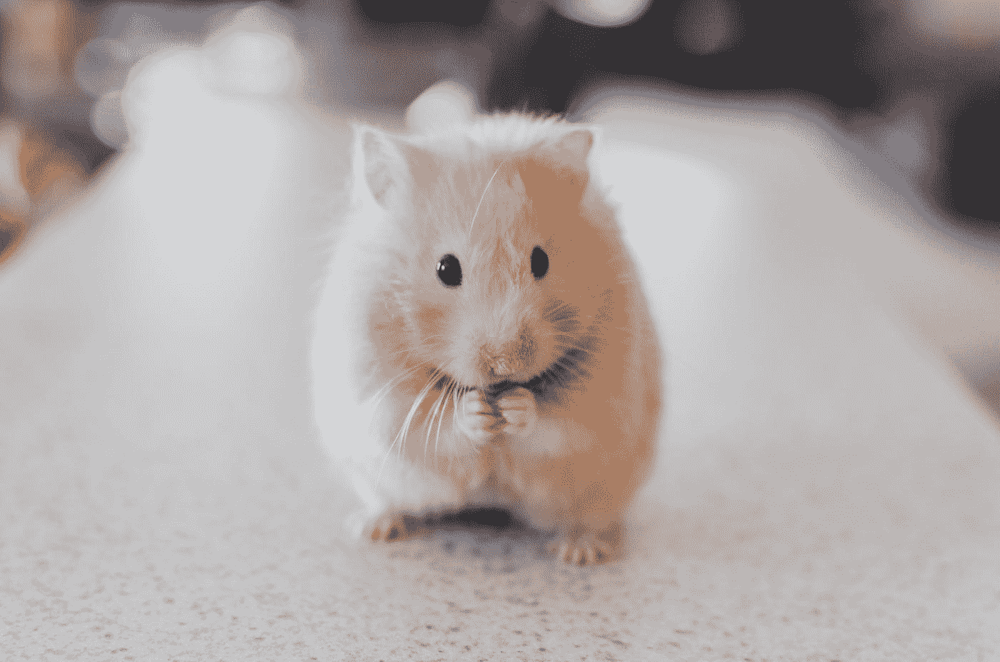

# 用 JavaScript 检查我们按下鼠标按钮后它是否被按住

> 原文：<https://javascript.plainenglish.io/how-to-check-if-a-mouse-button-is-kept-down-after-we-press-it-with-javascript-6dd13091d584?source=collection_archive---------7----------------------->

## 一个 JavaScript 教程，关于在我们按下鼠标按钮后检查它是否被按住。



Photo by [Ricky Kharawala](https://unsplash.com/@sweetmangostudios?utm_source=medium&utm_medium=referral) on [Unsplash](https://unsplash.com?utm_source=medium&utm_medium=referral)

有时，我们想用 JavaScript 检查鼠标按钮按下后是否还在按下。

在这篇文章中，我们将看看如何用 JavaScript 来检查在我们按下鼠标按钮后它是否被按住。

# 侦听 mousedown 和 mouseup 事件

我们可以监听`mousedown`和`mouseup`事件来检查在我们按下鼠标按钮后鼠标按钮是否被按住。

例如，我们可以写:

```
let mouseDown = 0;
window.onmousedown = () => {
  ++mouseDown;
  if (mouseDown) {
    console.log('mouse button down')
  }
}
window.onmouseup = () => {
  --mouseDown;
  if (mouseDown) {
    console.log('mouse button down')
  }
}
```

我们将`window.onmousedown`和`window.onmouseup`属性设置为改变`mouseDown`计数的函数，以监听整个选项卡上的`mousedown`和`mouseup`事件。

如果发出了`mousedown`事件，我们递增`mouseDown`。

如果发出了`mouseup`事件，我们递减`mouseDown`。

`mousedown`当我们按下鼠标按钮时发出事件。

当我们停止按下鼠标键时会发出`mouseup`。

因此，如果`mouseDown`大于 0，鼠标键保持按下。

# 结论

我们可以通过监听`mousedown`和`mouseup`事件来检查鼠标按钮是否被按下，并记录鼠标按钮被按下或抬起的次数。

*更多内容请看*[***plain English . io***](https://plainenglish.io/)*。报名参加我们的* [***免费周报***](http://newsletter.plainenglish.io/) *。关注我们关于*[***Twitter***](https://twitter.com/inPlainEngHQ)[***LinkedIn***](https://www.linkedin.com/company/inplainenglish/)*[***YouTube***](https://www.youtube.com/channel/UCtipWUghju290NWcn8jhyAw)*[***不和***](https://discord.gg/GtDtUAvyhW) *。***