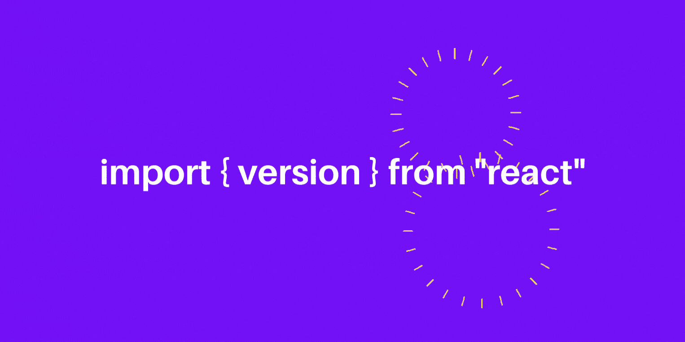
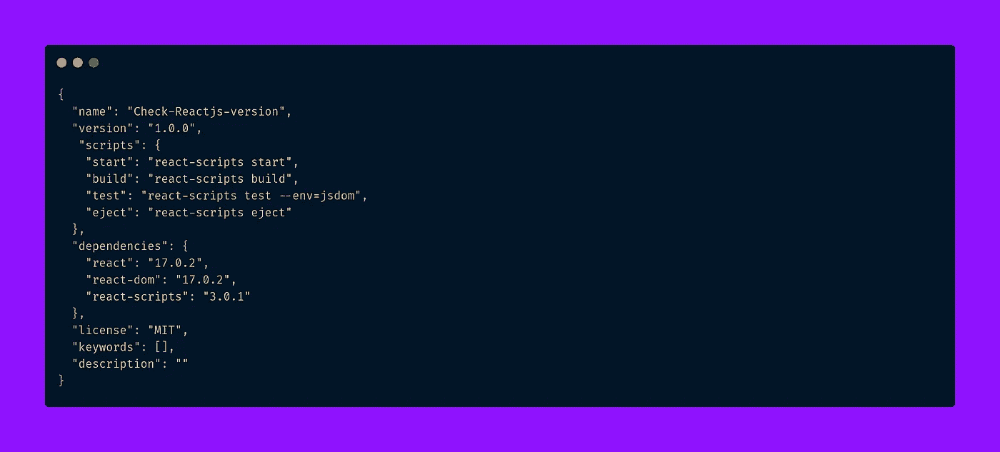
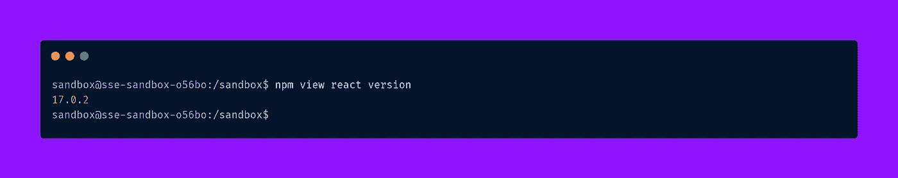
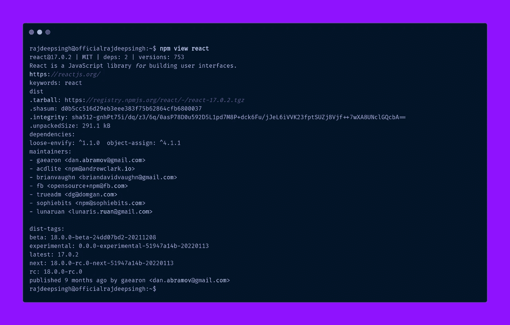

# 如何在 React 中检查版本？

> 原文：<https://javascript.plainenglish.io/how-to-check-the-version-in-react-5780fd2ced4b?source=collection_archive---------9----------------------->

## 反应

## 在 React 中用 import 语句、package.json 和 npm 或 yarn 检查版本。



How to check the version in reactjs by Rajdeep Singh

在 React 中，我们用三种方式检查版本。首先是 package.json 文件。我们使用 npm 命令的第二种方式是 cli。最后，我们使用 JavaScript 中的导入方法和导入版本来检查 React 的版本。

Package.json 在 React 中非常常见且易于使用。大家都用 package.json 方法。

## 演示

Check version is React

检查 React 版本的三种方法如下:

1.  使用 package.json 文件
2.  NPM 还是纱线
3.  导入方法

## 使用 package.json 文件

在 package.json 文件中检查 react.js 版本比其他方法更快。我们大部分时间使用 package.json 来检查 React 和另一个 npm 包。每个人都可以直接打开 package.json 文件，检查 React 版本或另一个 npm 包。



Check React version in package.json

## NPM

NPM 是检查 react 版本的一个很好的方法。我们大部分时间使用 package.json 文件方法来检查 React 版本。但是您了解 npm 的 cli 概念。我知道 package.json 方法很容易与 NPM 相比。建议你用 npm 查一下 React 版本。

NPM 命令行提供了一个查看命令，用于检查 package.json 文件中存在的任何软件包版本，并将其全局安装到您的系统中。

```
npm view react version
```

## **Linux 中的输出**



Check React.js version in npm

## **Ubuntu 中的输出**



Check React version in Ubuntu

## 导入方法

React 提供了一个内置的版本变量来定义核心中的 React 版本。可以用 JavaScript 导入方法检查 React 版本。在这个方法中，你还要写条件。

```
import { version } from "react";
```

导入后，你用`version`在任何你需要使用它的地方。例如，我使用 div 内部的版本在浏览器中显示 React 版本。使用版本变量为项目导入特定包。

```
import { version } from "react";import "./styles.css";export default function App() {return (<> 
   **<div className="App"> 
    <h1>React version: {version} </h1> 
   </div>** **<div className="version"> 
     <p> Reactjs version:{ version === "17.0.2" ? " +17" : "16"}</p>    
   </div>**</>);}
```

## 版本条件

条件的时候，你总是在 async 内部使用 import 和 wait 方法。否则，你就面临一个问题。您使用异步和等待来解决问题。

```
import { version } from "react";**if (version) {
*// When import with condtion always use*** async ***and wait in js*     
import("./styles.css");****} else {
*// import other package* console.log(version);
}**export default function App() {return (<>
  <div className="App">
     <h1>React version: {version} </h1>
   </div> <div className="version">
    <p> React js version: {version === "17.0.2" ? "+ 17" : "16"}</p>
   </div>
</>);}
```

## 以前的文章

[](https://medium.com/nextjs/the-script-component-in-next-js-ee6ee6cd705a) [## Next.js 中的脚本组件？

### Next.js 脚本组件有助于优化和提高 web 应用程序的加载性能。本文是…的一部分

medium.com](https://medium.com/nextjs/the-script-component-in-next-js-ee6ee6cd705a) [](https://medium.com/nextjs/how-to-use-bootstrap-5-with-cdn-in-nextjs-e9b9c8fd35cd) [## 如何在 Next.js 中使用带有 CDN 的 Bootstrap 5？

### Bootstrap 5 是领先的 CSS 框架。使用复制粘贴代码在 Next.js 中添加 Bootstrap 5。

medium.com](https://medium.com/nextjs/how-to-use-bootstrap-5-with-cdn-in-nextjs-e9b9c8fd35cd) 

## 结论

我希望我的文章有助于更容易理解 React 版本的概念。我总是使用 package.json 文件来检查 React 中的版本。对开发者来说更方便。使用版本变量可能对你有帮助。但我永远不会被利用。我希望将来在 React 中下载特定版本的包会更流行。

如果你有任何疑问或需要我的帮助，不要犹豫与我在 officialrajdeepsingh@gmail.com 联系。你要迁移 React 到 Next.js 吗？也可以联系我。

如果你喜欢我的文章，请随意喜欢并与他人分享我的文章。你也可以在 Twitter 上贴上标签。

[](https://officialrajdeepsingh.dev/) [## 拉吉迪普·辛格

### 我创建的这个网站是为了让初学者了解编程的基本概念。主要涵盖一个主题…

officialrajdeepsingh.dev](https://officialrajdeepsingh.dev/) 

*更多内容看* [***说白了。报名参加我们的***](http://plainenglish.io/)***[***免费周报***](http://newsletter.plainenglish.io/) *。在我们的* [***社区获得独家访问写作机会和建议***](https://discord.gg/GtDtUAvyhW) *。****