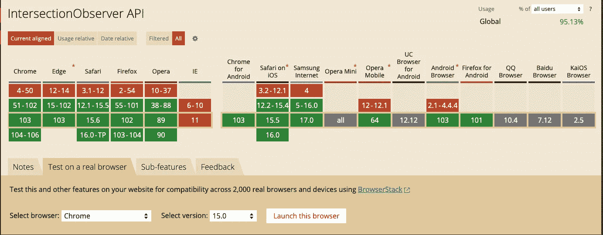

# 如何检查一个元素是否在视口中？

> 原文：<https://javascript.plainenglish.io/how-to-check-whether-an-element-is-in-the-viewport-or-not-eb5de51c0201?source=collection_archive---------6----------------------->

## 使用一种简洁的方式(交叉点观察器 API)来确定元素在视口中的可见性。

在开发网站/web 应用程序时，您可能会遇到一个重复出现的问题，即您希望根据元素是否在视口中来执行一些操作。这种情况在交互式网站中很常见。


Photo by [Matt Seymour](https://unsplash.com/@mattseymour?utm_source=medium&utm_medium=referral) on [Unsplash](https://unsplash.com?utm_source=medium&utm_medium=referral)

在本文中，我们将探索一种在视口中检查元素可见性的方法。

为了确定元素的可见性，我们将使用一个名为`Intersection Observer API`的浏览器 API。

在浏览器中引入`Intersection Observer API`之前，人们已经使用了元素的方法，如`Element.getBoundingClientRect()`、事件等..确定元素的可见性。这种方法也带来了一些性能问题，因为我们必须监听事件并相应地不断调用方法。如果我们增加检查可见性的元素数量，性能过载就会增加。

# **路口观察器 API**

它提供了一种异步观察目标元素与祖先元素或顶级文档视窗的交集变化的方法。

## 检查兼容性



从上图可以看出，除了 IE (Internet Explorer)之外，几乎所有浏览器的最新版本都支持交叉点观察器 API。不会有支持不支持的问题

您可以在`https://caniuse.com`或点击下面提供的链接，探索交叉点观察器 API 的其他方面。

 [## “交叉点观察器 API”|我可以使用吗...HTML5、CSS3 等的支持表

### “我可以使用吗”提供了最新的浏览器支持表，以支持桌面和移动设备上的前端 web 技术…

caniuse.com](https://caniuse.com/?search=Intersection%20Observer%20API) 

## 路口观测器的实现

为了实现交集观察者，我们需要一个目标元素&交集观察者来观察目标元素的可见性。

在这里了解更多关于十字路口观察器的信息

[](https://developer.mozilla.org/en-US/docs/Web/API/Intersection_Observer_API) [## 交叉点观察器 API-Web API | MDN

### 交叉点观察器 API 提供了一种异步观察目标元素交叉点变化的方法…

developer.mozilla.org](https://developer.mozilla.org/en-US/docs/Web/API/Intersection_Observer_API) 

我们可以通过这些简单的步骤实现交叉点观察器。

1.  创建一个观察者

```
const options = {
    root: null,
    threshold: 0.5
};
const callback = function(entries, observer) {
     entries.forEach((entry) => {
        console.log(entry.isIntersecting);
     });
}let observer = new IntersectionObserver(callback, options);
```

这里你可以看到我们已经通过了`options`和`callback`来创建一个观察者。在选项中，`root`的值是`null`，这意味着它将视口作为参考来确定可见性。`threshold`值为`0.5`，表示如果目标可见性超过 50%，则`callback`将被调用。

回调函数有两个参数，`entries`和`observer`。`entries`是`IntersectionObserverEntry`类型对象的列表。

2.选择一个目标并观察它

```
const target = document.getElementById("target");
observer.observe(target);
```

仅此而已。

# 检查元素对视口是否可见

为了检查一个元素是否在视口中，我们将`threshold`的值设置为`0`。这样，元素一进入或离开视口，回调就被调用

```
const target = document.getElementById("target");
function callback(entries, observer) {
     entries.forEach((entry) => {
       if(entry.isIntersecting) {
         console.log("visible"); 
       } else {
         console.log("not visible");
       }
    });
}
function createObserver(target, callback) {
   const options = {
      root: null,
      threshold: **0**
   };
   const observer = new IntersectionObserver(callback, options);
   observer.observe(target);
}

createObserver(target, callback);
```

查看此处的工作示例:

Check if the element is visible or not

# 检查元素在视口中是否完全可见

为了检查一个元素是否完全可见，我们将`threshold`的值设置为`1`。这样，一旦整个元素进入视口或完全离开视口，回调就会被调用。

```
const target = document.getElementById("target");function callback(entries, observer) {
     entries.forEach((entry) => {
       if(entry.isIntersecting) {
         console.log("Fully visible"); 
       } else {
         console.log("not fully visible");
       }
    });
}function createObserver(target, callback) {
   const options = {
      root: null,
      threshold: 1
   };
   const observer = new IntersectionObserver(callback, options);
   observer.observe(target);
}

createObserver(target, callback);
```

查看此处的工作示例。

Check if the element is fully visible or not

我希望你喜欢这篇文章。

感谢阅读。坚持阅读，坚持解决问题。谢谢你。

*更多内容请看*[***plain English . io***](https://plainenglish.io/)*。报名参加我们的* [***免费周报***](http://newsletter.plainenglish.io/) *。关注我们关于*[***Twitter***](https://twitter.com/inPlainEngHQ)**和*[***LinkedIn***](https://www.linkedin.com/company/inplainenglish/)*。查看我们的* [***社区不和谐***](https://discord.gg/GtDtUAvyhW) *加入我们的* [***人才集体***](https://inplainenglish.pallet.com/talent/welcome) *。**