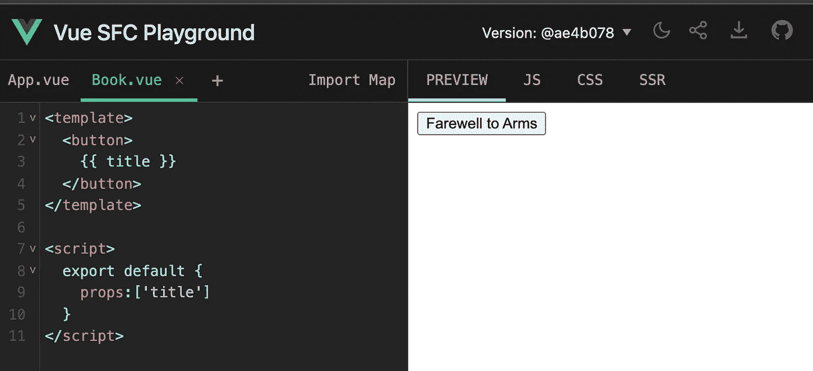
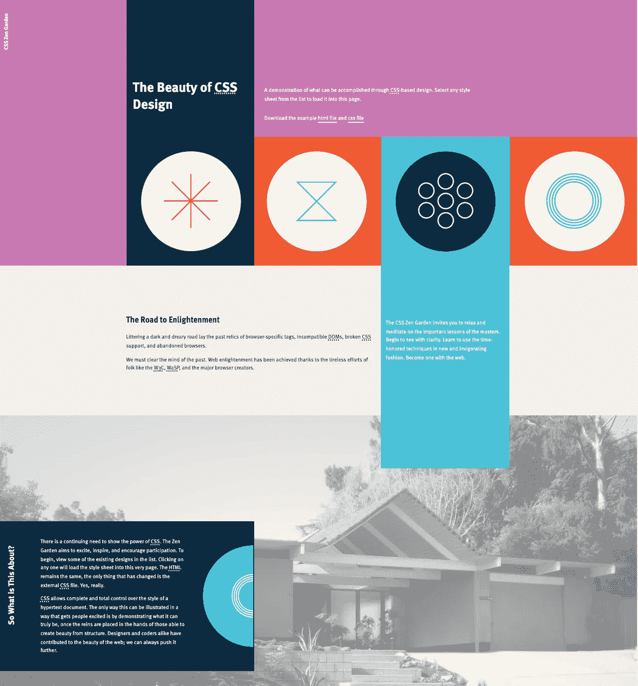
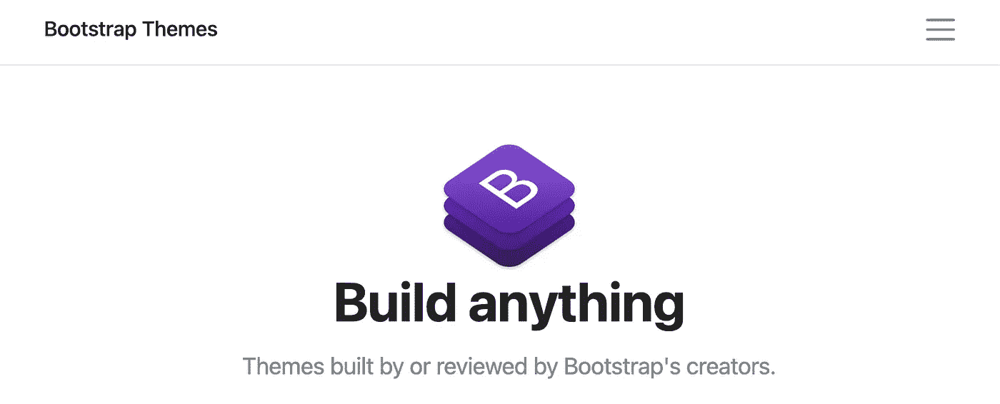
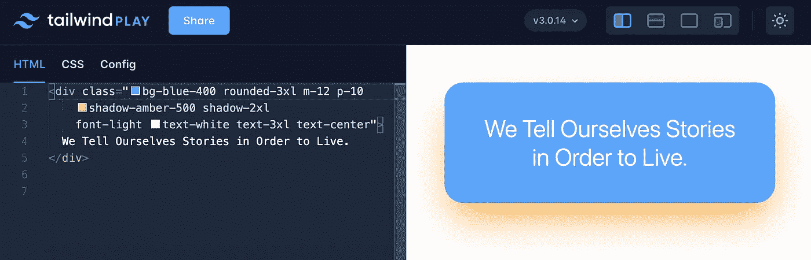

# 如何选择 Web 开发的前端框架

> 原文：<https://javascript.plainenglish.io/how-to-choose-a-frontend-framework-for-web-development-d85305512e7a?source=collection_archive---------11----------------------->

## 当开发人员体验很重要时


Photo by [René Peters](https://unsplash.com/@cosiman?utm_source=medium&utm_medium=referral) on [Unsplash](https://unsplash.com?utm_source=medium&utm_medium=referral)

哪个 web 框架工作得最好？

*作为一名开发人员，我想分享我在使用这些框架的经历中最喜欢的工具。*

# 1.网络的现状

Tim Berbers-Lee 在 1993 年编写了 HTML 的第一个版本，Dave Raggett 的第一个浏览器马赛克也在同一年发布。从那以后，许多技术被发明用于互联网。就像今天的 web 所能提供的一样迷人，web 开发经常是一个混乱的地方。作为一名开发人员，我们看到了闪亮的跑车和引擎盖下发生的事情。

2021 年网站总数超过 18 亿。泛滥的网页内容在吸引用户注意力方面产生了激烈的竞争，这给网页设计和性能提出了更高的标准。一个网站被期望:1)支持新的浏览器而不打破旧的(保持向后兼容)；2)处理具有(异常)浪涌的流量，即使在网络连接不良的情况下也能迅速响应；3)自动适配大屏电脑，iPad，或者各种品牌的手机。

# 2.Web 开发的自然方法

## 2a。mise en scene

在电影语言中， *mise en scène* 是一个描述放置在镜头前的一切的设置的术语；它通常是导演和摄影师决定如何最有效地构建镜头的起点。故事发生在前院就不用装修房子后面了；我们应该只关心最重要的事情。

带着这种心态，我们来讨论一下 web。网页浏览器是我们的照相机，用来框住镜头，网页设计应该从构建我们想要看到的东西开始。浏览器窗口定义了一个矩形空间，就像一张纸，创建一个网页和制作一个剪贴簿没有什么不同。我们知道如何去做。首先，我们找到自己喜欢的材料；然后我们把它裁剪出来，修剪到合适的大小，再固定到床单上，就渐渐成为我们的杰作了。基于组件的 web 设计就是这么做的。

## 2b。基于组件的网页设计

组件是只涉及整体的一部分的单元，通常为特定目的而设计，并展示独特的视觉表现。一个网页通常由多个组件组成；换句话说，基于组件的设计利用了组合设计模式。

在这种方法下，一个网站通常按以下步骤成形:1)勾画和划分组件；2)定义每个组件的外观和功能；3)用户体验和交互设计；4)开发、测试和迭代。

管理所有组件的状态是最基本的，这不是一个小任务。添加新组件后，复杂性不是线性增加，而是呈指数增加。为了成功地实现基于组件的设计，我们需要合适的软件工具来处理血淋淋的细节，以专注于我们最关心的事情。

## 2c。Web 框架

一个 *Web 框架*是一个软件工具，为 Web 所需的任务提供通用模式。我们只讨论前端框架，因为后端超出了我们的范围。前端框架下有两类:JavaScript 框架和 CSS 框架。简而言之，JavaScript 框架处理内容和功能，而 CSS 框架定义网站的布局和其他美学问题。

让我们听听两个最流行的 JavaScript 框架的故事。(我们将在后面讨论 CSS。)

乔丹·沃克在 2011 年为脸书的新闻订阅开发了 **React** ，以跟上应用程序的复杂性。React 带来了限制组件状态突变的革命性思想。React 在 2013 年开源，很快就变得流行起来，自 2019 年以来，它一直位于前端框架流行排行榜的首位。

令人惊讶的是， **Vue** 是一个艺术生发明的。在帕森斯攻读他的艺术硕士学位时，就连你也看到了在网络上创造复杂的互动体验的需要，并自学了 JavaScript 编程。他的愿景是简单地构建 web 组件。Github 发布 Vue 的消息引起了谷歌的注意，谷歌为 Evan 提供了一份工作。在企业界呆了几年后，Evan 回到 Vue 全职工作。

Vue.js Documentary by HoneyPot

## 2d。如何选择一个 JavaScript 框架

经过冗长的利弊比较，许多评论会用臭名昭著的*视情况而定*来回答选择的问题。也许真的要看情况，但这样的说法提供的帮助很少。

用最流行的怎么样，比如在亚马逊上买最畅销的？仔细想想；您会发现这个逻辑对于 web 开发工具来说是有缺陷的。采用新的 web 框架需要时间，所以流行度图不一定反映最好的。

大多数流行的 web 框架都是开源的，这不是巧合。开源有很大的好处，但我们在采用开源软件时需要谨慎。我会推荐一些东西:

*   阅读关于项目的合理数量，如评级和评论。考虑信息来源和评论者的背景。
*   认识造物主。找一些著述，Twitter，YouTube 讲座，编码演示等。；这可能是特别有帮助的材料是关于项目的。
*   浏览一下 Github 的文档、教程和源代码。
*   做一个迷你项目；如果以上都显示有希望，是时候让你的手脏起来，自己试试了。

## 2d。反应与 Vue

## 反应

我第一次接触 React 是通过 React Native，当时我正在寻找开发跨平台应用程序的工具。如果你发现学习反应需要一些努力，你并不孤单。React 要求至少具备中等水平的 JavaScript 经验和面向对象设计知识。

看看下面构建一个简单组件的代码。

```
**class Book extends React.Component** {
  render() {
    return (
      <button className="book">
        **{this.props.title}**
      </button>
    );
  }
}**ReactDOM**.render(
  <Book title="Play It as It Lays"/>,
  document.getElementById('root')
);
```

代码不长。您需要准备一个空的`<div id='root'> </div>`来接收 HTML 中的渲染结果。在 React 中，组件最终将被根组件调用，根组件通过熟悉的方式与 DOM 交互。`document.getElementById()`。

一个组件继承了 *React。组件*类，并在您调用它的`render()`方法时返回 HTML。有两件事是必须知道的:

*   `this.props`是不可变的，因为组件所有者使用它来传递值；
*   `this.state`是组件自己的状态，它可以被改变，但是只有当你有一个好的理由这样做的时候。

用 React 写代码只是 JavaScript 的面向对象编程，需要一些小心。HTML 模板与代码的 JavaScript 部分混合在一起，React 并不能增强可读性；从某种意义上来说，React 并没有充分发挥 JavaScript 的优势。

## 某视频剪辑软件

我知道 Vue 已经有一段时间了，但我是在 Vue 3.0 正式发布后才一头扎进去的。我发现 Vue 在以下方面最具吸引力:

*   简单直观。Vue 非常容易上手。Vue 宣传自己是“进步的 JavaScript 框架”，说的是实话。
*   可能用于 SFC(单个文件组件)。在一个单独的文件中编写一个组件是完全有意义的。它方便、高效，并且避免了许多潜在的弄乱其他东西的问题。
*   分离*模板*、*脚本*和*样式*。a) *模板*是 HTML，定义了可视化元素；b) *脚本*是 JavaScript 的部分，定义道具和流程数据；c) *style* 是专门针对该组件的 CSS，可以为空，也可以省略整段。
*   构建工具，如 *vite* ，使得构建 Vue 应用变得容易。

作为一个例子，我在 Vue 中编写了 React 中使用的示例。使用 SFC 是最佳实践。组件`Square.vue`如下:

```
<template>
  <button>
    {{ title }}
  </button>
</template><script>
  export default {
    props:['title']
  }
</script>
```

要使用该组件，您只需从 *App.vue* 中调用即可。不需要理解底层的低级功能。与 React 与 DOM 的交互方式相比，它要简单得多)。

```
<template>
 <Book title="Farewell to Arms"/>
</template><script>
  import Book from "./Book.vue"  
  export default {
    components: { Book }
  }
</script>
```

去 Vue SFC 游乐场试试吧。你可以在这里找到这个简单的例子[。](https://sfc.vuejs.org/#eyJBcHAudnVlIjoiPHRlbXBsYXRlPlxuXHQ8Qm9vayB0aXRsZT1cIkZhcmV3ZWxsIHRvIEFybXNcIi8+XG48L3RlbXBsYXRlPlxuXG48c2NyaXB0PlxuICBpbXBvcnQgQm9vayBmcm9tIFwiLi9Cb29rLnZ1ZVwiICBcbiAgZXhwb3J0IGRlZmF1bHQge1xuICAgIGNvbXBvbmVudHM6IHsgQm9vayB9XG4gIH1cbjwvc2NyaXB0PiIsImltcG9ydC1tYXAuanNvbiI6IntcbiAgXCJpbXBvcnRzXCI6IHtcbiAgICBcInZ1ZVwiOiBcImh0dHBzOi8vc2ZjLnZ1ZWpzLm9yZy92dWUucnVudGltZS5lc20tYnJvd3Nlci5qc1wiXG4gIH1cbn0iLCJCb29rLnZ1ZSI6Ijx0ZW1wbGF0ZT5cbiAgPGJ1dHRvbj5cbiAgICB7eyB0aXRsZSB9fVxuICA8L2J1dHRvbj5cbjwvdGVtcGxhdGU+XG5cbjxzY3JpcHQ+XG4gIGV4cG9ydCBkZWZhdWx0IHtcbiAgICBwcm9wczpbJ3RpdGxlJ11cbiAgfVxuPC9zY3JpcHQ+In0=)



Vue SFC Playground (https://sfc.vuejs.org) | Image source: Sean Zhai

如果把 React 编程比作去洛杉矶市区的早晨通勤，那么用 Vue 写代码就是在曼彻斯特海边的夏日午后之旅。也许名字反映了这些框架发明者的心态: *react* 需要时刻保持警惕和注意力； *vue* 是法语单词 *view* ，谁不*获利 de la vue？*

# 3.设计网页风格

## 3a。定义外观



CSS Zen Garden | Image source: csszengarden.com

级联样式表，或 CSS，负责网页的外观。kon Wium Lie 于 1994 年首次提出，一年后他在 CERN(欧洲核研究委员会)的同事蒂姆·伯纳斯·李发明了 HTML。

顾名思义，CSS 使用层叠规则来定义 HTML 元素应该如何呈现。Dave Shea 的 CSS Zen Garden 项目展示了 CSS 的重要性，该项目向设计师提出挑战，要求他们仅通过改变 CSS 来创造独特的外观。

任何 web 元素都可以有自己的 CSS。浏览器将尽最大努力根据规则呈现所有的 CSS:从其父级继承的子级可以覆盖在任何上层定义的规则。错误被原谅，矛盾被默默化解。这种行为是为了让 web 更加健壮而设计的，但是副作用是它使得 CSS 很难调试。

早期的 web 是出了名的难以控制一个元素的位置，人们不得不为此绑架 *<表>* 。人们做了很多努力来减轻使用 CSS 的痛苦，比如引入网格系统。功能齐全的 CSS 框架逐渐走向成熟。

## 3b。CSS 框架

## 引导程序

Bootstrap 在 2011 年首次发布之前由 Twitter 内部使用。它是当今最流行的 CSS 框架。Bootstrap 具有广泛的预构建组件和数以千计的主题，专为各种可能的用户而设计。这个想法很简单，无论 web 需要什么 UI 组件，Bootstrap 都会为您构建。



Bootstrap | Source: getbootstrap.com

Bootstrap 使得任何人都可以很容易地基于现有的模板设计网站，但是使用自己的组件就(困难得多)了。创建一个独特的视觉存在往往不是一件小事，许多用户尝试，受挫，并放弃这样的想法。很少看到带有用户组件的 Bootstrap 站点，这导致人们通常可以通过它们的相似性来区分哪个站点使用了 Bootstrap。在某种程度上，Bootstrap 意味着普通甚至无聊。

这就是我所看到的选择引导主题的困境:寻找一个符合你需求的平衡主题就像在一个巨大的购物中心购物，在找到正确的主题之前你经常会筋疲力尽；所以，也许你想使用一个流行的主题，但这意味着会有许多其他网站也是类似的；也许你甚至考虑获得一个付费主题，我强烈建议你在这样做之前先考虑维护和进一步开发。

## 顺风 CSS

亚当·瓦森是 Tailwind 的幕后策划者，一个*实用优先的 CSS* (与*语义 CSS* 相比)。从概念上讲，CSS 应该抽象出视觉表现，并独立于 HTML 内容。Wathan 的目标是可重用性，这可以通过一套实用程序类来实现，比如:

*   文本大小、颜色和粗细
*   边框颜色、宽度和位置
*   背景颜色
*   Flexbox 实用程序
*   填充和边距助手

这些简单实用工具的组合可以有效地创造惊人的东西。看看下面这个简单的例子，你会发现它是描述性的，几乎不言自明。



Tailwind CSS Example using [Tailwind Play](https://play.tailwindcss.com/) | Image source: Sean Zhai

2021 年 12 月 9 日发布的顺风 3.0，很新鲜。即时编译器是一个巨大的改进，因为它极大地减少了开发中的 CSS 大小，并支持许多新功能。

我在过去的一些项目中使用了 Bootstrap，最近我发现了 Tailwind。我喜欢《顺风》,因为创造你想要的外观不再是一件难事。它给人一种光滑清爽的感觉。

# 4.Vue 和顺风的整合

我明确支持 Vue 和 Tailwind，的确，它们融合得很美。

Vue 和 Tailwind 社区似乎都很重视对方，并且都提供了一套完整的文档来与对方集成。我对两者都进行了测试，并记录了我的发现。

[](https://towardsdatascience.com/dive-into-modern-web-deployment-quickstart-guide-on-building-dynamic-applications-9e1eb2979f1e) [## 深入现代 Web 部署:构建动态应用程序快速入门指南

### 用顺风 CSS 创建 Vue 应用

towardsdatascience.com](https://towardsdatascience.com/dive-into-modern-web-deployment-quickstart-guide-on-building-dynamic-applications-9e1eb2979f1e) 

# 尾声

随着越来越多的 web 框架可用，开发人员的体验变得越来越重要。真正受开发者喜爱的，才会升到顶。干杯！

*更多内容请看*[***plain English . io***](http://plainenglish.io/)*。报名参加我们的* [***免费周报***](http://newsletter.plainenglish.io/) *。在我们的* [***社区***](https://discord.gg/GtDtUAvyhW) *获得独家获得写作机会和建议。*