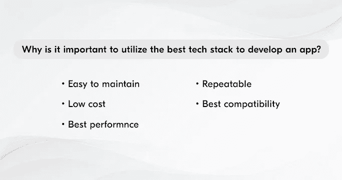

# 采用这些策略来选择正确的技术组合

> 原文：<https://javascript.plainenglish.io/how-to-choose-tech-stack-wisely-9be1ac110271?source=collection_archive---------11----------------------->

## 如何为你的下一个应用开发项目选择合适的技术堆栈？

使用合适的建筑材料，建筑能够变得更加具体和坚固。同样，有了合适的技术组合，企业就能取得最大的成功。

所以选择要适当。这将刺激开发过程，并使解决方案快速工作。

在本文中，我们详细解释了这一点，列出了使选择更容易的领域。

让我们开始吧。

## ***科技栈定义***

根据 Stack share，技术堆栈基本上是组织用于移动应用程序开发的技术的组合。

为开发者构建编程语言、框架、库、模式、服务器、UI/UX 解决方案、软件和工具，以加速应用程序开发过程并确保其快速运行。

既然我已经解释了这个概念，现在让我列出创建技术堆栈背后的组件。

## ***支持技术栈创建的组件***

**前端**
这基本上就是 app 接口了。也称客户端开发，是决定用户与 app 交互的行为类。

**后端**
基本上是一个数据访问层，它与不同的数据库、脚本、网站架构和服务器端建立连接，并考虑用户输入。在执行这项任务时，输出转换任务变得更加简单。

**开发工具**
这些工具包括库和接口。同样支持构建功能强大且快速的解决方案。

**附加元素**
包含各种各样的技术元素，它们有助于确定应用程序在安全性等方面的表现。

了解了这些不同的组件之后，现在让我们来思考一下为什么企业需要将组件放在首位。但是，首先让我向您介绍一下构成前端和后端开发关键部分的知识。

## ***前端开发组件***

*   级联样式表
*   Java Script 语言
*   web 程序集
*   超文本标记语言

## ***后端开发成分***

*   数据库管理系统
*   Web 服务器
*   协作服务
*   当地发展环境

现在，您已经了解了技术堆栈的含义，以及构建技术堆栈背后的不同要素，现在让我为您提供选择技术堆栈的理由。

## ***移动应用开发技术栈相关性的原因***

请看下图:

看着上面的这张图片，你可以清楚地了解是什么使得选择技术堆栈成为 [**移动应用程序开发**](https://www.xongolab.com/mobile-app-development/) 任务的必要条件。

现在让我在下面详细解释这些领域。

**让应用维护变得简单**
选择一个技术堆栈支持简单的应用维护。特别是，由于它提供了快速和简单的更改支持，因此，在您的业务模式发生转变的情况下，这可以说是塞翁失马，焉知非福。

**节省成本**
在应用程序开发和维护阶段，初创公司不会希望花费巨额资金。因此，获得技术堆栈变得至关重要。它节省了大量资金。

**优化性能**
优质的特性和优化的性能是成功创建应用的两个先决条件。这在一系列技术的支持下成为可能。它将确保解决方案提供高性能，并消耗最少的内存和资源。，同时确保这些特性具有最高的质量。

**使不同版本之间的更改变得容易实现**
这是在选择技术堆栈之前要考虑的另一个重要方面。它可以帮助您无缝地、方便地在不同版本之间进行更改。

**有助于实现兼容性**
比方说，你正在为 iOS 或 Android 操作系统开发一个应用程序，你的主要目标是确保客户端应用程序和服务器之间的无缝交互。这是在技术支持下才有可能实现的事情。它使您能够访问使兼容性更容易实现的工具。

既然您已经了解了构建移动应用程序时技术堆栈的重要性，那么现在重要的是思考不同操作系统使用的不同技术堆栈。

你一定想知道为什么？因为每个平台都有独特的功能。因此，可以说，他们需要独一无二的技术堆栈。

因此，让我们了解一下这些平台上的移动应用程序开发背后的技术堆栈，即 iOS 和 Android，以及混合应用程序开发和跨平台应用程序开发等任务。

## ***Android 应用开发的技术栈***

***编程语言***
基本上，kot Lin(2011 年推出)是一种用于跨平台应用开发的编程语言，近年来非常受欢迎。这尤其适用于在 Android 上开发应用的任务 [**。另一个同样受欢迎的是 Java。尽管它在使应用程序易于使用方面很受欢迎，但现在越来越多的开发者推荐前者。**](https://www.xongolab.com/android-app-development/)

***Android 工具包***
主要有两个工具，Android Studio 和 Android Developer。前者提供了构建高质量性能应用的灵活性。后者则在获得调试工具方面为开发人员提供支持，从而确保自动化和快速测试。

***SDK***
Android SDK 帮助开发人员获得工具，使更新和修改应用程序等任务尽可能简单。这些工具包括 fastboot、systrace 等。所有这些都有助于快速增强应用程序。

## ***iOS 应用开发的技术栈***

***编程语言***
Swift 和 Objective-C 是推荐给 [**开发 iOS app**](https://www.xongolab.com/iphone-ios-app-development-services/)的两种语言。这是由于功能特性和代码的存在，这些代码很容易产生很少的错误。

***工具包***
有两个工具包开发者推荐，为 iOS 设备开发一个 app。这包括 IntelliJ AppCode、和 Xcode。

***iOS SDK***
iOS OS 的 SDK 主要由一个 API 组成。它充当运行应用程序的平台和整个软件应用程序之间的链接。这包括主要用于触摸屏界面和专有 iOS 操作系统的工具。

现在，让我们分别向您介绍用于混合应用程序开发、原生应用程序开发和跨平台应用程序开发的技术堆栈。

## ***混合应用开发技术栈***

使用 CSS、HTML5 等标准 web 技术开发的混合应用程序由两部分组成，即后端和原生外壳。这些为解决方案提供了访问 API 和存储的支持。

既然你已经知道了基本结构，现在让我告诉你使用的框架的知识。这包括 Cordova、Sencha Touch 2 和 Ionic。

在混合应用程序之后，让我们反思跨平台应用程序开发背后的技术栈，以帮助解决方案尽可能快速地工作。

## ***跨平台 App 开发的技术栈***

简单来说，在讨论 [**跨平台 app 开发**](https://www.xongolab.com/blog/why-should-you-go-for-cross-platform-to-develop-mobile-app/) 的意义时，它基本上是建议创建一个可以跨平台运行的 app，比如 Android、iOS、web。这意味着在所有这些平台上使用单一代码。

最后，让我们思考一下本地应用开发背后的技术堆栈，以确保最终解决方案的无缝运行。

## ***面向原生应用开发的技术栈***

原生应用以其整体质量表现而闻名，为企业提供支持，将已经存在于设备中的内置功能集成到应用中。这不需要使用第三方 API 来完成这项任务。

现在，您已经很好地了解了用于不同任务的技术堆栈，例如 iOS 应用程序开发、android 应用程序开发、跨平台应用程序开发、混合应用程序开发以及原生应用程序开发。然而，同样重要的是深入了解使最终选择更容易的策略。

下面让我们来教你这方面的知识。

读完这篇文章后，我们相信你可以理解技术栈的重要性，以及在 iOS 和 Android 平台上构建应用程序的推荐技术，等等。

但是做出适当的选择也同样重要，因为它将支持您的解决方案，为您的业务带来最大的成功。

那么该如何着手呢？

**看看下面的几点可以更好地理解这一点:**

***了解 app 需求***
每个 App 都有独特的需求。因此，在选择技术组合之前，确定应用程序将满足的需求。这包括应用程序运行的设备、应用程序提供的用户体验、应用程序上市的时间等等。这些区域将为您提供选择合适的库、框架等所需的便利。

***检查你的应用程序将实现的目标***
这个区域将支持你为应用程序开发选择合适的技术堆栈。例如，如果您的应用程序依赖于高负载处理，那么您应该选择强大的技术堆栈。这将有助于无缝应用运营，从而为您的最终解决方案留住更多用户。

***确定技术的母公司***
在选择技术组合之前要考虑的另一个关键点是关注技术的母公司。这将帮助您获得易于理解的文档，如果您在移动应用程序开发过程中遇到障碍，社区将随时为您提供支持。

此外，除了技术堆栈将帮助您实现的安全性和安全领域之外，还要突出技术堆栈将能够与您整合的工具兼容等标准，并最终了解堆栈将提供的允许应用程序跨不同平台运行的能力。

所有这些将帮助您创建一个解决方案，为您的企业创造最大价值，为您的企业吸引最多的客户，并最终帮助您从第一天起就获得最大收益！

## 结尾词

阅读这篇文章，我们相信你能理解拥有一个创新的解决方案对你的新公司的重要性。但是，如果不选择合适的技术组合，就无法实现这一点。

选择一个合适的，你打开了巨大的商机。然而，由于独自完成这项任务可能不容易，可以考虑与移动应用开发公司合作。通过他们在最新技术堆栈中拥有的专业知识，以及推动创新的最新方法，他们将支持您在最大化客户和收入方面取得巨大成功。

因此，明智地做出选择，从第一天起就将你的创业项目转移到下一代水平。

*更多内容看* [***说白了就是 io***](https://plainenglish.io/) *。报名参加我们的* [***免费周报***](http://newsletter.plainenglish.io/) *。关注我们关于*[***Twitter***](https://twitter.com/inPlainEngHQ)*和*[***LinkedIn***](https://www.linkedin.com/company/inplainenglish/)*。加入我们的* [***社区不和谐***](https://discord.gg/GtDtUAvyhW) *。*