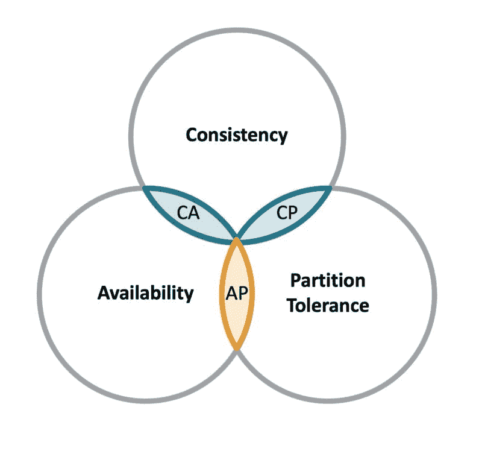
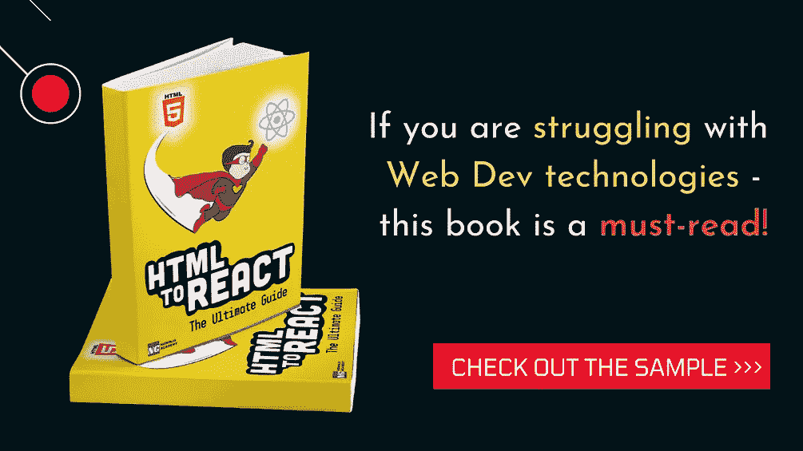

# 如何为您的应用选择合适的数据库

> 原文：<https://javascript.plainenglish.io/how-to-choose-the-right-database-for-your-application-11475c9ff242?source=collection_archive---------1----------------------->

## 为您的应用程序选择数据库时应该考虑的因素。

# 介绍

选择使用哪个数据库是你在开始开发一个新的应用程序或网站时可以做出的最重要的决定之一。

如果您最终意识到自己做出了错误的选择，那么迁移到另一个数据库的成本会非常高，而且在零宕机的情况下，有时会更加复杂。

对于您的应用程序来说，花时间提前做出明智的数据库技术选择可能是一个有价值的早期决策。

*(这一点之所以重要的另一个原因是，了解不同的数据库及其属性&在求职面试中，选择哪一个是很常见的问题)*

每种数据库技术都有优点和缺点。像亚马逊这样的云提供商提供各种数据库和存储选项，这使得很难找出哪一个是正确的。

长期以来，关系数据库一直是主要的数据存储机制。非关系数据库自 20 世纪 60 年代就已经存在，但最近随着 MongoDB 等流行选项的出现而受到重视。

在本文中，我们将讨论在选择任何数据库时应该考虑的因素。

# 语言决定数据库

重要的事情先来。您将使用的语言或技术永远不会决定数据库❌

我们已经习惯了技术栈，比如 MERN (MongoDB，Express，React，Node.js)和 LAMP (Linux，Apache，MySQL，PHP)。

这些栈的进化是有一定原因的。但是不要以为这些就是规则。您可以在 Java 项目中使用 MongoDB 数据库。您可以在 Node.js 中使用 MySQL。您可能没有找到很多教程，但是应该由您的需求来决定数据库类型&而不是语言。

# 理解权衡

现在，让我们了解一下在做出 DB 决策时需要处理的基本权衡。

今天我们有许多数据库选项的原因是由于 CAP 定理。CAP 代表**一致性**、**可用性**和**分区容差**。

**一致性**意味着任何读取请求都将返回最近的写入。

**可用性**意味着所有(非故障)节点都可用于查询&必须在合理的时间内做出响应。

**分区容错**意味着尽管节点出现故障，系统仍将继续工作。

在任何给定时间，这三个要求中只有两个可以满足。如果你正在构建一个分布式应用，那么分区容忍度是必须的。因此，选择仍然是我们希望我们的数据库是高度可用还是高度一致。

# 数据结构

如果您的数据需要结构化，或者您要保留的不同类型的数据之间存在关系，同时您希望严格的数据完整性，那么关系数据库应该是您更好的选择。

例如，假设我们正在制作一个学生管理应用程序，其中我们需要存储某些课程的信息，并且每门课程都需要一个或多个学生参加。在这种情况下，我们可以创建两个表(`Students`和`Courses`)，其中`Courses`表中的`Student ID`列的值通过它们的`ID`列的值指向`Students`表中的行。

除此之外，如果你想让你的数据库兼容 ACID，比如当你在应用程序中处理支付和交易时，那么在这种情况下，你也应该更喜欢基于 SQL 的数据库，因为对应的数据库，即 NoSQL 数据库，提供了弱一致性。

> *ACID compliance 通过准确定义什么是事务以及事务如何与数据库交互来保护数据的完整性。它避免了数据库表变得不同步，这对于金融交易非常重要。即使面临错误、技术故障、灾难性事件等等，ACID 法规遵从性也能保证事务的有效性。*

另一方面，如果您的数据需求不明确或者您的数据是非结构化的，NoSQL 可能是您的最佳选择。

存储在 NoSQL 数据库中的数据不需要预定义的模式。这在管理数据库时提供了更大的灵活性和更少的前期规划。

NoSQL 数据库更适合存储文章内容、社交媒体帖子、传感器数据和其他类型的非结构化数据，这些数据不适合放在一个表中。NoSQL 数据库在构建时考虑了灵活性和可扩展性，并遵循基本一致性模型，这意味着:

## 基本可用性

这意味着尽管数据库保证了数据的可用性，但数据库可能无法获得所请求的数据，或者数据可能处于变化或不一致的状态。

## 柔软状态

数据库的状态可能会随着时间的推移而变化。

## 最终一致性

数据库最终会变得一致，在未来的某个时刻，数据会传播到任何地方。

在决定使用 SQL 还是 NoSQL 数据库时，数据的结构是最重要的因素，所以在做出决定之前要多加考虑。

# 查询模式

下一个要考虑的因素是如何查询数据。这是为您的用例找到最佳数据库的主要方法之一

您需要通过单个键进行检索，还是通过各种其他参数进行检索？你还需要对数据进行模糊搜索吗？

*   使用非关系数据库如果要通过键获取数据，那么只需要一个键值存储(例如 DynamoDB)。
*   另一方面，如果您需要查询许多不同的字段，您可以选择关系数据库(例如 MySQL)或文档数据库(例如 MongoDB)。
*   如果你正在寻找模糊搜索查询功能(自由文本搜索)，那么像 Elasticsearch(也属于 NoSQL DBs)这样的搜索引擎是最合适的。
*   但是，如果您的数据结构良好，用 SQL 数据库查询数据会非常有效。

> SQL 是一种流行的查询语言，至今已有 50 多年的历史，因此它非常成熟和知名。它使用连接有效地执行查询和检索，并快速编辑数据。它是非常轻量级和声明性的。

# 一致性

需要强一致性(写后读)还是最终一致性可以？

如果您需要在写入操作之后立即读取数据(即强一致性)，那么关系数据库(例如 MySQL)通常比非关系数据库(例如 MongoDB)更适合。

# 性能和可扩展性

随着读/写流量的增加，所有数据库的性能都会下降。这是优化的时候了，比如索引数据和扩展数据库。

性能取决于各种因素，但总体性能在很大程度上取决于为您的用例选择正确的实现。

SQL 和 NoSQL 数据库的伸缩性不同，因此您必须考虑您的数据集在未来将如何增长。

SQL 数据库是纵向扩展的，这意味着您需要增加单台服务器的容量(增加 CPU、RAM 或 SSD)来扩展您的数据库。SQL 数据库旨在维护数据的完整性，因此它们最好运行在一台服务器上，因此不容易扩展。

NoSQL 数据库易于水平扩展，这意味着您可以随着数据的增长添加更多的服务器。这是 NoSQL 优于 SQL 的一个优势。

就可用性而言，非关系数据库的这种简单的水平伸缩特性使它们优于关系数据库。

NoSQL 数据库的水平伸缩能力与数据缺乏结构有关。因为 NoSQL 比 SQL 需要更少的结构，所以每个存储的对象都是独立的。因此，对象可以很容易地存储在多个服务器上，而不必链接。这不是 SQL 的情况，在 SQL 中，每个表行和列都需要相关联。

这也是关于性能的问题，SQL 的不足之处是伸缩性。随着数据库规模和数量的增长，正如我们所见，RDBMS 需要垂直扩展的解决方案。然而，这带来了巨大的成本。尽管许多商业 RDBMS 产品提供了水平扩展，但这些也可能非常昂贵，甚至实现起来很复杂。

如果您预测您将面临这样的问题，那么可以考虑 NoSQL，因为它们中的许多是专门为解决这些规模和性能问题而设计的。

# 结论

在本文中，我们讨论了在选择数据库类型时应该考虑的多个因素。简而言之，SQL 数据库为结构不经常改变(或者根本不改变)并且数据完整性至关重要的事务性数据提供了巨大的好处。它也是快速分析查询的最佳选择。NoSQL 数据库提供了更多的灵活性和可伸缩性，这使得它们对于快速或迭代开发非常有用。

下面是我们上面讨论的内容的一个小总结:

# 使用 SQL 数据库的原因

*   当你需要酸支持时
*   您的应用程序需要大量事务
*   数据完整性至关重要
*   你不会预料到模式会有很多变化

# 使用 NoSQL 数据库的理由

*   您存储了大量没有结构的数据
*   您不断得到不相关的、不确定的或不断发展的数据需求
*   速度和可扩展性至关重要。
*   当数据完整性不是您的首要目标，并且您关心可用性时(最终的一致性对于您的用例来说已经足够好了)

我希望这有助于您理解在选择数据库时需要考虑的问题。在选择数据库时，您还会考虑哪些问题？请在评论中告诉我你的想法。

编码快乐！💻

(如果您发现任何疑问、更新或更正来改进本文，请在评论中分享)😊

# 从 Web 开发开始？

查看 [**HTML 反应过来:终极指南**](https://gumroad.com/a/316675187)

这本电子书是一个全面的学习指南，通过大量易于理解的例子和经过验证的路线图，它将教你**成为一个自信的网络开发者所需要知道的一切**

有了这个 [*链接*](https://gumroad.com/a/316675187) ，就可以拿**六折。**

HTML TO REACT: THE COMPLETE WEB DEVELOPMENT E-BOOK

*(原载于*[*https://apoorvtyagi . tech*](https://apoorvtyagi.tech/how-to-choose-the-right-database-for-your-application)*)*

*更多内容请看*[***plain English . io***](https://plainenglish.io/)*。报名参加我们的* [***免费周报***](http://newsletter.plainenglish.io/) *。关注我们关于*[***Twitter***](https://twitter.com/inPlainEngHQ)*和*[***LinkedIn***](https://www.linkedin.com/company/inplainenglish/)*。查看我们的* [***社区不和谐***](https://discord.gg/GtDtUAvyhW) *加入我们的* [***人才集体***](https://inplainenglish.pallet.com/talent/welcome) *。*